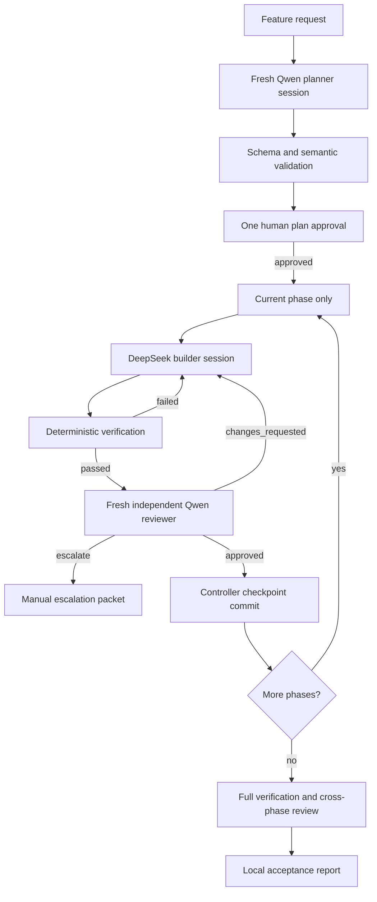
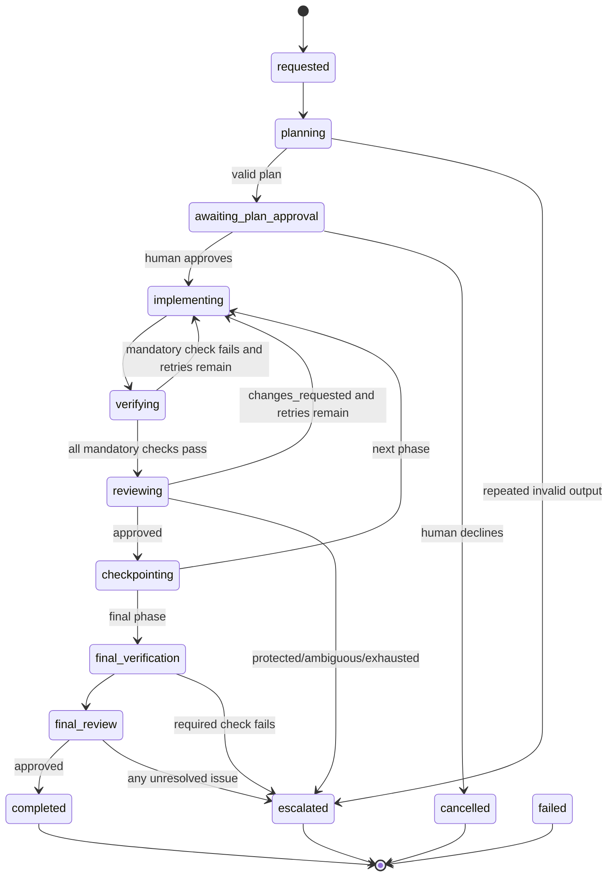

# AI Development Engine — long-term architecture

> Evidence status: Repository facts and Version 1A behavior are confirmed from code. The target architecture is an approved direction, not implemented behavior. Business rules and future version boundaries still require owner confirmation when scheduled.

## Document purpose

This is the retained blueprint for the Newl Apps AI Development Engine. It describes the Version 3–4 architecture that future iterations should evolve toward. It must not be treated as a commitment to build the whole platform at once.

The present experiment is [Version 1A.1](../../tools/ai-workflow/README.md): one local, non-persistent Qwen planner → DeepSeek builder → fresh Qwen reviewer loop with deterministic verification, fail-closed preflight, and one human plan approval. Infrastructure in this roadmap should be added only after real Newl Apps features demonstrate that the model sequence improves quality, time, or cost.

## Executive recommendation

Keep the engine in `tools/ai-workflow/` while it is Newl Apps-specific. The repository instructions, task-worktree process, test commands, tenant rules, and protected-action boundaries are essential inputs, not generic configuration.

Evolve in thin slices:

1. Prove the supervised workflow.
2. Measure results across real features and competing model combinations.
3. Add durability and Git checkpoints only when interrupted or long-running work makes them valuable.
4. Add formal reporting and operator UI only when workflow volume justifies them.
5. Extract a reusable package only after at least two repositories expose a stable common core.

The controller—not any model—must always own state transitions, mandatory verification, Git mutation, retry ceilings, and protected-action stops.

## Repository-informed baseline

The design is based on the following repository facts:

| Concern | Confirmed Newl Apps pattern |
|---|---|
| Package manager | npm with `package-lock.json` lockfile version 3. |
| Application | Next.js 15 App Router and React 19 under `src/`. |
| Language | Strict TypeScript 5.6 with `moduleResolution: bundler`. |
| Tests | Vitest in the Node environment; `tests/**/*.test.ts` is the configured suite. |
| Type checking | `npm run typecheck` → `tsc --noEmit`. |
| Linting | `npm run lint` → `eslint . --max-warnings=0`. No separate formatting command exists. |
| Production build | `npm run build` → `next build`. |
| Browser tooling | `playwright-core` exists for guarded scripts; there is no general Playwright test-runner configuration. |
| Git workflow | Dedicated `codex/*` branches and persistent task worktrees created from freshly fetched `origin/main`; the root checkout is coordination-only. |
| Agent instructions | `AGENTS.md`, `docs/README.md`, architecture docs, module docs, and protected-action rules are mandatory context. |
| Existing automation | Rivet already demonstrates isolated builder/reviewer sessions, deterministic gates, bounded remediation, and human ownership of merge/deployment. It remains a separate workflow. |
| Production boundaries | Tenant filtering, authorization, migrations, Teamship writes, financial posting, printing, shipping/releasing, permission changes, customer communications, and deployment have explicit approval requirements. |

No general repository OpenCode workflow existed before Version 1A. The engine must remain developer tooling and must not be imported by customer-facing runtime code.

## Goals

The mature engine should:

- accept a feature request from a developer CLI;
- create or select a safe isolated task branch and record its starting commit;
- have a read-only planner inspect actual repository patterns and return a schema-validated phased plan;
- pause exactly once for overall human plan approval before implementation;
- give the builder only the current approved phase and exact corrections;
- run a deterministic mandatory baseline plus controller-selected risk-specific checks;
- create a fresh, independent read-only reviewer for every review cycle;
- advance only after an exact structured `approved` result and passing verification;
- create a checkpoint after each approved phase;
- resume safely after interruption;
- stop with a complete escalation packet for risky, ambiguous, or repeatedly failing work;
- produce an acceptance report and local measurements; and
- never push, merge, deploy, contact customers, use production credentials, or perform protected business actions automatically.

## Non-goals

The engine is not:

- a general autonomous software company;
- a production job runner or customer-facing feature;
- an authority for business rules;
- a replacement for authenticated tenant and authorization enforcement;
- permission to execute migrations or external writes;
- a deployment system;
- a multi-phase concurrent scheduler;
- a place to store secrets or live customer evidence;
- a requirement to use a premium model automatically; or
- initially a dashboard or reusable cross-repository framework.

## Target architecture

The following is the long-term module map. Version 1A intentionally implements only a small subset.

```text
tools/ai-workflow/
  cli.ts                         # developer command and operator prompts
  workflow.ts                    # deterministic workflow orchestration
  state-machine.ts               # legal workflow/phase transitions
  opencode-client.ts             # server lifecycle and official SDK adapter
  agents.ts                      # model/provider selection and session isolation
  schemas/
    plan.ts                      # planner schema and semantic validation
    review.ts                    # reviewer schema and approval invariants
    builder-report.ts            # builder completion/deviation report
    workflow-state.ts            # versioned persisted state
    reports.ts                   # escalation and acceptance report contracts
  planner.ts                     # plan prompt, repository context, validation
  builder.ts                     # initial phase and correction prompts
  reviewer.ts                    # independent review packet and decision
  verification.ts               # fixed and risk-derived verification graph
  git.ts                        # guarded branch, diff, checkpoint, rollback helpers
  risk.ts                       # deterministic path/behavior risk classifier
  persistence.ts                # atomic state snapshots and event journal
  logging.ts                    # redacted structured events and usage/cost
  reporting.ts                  # escalation and final acceptance artifacts
  prompts/
    planner.md
    builder.md
    correction.md
    reviewer.md
    final-reviewer.md
  README.md

.opencode/agents/
  newl-ai-planner.md
  newl-ai-builder.md
  newl-ai-reviewer.md

tests/
  ai-workflow-*.test.ts

tmp/ai-workflow/                # ignored local runtime data, never source control
  <workflow-id>/
    state.json
    events.jsonl
    artifacts/
    reports/
```

### Module boundaries

- `cli.ts` parses safe arguments, collects the request, renders the plan, records the human decision, displays status, and maps terminal outcomes to exit codes. It contains no state-transition decisions.
- `workflow.ts` coordinates planner, one active phase, verification, reviewer, correction, checkpoints, final verification, and reporting. It calls typed interfaces instead of shell strings.
- `state-machine.ts` is the sole authority for legal transitions and invariants.
- `opencode-client.ts` starts an ephemeral local OpenCode server or attaches to an explicitly configured local endpoint, uses the official TypeScript SDK, creates sessions, captures events, and closes resources.
- `agents.ts` maps roles to configured `provider/model` IDs and validates that planner, builder, and reviewer sessions remain distinct.
- `schemas/*` accept no free-form permission to advance. JSON Schema/Ajv or an equivalent strict validator should reject missing, contradictory, or oversized values.
- `planner.ts`, `builder.ts`, and `reviewer.ts` assemble role-specific bounded context and validate the structured result; they never change workflow state themselves.
- `verification.ts` owns the mandatory command allowlist, focused-check selection, durations, bounded output, and artifact references. Models may suggest tests but cannot waive them.
- `git.ts` owns clean-tree checks, branch/worktree selection, starting commit, cumulative and phase diffs, expected-scope comparison, checkpoints, and safe rollback preparation. It never pushes or merges.
- `risk.ts` uses deterministic file/behavior rules to require additional checks or human/Codex escalation.
- `persistence.ts` writes versioned snapshots atomically and appends immutable events. It owns migrations between state versions when that feature exists.
- `logging.ts` redacts sensitive values and records operational events, model usage, cost, and verification timing without storing unnecessary prompts or live evidence.
- `reporting.ts` produces bounded Markdown and JSON escalation/acceptance reports from state and evidence; reports do not perform external actions.

## Component flow



## OpenCode integration

### Target transport

The mature implementation should pin `opencode-ai` and `@opencode-ai/sdk` to compatible exact versions. Start an ephemeral OpenCode server on a random loopback port for one workflow, or attach only to an explicitly supplied loopback URL. Do not drive the TUI or browser.

The SDK adapter should:

1. verify repository root and configured OpenCode version;
2. start/connect with a reduced environment and no unapproved plugins;
3. create a new planner session;
4. create a builder session for the current phase or a fresh correction session according to measured results;
5. create a brand-new reviewer session for each review cycle;
6. stream bounded events into the local journal;
7. capture final text, token usage, cost, model, session ID, timings, and errors;
8. abort timed-out or interrupted requests; and
9. close the server cleanly without treating session history as workflow state.

Provider authentication should be established through OpenCode outside the workflow. Secrets must not be copied into workflow state, prompts, reports, or logs. Model IDs stay configurable because provider catalogs change.

### Structured output

Every model result is parsed into JSON and validated twice:

- structural validation against a versioned schema; and
- semantic validation for invariants such as unique phases, repository-relative paths, test-file constraints, approval consistency, and bounded findings.

Invalid output may be retried with a short schema-error prompt. Repeated invalid output produces escalation; it never becomes implied approval.

## Agent design

### Planner — Qwen

The planner is a read-only primary agent. It may read, search, list, and use language-server inspection inside the repository. It cannot edit, use a shell, invoke subagents, browse externally, read environment files, or cross the repository boundary.

It receives the original request and repository instruction manifest. It must identify affected layers, assumptions, questions, risks, phases, expected areas, verification needs, completion criteria, and escalation conditions. It must distinguish confirmed repository behavior from inferred business behavior.

### Builder — DeepSeek

The builder may read and edit only inside the repository worktree. The controller, not the builder, runs commands and Git operations. It receives the current approved phase, relevant repository context, and either no corrections or exact deterministic/reviewer failures.

It must implement only that phase, preserve tenant and authorization patterns, add appropriate tests, update behavior documentation, and report deviations. It cannot commit, push, deploy, invoke subagents, read secrets, or perform external/production actions.

### Reviewer — fresh Qwen

Every reviewer is a new read-only session with no builder transcript or builder-authored summary as authority. It receives:

- original request;
- human-approved complete plan;
- current phase;
- phase and/or cumulative Git diff;
- bounded surrounding code plus repository read access;
- deterministic verification results and artifacts; and
- repository review rules and risk classification.

It checks completeness, correctness, regressions, tenant isolation, authorization, approval boundaries, testing, documentation, complexity, and scope. Only a schema-valid `approved` result with zero unresolved findings advances.

## Long-term schemas

### Planner result

```ts
type PlannedWorkflow = {
  schemaVersion: number;
  summary: string;
  assumptions: string[];
  openQuestions: string[];
  globalRisks: Risk[];
  expectedAreas: string[];
  phases: Array<{
    id: string;
    title: string;
    objective: string;
    requirements: string[];
    expectedFiles: string[];
    requiredVerification: VerificationRequirement[];
    definitionOfDone: string[];
    risk: "low" | "medium" | "high" | "protected";
    escalationConditions: string[];
  }>;
};
```

The controller converts verified planner suggestions into an immutable approved-plan record. It does not accept arbitrary command strings from the plan.

### Reviewer result

```ts
type ReviewDecision = {
  schemaVersion: number;
  status: "approved" | "changes_requested" | "escalate";
  summary: string;
  findings: Array<{
    severity: "critical" | "high" | "medium" | "low";
    file: string | null;
    line: number | null;
    evidence: string;
    requiredCorrection: string;
    autoFixable: boolean;
    requiresBusinessDecision: boolean;
  }>;
  missingTests: string[];
  scopeConcerns: string[];
  escalationReason: string | null;
};
```

`approved` requires empty findings, missing tests, scope concerns, and escalation reason. `changes_requested` requires at least one actionable item. Protected or ambiguous findings cannot be auto-remediated.

## Deterministic state machine



Required invariants:

- implementation cannot begin without a stored human approval tied to the exact plan hash;
- only one phase may be active;
- review cannot start until every mandatory check has a current passing result for the reviewed diff/checkpoint;
- no phase advances without exact `approved` status;
- invalid output is failure, never consent;
- retries are bounded (three review-and-fix cycles by default);
- a checkpoint is created only by deterministic Git code after approval;
- resumed work verifies branch, base, checkpoint, diff, state version, and no concurrent owner before continuing; and
- terminal states cannot mutate without an explicit new operator action.

## Verification strategy

### Mandatory phase baseline

The fixed Newl Apps baseline is:

```text
git diff --check <workflow-starting-or-phase-base-commit> --
npm run typecheck
npm run lint
npm run build
npm run test -- <controller-selected focused test files>
```

When no safe focused selection exists, run `npm test`. No separate formatter exists, so Version 1 must not invent one.

### Risk-derived checks

Future deterministic classification should add, never replace, checks:

| Change | Required addition |
|---|---|
| UI behavior | Existing focused UI tests and a Vercel Preview/manual browser acceptance step; add Playwright only after a repository-standard runner exists. |
| API/server action/service | Focused route/service integration tests, including invalid and unauthorized input. |
| Auth/authorization/tenant scope | Authorization and cross-tenant regression tests plus manual/Codex escalation. |
| Bug with partial external evidence | Regression tests for partially populated and completely missing evidence. |
| Prisma schema/migration | Stop before migration execution; require explicit human review and safe preview procedure. |
| Garland/Teamship | Required Garland and Shipment Documents docs, protected-action analysis, and dry-run/read-only tests. Never write Teamship automatically. |
| Financial logic | Exact deterministic calculation tests and manual/Codex escalation. |

Command specs must be executable plus argument arrays, not interpolated shells. Output should be size-bounded, credential-redacted, and stored separately from durable state when large. Verification records include command identity, exit code, duration, commit/diff identity, sanitized output reference, and pass/fail.

## Git safety

The target implementation should reuse the repository task-worktree scripts rather than inventing a conflicting branch system.

1. Refuse a dirty coordination checkout or unapproved pre-existing changes.
2. Fetch current `origin/main` through the approved task-start workflow.
3. Create a unique persistent `work/codex/<slug>` worktree and `codex/<slug>` branch.
4. Record base branch, starting commit, worktree path, and initial status.
5. Compare each phase with its checkpoint base and detect unexpected files outside approved areas.
6. After phase approval, stage only validated intended files and create `AI workflow: <phase id> <title>` checkpoint commits.
7. Never use destructive reset/checkout commands automatically. Prepare a rollback instruction or inverse commit for human approval.
8. Before final acceptance, fetch current main, calculate overlap/mergeability, and stop on conflicts.
9. Never push, open a pull request, merge, or deploy without a separate explicit operator action and the repository publish process.

Pre-existing changes should be rejected by default. A future explicit adoption flow would need a recorded patch hash, owner approval, excluded paths, and proof that model changes cannot be confused with owner work; it is not a default convenience.

## Persistence and resumability

When workflow duration proves durability is necessary, store local ignored state under `tmp/ai-workflow/<workflow-id>/`.

The snapshot should include:

- schema version and workflow ID;
- original request hash and bounded request text;
- branch, worktree, base commit, and current commit;
- workflow/phase status and transition version;
- immutable approved plan and approval timestamp;
- active phase and attempt counters;
- OpenCode role/session metadata, not chat history as authority;
- verification history and artifact references;
- reviewer decisions and resolved-finding links;
- checkpoint commits;
- cost/token/timing aggregates;
- escalation state; and
- created/updated timestamps.

Write a new temporary file, flush it, then atomically rename it over `state.json`. Append events to `events.jsonl` with monotonic sequence numbers and prior-event hashes if tamper evidence becomes necessary. Acquire a lock containing process identity and expiry before mutation; stale-lock recovery must verify the process and Git state. State migrations are explicit, versioned, tested, and never run implicitly on unknown future versions.

Resume must fail closed if the branch, worktree, checkpoint, plan hash, or changed files do not match recorded state.

## Risk and escalation

Deterministic rules must stop automatic work or require manual/Codex review for:

- authentication, authorization, role policy, or tenant/customer/warehouse/user scoping;
- Teamship writes, printing, shipping/releasing, or external system mutation;
- production configuration, deployment infrastructure, secrets, credentials, or environment files;
- database schema or migrations;
- destructive actions or customer-data deletion;
- billing, financial posting, or financial calculations;
- security controls;
- email, Teams, or customer communications;
- permission changes;
- unresolved mandatory verification failures;
- repeated invalid structured output;
- exhausted review/correction limits;
- material plan/implementation/review disagreement;
- suspicious live customer data or credentials in added content; and
- unexplained overlap with another open change.

The escalation artifact should include the request, approved plan, current phase, branch/commit/diff identity, exact unresolved findings, sanitized verification evidence, attempts, files changed, risk rules triggered, decisions needed, and a recommended next safe action. Early versions should hand this to the owner or Codex manually; automatic premium-model invocation is a later, separately approved capability.

## Reporting and observability

The mature acceptance report should contain:

- original request and approved-plan hash;
- completed phases and checkpoint commits;
- changed files and expected-scope comparison;
- every required command and result;
- review cycles, findings, and resolutions;
- known limitations and untested integrations;
- manual acceptance steps and deployment considerations;
- risk/escalation recommendation; and
- branch/worktree identity without performing publication.

Structured model/run measurements should support future comparison:

- role, provider/model, session ID, start/end, success/failure;
- input/output/cached/reasoning tokens when exposed;
- API cost when exposed;
- retry and review-cycle counts;
- verification duration;
- files changed and test commands;
- phase outcome; and
- final human acceptance outcome when later recorded.

Logs must not contain secrets, session cookies, live customer data, raw customer evidence, service-account JSON, or production credentials. A dashboard is not justified until JSON/JSONL records prove useful and the query requirements stabilize.

## Testing the engine

The engine's own test suite should grow with implemented behavior:

- schema acceptance/rejection and semantic invariants;
- legal and illegal state transitions;
- approval gating and single active phase;
- fresh reviewer session isolation;
- verification ordering and inability for model output to waive commands;
- exact correction handoff;
- retry/review ceilings and escalation;
- invalid/truncated model output;
- cost/metrics aggregation with unavailable values;
- branch creation, worktree validation, checkpoint creation, and dirty-tree refusal;
- cumulative and phase diff correctness, including untracked files;
- command allowlisting and absence of shell interpolation;
- path traversal and environment-file denial;
- output redaction and size limits;
- atomic persistence, lock recovery, migrations, and resume mismatch refusal;
- mocked OpenCode server/SDK sessions and interruption; and
- end-to-end dry runs in temporary synthetic Git repositories.

Automated tests must never call live models, production systems, Teamship, email, migrations, deployments, or live customer data.

## Evolution plan

### Version 1A — workflow proof (implemented)

- repository-local CLI;
- real OpenCode CLI calls with configurable model IDs;
- read-only planner, workspace-only builder, fresh read-only reviewer;
- validated minimal plan/review results;
- one interactive plan approval;
- one phase at a time;
- fixed diff/typecheck/lint/build/full-test-suite verification;
- correction loop and bounded manual escalation;
- simple safe branch selection/creation;
- printed/manual completion; and
- ignored JSONL metrics.

No persistence, checkpoints, resume, final cross-phase review, report engine, dashboard, Codex integration, automatic publishing, or production action.

### Version 1B — evidence-based hardening

Only after several real workflows:

- tune prompts/schemas from observed failures;
- add explicit risk-derived check selection;
- improve phase-local diffs without checkpoint commits;
- compare model combinations and human acceptance;
- add dry-run/model-mock CLI fixtures; and
- decide whether API cost and quality measurements justify continued investment.

### Version 2 — durability and Git checkpoints

If interruption and long phases are material problems:

- versioned local state and event journal;
- atomic writes, locks, resume validation, and state migrations;
- phase checkpoint commits and safe rollback guidance;
- exact phase diffs and final cross-phase verification/review; and
- structured escalation and acceptance reports.

### Version 3 — operational safety and scale

- current-main compatibility and sibling-change overlap checks;
- richer risk classifier and artifact handling;
- server/SDK OpenCode transport with streaming cancellation;
- advanced cost/token/latency observability;
- approved manual Codex escalation handoff; and
- operator tooling for multiple sequential workflows without concurrent phases.

### Version 4 — optional platformization

- dashboard and comparative reporting if workflow volume supports them;
- reusable core package with Newl Apps policy adapter;
- cross-repository templates and versioned policy packs; and
- separately approved integrations for PR preparation or other external actions, still never automatic merge/deploy.

## Tradeoffs and unresolved questions

- Exact Qwen and DeepSeek provider/model IDs depend on the local OpenCode provider catalog and must remain configuration, not repository guesses.
- Provider cost events may be incomplete; `null` is more honest than a partial “total.”
- Running the full Next build every attempt is slow but provides a strong early baseline. Measurements should determine whether safe caching or phase/final tiers are worthwhile.
- Newl Apps lacks a standard Playwright runner. UI acceptance should use existing tests and Vercel Preview/manual validation until a repository-wide browser-test standard is approved.
- Phase-local diffs are cleaner with checkpoint commits, but Version 1A deliberately accepts cumulative diffs to avoid premature Git infrastructure.
- Whether correction work should reuse a builder session or start fresh should be decided from measured performance and contamination risk.
- Business ambiguity must stop; no prompt can turn inferred behavior into approval.
- Package extraction should wait until repository policy hooks, verification profiles, and schema boundaries have proven stable in practice.

## Decision rule

The next architecture increment should solve a failure observed in real Version 1A workflows or materially improve measured quality, time, cost, safety, or operator effort. The existence of this roadmap is not itself a reason to implement its later layers.
