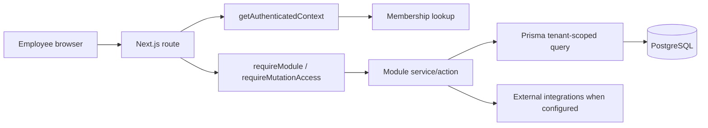
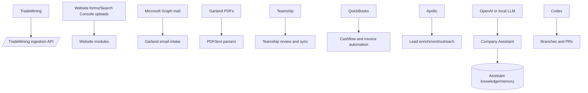

# Architecture overview

> Evidence status: Confirmed from code.

Newl Apps is a Next.js 15 / React 19 internal business platform backed by PostgreSQL through Prisma. Auth.js v5 provides Microsoft Entra ID SSO and database sessions; local dev bypass and temporary password login exist behind environment gates. The platform is multi-tenant: `Tenant`, `Membership`, module entitlement, integration credential, audit, job, and business records are tenant-scoped in `prisma/schema.prisma`.

## Primary technologies

| Area | Evidence |
|---|---|
| Frontend/backend | Next.js app router in `src/app`, shared React components in `src/components`, module UI in `src/modules/*/components*`. |
| Database/ORM | PostgreSQL datasource and Prisma models in `prisma/schema.prisma`; migrations in `prisma/migrations`. |
| Auth | `src/server/auth/auth.config.ts`, `src/server/tenant-context.ts`, `src/middleware.ts`. |
| Permissions | `src/server/auth/authorization.ts`, `src/server/auth/role-policy.ts`, settings access code in `src/modules/settings`. |
| Hosting/build | `next.config.ts`, `scripts/vercel-build.ts`, `.github/workflows/*migrations.yml`, `docs/deployment.md`. |
| Tests | Vitest suites in `tests/`; package scripts in `package.json`. |

## High-level request flow

## High-level data flow

## Module map

Confirmed module keys: `ASSISTANT`, `LEAD_GEN`, `UPS_TOOLS`, `LTL_RATE_PORTAL`, `TRANSIT_LOOKUP`, `SHIPMENT_DOCUMENTS`, `INVOICE_VERIFICATION`, `QUICKBOOKS_POSTING`, `CUSTOMER_CASHFLOW`, `WEBSITE_INBOUND`, `WEBSITE_GROWTH`, and `OCEAN_FREIGHT_PRICING` in `prisma/schema.prisma`.

## Major security boundaries

- User sessions are distinct from machine ingestion tokens (`src/server/ingestion-auth.ts`).
- Role access and tenant entitlements are enforced server-side in `requireModule`.
- Read-only users are blocked from mutations by `requireMutationAccess`.
- Integration credentials should be tenant scoped through `IntegrationCredential`; several runtime fallbacks still use environment variables.
