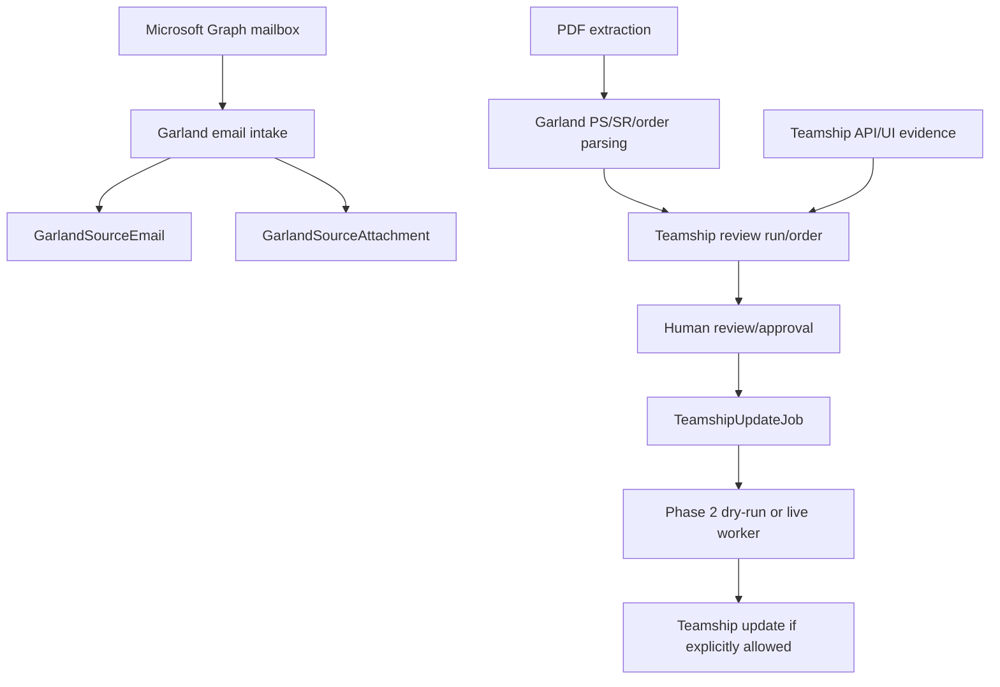

# Garland: Parsing Rules

> Evidence status: Confirmed from code unless otherwise marked.

Garland-specific implementation is part of Shipment Documents. Evidence files include `src/modules/shipment-documents/garland-email-intake.ts`, `garland-email-agent-automation.ts`, `garland-pdf-server-extraction.ts`, `teamship-review.ts`, `teamship-review-types.ts`, `garland-product-dimensions.ts`, `garland-product-dimension-directory.ts`, `teamship-update-jobs.ts`, `teamship-phase2-agent-execution.ts`, Teamship API routes under `src/app/api/shipment-documents/teamship-review`, pages under `src/app/(authenticated)/shipment-documents/teamship-review`, `src/data/garland-product-dimensions.json`, tests named `garland-*` and `teamship-*`, and `reference/GARLAND_TEAMSHIP_REVIEW_FINDINGS.md`.

## Confirmed workflow

Emails are classified using Garland-domain, PS-range, order/page-count, attachment, and correction signals. Attachments are hashed for duplicate detection. Parsed PDF pages extract PS number, SR number, ship-to data, PO, freight terms, order date, ship-via, instructions, and item rows when present. Teamship review compares Garland parsed data with Teamship details.

Garland Lot/Serial references may be all-numeric values from 8 through 16 digits, or alphanumeric values containing at least one digit. Six-digit site/location codes remain excluded from serial extraction. Multiple valid Lot/Serial references can share one extracted PDF text line and must remain attached to the current item. When a multi-page order continues with Lot/Serial rows before the next item begins, those rows belong to the last item from the preceding page. Serialized commodity text uses `SKU: <sku>, SN: <serials>` rather than the non-serialized `QTY:` fallback.

PDF text extraction may place the final wrapped Special Instructions line inside the split item-table header. The parser normally recovers only the first non-header line when the preceding instruction ends with a colon, which is the confirmed wrapped-continuation layout. In a dangerous-goods instruction block, it may recover up to two structurally recognized continuation lines: a `CHEMTREC` contact and a standalone `QUANTITY:` value. It must not treat continuation-page product configuration, `End of Comments`, item numbers, item quantities, or serial rows as Special Instructions. The Teamship update planner and every live API, browser, and BOL-cleanup entry point independently block instruction updates containing strong item-detail evidence, including polluted plans saved before the parser correction.

Owner-confirmed dangerous-goods behaviour: long runs of asterisks are decorative separators and may be removed when Teamship's instruction limit requires space. Business content must be preserved through the section boundary, including the emergency contact number, standalone dangerous-goods quantity, and a following delivery/site instruction line. This rule does not authorize product configuration or item-table text to enter Special Instructions; parser implementation and synthetic regression coverage for the additional trailing business-content line remain pending.

Garland ship-to city, province/state, and postal code extraction accepts both `CITY, ST POSTAL` and `CITY ST POSTAL` text layouts. The PDF text layer can omit the visual comma, and that omission must not move the location line into ship-to address line 1 or leave city and postal code blank.

Owner-confirmed ship-to normalization: Garland's known source city token `QUEBEFC` must be corrected to `QUEBEC` when it appears with province `QC`. A later stray or fallback `ON` line must not override the complete `QUEBEC, QC <postal-code>` location. This is a narrow approved alias, not permission to silently correct other customer names, cities, or address text.

## Pallet and printing notes

Pallet dimensions, serials, weight, and SKU observations are represented in Teamship review/update types and `GarlandProductDimensionObservation`. The UPS special dimension rule is confirmed in existing documentation and tests should be consulted before changing it. Printer mappings, duplicate print protection, and a general print service were not located; production printing requires explicit human approval.

## Open questions

- Final employee-approved Garland order lifecycle terms. Requires employee confirmation.
- Exact Teamship screen behaviour outside coded API/UI selectors. Requires employee confirmation.
- Whether any customer communications can be automated. Requires owner confirmation.
