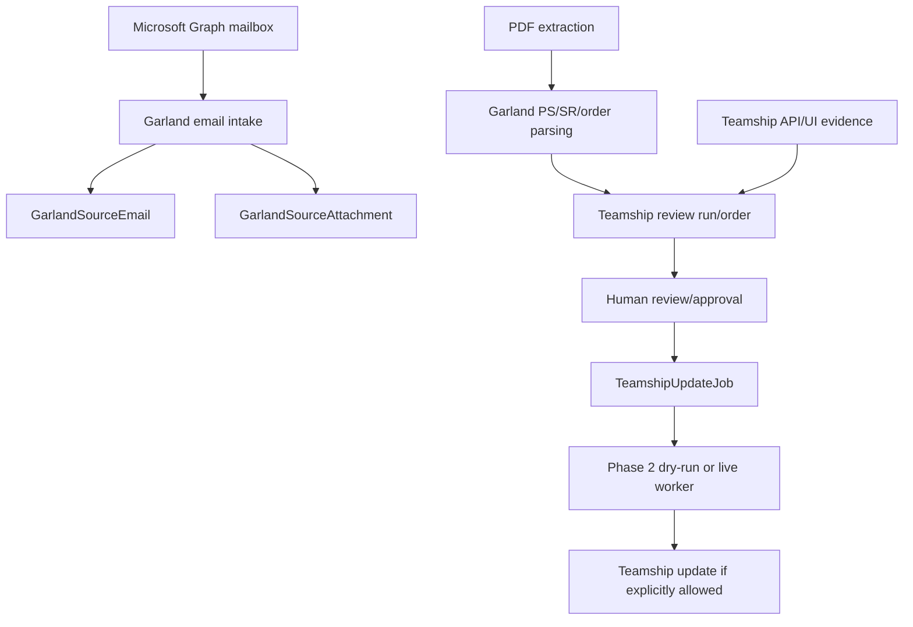

# Garland: Printing Rules

> Evidence status: Confirmed from code unless otherwise marked.

Garland-specific implementation is part of Shipment Documents. Evidence files include `src/modules/shipment-documents/garland-email-intake.ts`, `garland-email-agent-automation.ts`, `garland-pdf-server-extraction.ts`, `teamship-review.ts`, `teamship-review-types.ts`, `garland-product-dimensions.ts`, `garland-product-dimension-directory.ts`, `teamship-update-jobs.ts`, `teamship-phase2-agent-execution.ts`, Teamship API routes under `src/app/api/shipment-documents/teamship-review`, pages under `src/app/(authenticated)/shipment-documents/teamship-review`, `src/data/garland-product-dimensions.json`, tests named `garland-*` and `teamship-*`, and `reference/GARLAND_TEAMSHIP_REVIEW_FINDINGS.md`.

## Confirmed workflow

Emails are classified using Garland-domain, PS-range, order/page-count, attachment, and correction signals. Attachments are hashed for duplicate detection. Parsed PDF pages extract PS number, SR number, ship-to data, PO, freight terms, order date, ship-via, instructions, and item rows when present. Teamship review compares Garland parsed data with Teamship details.

## Pallet and printing notes

Pallet dimensions, serials, weight, and SKU observations are represented in Teamship review/update types and `GarlandProductDimensionObservation`. The UPS special dimension rule is confirmed in existing documentation and tests should be consulted before changing it. Printer mappings, duplicate print protection, and a general print service were not located; production printing requires explicit human approval.

## Open questions

- Final employee-approved Garland order lifecycle terms. Requires employee confirmation.
- Exact Teamship screen behaviour outside coded API/UI selectors. Requires employee confirmation.
- Whether any customer communications can be automated. Requires owner confirmation.
