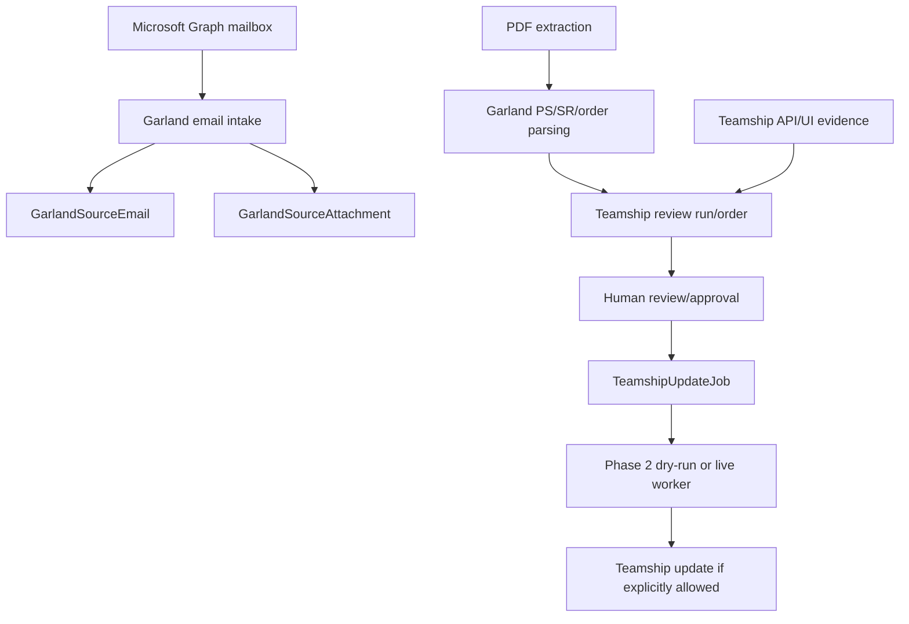

# Garland: Printing Rules

> Evidence status: Confirmed from code unless otherwise marked.

Garland-specific implementation is part of Shipment Documents. Evidence files include `src/modules/shipment-documents/garland-email-intake.ts`, `garland-email-agent-automation.ts`, `garland-pdf-server-extraction.ts`, `teamship-review.ts`, `teamship-review-types.ts`, `garland-product-dimensions.ts`, `garland-product-dimension-directory.ts`, `teamship-update-jobs.ts`, `teamship-phase2-agent-execution.ts`, Teamship API routes under `src/app/api/shipment-documents/teamship-review`, pages under `src/app/(authenticated)/shipment-documents/teamship-review`, `src/data/garland-product-dimensions.json`, tests named `garland-*` and `teamship-*`, and `reference/GARLAND_TEAMSHIP_REVIEW_FINDINGS.md`.

## Confirmed workflow

Emails are classified using Garland-domain, PS-range, order/page-count, attachment, and correction signals. Attachments are hashed for duplicate detection. Parsed PDF pages extract PS number, SR number, ship-to data, PO, freight terms, order date, ship-via, instructions, and item rows when present. Teamship review compares Garland parsed data with Teamship details.

## Pallet and printing notes

Pallet dimensions, serials, weight, and SKU observations are represented in Teamship review/update types and `GarlandProductDimensionObservation`. The UPS special dimension rule is confirmed in existing documentation and tests should be consulted before changing it.

Phase 1 has an approval-gated single-order print queue. It uses these fixed destinations:

- Picking list: one copy through the local CUPS queue `_192_168_1_28` (`192.168.1.28`).
- BOL: one copy through Teamship using `KONICA MINOLTA bizhub C3350i PCL (192.168.1.28) UPD`.
- Outbound pallet labels: copies equal to the current approved pallet count through Teamship using exactly `BIXOLON SRP-770III`.

Teamship may reset its selected printer when another shipping order opens. The worker therefore resolves, selects, and reads back the exact outbound-label printer on every order and again immediately before the irreversible Print action. It never substitutes `BIXOLON SRP-770III - BPL-Z` or reuses a printer ID from a prior order. Teamship's Draft BOL label is normal and does not block printing.

The same employee who creates a plan must explicitly approve its request ID. Changed pallet counts, missing or duplicated printer options, unavailable local queues, expired approvals, and ambiguous Teamship pages stop the job. Uncertain jobs never retry automatically.

Garland shipping-order display numbers and Teamship's internal page IDs are separate identities. For example, the supervised order `30666` resolves to internal Teamship record `31064`. Nemo shows and verifies `30666`, while the local worker navigates to `/ship-inventories/31064`; the integration resolves this mapping for every order rather than hard-coding a customer example.

## Open questions

- Final employee-approved Garland order lifecycle terms. Requires employee confirmation.
- Exact Teamship screen behaviour outside coded API/UI selectors. Requires employee confirmation.
- Whether any customer communications can be automated. Requires owner confirmation.
- When Phase 2 batch printing may be enabled after supervised single-order evidence. Requires owner confirmation.
- Whether Phase 3 automatic printing should require per-batch approval or a separately approved automation policy. Requires owner confirmation.
