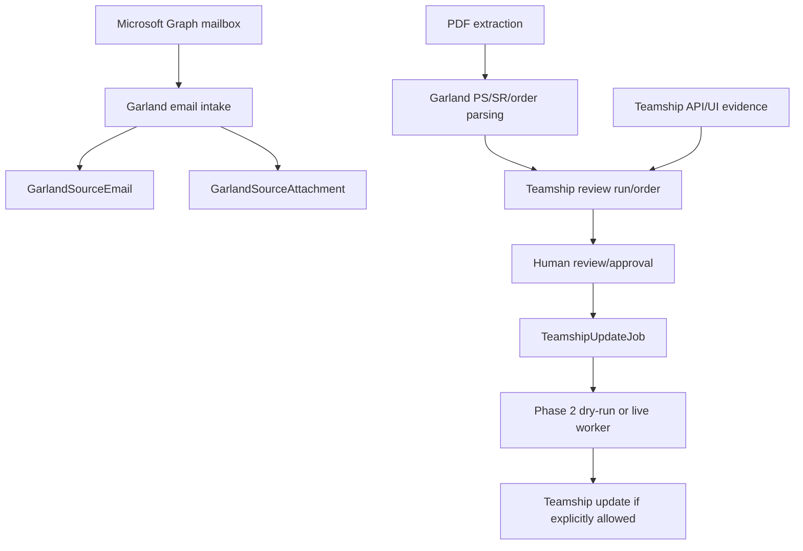

# Garland: Review Workflow

> Evidence status: Confirmed from code unless otherwise marked.

Garland-specific implementation is part of Shipment Documents. Evidence files include `src/modules/shipment-documents/garland-email-intake.ts`, `garland-email-agent-automation.ts`, `garland-pdf-server-extraction.ts`, `teamship-review.ts`, `teamship-review-types.ts`, `garland-product-dimensions.ts`, `garland-product-dimension-directory.ts`, `teamship-update-jobs.ts`, `teamship-phase2-agent-execution.ts`, Teamship API routes under `src/app/api/shipment-documents/teamship-review`, pages under `src/app/(authenticated)/shipment-documents/teamship-review`, `src/data/garland-product-dimensions.json`, tests named `garland-*` and `teamship-*`, and `reference/GARLAND_TEAMSHIP_REVIEW_FINDINGS.md`.

## Confirmed workflow

Emails are classified using Garland-domain, PS-range, order/page-count, attachment, and correction signals. Attachments are hashed for duplicate detection. Parsed PDF pages extract PS number, SR number, ship-to data, PO, freight terms, order date, ship-via, instructions, and item rows when present. Teamship review compares Garland parsed data with Teamship details.

Garland PS numbers are the unique shipment-document identity for matching PDF orders to Teamship. SR numbers can repeat in Teamship, so the review should prefer exact PS/pack-slip matches and use SR-only matching only when the SR cannot conflict with a different Teamship PS number.

For a Teams-uploaded multi-order PDF, the CSR must name one exact PS or SR number. Newl Apps stores the complete PDF as source evidence but filters the parsed orders before querying Teamship. An exact PS selects one order. An SR is accepted only when it selects one PDF order; if it repeats, Nemo asks for the PS number. Missing or unmatched references stop without a Teamship query, and the saved response names the selected PS/SR plus the number of other PDF orders ignored.

Employee feedback about these reviews is grouped into stable root-cause families. New reports do not create another development approval while the same family already has an approved Rivet fix; they remain follow-up evidence until the reviewed PR is explicitly recorded as deployed. Evidence reported after that point is presented as one linked regression family.

An employee report remains unapproved evidence until an administrator reviews it. The administrator chooses whether the issue is an incorrect order decision, incorrect/missing Teamship field update, missed processing, notification/response problem, or another workflow problem. Decision issues compare Nemo's original decision with the correct decision. Field-update issues capture the exact Teamship field and actual/correct values instead of forcing a misleading PASS/FAIL mismatch.

Incorrect or missing Teamship updates require the exact saved PS/SR review and its source PDF, or a supporting PDF/image, before confirmation. For a review created from Garland email intake, Newl Apps automatically re-fetches the original PDF through its saved Microsoft Graph message and attachment identifiers, requires an exact filename/PS/SR match, verifies the parsed content hash, and caches the verified bytes as the review artifact. If the email is no longer retrievable, the match is ambiguous, or the problem is visible only in Teamship, the administrator supplies the exact PDF or screenshot. The saved review contributes its exact page numbers and parsed/review snapshot. After confirmation and a queue refresh, the administrator can add **Your instructions for Rivet** on the awaiting-approval suggestion. Only confirmed feedback and its immutable evidence manifest can enter a Rivet packet.

## Pallet and printing notes

Pallet dimensions, serials, weight, and SKU observations are represented in Teamship review/update types and `GarlandProductDimensionObservation`. The UPS special dimension rule is confirmed in existing documentation and tests should be consulted before changing it. Printer mappings, duplicate print protection, and a general print service were not located; production printing requires explicit human approval.

## Open questions

- Final employee-approved Garland order lifecycle terms. Requires employee confirmation.
- Exact Teamship screen behaviour outside coded API/UI selectors. Requires employee confirmation.
- Whether any customer communications can be automated. Requires owner confirmation.
