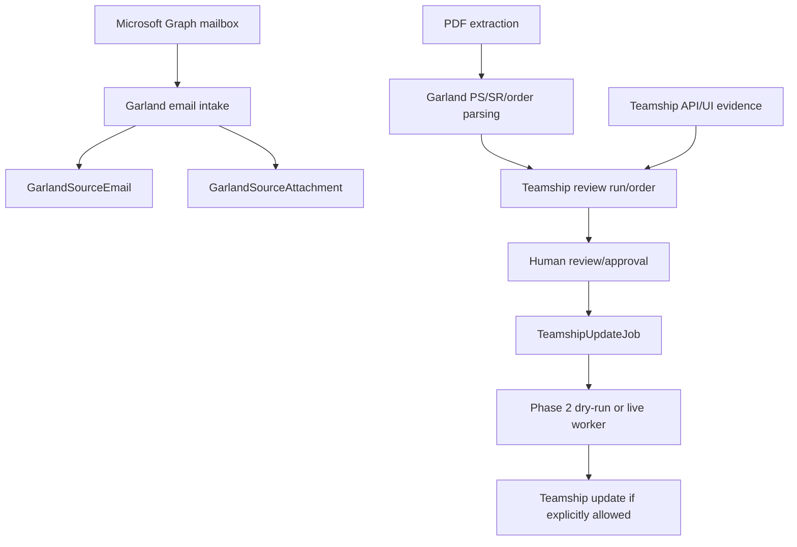

# Garland: Teamship Workflow

> Evidence status: Confirmed from code unless otherwise marked.

Garland-specific implementation is part of Shipment Documents. Evidence files include `src/modules/shipment-documents/garland-email-intake.ts`, `garland-email-agent-automation.ts`, `garland-pdf-server-extraction.ts`, `teamship-review.ts`, `teamship-review-types.ts`, `garland-product-dimensions.ts`, `garland-product-dimension-directory.ts`, `teamship-update-jobs.ts`, `teamship-phase2-agent-execution.ts`, Teamship API routes under `src/app/api/shipment-documents/teamship-review`, pages under `src/app/(authenticated)/shipment-documents/teamship-review`, `src/data/garland-product-dimensions.json`, tests named `garland-*` and `teamship-*`, and `reference/GARLAND_TEAMSHIP_REVIEW_FINDINGS.md`.

## Confirmed workflow

Emails are classified using Garland-domain, PS-range, order/page-count, attachment, and correction signals. Attachments are hashed for duplicate detection. Parsed PDF pages extract PS number, SR number, ship-to data, PO, freight terms, order date, ship-via, instructions, and item rows when present. Teamship review compares Garland parsed data with Teamship details.

When the Garland PDF ship-to name differs from Teamship, an approved update uses the complete PDF ship-to name for Teamship `ship_first_name` (the field labelled **First Name**). The planner must preserve the complete business name without abbreviating it. This approved rule does not silently clear or rewrite Teamship `ship_last_name`; any separate Last Name correction requires its own reviewed rule. The existing review and update approval gates still apply before any Teamship write.

An approved Phase 2 update writes the reviewed Teamship API fields first and then removes generated Customer Order Information weights from the editable BOL. If the shared browser session closes during that cleanup, the worker performs at most one browser restart and retries only the interrupted cleanup order. It never repeats the preceding API update as part of browser recovery. A second browser closure stops the cleanup batch; the affected order is failed and the untouched later orders are explicitly marked skipped under the same infrastructure incident.

Before any order write, the worker logs into Teamship. A transient network, rate-limit, or Teamship server failure at this login stage receives one safe login-only retry; authentication rejection is not retried. A terminal worker result records whether it stopped during worker preflight, Teamship login, Teamship API work, or editable-BOL cleanup. Newl Apps retains the sanitized top-level error and applies it to any order that never returned order-level evidence instead of reporting only a generic incomplete attempt.

If a later batch or editable-BOL failure occurs after one or more order API updates, successful order evidence is preserved and Teamship is rescanned read-only. The job becomes `NEEDS_REVIEW` instead of erasing successful orders under a batch-wide failure. Only orders retained as successful are marked ready to print. A recovery action never automatically replays a successful Teamship write.

Saved review-run totals describe the PDF-versus-Teamship comparison only. Live Teamship update, BOL cleanup, and verification status are shown separately in Bot drafts and run history and drive the post-run CSR email.

## Pallet and printing notes

Pallet dimensions, serials, weight, and SKU observations are represented in Teamship review/update types and `GarlandProductDimensionObservation`. The UPS special dimension rule is confirmed in existing documentation and tests should be consulted before changing it. Printer mappings, duplicate print protection, and a general print service were not located; production printing requires explicit human approval.

## Open questions

- Final employee-approved Garland order lifecycle terms. Requires employee confirmation.
- Exact Teamship screen behaviour outside coded API/UI selectors. Requires employee confirmation.
- Whether any customer communications can be automated. Requires owner confirmation.
