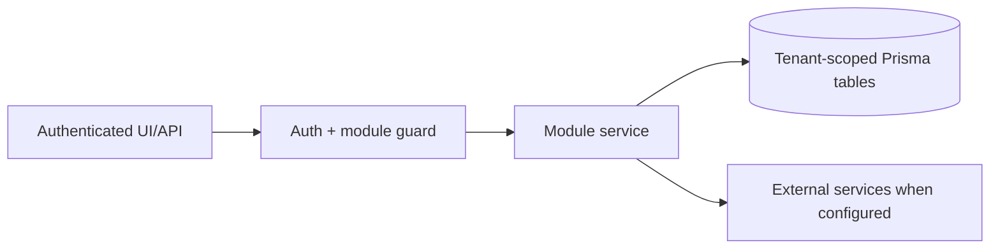

# Company Assistant / AI chat: Overview

> Evidence status: Confirmed from code for file locations and schema references; business workflow details not explicitly encoded are marked Requires employee confirmation.

## Purpose and status

Company Assistant / AI chat is documented because code, routes, schema, or tests were located. Main evidence: `src/app/(authenticated)/assistant/page.tsx`, `src/modules/assistant/*`, `src/server/integrations/assistant-provider.ts`, `tests/assistant-*.test.ts`, assistant Prisma models.

## Workflow / rules summary

- Entry points are protected authenticated pages and/or API routes for this module.
- Server-side pages and mutating APIs should validate tenant context and module entitlement before data access.
- Data persistence uses tenant-scoped Prisma models where a database model exists.
- External calls use `src/server/integrations/*` or module-specific integration helpers. Secret values are not documented here.
- Approval, printing, posting, and live external writes require human approval unless a code path explicitly enforces a safe dry-run.
- Operational feedback is stored separately from approved assistant memory. Employee reports begin as `REPORTED` evidence and cannot affect Nemo explanations until an administrator confirms the feedback and explicitly creates an `ApprovedOperationalLesson`.
- Feedback Review is an active-work queue: only `REPORTED` and `INVESTIGATING` findings are visible by default. Confirmed, rejected, and resolved history is hidden unless the user explicitly opens it.
- Development suggestions group similar employee reports into one focused issue before approval. Creating or refreshing the queue does not start development.
- Only administrator-confirmed feedback may enter a Rivet approval packet. Pending reports can be expanded in full and their observed/expected result classifications can be corrected without resubmission; identical Garland check outcomes cannot be confirmed as a development issue.
- The approval screen exposes every complete source and follow-up message for the grouped family. Optional administrator comments entered with approval are audited and included verbatim in the restricted Rivet development packet.
- A development suggestion is one tenant-scoped issue family. Later feedback for an approved family is stored as follow-up evidence without changing the already-approved Rivet packet. Duplicate awaiting cards for that family are marked `SUPERSEDED`.
- After the exact reviewed pull request is merged and deployed, an administrator must use the two-step **Mark merged and deployed** action. That resolves the source and follow-up reports. Later feedback opens one approval-gated regression suggestion linked to the resolved family.
- Generic historical issue keys are reclassified into deterministic Garland families for Lot/Serial, Special Instructions, ship-to name, ship-to location, pallet dimensions, email processing, order-status responses, and false comparison mismatches. A report is screened as a no-change report only when its displayed values and its observed/expected outcomes are both equal.
- Every Rivet PR must pass a fresh read-only Codex review of the exact commit. Review results are stored in tenant-scoped `CodexReviewRun` records. Only a zero-finding `PASS` for the current commit may produce `READY_FOR_ALEX`.
- Selecting **Approve & start Rivet** records the administrator decision and atomically queues a tenant-scoped Rivet development job. The restricted local worker may use Codex to prepare an isolated branch and draft PR; it cannot merge, deploy, execute a migration, update Teamship, print, release an order, change permissions, or contact a customer.
- Approved memory is database-backed and tenant-scoped, so it is available across Codex/OpenClaw chat threads. Chat history is useful context but is not the source of truth for Nemo's approved workflow understanding.

## Data model

Relevant tables and enums are in `prisma/schema.prisma`. Operationally important fields include primary `id`, `tenantId` where present, status enums, foreign keys to tenant/user/module, timestamps, metadata JSON, and unique/index constraints declared in Prisma.

Operational-learning and development-control tables are `OperationalFeedback`, `ApprovedOperationalLesson`, `DevelopmentSuggestion`, and `CodexReviewRun`. `WorkflowArtifact` and `WorkflowArtifactChunk` retain workflow evidence such as Teams PDFs.

## Permissions

Roles and defaults are in `src/server/auth/role-policy.ts`. Runtime checks are in `src/server/auth/authorization.ts`; gaps should be treated as requiring code review before enabling production writes.

## Failure modes

Expected failures include missing tenant entitlement, read-only mutation attempts, validation errors, missing integration credentials, duplicate records, empty parser results, external API errors, timeouts, and partial job completion. Recovery should use module UI review screens, audit/job records, and documented dry-run scripts before live writes.

## Testing

Relevant tests are under `tests/` and generally named after the module. Recommended checks: `npm test`, `npm run lint`, `npm run typecheck`, and targeted route/service tests. Live integration scripts must not be run without explicit approval and safe credentials.

## Source map

| Responsibility | Main files | Supporting files | Tests |
|---|---|---|---|
| UI and routes | See evidence paths above | `src/components/app-shell.tsx` | module-named tests under `tests/` |
| Services/actions/queries | `src/modules/assistant*` or evidence paths above | `src/server/*` | module-named tests |
| Schema | `prisma/schema.prisma` | `prisma/migrations/*` | schema-dependent unit tests |

## Open questions

- Which status values map to employee-approved business language? Requires employee confirmation.
- Which write actions should require two-person approval? Requires owner confirmation.
- Which external integration credentials should be moved from env fallback to tenant-scoped settings first? Requires owner confirmation.
- The daily digest target is confirmed as Alex's Teams direct conversation at 10:00 AM `America/Toronto`; runtime enablement remains blocked on the reviewed production rollout.
- Alex confirmed that one explicit **Approve & start Rivet** decision may start the restricted Codex branch-and-PR workflow. Merge and every production or operational action remain separate approvals.
