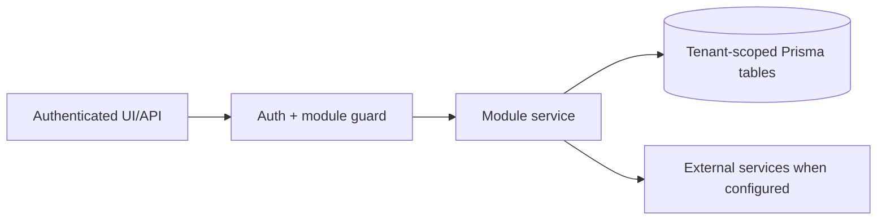

# Company Assistant / AI chat: Permissions

> Evidence status: Confirmed from code for file locations and schema references; business workflow details not explicitly encoded are marked Requires employee confirmation.

## Purpose and status

Company Assistant / AI chat is documented because code, routes, schema, or tests were located. Main evidence: `src/app/(authenticated)/assistant/page.tsx`, `src/modules/assistant/*`, `src/server/integrations/assistant-provider.ts`, `tests/assistant-*.test.ts`, assistant Prisma models.

## Workflow / rules summary

- Entry points are protected authenticated pages and/or API routes for this module.
- Server-side pages and mutating APIs should validate tenant context and module entitlement before data access.
- Data persistence uses tenant-scoped Prisma models where a database model exists.
- External calls use `src/server/integrations/*` or module-specific integration helpers. Secret values are not documented here.
- Approval, printing, posting, and live external writes require human approval unless a code path explicitly enforces a safe dry-run.

## Data model

Relevant tables and enums are in `prisma/schema.prisma`. Operationally important fields include primary `id`, `tenantId` where present, status enums, foreign keys to tenant/user/module, timestamps, metadata JSON, and unique/index constraints declared in Prisma.

## Permissions

Roles and defaults are in `src/server/auth/role-policy.ts`. Runtime checks are in `src/server/auth/authorization.ts`; gaps should be treated as requiring code review before enabling production writes.

## Failure modes

Expected failures include missing tenant entitlement, read-only mutation attempts, validation errors, missing integration credentials, duplicate records, empty parser results, external API errors, timeouts, and partial job completion. Recovery should use module UI review screens, audit/job records, and documented dry-run scripts before live writes.

## Testing

Relevant tests are under `tests/` and generally named after the module. Recommended checks: `npm test`, `npm run lint`, `npm run typecheck`, and targeted route/service tests. Live integration scripts must not be run without explicit approval and safe credentials.

## Source map

| Responsibility | Main files | Supporting files | Tests |
|---|---|---|---|
| UI and routes | See evidence paths above | `src/components/app-shell.tsx` | module-named tests under `tests/` |
| Services/actions/queries | `src/modules/assistant*` or evidence paths above | `src/server/*` | module-named tests |
| Schema | `prisma/schema.prisma` | `prisma/migrations/*` | schema-dependent unit tests |

## Open questions

- Which status values map to employee-approved business language? Requires employee confirmation.
- Which write actions should require two-person approval? Requires owner confirmation.
- Which external integration credentials should be moved from env fallback to tenant-scoped settings first? Requires owner confirmation.
