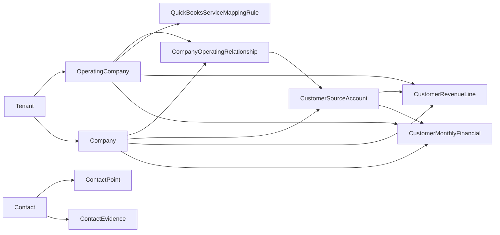

# Customer Intelligence: Data Model

> Evidence status: Confirmed from schema and migration. Additive to the existing platform; nothing here rewrites `CashflowCustomer` or `CashflowLegalEntity`.

Migrations: `20260805120000_add_customer_intelligence_foundation` (base tables/enums) and `20260805150000_customer_intelligence_corrections` (open AR, operating-company-scoped identity matches, evidence conflicts, one-approved-per-source database index, and the deployable Module/TenantModuleAccess/OperatingCompany bootstrap).

## Canonical structure

The canonical `Company` remains the identity hub. Customer Intelligence adds tenant-scoped records around it.

### OperatingCompany

Configurable operating companies replacing the hard-coded two-company finance behaviour. Fields: `slug`, `displayName`, `legalName`, `homeCurrency` (default CAD), `active`, `quickBooksRealmId`, `quickBooksCredentialId` (loose reference, validated in service code). Unique `(tenantId, slug)`.

### CompanyOperatingRelationship

Links one canonical `Company` to one `OperatingCompany`. Fields: `lifecycle` (`PROSPECT | ACTIVE_CUSTOMER | DORMANT_CUSTOMER | FORMER_CUSTOMER`), `status` (`ACTIVE | INACTIVE`), `firstRevenueDate`, `lastRevenueDate`, `assignedOwnerUserId`, `notes`. Unique `(tenantId, companyId, operatingCompanyId)`. Multiple relationships allow one customer across all three operating companies.

### CustomerSourceAccount

One row per QuickBooks customer record, keyed by `(tenantId, realmId, quickBooksCustomerId)`. Fields: `companyId`, `operatingCompanyId`, `companyOperatingRelationshipId`, `currency` (CAD/USD), `displayName`, `active`, `status` (`ACTIVE | INACTIVE | ARCHIVED`), `email`, `phone`, `billingAddress`/`shippingAddress` (Json), `parentQuickBooksCustomerId`, `contactDetails` (Json), `lastSyncedAt`. Multiple accounts (e.g. "Customer ABC" and "Customer ABC USD") map to one relationship and roll up to one canonical company.

## Contacts and evidence

`Contact` stays the tenant-wide person record. Additions:

- **ContactPoint**: one row per normalized email/phone/website/address per contact. `value` stores the normalized form (emails lowercased, phones digits-only) so equivalent values deduplicate deterministically; `displayValue` keeps the human form. Fields: `type` (`EMAIL | PHONE | WEBSITE | ADDRESS | OTHER`), `value`, `displayValue`, `label`, `primary`, `verificationStatus` (`UNVERIFIED | VERIFIED | REJECTED | EXPIRED`), `firstSeenAt`, `lastSeenAt`, `source`. Unique `(tenantId, contactId, type, value)`.
- **ContactEvidence**: extracted field-level facts. Fields: `sourceType` (`EMAIL_SIGNATURE | QUICKBOOKS | MANUAL | APOLLO | WEBSITE | OTHER`), `sourceRecordKey`, `fieldName`, `fieldValue`, `confidence`, `parserVersion`, `observedAt`, `reviewStatus` (`UNREVIEWED | ACCEPTED | REJECTED | CONFLICT`), `evidenceFragment` (capped at 240 characters), `conflictingValue` (the value that conflicts with an accepted/reviewed fact, preserved for review). Unique `(tenantId, contactId, sourceRecordKey, fieldName)`.
- **CustomerIdentityMatch**: proposed/approved links for QuickBooks accounts, email domains, aliases, and contacts. Fields: `kind` (`QUICKBOOKS_ACCOUNT | EMAIL_DOMAIN | COMPANY_ALIAS | CONTACT`), `companyId` (canonical target), `operatingCompanyId` (required for `QUICKBOOKS_ACCOUNT` so a mapping under one operating company cannot activate another), `sourceRecordKey`, `sourceLabel`, `candidateCompanyId`, `score`, `status` (`PROPOSED | APPROVED | REJECTED | SUPERSEDED`), `evidence` (Json), `reviewerUserId`, `reviewedAt`. A partial unique index enforces one `APPROVED` row per `(tenantId, kind, sourceRecordKey)` at the database level (`CustomerIdentityMatch_one_approved_per_source_key`).

## Financial records

- **QuickBooksServiceMappingRule**: operating company, `dimension` (`ITEM | CLASS | DEPARTMENT | INCOME_ACCOUNT | FILE_PREFIX | OTHER`), `matchValue`, `serviceLine`, `priority`, `active`, `reviewerUserId`. Unique `(tenantId, operatingCompanyId, dimension, matchValue)`.
- **CustomerFxRate**: `currency`, `monthKey` (YYYY-MM), `rateToCad` (Decimal 12,6), `status` (`PROVISIONAL | FINAL`), `source`, `fetchedAt`. Unique `(tenantId, currency, monthKey)`.
- **CustomerRevenueLine**: immutable QuickBooks report line identity. Fields: `realmId`, `sourceKey` (deterministic identity), `sourceAccountId`, `companyId`, `operatingCompanyId`, `transactionDate`, `transactionType`, `transactionNumber`, `accountRef`, `classRef`, `itemRef`, `fileRef`, `serviceLine`, `nativeAmount`, `nativeCurrency`, `homeAmount`, `homeCurrency`, `cadAmount`, `fxSource`, `syncMetadata`. Unique `(tenantId, sourceKey)`; re-inserting the same `sourceKey` returns the existing row.
- **CustomerMonthlyFinancial**: materialized monthly totals. Fields: `monthKey`, `companyId`, `operatingCompanyId`, `companyOperatingRelationshipId`, `sourceAccountId`, `sourceAccountKey` ("ALL" or account id; keeps the unique index NULL-safe), `serviceLine`, `currency`, `nativeRevenue`, `nativeCost`, `nativeGrossProfit`, `cadRevenue`, `nativeOpenAr`, `cadOpenAr`, `reconciliationStatus` (`RECONCILED | INCOMPLETE | UNRECONCILED`). Unique `(tenantId, companyOperatingRelationshipId, sourceAccountKey, serviceLine, currency, monthKey)`.

## Service lines

`CustomerIntelligenceServiceLine`: `OCEAN | AIR | TRUCKING_DRAYAGE | LOCAL_TRUCKING | WAREHOUSING_FULFILLMENT | CUSTOMS_BROKERAGE | OTHER`.

## Cashflow compatibility

The legacy `CashflowLegalEntity` enum (`NEWL_WORLDWIDE | NEWL_USA`) and `CashflowCustomer` are preserved unchanged. `cashflowLegalEntityToOperatingCompanySlug` maps the legacy enum to the operating-company slugs (`newl-worldwide`, `newl-usa`). A later reviewed migration may backfill `CompanyOperatingRelationship` from `CashflowCustomer.legalEntity`; the Customer Intelligence foundation performs no rewrite.

## Relation graph

