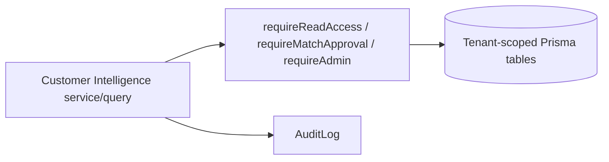

# Customer Intelligence: Overview

> Evidence status: Confirmed from code for file locations, schema, and implemented foundation behaviour. Inferred business rules are marked Requires employee confirmation.

## Purpose and status

Customer Intelligence is a leadership-only module that creates one tenant-wide profile for every prospect, active, dormant, and former customer. Phase 1 (this PR) is the **additive foundation only**: module entitlement, configurable operating companies, canonical company-to-operating-company relationships, multiple QuickBooks source accounts per relationship, contact points and source evidence, identity-match review records, service mapping rules, and FX/financial fact structures.

No live Microsoft 365, QuickBooks, Brave, Apollo, or customer-communication workflow is implemented in Phase 1. The module is read-only toward Microsoft 365 and QuickBooks in the final design; this foundation ships no external integration calls.

Main evidence: `prisma/schema.prisma` (Customer Intelligence models), `prisma/migrations/20260805120000_add_customer_intelligence_foundation`, `prisma/migrations/20260805150000_customer_intelligence_corrections`, `prisma/migrations/20260805160000_customer_intelligence_identity_integrity`, `src/modules/customer-intelligence/*`, `tests/customer-intelligence-*.test.ts`.

## Corrections (second review round)

- **Deployable bootstrap**: the corrections migration creates the module catalog record, enables the module for the approved `newl-group` tenant, and seeds the three Newl operating companies, so entitlement works through `prisma migrate deploy` without the development seed.
- **Lifecycle isolation + open AR**: revenue and approved QuickBooks mappings are scoped to the relationship's operating company; `CustomerMonthlyFinancial` now carries `nativeOpenAr`/`cadOpenAr` so positive open AR can activate a relationship with zero revenue.
- **Permissions at every entry point**: all exported queries and the cashflow resolver enforce `requireReadAccess`; `refreshRelationshipLifecycle` enforces `requireMutationAccess`.
- **Identity target integrity**: referenced company IDs are validated in-tenant, manual and automatic approval share one conflict invariant, and a partial unique index enforces one `APPROVED` target per `(tenantId, kind, sourceRecordKey)`.
- **Contact points/evidence**: values are normalized for deterministic dedupe; accepted facts are never silently overwritten and conflicts enter a reviewable `CONFLICT` state.

## Corrections (third review round)

- **No approval without a canonical company**: automatic approval requires a non-null canonical `companyId`; a high-scoring proposal without one stays `PROPOSED`.
- **QuickBooks operating company required on manual approval**: manual approval of a `QUICKBOOKS_ACCOUNT` match requires a tenant-valid `operatingCompanyId`; automatic and manual approval share the invariant validator in `identity-approval.ts`.
- **Database-backed integrity**: the `20260805160000_customer_intelligence_identity_integrity` migration adds tenant-scoped foreign keys for `companyId`/`candidateCompanyId` (`ON DELETE NO ACTION`) and CHECK constraints requiring `companyId` on every `APPROVED` match and `operatingCompanyId` on every `APPROVED` `QUICKBOOKS_ACCOUNT` match, preserving the one-approved-per-source index.

## Workflow / rules summary

- Entry points are server-side queries and actions under `src/modules/customer-intelligence`; UI pages, API routes, mailbox sync, QuickBooks sync, and research are later phases.
- Every query and action requires an authenticated leadership context (`permissions.ts`) and injects `tenantId` through `tenantWhere`.
- The canonical `Company` stays the identity shared by sales, TradeMining, Hunter, contacts, and finance. Customer Intelligence adds records around it; it never rewrites or deletes existing `Company`, `CashflowCustomer`, or `CashflowLegalEntity` data.
- Lifecycle is computed per operating-company relationship and rolled up to the canonical company (ACTIVE beats DORMANT beats FORMER beats PROSPECT).
- Identity matches auto-link only at score >= 90 without a conflicting canonical company; reviewed decisions are preserved across re-runs; one source can be approved to at most one canonical company.
- Every approval, rejection, merge, and unmerge writes an `AuditLog`.

## Permissions

- Read access: ADMIN, MANAGER, FINANCE (leadership only in v1).
- Match and service-rule approval: ADMIN or FINANCE.
- Integration, mailbox, operating-company, retention, and schedule settings: ADMIN.
- SALES and OPERATIONS receive no access in v1. READ_ONLY is excluded by the leadership guard (`requireReadAccess`) even though the role matrix grants read access broadly.

See `docs/modules/customer-intelligence/permissions.md`.

## Data model

Additive models in `prisma/schema.prisma`: `OperatingCompany`, `CompanyOperatingRelationship`, `CustomerSourceAccount`, `ContactPoint`, `ContactEvidence`, `CustomerIdentityMatch`, `QuickBooksServiceMappingRule`, `CustomerFxRate`, `CustomerRevenueLine`, `CustomerMonthlyFinancial`. See `docs/modules/customer-intelligence/data-model.md`.

## Failure modes

Expected failures: missing tenant entitlement, read-only mutation attempts, leadership-role denial, cross-tenant ID references (returns null or throws), operating company / company / relationship / contact not in the caller's tenant, duplicate source accounts keyed by `(tenantId, realmId, quickBooksCustomerId)`, and evidence fragments over 240 characters. Recovery uses the module review records and documented dry-run scripts in later phases.

## Testing

Relevant tests: `tests/customer-intelligence-foundation.test.ts` (tenant-safe actions, shared company, multi-account, cross-tenant attacks, cashflow compatibility), `tests/customer-intelligence-identity.test.ts`, `tests/customer-intelligence-service-lines.test.ts`, `tests/customer-intelligence-lifecycle.test.ts`, and the `CUSTOMER_INTELLIGENCE` assertions in `tests/authorization.test.ts`.

## Source map

| Responsibility | Main files |
|---|---|
| Services/actions | `src/modules/customer-intelligence/actions.ts` |
| Queries | `src/modules/customer-intelligence/queries.ts` |
| Pure logic | `src/modules/customer-intelligence/identity.ts`, `service-lines.ts`, `lifecycle.ts`, `constants.ts` |
| Cashflow compatibility | `src/modules/customer-intelligence/cashflow-compatibility.ts` |
| Audit | `src/modules/customer-intelligence/audit.ts` |
| Schema/migration | `prisma/schema.prisma`, `prisma/migrations/20260805120000_add_customer_intelligence_foundation` |
| Role policy | `src/server/auth/role-policy.ts` |
| Seed | `prisma/seed.ts` |

## Open questions

- Whether the third operating company display name must remain exactly "Newell's Express and Warehousing Ltd." (editable in settings; a test fixture uses "Newells Express" and an existing test file references a different legal name).
- The lifecycle rollup ordering (ACTIVE > DORMANT > FORMER > PROSPECT) is inferred and requires owner confirmation.
- Whether READ_ONLY users should ever see Customer Intelligence (v1 excludes them via the leadership guard).
