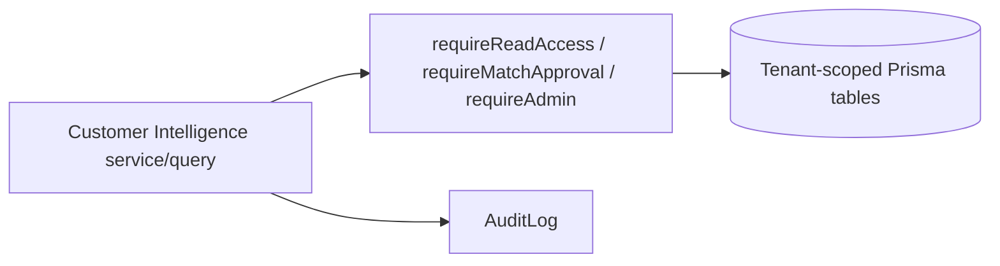

# Customer Intelligence: Overview

> Evidence status: Confirmed from code for file locations, schema, and implemented foundation behaviour. Inferred business rules are marked Requires employee confirmation.

## Purpose and status

Customer Intelligence is a leadership-only module that creates one tenant-wide profile for every prospect, active, dormant, and former customer. Phase 1 (this PR) is the **additive foundation only**: module entitlement, configurable operating companies, canonical company-to-operating-company relationships, multiple QuickBooks source accounts per relationship, contact points and source evidence, identity-match review records, service mapping rules, and FX/financial fact structures.

No live Microsoft 365, QuickBooks, Brave, Apollo, or customer-communication workflow is implemented in Phase 1. The module is read-only toward Microsoft 365 and QuickBooks in the final design; this foundation ships no external integration calls.

Main evidence: `prisma/schema.prisma` (Customer Intelligence models), `prisma/migrations/20260805120000_add_customer_intelligence_foundation`, `prisma/migrations/20260805150000_customer_intelligence_corrections`, `prisma/migrations/20260805160000_customer_intelligence_identity_integrity`, `src/modules/customer-intelligence/*`, `tests/customer-intelligence-*.test.ts`.

## Customer Profile UI design reference

The owner-reviewed target experience is documented in
`docs/modules/customer-intelligence/customer-profile-ui-design.md`, with the
interactive high-fidelity reference in
`docs/modules/customer-intelligence/customer-profile-wireframes.html`.

Builders and reviewers working on CP-PHASE-02B-3 or later Customer Profile
phases must inspect both files. The reference spans multiple phases for product
continuity; it is not blanket approval to implement every screen or integration
in one phase. The design document identifies the approved UX baseline, phase
boundaries, safety rules, and future concepts that still require separate
planning or migration approval.

## Corrections (second review round)

- **Deployable bootstrap**: the corrections migration creates the module catalog record, enables the module for the approved `newl-group` tenant, and seeds the three Newl operating companies, so entitlement works through `prisma migrate deploy` without the development seed.
- **Lifecycle isolation + open AR**: revenue and approved QuickBooks mappings are scoped to the relationship's operating company; `CustomerMonthlyFinancial` now carries `nativeOpenAr`/`cadOpenAr` so positive open AR can activate a relationship with zero revenue.
- **Permissions at every entry point**: all exported queries and the cashflow resolver enforce `requireReadAccess`; `refreshRelationshipLifecycle` enforces `requireMutationAccess`.
- **Identity target integrity**: referenced company IDs are validated in-tenant, manual and automatic approval share one conflict invariant, and a partial unique index enforces one `APPROVED` target per `(tenantId, kind, sourceRecordKey)`.
- **Contact points/evidence**: values are normalized for deterministic dedupe; accepted facts are never silently overwritten and conflicts enter a reviewable `CONFLICT` state.

## Corrections (third review round)

- **No approval without a canonical company**: automatic approval requires a non-null canonical `companyId`; a high-scoring proposal without one stays `PROPOSED`.
- **QuickBooks operating company required on manual approval**: manual approval of a `QUICKBOOKS_ACCOUNT` match requires a tenant-valid `operatingCompanyId`; automatic and manual approval share the invariant validator in `identity-approval.ts`.
- **Database-backed integrity**: the `20260805160000_customer_intelligence_identity_integrity` migration adds tenant-scoped foreign keys for `companyId`/`candidateCompanyId` (`ON DELETE NO ACTION`) and CHECK constraints requiring `companyId` on every `APPROVED` match and `operatingCompanyId` on every `APPROVED` `QUICKBOOKS_ACCOUNT` match, preserving the one-approved-per-source index.

## Customer Profile UI (CP-PHASE-02B-4)

The Customer Profile pages are server-rendered, leadership-only (ADMIN,
MANAGER, FINANCE via `requireReadAccess`) and render only existing
tenant-scoped foundation data. SALES, OPERATIONS, and READ_ONLY remain
excluded; unknown and cross-tenant company identifiers render as not found
(`getCompanyProfileDetail` returns null → `notFound()`).

- **Directory** (`/customer-intelligence`): matched-company table (lifecycle
  rollup, operating companies, QuickBooks source accounts, contacts,
  opportunities, last activity) plus an unmatched QuickBooks customer view.
  Unmatched rows show potential contacts derived **only** from the stored
  identity-match evidence (`profile-evidence.ts`); no Microsoft 365 or external
  call exists and email bodies are never read or displayed. Every PROPOSED
  QuickBooks match remains in this view, including a deferred proposal carrying
  a reviewer-selected canonical company; only an approved decision is matched.
- **Company profile** (`/customer-intelligence/companies/[companyId]`):
  overview with operating-company relationships and lifecycle, source accounts,
  match status, contacts (with contact points and evidence counts), existing
  sales-pipeline lead and stored opportunity signals, an honest news empty
  state (public-news collection is a later phase), and an honest TradeMining
  configuration state. The TradeMining section shows only stored
  `TradeMiningImportRecord` evidence; a per-company TradeMining search identity
  is **not** persisted by the current schema, so no search name is editable and
  no schema change was added (owner-approved "no schema change" boundary).
- **Guarded editing**: `updateContactDetails` (core action in `actions.ts`,
  ADMIN/FINANCE via `requireMatchApproval` + `requireWrite`) applies manual
   contact corrections (first/last name, title, department, email, phone,
   contact status), derives the required `fullName`, and records email/phone
   corrections as normalized `ContactPoint` rows — equivalent spellings
   deduplicate deterministically, and a replaced value becomes the primary point
   while the prior direct value is retained as deduplicated evidence even when
   no prior `ContactPoint` existed (demoted, never deleted). Clearing a direct
   value retains it and demotes every prior primary point of that type. The
   authoritative contact is row-locked and read within the transaction, and only
   submitted fields are updated. The contact row, contact-point corrections,
   and AuditLog entry commit in that Prisma transaction, so concurrent changes
   to omitted fields are not lost and a manual correction cannot persist
   unaudited. The
  visible edit panel (`components/contact-edit-panel.tsx`) never substitutes
  for the server-side mutation guard; the thin `profile-actions.ts` wrappers
  re-validate the profile path and reject a nonempty unrecognized contact
  status with an error state instead of reporting false success.
- **No fabrication**: news, imports, opportunities, and external results are
  never invented; the news section is an honest empty state and the
  TradeMining section explains the missing per-company identity model.
- **Contact attribution**: profile contact cards show the stored `Contact.source`
  and each contact point's stored `source` (or “Not stored”) alongside its
  verification state. The UI does not infer provenance.

## Workflow / rules summary

- Entry points are server-side queries and actions under `src/modules/customer-intelligence`; the CP-PHASE-02B-3 identity review page lives under `src/app/(authenticated)/customer-intelligence/review`, and the CP-PHASE-02B-4 directory/profile pages live under `src/app/(authenticated)/customer-intelligence` (root) and `src/app/(authenticated)/customer-intelligence/companies/[companyId]`. Mailbox sync, reconciliation, research, and the remaining Customer Profile screens are later phases.
- Every query and action requires an authenticated leadership context (`permissions.ts`) and injects `tenantId` through `tenantWhere`.
- The canonical `Company` stays the identity shared by sales, TradeMining, Hunter, contacts, and finance. Customer Intelligence adds records around it; it never rewrites or deletes existing `Company`, `CashflowCustomer`, or `CashflowLegalEntity` data.
- Lifecycle is computed per operating-company relationship and rolled up to the canonical company (ACTIVE beats DORMANT beats FORMER beats PROSPECT).
- Identity matches auto-link only at score >= 90 without a conflicting canonical company; reviewed decisions are preserved across re-runs; one source can be approved to at most one canonical company. CP-PHASE-02B-3 adds the deterministic reconciliation service that re-scores PROPOSED QuickBooks matches and routes ambiguity to the leadership review queue.
- Every approval, rejection, and deferral writes an `AuditLog`. For an unmatched
  QuickBooks customer, ADMIN/FINANCE may explicitly create a canonical Company
  from separately entered reviewer data; Company, operating-company
  relationship, approved decision, and audit evidence commit atomically. The
  source name is never an automatic creation fallback.
- CP-PHASE-02B-5 adds the ADMIN-triggered, GET-only financial materialization
  (`runFinancialMaterialization`): revenue detail + AR aging are materialized
  into immutable `CustomerRevenueLine` rows, aggregated into
  `CustomerMonthlyFinancial` under the existing monthly unique key, and
  lifecycle is refreshed through the existing guarded action. Dry-run performs
  zero writes; no QuickBooks posting is performed.

## Permissions

- Read access: ADMIN, MANAGER, FINANCE (leadership only in v1).
- Match and service-rule approval: ADMIN or FINANCE.
- Integration, mailbox, operating-company, retention, and schedule settings: ADMIN.
- SALES and OPERATIONS receive no access in v1. READ_ONLY is excluded by the leadership guard (`requireReadAccess`) even though the role matrix grants read access broadly.

See `docs/modules/customer-intelligence/permissions.md`.

## Data model

Additive models in `prisma/schema.prisma`: `OperatingCompany`, `CompanyOperatingRelationship`, `CustomerSourceAccount`, `ContactPoint`, `ContactEvidence`, `CustomerIdentityMatch`, `QuickBooksServiceMappingRule`, `CustomerFxRate`, `CustomerRevenueLine`, `CustomerMonthlyFinancial`. See `docs/modules/customer-intelligence/data-model.md`.

## Failure modes

Expected failures: missing tenant entitlement, read-only mutation attempts, leadership-role denial, cross-tenant ID references (returns null or throws), operating company / company / relationship / contact not in the caller's tenant, duplicate source accounts keyed by `(tenantId, realmId, quickBooksCustomerId)`, and evidence fragments over 240 characters. Recovery uses the module review records and documented dry-run scripts in later phases.

## Testing

Relevant tests: `tests/customer-intelligence-foundation.test.ts` (tenant-safe actions, shared company, multi-account, cross-tenant attacks, cashflow compatibility), `tests/customer-intelligence-identity.test.ts`, `tests/customer-intelligence-service-lines.test.ts`, `tests/customer-intelligence-lifecycle.test.ts`, `tests/customer-intelligence-profile-ui.test.tsx` (directory/profile queries, guarded contact corrections, and server-rendered pages), `tests/customer-intelligence-ingestion.test.ts` (CP-PHASE-02B-2 read-only QuickBooks customer ingestion), `tests/customer-intelligence-materialization.test.ts` and `tests/customer-intelligence-fx.test.ts` (CP-PHASE-02B-5 financial materialization), and the `CUSTOMER_INTELLIGENCE` assertions in `tests/authorization.test.ts`.

## Source map

| Responsibility | Main files |
|---|---|
| Services/actions | `src/modules/customer-intelligence/actions.ts` |
| Queries | `src/modules/customer-intelligence/queries.ts` |
| Read-only QuickBooks customer ingestion (CP-PHASE-02B-2) | `src/modules/customer-intelligence/quickbooks-ingestion.ts` |
| Read-only QuickBooks financial materialization (CP-PHASE-02B-5) | `src/modules/customer-intelligence/financial-materialization.ts` |
| Deterministic FX helpers (CP-PHASE-02B-5) | `src/modules/customer-intelligence/fx.ts` |
| Deterministic identity reconciliation (CP-PHASE-02B-3) | `src/modules/customer-intelligence/reconciliation.ts` |
| Identity review page and server actions (CP-PHASE-02B-3) | `src/app/(authenticated)/customer-intelligence/review/page.tsx`, `src/modules/customer-intelligence/review-actions.ts`, `src/modules/customer-intelligence/components/identity-review-actions.tsx` |
| Customer Profile directory and company detail pages (CP-PHASE-02B-4) | `src/app/(authenticated)/customer-intelligence/page.tsx`, `src/app/(authenticated)/customer-intelligence/companies/[companyId]/page.tsx` |
| Customer Profile queries, contact action, server actions, evidence helper, edit panel (CP-PHASE-02B-4) | `src/modules/customer-intelligence/queries.ts`, `src/modules/customer-intelligence/actions.ts`, `src/modules/customer-intelligence/profile-actions.ts`, `src/modules/customer-intelligence/profile-evidence.ts`, `src/modules/customer-intelligence/components/contact-edit-panel.tsx` |
| Customer Profile UX baseline | `docs/modules/customer-intelligence/customer-profile-ui-design.md`, `customer-profile-wireframes.html` |
| Pure logic | `src/modules/customer-intelligence/identity.ts`, `service-lines.ts`, `lifecycle.ts`, `constants.ts` |
| Cashflow compatibility | `src/modules/customer-intelligence/cashflow-compatibility.ts` |
| Audit | `src/modules/customer-intelligence/audit.ts` |
| Schema/migration | `prisma/schema.prisma`, `prisma/migrations/20260805120000_add_customer_intelligence_foundation` |
| Role policy | `src/server/auth/role-policy.ts` |
| Seed | `prisma/seed.ts` |

## Open questions

- Whether the third operating company display name must remain exactly "Newell's Express and Warehousing Ltd." (editable in settings; a test fixture uses "Newells Express" and an existing test file references a different legal name).
- The lifecycle rollup ordering (ACTIVE > DORMANT > FORMER > PROSPECT) is inferred and requires owner confirmation.
- Whether READ_ONLY users should ever see Customer Intelligence (v1 excludes them via the leadership guard).
