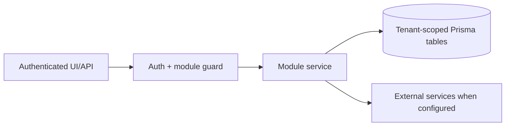

# Lead generation, contacts, TradeMining, Apollo outreach: Business Rules

> Evidence status: Confirmed from code for file locations and schema references; business workflow details not explicitly encoded are marked Requires employee confirmation.

## Purpose and status

Lead generation, contacts, TradeMining, Apollo outreach is documented because code, routes, schema, or tests were located. Main evidence: `src/app/(authenticated)/lead-gen/*`, `src/modules/lead-gen/*`, `src/modules/trademining/ingestion.ts`, Apollo integration files, lead/contact/company Prisma models.

## Workflow / rules summary

- Entry points are protected authenticated pages and/or API routes for this module.
- Server-side pages and mutating APIs should validate tenant context and module entitlement before data access.
- Data persistence uses tenant-scoped Prisma models where a database model exists.
- External calls use `src/server/integrations/*` or module-specific integration helpers. Secret values are not documented here.
- Approval, printing, posting, and live external writes require human approval unless a code path explicitly enforces a safe dry-run.

## TradeMining search profile execution

- Every enabled TradeMining search profile is run once daily by Hunter after its configured local run time.
- `lookbackWindowDays` controls the full trailing TradeMining query window for that individual profile.
- Each daily profile run begins as one logical BOL search containing every configured destination port, origin country, origin port, ship-from port, product keyword, HS code, and minimum-TEU rule. If TradeMining reports more than 25,000 matches, Hunter adaptively divides the date range and, for a capped one-day range, the arrival-port set. The profile still represents one daily run and the complete configured lookback.
- U.S. arrival ports are optional. When supplied, every value must be a supported TradeMining U.S. arrival port; common short names such as `Charleston`, `Savannah`, and `Wilmington` are executed as canonical TradeMining port names. Canadian cities belong in consignee markets, not arrival ports.
- `destinationMarkets` accepts canonical city or province destinations. Canada requires a province value such as `Ontario | Canada`; legacy Canadian city values fail validation and are excluded from suggestions. Hunter submits Canadian profiles through TradeMining's consignee-country and consignee-state/province fields and supplies Canada's lookup ID when resolving the province. Canadian province profiles do not submit a city or address fallback. Non-Canadian city values require an exact TradeMining city match. If any configured city is unresolved, every configured city stays inside one Boolean consignee-address expression so the alternatives remain OR rather than becoming contradictory fields.
- The legacy database field `minShipmentVolume` represents minimum TEUs per BOL and is posted to TradeMining as `TEU >= value`.
- A company qualifies for Found Companies only when its shipment evidence for the matched profile, within that profile's lookback window, meets both `minShipmentCount` and the optional `minAggregateTeu`.
- Industry packs maintain reusable keyword and HS-code families. `PREFER` increases the industry-fit score but does not remove companies; `HARD` requires the persisted primary or secondary classification to match a selected pack; `EXCLUDE` removes companies whose persisted classification matches a selected pack. Hard and exclude modes are deterministic post-ingestion qualification rules, not additional TradeMining form fields.
- Each completed run records the count reported by TradeMining, exported row count, number of physical queries, qualifying-company count, and whether retrieval was complete. A one-day, one-port (or no-port) query still above the export limit is `PARTIAL`, never silently complete.
- Search profile frequency is a legacy database compatibility field fixed to `daily`; it is not editable and does not control the worker.
- Newl Apps is the source of truth for enabled profiles. Deleting a profile cancels its pending immediate-run requests, and Hunter reloads the enabled profile list before execution so deleted or disabled profiles do not receive future searches.
- Hunter creates the tracked ingestion run before validating local execution configuration. A configuration failure therefore updates the profile to `FAILED`, appears on the Search Profiles screen, and counts as that day's attempt. Recovery is an explicit profile correction followed by **Run now**, rather than continuous automatic retries.

## Scoring and outreach safety

- Hunter's owner-approved target mix is 60% warehousing, 30% ocean/air, and 10% trucking. The planner may backfill a weak or empty bucket from the strongest remaining service line; it must not lower score or confidence thresholds merely to fill the daily limit.
- TradeMining is one Hunter evidence source, not a prerequisite. A sufficiently confident tenant-scoped external signal can create a dry-run decision without an existing Company row.
- Phase 1 planning excludes active customers, company-level replies, do-not-prospect records, rejected/disqualified companies, and active suppression entries. Legacy lead rows, an individual do-not-contact record, and prior cadence history do not suppress the entire company; contact-level safety is rechecked later.
- `OFF` and the kill switch both prevent planning. `ASSISTED` and `AUTOMATIC` are reserved schema states and cannot be selected through the Phase 1 policy action.
- Company scoring uses only tenant-scoped TradeMining evidence inside the matched search profile's own `lookbackWindowDays`. The scoring-level lookback is a fallback for unmatched or legacy imports and must cover the recent plus comparison windows.
- Shipment evidence queries are date bounded but not row capped. This prevents arbitrary 25-, 100-, or 250-record limits from changing a score for high-volume companies.
- The matched profile's `minShipmentCount` is a qualification gate for Found Companies; it is not replaced by the fallback scoring lookback.
- The matched profile's `minAggregateTeu` is a second qualification gate. It sums the record-level `teu` values for that company, profile, and lookback window; it is distinct from minimum TEUs per BOL.
- Contacts marked `DO_NOT_CONTACT` or `REJECTED` receive score `0`, remain `UNRANKED`, and cannot be assigned a cadence.
- Only contacts explicitly marked `APPROVED` can be queued for Apollo. The queue worker rechecks the contact and blocks companies marked `doNotProspect`, `REJECTED`, or `DISQUALIFIED` before any external write.
- Apollo organization discovery must use documented Apollo filters. A known domain uses `q_organization_domains_list`; a name-only search uses `q_organization_name` and no more than two deterministic variants.
- Only `DIRECT_COMPANY` matches can proceed automatically. If the latest match is ambiguous, a logistics provider, or no match, bulk enrichment must skip the company until a rep resolves it in **Apollo Match Review**.
- A manually supplied Apollo Overview or People URL may contain either an Apollo account ID or global organization
  ID. Newl Apps must resolve an account ID to its nested global organization ID before employee search, require a
  strong company-name match, prevent duplicate organization mapping inside the tenant, and require explicit
  acknowledgement of the one-credit organization validation. A facility/legal account may map to the canonical
  operating parent only when Account View proves the exact relationship and both names share a distinctive brand.
- Confirming no Apollo match keeps the latest attempt and reviewer metadata. Automatic and bulk retry remain blocked until a rep explicitly reopens the review.
- Resolving a company mapping queues the same one-company Hunter buyer-role review used by the automated handoff. It
  never drafts from the unfiltered Apollo employee result, selects more than the saved 1-3-contact limit, or authorizes
  cadence enrollment; the existing grounded QA, human approval, and push controls still apply.
- The Contacts directory includes both assigned and unassigned contacts attached to pipeline accounts. Unassigned contacts remain filterable and reviewable, but Apollo queueing is blocked until a sales rep is assigned.
- Contact title and department matching uses normalized phrase boundaries. Sales, business-development, and customer-service roles are deprioritized by default, while a preferred logistics/operations match takes precedence for mixed-function titles. Clearly individual-contributor titles such as coordinator, specialist, analyst, associate, assistant, administrator, clerk, representative, agent, or technician cannot be auto-selected merely because the contact-fit model rates them highly; a manager-or-higher buyer role or a non-junior model-qualified stakeholder is required. The narrow exception is an explicit import/export, customs, or trade-compliance specialist: that person may advance only when the buyer-role model independently returns a qualifying Primary/Secondary disposition and every contact-safety gate passes.
- Hunter email outreach requires a concrete syntactically usable email address before contact persistence, buyer-role
  review, or plan generation. Apollo's `has_email` availability flag is not enough because it does not provide a
  deliverable address. Saved-contact lookup is zero-credit and must be exhausted before enrichment. Paid email-only
  enrichment is disabled for automatic runs and requires a separate explicit manual authorization capped at three
  people; phone, personal-email, and waterfall enrichment remain disabled.
- Bulk outreach approval accepts selected contacts rather than plan IDs, resolves each contact's latest non-archived
  plan inside the authenticated tenant, and approves only current `QA_PASSED` plans for safe Qwen/Kimi-vetted Hunter
  opportunities with a usable email. Eligible contacts are approved atomically and placed into one Apollo enrollment
  job; ineligible selections remain unchanged and return a visible reason.
- Scoring settings reject invalid window combinations, company weights that do not total exactly 100 points, non-descending contact tiers, and incomplete or inverted mid-market TEU ranges.
- Score history is immutable and event-driven. Company opportunity scores are captured after TradeMining ingestion and pipeline approval; contact relevance scores are captured when Apollo status is synchronized or a push is attempted. Opening a page does not create history.
- Every score snapshot records the scoring model version, a deterministic fingerprint of the full scoring configuration, the matched search profile when available, an explanation, and the evidence date. This allows later outcomes to be compared against the score that was actually used.
- Candidate decisions, pipeline stage changes, Apollo cadence enrollment, sequence status changes, and reply status changes are stored as tenant-scoped outcome events.
- Each new outcome links to the latest applicable score snapshot for the same tenant and subject at or before the outcome time. Contact outcomes use contact-relevance snapshots; company and pipeline outcomes use company-opportunity snapshots. Outcomes remain unlinked when no earlier snapshot exists.
- Apollo sequence and reply outcomes link to a snapshot created before the new Apollo state is persisted. A positive reply or meeting therefore cannot increase the score used to evaluate that same outcome.
- Apollo reply data is refreshed when a user selects contacts and runs **Sync Apollo status**, during the immediate Apollo lookup used to verify a push, and by the scheduled saved-contact sync. The scheduler runs hourly and treats each successful contact as fresh for four hours by default. Push-job polling only rechecks pending cadence enrollment and is not a general reply refresh.
- Scheduled Apollo sync only runs for tenants with Lead Generation enabled and an active Apollo integration. It reads saved contacts by Apollo contact ID, uses bounded batches and retries, stops the current batch after sustained rate limiting, and records contact-level failures plus an `AutomationJobRun` and audit entry.
- The scoring-history migration is additive and performs no score backfill. Historical reporting begins after the migration is deployed; current Company, Contact, Lead, and TradeMining records are not rewritten.

## External signal classification

- Public-news discovery is opt-in and disabled by default. Enabling a source is a business/compliance decision, not a model decision.
- Discovery is bounded to a trailing-month Brave window and at most 40 unique, previously unseen source URLs per daily run.
- Approved topics and geographies rotate deterministically by local date. Exact query fingerprints are stored in the
  job input, canonical source URLs are suppressed for 180 days, and same-company/signal/geography coverage within
  one publication month is grouped as one event with bounded corroborating sources.
- Obvious directories, rankings, and warehouse/provider roundup titles are deterministically removed before Qwen.
  The classifier must also reject one-off pop-ups and service-line assignments without explicit supporting evidence.
- A source outage cannot become a false successful zero-result run. If every configured query transport fails, the job is `ERROR`.
- Model output is advisory evidence. Deterministic validation controls enums, HTTPS URLs, dates, field sizes, source mapping, dedupe, tenant scope, and the minimum confidence gate.
- `relevant=true` requires an explicit company and confidence of at least 50. The tenant's `minimumSignalConfidence` remains the final activation threshold.
- Local Qwen is the bulk classifier. A hosted model is not required for this phase and cannot independently authorize Apollo or outreach.
- The prompt/model/provider/version, classification rationale, source lens, and supporting title/snippet statements are retained with accepted signals.
- An above-threshold company is matched to the tenant's canonical identity or created as a provisional external-scout
  company without requiring a TradeMining record. External-signal companies receive a bounded one-third reservation
  in the next company-research cohort; they still require the complete Luna/Kimi/deterministic gate before Apollo.
- The local classifier receives public search-result metadata only. It does not receive contacts, emails, Apollo payloads, TradeMining raw rows, tenant credentials, or customer records.

## Hunter company deep research

- Company deep research is opt-in and disabled by default. It processes the tenant policy's `dailyCompanyLimit`, which defaults to 30 for a new, unsaved policy and remains editable from 1 to 100.
- The default queue excludes do-not-prospect, rejected/disqualified, cashflow-customer, existing-pipeline, replied, previously sequenced, do-not-contact, and recently researched companies. An explicit operator replay may name at most 100 company keys, and every key is still resolved inside the authenticated tenant and through the same exclusion rules.
- Every company receives identity/parent, fresh-event, first-party-careers, distribution-footprint, and customs/import-record queries. One bounded page-fetch slot is reserved for customs evidence, and repeated source URLs are deduplicated across passes. TradeMining importer, consignee, and shipper names may become at most four same-identity search aliases; they are query-only and are never included in the Qwen, Kimi, or Luna evidence packet. When an official domain is known, its identity and fresh-event queries must execute even when earlier generic searches return enough rows to fill the evidence cap; bounded evidence selection samples every enabled query before filling remaining slots. If Qwen leaves identity below 70%, marks it ambiguous, or lacks corroborating first-party identity, Hunter runs a deterministic brand-domain recovery pass before scoring. It can pivot from a candidate-matching domain already present in saved evidence, searches the brand's official site and first-party legal/about/contact pages, and reruns synthesis when evidence is added. First-party recovery evidence may replace a weaker directory/non-trigger row at the evidence cap. Local Qwen may request at most two evidence-gap follow-ups. Those follow-ups stop before the shared 24-record company cap, and the completion payload applies the same bound defensively. Search results, queries, source URLs/domains, excerpts, pass labels, Brave publication dates, retrieval counts, and failures remain auditable.
- GPT-5.6 Luna authoritatively synthesizes the bounded evidence with low reasoning, strict Structured Outputs,
  no tools, and `store: false`, including the exact evidence indices supporting each trigger and the public-evidence
  basis for company country/U.S.-division identity. Local Qwen 3.5 35B temporarily processes the same evidence only
  as a non-blocking comparison and cannot replace a missing Luna row. Kimi K2.6 independently scores five 0-20
  dimensions only after Luna synthesis. Kimi K3 with low reasoning validates at most the five strongest provisional
  fresh-event candidates. Any trigger evidence restored by deterministic review is guaranteed into both compact Kimi
  packets instead of being displaced by a generic page chosen for pass diversity. Token counts, cached tokens,
  durations, model names, prompt version, and non-authoritative cost estimates are retained.
- Deterministic server code, not either model alone, blocks an uncorroborated ambiguous identity, explicit language showing that the company provides logistics services to other customers or members, an explicitly evidenced stable/exclusive external-provider relationship without displacement evidence, fewer than two evidence records, missing identity evidence, coverage of fewer than two passes, and mainland-China identity without a verified U.S. division. Provider and incumbent labels require explicit saved evidence; unsupported model labels are cleared before scoring. Matching first-party identity evidence can correct an unsupported ambiguous label. Active government registration plus independent recent customs evidence for the exact company may establish current identity, but an inactive registration, a similar parent/holding company, or customs evidence by itself cannot. Customs notify-party or logistics-party names never establish an incumbent relationship, exclusivity, or displacement. Compact model packets preserve up to two exact-company, recent, dated material-expansion records and the strongest specific current logistics-management vacancy before filling remaining slots by pass diversity; generic identity, careers, or footprint pages cannot displace those records merely because they rank higher by source type. A current vacancy must contain unambiguous opening, hiring, or application language tied to the specific currently available role and the exact company identity; responsibilities or qualifications alone, generic “Join our team” invitations, general applications, talent communities, future-opportunity language, salary records, compensation references, role taxonomies, job-description references, employee profiles, and expired postings do not qualify. For current-account research, deterministic reconciliation saves that vacancy as the trigger citation with its exact role wording, or replaces a non-vacancy careers citation and removes unsupported hiring language when no qualifying vacancy exists. Related-company events are ordered by the most specific candidate-name match and then logistics-facility relevance, so an exact operating-company distribution-center event precedes a parent or affiliate manufacturing event. A strict evidence check restores `FRESH` and its summary when Qwen overlooks an exact-company, recent, dated material expansion in a non-directory source, including production-line investment, establishment of a distribution center or warehouse, and cases where Qwen selected `FRESH` but cited a weaker affiliate, unsupported careers, or directory record instead of the qualifying event. New manufacturing or production lines at an existing facility qualify as an `EXPANSION`, not a `FACILITY_OPENING`; deterministic repair also replaces a contradicted generic synthesis summary with the exact saved event evidence. The event itself and its cited publication must both fall inside the trailing 18 months; a newly published article about a clearly older opening or production start is not fresh. Facility and commencement language must occur in the same atomic clause and cannot be assembled from separate statements. A `FRESH` claim whose cited trigger lacks a qualifying recent event is evaluated as current fit instead of being blocked, and stale/no-opportunity results remain on Watchlist for later research. Hunter prefers the page's original `datePublished` metadata over Brave's later page-update age. A current year in the search query, a generic recently updated company profile, or a crawl timestamp is not event-date evidence. Ordinary manufacturers, retailers, importers, or distributors with internal logistics staff are prospects and do not trip the provider gate.
- Kimi's five dimension scores must sum exactly to its total. K3 may confirm or downgrade a candidate and may never raise the K2.6 score or override a deterministic blocker. A fresh event becomes **Hot opportunity** only when K3 confirms the same recent dated evidence. A strong fit with current evidence but no discrete recent trigger becomes **Qualified current account**. Lower-accessibility, uncertain-timing, below-threshold, stale/no-opportunity, foreign-without-U.S.-division, or unvalidated fresh candidates become **Watchlist**. Explicit logistics providers, uncorroborated ambiguous identities, explicitly stable/exclusive incumbent relationships without displacement evidence, and mainland-China entities without a verified U.S. division become **Blocked**.
- K2.6 confidence measures the reliability of its score and identity evidence, not the magnitude or freshness of the sales opportunity. A verified current account may have a moderate score and high confidence when no discrete expansion or provider-displacement event exists; absence of a fresh trigger must not by itself push confidence below the active threshold.
- Company-country rules use public identity evidence only. TradeMining origin countries, foreign ports, and shipment routing are never treated as the company's country. A verified U.S. or Canadian identity cannot be reversed by an incidental China reference elsewhere in a long identity page; text-based China inference is used only while operating country remains unknown. U.S. and Canadian companies are prioritized normally and do not have to re-prove that they are a foreign parent's U.S. division after their North American operating identity passes the identity gate. For a foreign or mainland-China company claiming a U.S. division, cited public evidence must still contain a matching division alias, U.S./North America jurisdiction language, and an explicit operating relationship. Legal suffixes and explanatory parentheticals do not have to match literally, but an unrelated similar brand does not qualify. Other foreign companies without a verified U.S. division remain eligible evidence but receive a fixed 10-point penalty and cannot rise above Watchlist. A mainland-China company is Blocked unless cited evidence verifies a named U.S. operating division.
- Completion refreshes the prospecting plan. The research/model stage itself cannot search Apollo, change a company
  or lead stage, enroll a cadence, draft/send email, or perform LinkedIn activity. An explicitly enabled Assisted
  policy may then queue the separate post-research handoff below.
- Research data reuses the additive Hunter signal and `AutomationJobRun` JSON ledgers. Phase 3 requires no database migration and does not rewrite existing company, contact, lead, TradeMining, Apollo, scoring, or outreach records.

## Hunter quality and TradeMining run assurance

- The daily quality audit samples at most five recent classifications and deliberately covers Hot, Qualified current account, Watchlist, and Blocked before filling any remaining slot.
- Codex auditing is read-only. Its output cannot directly change a signal, company, score, pipeline stage, contact, cadence, or outreach record.
- A missing source is a retrieval defect only when independent public research verifies a material source that existed for the audited run. Evidence already present in the saved ledger but absent from a downstream model decision is a handoff defect. A disagreement after the evidence reached the model is model judgment and is not auto-fixed.
- Every enabled TradeMining profile must have a tracked ingestion attempt once per local day after the monitoring grace hour. A run for a removed or disabled profile, overlapping active runs, missing coverage metrics, incomplete adaptive retrieval, or exported/processed count mismatch is a deterministic alert.
- Zero TradeMining matches are not automatically an error. They become a review anomaly only when the same profile has recent positive run history.
- Only reproducible code defects may use the owner-enabled Hunter Rivet standing approval. Credentials, authorization, transient runtime failures, configuration issues, and subjective scoring always require review.
- Reproducible findings from the same workflow and audit are consolidated into one incident and one Rivet packet. A queued, running, or review-blocked Rivet scope prevents a sibling job for that workflow; later evidence must be reviewed with the existing work.
- The second incident for the same reproducible workflow scope within seven days trips the incident circuit breaker. It reuses the existing Rivet job when present and does not create another automatic branch.
- Teams notifications always state that no lead was reclassified, no search/outreach was retried, and nothing was merged or deployed.
- The routine TradeMining digest is separate from quality control. It reports the settled daily profile batch once, while a failed profile sends an immediate safe alert and the remaining profiles continue.
- Rivet validates approved packets and required context against the fetched base branch in its dedicated runtime. A missing context file or blank packet field must stop before `git worktree add`; it cannot fall through to an empty `origin/` reference. Rivet pushes an isolated branch, obtains an independent exact-commit review, and opens a draft PR only after a zero-finding `PASS`. A blocked review keeps its branch and audit record but creates no PR.

## Automated sales workspace boundaries

- Daily Opportunities is the researched decision surface; Found Companies remains a bounded source-data review screen.
- Outreach Queue defaults to **Needs Attention**. It includes approved, ready, paused, or replied contacts and contacts
  with a current Newl draft or Outreach Plan, but excludes contacts already enrolled in Apollo.
- **Active Cadences** contains enrolled, no-reply contacts for monitoring. Enrollment therefore removes a contact from
  Needs Attention without deleting the contact, plan, sequence history, or reply-sync state.
- Both views exclude rejected and do-not-contact records, bounced sequences, finished sequences without current outreach work, and positive, meeting-booked, or negative reply outcomes. A current non-archived Outreach Plan keeps a no-reply contact visible in Needs Attention even when an older cadence is finished.
- A legacy `Lead` row by itself does not remove a researched company from Hunter planning. Hunter blocks a company
  for current-customer, do-not-prospect, rejected/disqualified, do-not-contact, reply, or prior-sequence evidence.
  This preserves duplicate-outreach protection without letting the retired pipeline workflow suppress otherwise
  valid Hot and Qualified opportunities.
- Sales Opportunities is a revenue view over existing lead stages, limited to `REPLIED`, `MEETING_BOOKED`, `QUOTED`, `WON`, and `LOST`. A saved Apollo positive reply infers `REPLIED` for the view, while meeting-booked infers `MEETING_BOOKED`, so engagement cannot disappear between queues before a human confirms the lead stage. This layout rule does not change the Prisma enum or delete earlier-stage leads.
- Apollo/customer communication approval boundaries are unchanged by this presentation redesign.

## Assisted outreach planning and grounding

- Outreach generation requires both a ranked contact and a current company-level Hunter handoff. The latest Hunter
  company-research signal must be Hot or Qualified current account, pass the deterministic research gate, and have a
  newer `WOULD_PURSUE` planner decision with the same service line. Watchlist, Blocked, unassessed, stale, unselected,
  or inconsistent handoffs cannot generate or push outreach.
- The saved model ledger must explicitly identify the authoritative Luna synthesis model, optional Qwen shadow,
  and Kimi scoring model. An OpenAI, Ollama, or Kimi
  provider label without the expected model-family name fails closed, so legacy or partially processed records cannot
  enter the contact-discovery queue.
- Hot opportunities additionally require a saved Kimi K3 `CONFIRM` validation. Qualified current accounts may use
  the normal `NOT_SELECTED` validator state because K3 is reserved for the strongest fresh-event candidates.
- Research freshness defaults to 30 days through `HUNTER_OUTREACH_RESEARCH_MAX_AGE_DAYS`. The duration is inferred
  operating policy and still requires business-owner confirmation; changing it does not rewrite saved research.
- Strategy uses the configured Terra-class model; drafting and model QA use the configured Luna-class model. Model
  names remain server environment configuration and every saved plan records the actual names and prompt version.
- Hunter's selected service line is authoritative. The strategy model receives the saved opportunity tier, point of
  attack, service line, score, confidence, persona, sender, cadence, and research time. It may refine messaging but
  cannot substitute another service line; a mismatch fails before persistence.
- Every plan freezes a bounded evidence ledger and SHA-256 fingerprint. Company/contact identity, each exact Hunter
  research article URL/excerpt, the selected Hunter decision, and TradeMining summaries have stable evidence IDs.
- The ledger includes a small owner-approved Newl capability record for Hunter's selected service line. It may ground
  conservative statements about Newl's own services, but it does not prove a prospect event, need, volume, timing,
  incumbent relationship, or buyer responsibility.
- A Hunter cadence contains three emails on days 0, 4, and 10. A separate manual call task on day 7 is permitted only for a Hot opportunity. Hunter does not add LinkedIn tasks to Apollo cadences.
- Hunter cadence catalog keys are planning identifiers only. Customer enrollment requires one active Apollo cadence
  with the exact managed name and always uses Apollo's live sequence ID.
- Every strategy and step must cite a saved evidence ID. Deterministic QA validates citations, ordering, channel mix,
  lengths, unsupported URLs, banned generic phrases, and unsupported quantified shipment/TEU/store/facility/location
  claims. A conservative model critic separately checks semantic grounding and buyer-responsibility assumptions.
- Any deterministic or model error fails closed. A failed plan remains reviewable but cannot be approved or pushed.
- Outreach policy v2.5 preserves already-passed v2.4 plans. Failed v2.4 plans receive one upgrade attempt under v2.5,
  while any v2.5 result is reused until a person explicitly requests regeneration. This prevents repeated model spend
  without rewriting copy that already passed both gates.
- Generation never marks a draft approved. Human plan approval requires QA `PASSED` and a company/contact that is
  not rejected, disqualified, or do-not-prospect. That single approval approves the selected contact and queues
  Apollo enrollment; there is no second manual push step.
- Reviewer feedback may be supplied before enrollment and is saved with the generated-plan inputs. It can guide
  tone and emphasis but cannot override evidence or QA. Regeneration is blocked once the plan is approved or sequence
  activity starts.
- A Newl Apps rep may route through multiple active Apollo mailboxes owned by the same Apollo user. Mailbox allocation
  is deterministic by company and weighted by admin configuration, so contacts at one company do not receive outreach
  from different Newl identities. The routed mailbox first name is also the required final signature on every generated email; placeholders, generic company signatures, Hunter/internal references, and evidence IDs fail deterministic QA. Newly synced secondary mailboxes remain inactive with zero weight until an admin
  explicitly enables them.
- Editing the first email after QA invalidates the plan and Apollo readiness. Regeneration creates a new plan version,
  archives the previous active version, and reruns strategy, drafting, and QA.
- Both Apollo queueing and the worker re-evaluate the same current Hunter handoff. When a current Outreach Plan
  exists, Apollo push is also blocked until that exact plan is approved. Approval alone does not enroll or send; the
  existing explicit Apollo push action remains a separate human-controlled external write.
- For an approved Hunter plan, the plan's cadence is authoritative over historical contact cadence fields. Finished
  sequence history remains eligible. If Apollo reports an active or paused different cadence, Newl Apps removes that
  membership and then enrolls the contact in the approved Hunter cadence. A reply, bounce, rejection, or
  do-not-contact state can never be overridden by this transition.
- Apollo People Search identity is not enrollment identity. A selected person with no saved Apollo contact ID may be
  converted only after every local approval and safety gate passes, using a concrete email and Apollo deduplication.
  The worker must persist the returned contact ID with tenant filtering before applying custom fields or enrolling.
- `ASSISTED` mode automatically queues only fresh Hot/Qualified `WOULD_PURSUE` companies after research. `DRY_RUN`
  and `OFF` never queue this work, and the kill switch prevents both queue creation and processing.
- Company matching, contact ranking, and plan generation are durable preparation steps, not outreach authorization.
  New contacts remain `REVIEWING`, no rep is assigned, no lead is created, and no approval, Apollo enrollment, or
  communication occurs.
- A latest unresolved Apollo match blocks automatic repeat lookup. Transient processing failures receive at most
  three attempts; research remains completed and the handoff job records the independent failure.
- Deterministic contact safety runs before model review and cannot be overridden. Model-qualified `PRIMARY` 70+
  and `SECONDARY` 80+ contacts rank first. An explicit manager-or-higher logistics/operations buyer role may still
  receive an unapproved human-review Outreach Plan when the model is conservative; replies, bounces, rejection,
  do-not-contact, and seller-side roles remain hard stops.
- An old negative reply or out-of-office response suppresses that contact, not every other person at the company.
  A generic reply requiring review, positive reply, or meeting booked remains a company-level planning/research stop.
- Contact-fit results are tied to the exact Hunter prospecting decision and prompt version. They are reused on an
  identical retry and invalidated automatically when a new research decision changes the opportunity.

## Data model

Relevant tables and enums are in `prisma/schema.prisma`. Operationally important fields include primary `id`, `tenantId` where present, status enums, foreign keys to tenant/user/module, timestamps, metadata JSON, and unique/index constraints declared in Prisma.

## Permissions

Roles and defaults are in `src/server/auth/role-policy.ts`. Runtime checks are in `src/server/auth/authorization.ts`; gaps should be treated as requiring code review before enabling production writes.

## Failure modes

Expected failures include missing tenant entitlement, read-only mutation attempts, validation errors, missing integration credentials, duplicate records, empty parser results, external API errors, timeouts, and partial job completion. Recovery should use module UI review screens, audit/job records, and documented dry-run scripts before live writes.

## Testing

Relevant tests are under `tests/` and generally named after the module. Recommended checks: `npm test`, `npm run lint`, `npm run typecheck`, and targeted route/service tests. Live integration scripts must not be run without explicit approval and safe credentials.

## Source map

| Responsibility | Main files | Supporting files | Tests |
|---|---|---|---|
| UI and routes | See evidence paths above | `src/components/app-shell.tsx` | module-named tests under `tests/` |
| Services/actions/queries | `src/modules/lead*` or evidence paths above | `src/server/*` | module-named tests |
| Schema | `prisma/schema.prisma` | `prisma/migrations/*` | schema-dependent unit tests |

## Open questions

- Which status values map to employee-approved business language? Requires employee confirmation.
- Which write actions should require two-person approval? Requires owner confirmation.
- Which external integration credentials should be moved from env fallback to tenant-scoped settings first? Requires owner confirmation.
