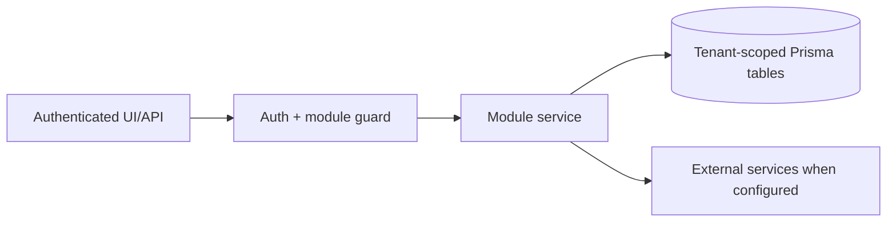

# Lead generation, contacts, TradeMining, Apollo outreach: Data Model

> Evidence status: Confirmed from code for file locations and schema references; business workflow details not explicitly encoded are marked Requires employee confirmation.

## Purpose and status

Lead generation, contacts, TradeMining, Apollo outreach is documented because code, routes, schema, or tests were located. Main evidence: `src/app/(authenticated)/lead-gen/*`, `src/modules/lead-gen/*`, `src/modules/trademining/ingestion.ts`, Apollo integration files, lead/contact/company Prisma models.

## Workflow / rules summary

- Entry points are protected authenticated pages and/or API routes for this module.
- Server-side pages and mutating APIs should validate tenant context and module entitlement before data access.
- Data persistence uses tenant-scoped Prisma models where a database model exists.
- External calls use `src/server/integrations/*` or module-specific integration helpers. Secret values are not documented here.
- Approval, printing, posting, and live external writes require human approval unless a code path explicitly enforces a safe dry-run.

## Data model

Apollo match review reuses the existing tenant-scoped models and requires no schema migration:

- `Company.apolloOrganizationId`, `domain`, and `linkedinUrl` store the resolved organization identity.
- each automatic or manual attempt creates an immutable `ApolloCompanyMatch` row with classification, score, request evidence, returned payload, and reason;
- `ApolloCompanyMatch.reviewedAt` and `reviewedByUserId` distinguish active review from **Confirmed no match**;
- the latest unresolved match is the repeat-search guard used by Pipeline bulk enrichment.

Relevant tables and enums are in `prisma/schema.prisma`. Operationally important fields include primary `id`, `tenantId` where present, status enums, foreign keys to tenant/user/module, timestamps, metadata JSON, and unique/index constraints declared in Prisma.

`TradeMiningSearchProfile` stores `industryPackIds`, `industryFilterMode`, and `minAggregateTeu`. The migration that introduces them is additive: it adds nullable JSON/decimal fields and a defaulted text mode without deleting, renaming, backfilling, or rewriting existing profile data. Existing profiles therefore default to `PREFER` with no selected packs and no aggregate-TEU gate.

TradeMining run coverage is stored in the existing `AutomationJobRun.output.metadata` JSON rather than a new table. The latest profile run exposes `matchedRecords`, `exportedRecords`, `queryCount`, `qualifyingCompanies`, and `retrievalComplete` in the Search Profiles UI.

Hunter Phase 1 adds only new tables and enums:

- `HunterAutomationPolicy` stores one tenant policy, kill switch, daily limits, the 60/30/10 allocation, thresholds, and planning timezone. Its nullable jurisdiction JSON is reserved for a later, explicitly defined geographic policy and is not treated as an active Phase 1 filter.
- `HunterOpportunitySignal` stores normalized, deduplicated external evidence and may optionally link to an existing tenant company.
- `HunterProspectingDecision` is an immutable decision per company and planning job. It preserves the scores, explanation, sources, recommendations, evidence, and configuration used at decision time.
- `HunterOutreachSuppression` stores tenant-scoped company/contact/email/domain exclusions for use before planning or future outreach.
- `AutomationJobRun` remains the run ledger and links to its Hunter decisions.

Migration `20260725120000_add_hunter_dry_run_control_plane` is additive. It creates these enums, tables, indexes, and tenant-safe foreign keys; it does not delete, rename, update, backfill, or otherwise rewrite existing records.

Hunter Phase 2 requires no database migration:

- accepted and below-threshold classifications reuse `HunterOpportunitySignal`;
- classifier provider, model, prompt version, rationale, lens, and evidence statements are stored in its existing `evidence` JSON;
- bounded raw headline metadata uses the existing `rawJson`;
- source failures, rejected samples, counts, and model details use the existing `AutomationJobRun.input` and `output`;
- every read, upsert, job completion, and audit row carries `tenantId`.

Hunter Phase 3 also requires no database migration:

- `AutomationJobRun` stores the prepared tenant cohort and aggregate retrieval/model telemetry;
- `HunterOpportunitySignal.evidence` stores the complete per-company search ledger, Qwen synthesis, deterministic gate result, K2.6 dimensions, K3 validation, company-country/U.S.-division evidence, four-tier classification, foreign adjustment, final score, and model usage;
- `HunterOpportunitySignal.rawJson` stores bounded non-secret replay metadata;
- the refreshed `HunterProspectingDecision` keeps the scored signal in the existing immutable daily-plan ledger.

Assisted outreach planning adds only new records and one enum value:

- `OutreachPlan` is a tenant/company/contact-scoped, versioned strategy record. It freezes the service line,
  opportunity hypothesis, buyer hypothesis, value proposition, objection, CTA, evidence ledger/fingerprint,
  model/prompt versions, QA result, and human approval.
- `OutreachSequenceStep` stores the five ordered email, LinkedIn-task, and call-task touches with delays, angles,
  evidence references, and step-level QA findings.
- the existing `ContactOutreachDraft` remains the Apollo compatibility record for the first email; `OPENAI` identifies
  the real provider instead of the legacy `MOCK_AI` label.
- migration `20260726120000_add_outreach_plans` is additive. It creates enums, tables, indexes, and foreign keys and
  adds an enum value. It does not delete, rename, backfill, or rewrite existing company, contact, lead, draft, Hunter,
  TradeMining, Apollo, score, or outcome data.

The automated post-research handoff requires no migration. It reuses `AutomationJobRun` with job type
`HUNTER_OUTREACH_HANDOFF`; `input` freezes the research/plan IDs and eligible company cohort, while `output` stores
the lease, per-company attempts, retry date, match disposition, imported-contact count, QA results, and completion
summary. Contacts, immutable Apollo matches, plans, drafts, and audit rows use their existing tenant-scoped tables.
The buyer-role review reuses `Contact.rawJson.hunterContactFit` for its disposition, confidence, explanation,
model/prompt version, exact prospecting-decision ID, usage, and review time. This is audit metadata only: it does not
change `ContactStatus`, assign a rep, approve the contact, or require a schema migration.

## Permissions

Roles and defaults are in `src/server/auth/role-policy.ts`. Runtime checks are in `src/server/auth/authorization.ts`; gaps should be treated as requiring code review before enabling production writes.

## Failure modes

Expected failures include missing tenant entitlement, read-only mutation attempts, validation errors, missing integration credentials, duplicate records, empty parser results, external API errors, timeouts, and partial job completion. Recovery should use module UI review screens, audit/job records, and documented dry-run scripts before live writes.

## Testing

Relevant tests are under `tests/` and generally named after the module. Recommended checks: `npm test`, `npm run lint`, `npm run typecheck`, and targeted route/service tests. Live integration scripts must not be run without explicit approval and safe credentials.

## Source map

| Responsibility | Main files | Supporting files | Tests |
|---|---|---|---|
| UI and routes | See evidence paths above | `src/components/app-shell.tsx` | module-named tests under `tests/` |
| Services/actions/queries | `src/modules/lead*` or evidence paths above | `src/server/*` | module-named tests |
| Schema | `prisma/schema.prisma` | `prisma/migrations/*` | schema-dependent unit tests |

## Open questions

- Which status values map to employee-approved business language? Requires employee confirmation.
- Which write actions should require two-person approval? Requires owner confirmation.
- Which external integration credentials should be moved from env fallback to tenant-scoped settings first? Requires owner confirmation.
