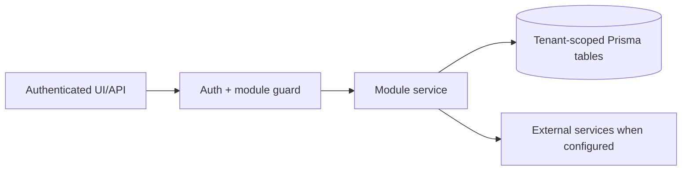

# Lead generation, contacts, TradeMining, Apollo outreach: Failure Modes

> Evidence status: Confirmed from code for file locations and schema references; business workflow details not explicitly encoded are marked Requires employee confirmation.

## Purpose and status

Lead generation, contacts, TradeMining, Apollo outreach is documented because code, routes, schema, or tests were located. Main evidence: `src/app/(authenticated)/lead-gen/*`, `src/modules/lead-gen/*`, `src/modules/trademining/ingestion.ts`, Apollo integration files, lead/contact/company Prisma models.

## Workflow / rules summary

- Entry points are protected authenticated pages and/or API routes for this module.
- Server-side pages and mutating APIs should validate tenant context and module entitlement before data access.
- Data persistence uses tenant-scoped Prisma models where a database model exists.
- External calls use `src/server/integrations/*` or module-specific integration helpers. Secret values are not documented here.
- Approval, printing, posting, and live external writes require human approval unless a code path explicitly enforces a safe dry-run.

## Data model

Relevant tables and enums are in `prisma/schema.prisma`. Operationally important fields include primary `id`, `tenantId` where present, status enums, foreign keys to tenant/user/module, timestamps, metadata JSON, and unique/index constraints declared in Prisma.

## Permissions

Roles and defaults are in `src/server/auth/role-policy.ts`. Runtime checks are in `src/server/auth/authorization.ts`; gaps should be treated as requiring code review before enabling production writes.

## Failure modes

Expected failures include missing tenant entitlement, read-only mutation attempts, validation errors, missing integration credentials, duplicate records, empty parser results, external API errors, timeouts, and partial job completion. Recovery should use module UI review screens, audit/job records, and documented dry-run scripts before live writes.

Hunter retries transient TradeMining network failures and HTTP 429/5xx responses with bounded exponential backoff. Authentication errors, invalid profile filters, and ambiguous lookup values fail immediately and remain visible on the tracked job run. A failed daily run is recovered with the explicit **Run now** action; it is not silently repeated throughout the day.

TradeMining's HS-code field uses comma-separated codes rather than Boolean syntax. Hunter checks the result count before export and treats zero matching BOLs as a successful zero-record run because TradeMining's Excel endpoint returns an error for empty result sets.

## Testing

Relevant tests are under `tests/` and generally named after the module. Recommended checks: `npm test`, `npm run lint`, `npm run typecheck`, and targeted route/service tests. Live integration scripts must not be run without explicit approval and safe credentials.

## Source map

| Responsibility | Main files | Supporting files | Tests |
|---|---|---|---|
| UI and routes | See evidence paths above | `src/components/app-shell.tsx` | module-named tests under `tests/` |
| Services/actions/queries | `src/modules/lead*` or evidence paths above | `src/server/*` | module-named tests |
| Schema | `prisma/schema.prisma` | `prisma/migrations/*` | schema-dependent unit tests |

## Open questions

- Which status values map to employee-approved business language? Requires employee confirmation.
- Which write actions should require two-person approval? Requires owner confirmation.
- Which external integration credentials should be moved from env fallback to tenant-scoped settings first? Requires owner confirmation.

## Apollo accepted but enrollment is not immediately visible

- Symptom: an Apollo push job completes with `0 enrolled` and one or more skipped contacts even though Apollo accepted the request.
- Cause: Apollo sequence membership can propagate after the push response. Apollo also exposes current membership under `contact_campaign_statuses`; ignoring that response shape makes both immediate verification and manual sync report `NOT_STARTED` incorrectly.
- Safe recovery: do not re-push. Wait briefly, run **Sync Apollo status**, and inspect the Apollo contact directly if the app still disagrees.
- Code guard: `src/server/integrations/apollo.ts` parses current campaign statuses and prefers active state over finished history.
- Regression coverage: `tests/apollo-integration.test.ts` includes an active campaign membership alongside older finished history.

## Automatic Apollo status sync is stale or failing

- Symptom: the Contacts health panel shows **Setup required**, due contacts that are not draining, or contacts with sync errors.
- Setup recovery: confirm the dedicated `APOLLO_STATUS_SYNC_SECRET` and `APOLLO_MASTER_API` are configured in the deployment and that the tenant's Apollo integration is active. The Apollo scheduler deliberately does not use the shared `CRON_SECRET`.
- Rate-limit recovery: no manual replay is required. The failed contact receives exponential backoff and the unprocessed remainder stays due for the next hourly run.
- Non-transient recovery: inspect the latest run message and contact-level error. Deleted or unauthorized Apollo contact IDs continue to retry at the bounded failure interval until the local contact is corrected or removed.
- Concurrency guard: a tenant run younger than 30 minutes blocks overlap; an older running record is closed as an error before recovery starts.
- Scheduler visibility: any tenant-level `error` makes the scheduled HTTP request fail. GitHub Actions must therefore show a failed run rather than a green run with an error hidden only in the JSON response.
- Retry visibility: GitHub Actions does not retry the entire scheduled request. Retrying after failed contacts have been deferred could produce an empty 200 response and mask the original failed batch; only the service's bounded per-contact retries are allowed.

## A TradeMining batch contains rows without a company identity

- Symptom: the ingestion batch returns `Validation failed` even though the TradeMining export and canonical summary completed.
- Cause: TradeMining can emit shipment rows with no importer, consignee, notify party, shipper, or master-party identity. Newl Apps intentionally rejects these because they cannot become company candidates.
- Safe recovery: Hunter quarantines and counts the rows as `recordsRejectedBeforeUpload`, then uploads the valid remainder. It must not invent a company identity from other shipment fields.
- Regression coverage: `tests/hunter-ingestion-adapter.test.ts` covers a mixed valid/identity-free export.

## A deleted or disabled profile is still queued

- Symptom: a manual run request exists after an operator removes or disables its search profile.
- Safe behavior: the worker resolves profiles only from the current enabled-profile API and rechecks the profile immediately before collection. Profile deletion cancels queued and running manual requests. A request already being handled may finish its current external HTTP call, but no later daily search starts from cached profile data.
- Regression coverage: search-profile action tests cover cancellation on deletion, and Hunter worker tests cover live profile resolution and once-daily eligibility.
