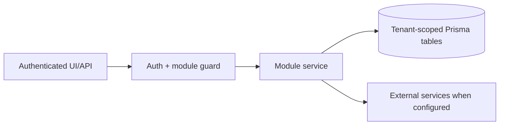

# Lead generation, contacts, TradeMining, Apollo outreach: Failure Modes

> Evidence status: Confirmed from code for file locations and schema references; business workflow details not explicitly encoded are marked Requires employee confirmation.

## Purpose and status

Lead generation, contacts, TradeMining, Apollo outreach is documented because code, routes, schema, or tests were located. Main evidence: `src/app/(authenticated)/lead-gen/*`, `src/modules/lead-gen/*`, `src/modules/trademining/ingestion.ts`, Apollo integration files, lead/contact/company Prisma models.

## Workflow / rules summary

- Entry points are protected authenticated pages and/or API routes for this module.
- Server-side pages and mutating APIs should validate tenant context and module entitlement before data access.
- Data persistence uses tenant-scoped Prisma models where a database model exists.
- External calls use `src/server/integrations/*` or module-specific integration helpers. Secret values are not documented here.
- Approval, printing, posting, and live external writes require human approval unless a code path explicitly enforces a safe dry-run.

## Data model

Relevant tables and enums are in `prisma/schema.prisma`. Operationally important fields include primary `id`, `tenantId` where present, status enums, foreign keys to tenant/user/module, timestamps, metadata JSON, and unique/index constraints declared in Prisma.

```mermaid
flowchart LR
  UI[Authenticated UI/API] --> Auth[Auth + module guard]
  Auth --> Service[Module service]
  Service --> DB[(Tenant-scoped Prisma tables)]
  Service --> Ext[External services when configured]
```

## Permissions

Roles and defaults are in `src/server/auth/role-policy.ts`. Runtime checks are in `src/server/auth/authorization.ts`; gaps should be treated as requiring code review before enabling production writes.

## Failure modes

Expected failures include missing tenant entitlement, read-only mutation attempts, validation errors, missing integration credentials, duplicate records, empty parser results, external API errors, timeouts, and partial job completion. Recovery should use module UI review screens, audit/job records, and documented dry-run scripts before live writes.

Hunter retries transient TradeMining network failures and HTTP 429/5xx responses with bounded exponential backoff. Authentication errors, invalid profile filters, and ambiguous lookup values fail immediately and remain visible on the tracked job run. A failed daily run is recovered with the explicit **Run now** action; it is not silently repeated throughout the day.

## Found Companies returns an application error

- Symptom: `/lead-gen/candidates` fails server-side as the company corpus grows.
- Confirmed cause: the prior query loaded every matching company and every matching TradeMining relation before applying browser pagination. PostgreSQL could terminate the generated relation query with `54001: stack depth limit exceeded`.
- Prevention: the human screen and CSV export request only the top 100 review candidates. Background Hunter paths that need exact corpus coverage read tenant-scoped companies in bounded batches.
- Limitation: company, score, and shipment filters on Found Companies operate inside the bounded human review queue. Hunter remains the complete-corpus workflow.

## Outreach Plan generation or QA fails

- Missing OpenAI configuration, an unranked contact, missing selected cadence, no saved evidence, invalid structured
  model output, or strategy/drafting transport failure stops generation and creates no partial active plan.
- Plan and sequence-step persistence uses two ordered writes inside the same transaction. Prisma nested relation input
  cannot safely mix the plan's tenant foreign-key scalars with nested tenant-scoped step creation; a failure rolls back
  both records rather than leaving a partial plan.
- Lead-generation AI runtime enablement is saved independently from scoring weights. An unrelated invalid scoring total
  cannot block the runtime toggle or silently rewrite scoring configuration.
- If drafting succeeds but the model critic is unavailable, Newl Apps saves the version as `QA_FAILED` with a
  `MODEL_QA_UNAVAILABLE` error. It cannot be approved or pushed.
- Unknown evidence citations, unsupported quantified claims, unsupported URLs, invalid sequence structure, or semantic
  grounding errors fail closed and remain visible on the plan.
- Editing the first email changes the plan to `QA_FAILED`, clears approval, and blocks Apollo. Regenerate to produce a
  new immutable version and rerun every check.
- A current unapproved plan blocks Apollo even when the contact's legacy cadence tier would not normally require a
  Newl draft. Correct or regenerate and approve the plan instead of bypassing the gate.

## External signal discovery or classification fails

- A GDELT 429/5xx response receives bounded retries and is recorded before the worker tries the RSS fallback.
- If every configured discovery transport fails, the tracked run becomes `ERROR`; it must not be recorded as a successful zero-result day.
- If Ollama is unavailable, returns non-JSON output, omits source rows, invents an unsupported enum, or emits a confidence below 50, the affected classifications fail closed.
- A failed daily attempt is not retried every minute. The operator can diagnose the run and use `--signal-scout-now` for one explicit rerun.
- Turning off `HUNTER_SIGNAL_SCOUT_ENABLED`, the Hunter policy, or the Hunter kill switch prevents the automatic scout from creating new signals.
- Discovery-source licensing and acceptable-use review remains an enablement prerequisite. The code and example environment default the scout to off.

## Company deep research fails

- A missing search or Kimi credential, unavailable local Qwen, total search-provider failure,
  incomplete structured output, company outside the prepared tenant cohort, forged URL/domain pair,
  or invalid score arithmetic closes the tracked run as `ERROR`.
- The completion API accepts at most 24 evidence records per company and validates the cohort atomically.
  Follow-up queries therefore stop before a full evidence ledger, append only into remaining capacity,
  and the worker bounds both resumed checkpoints and the final completion payload. A legacy over-cap
  synthesis checkpoint is resynthesized against its bounded evidence so saved indices remain valid.
- A failed completion is not partially persisted and does not refresh the prospecting plan. The
  operator may use the exact-cohort dry run and local replay ledger to diagnose it.
- A 30-company completion can exceed Prisma's default five-second interactive-transaction timeout
  when tenant identity is re-read one company at a time before each evidence upsert. Completion
  preloads the complete tenant-scoped company identity map in one query and uses an explicit
  30-second transaction timeout, still below the route's 60-second execution limit. A timeout rolls
  back every signal and the run update; the saved synthesis checkpoint can then be resumed.
- Individual query failures remain visible in a valid completion, but deterministic evidence-count,
  pass-coverage, identity, logistics-provider, stable/exclusive external-provider, and geography gates fail closed. Transport success
  with weak evidence cannot become a high-priority opportunity.
- Legal-name-only retrieval can miss first-party material for regional subsidiaries. Hunter therefore
  queries bounded legal-name, brand, and regional aliases and adds official-domain queries when a
  domain is known. Matching first-party identity evidence can correct an unsupported ambiguous
  synthesis label.
- A full generic result set can otherwise consume the bounded evidence ledger before a later
  official-domain event query runs. Hunter executes every enabled query first and samples their
  results in rounds, preserving targeted first-party evidence without increasing the 24-record cap.
- A model's provider or incumbent label cannot block an account without explicit supporting language
  in the saved evidence. An undated claimed trigger is treated as current fit. Stale/no-opportunity
  research is retained on Watchlist for later research instead of becoming a permanent block.
- Long identity pages can mention unrelated Chinese operations or suppliers. Text-based China
  inference is applied only when the company's operating country remains unknown, so it cannot
  override a verified U.S. or Canadian identity.
- Qwen can overlook a strong result even when retrieval succeeded. Hunter deterministically restores
  a fresh trigger only when a non-directory result names the exact company, has a verifiable date
  inside 18 months, and contains strict material expansion language. That language includes new
  manufacturing or production lines at an existing facility; the repaired summary is grounded in the
  saved event instead of preserving a contradictory generic conclusion. The result must still pass
  Kimi scoring and K3 validation before becoming Hot.
- Qwen can label a company `FRESH` while citing an undated careers record even though the same evidence
  bundle contains a qualifying expansion article. Hunter repairs the trigger citations before applying
  the recent-date downgrade and pins the repaired evidence into both Kimi packets; otherwise the valid
  expansion could be silently demoted or omitted from hosted validation.
- Compact packet selection can otherwise favor a generic first-party page over later, more material
  records from the same pass. Hunter deterministically pins up to two exact-company dated expansion
  records and the strongest specific logistics-management vacancy before filling the remaining packet
  by pass diversity. Production-line investment/expansion language is included in the strict trigger
  repair; generic growth claims, directories, and undated pages still cannot create a fresh trigger.
- A parent or affiliate expansion can otherwise win merely because it appeared earlier in the ledger,
  while wording such as “establishing a distribution center” can evade a manufacturing-focused trigger
  pattern. Hunter recognizes that facility language, orders material events by the most specific
  candidate-name match, and replaces the saved summary/citation when the model selected a weaker
  related-company event.
- A K3 validation outage does not discard completed retrieval, Qwen synthesis, or K2.6 scoring.
  Selected fresh-event candidates are retained as Watchlist and cannot become Hot until a later
  successful validation. Current-account qualifications and deterministic blockers continue normally.
- Automatic research remains disabled unless `HUNTER_COMPANY_RESEARCH_ENABLED=true`. The Hunter kill
  switch or `OFF` mode prevents the server from preparing a cohort.

## Hunter quality control finds or misses a defect

- The auditor returns exactly one structured finding for each sampled signal. A missing, duplicate, or
  out-of-cohort signal fails the whole audit instead of partially recording a misleading result.
- A worker/Codex/schema failure marks the audit failed and sends a safe Teams alert. It does not
  reclassify a lead or queue a Rivet job from an incomplete audit.
- Evidence URLs use an HTTPS pattern in the Codex output schema. Do not add JSON Schema's `uri`
  format: the Codex structured-output endpoint rejects that format before research begins.
- Model-judgment, credential, runtime, and configuration findings are recorded and reported but do not
  auto-create code work.
- Reproducible retrieval, handoff, rule, or TradeMining code defects create Rivet work only when the
  exact standing-approval value is present. Without it, the Teams message says the defect was recorded
  but not queued.
- Repeated identical incidents trip the seven-day circuit breaker. Review the existing Rivet job or
  underlying runtime before another automated development attempt.
- The auditor is a bounded daily sample, not proof that every classification is correct. The tiered
  sample, independent web research, deterministic TradeMining checks, and stored evidence make misses
  more likely to surface without pretending to eliminate all model or search-index risk.
- If every queued Rivet job fails while preparing its branch, inspect the worker diagnostics before
  treating the underlying Hunter findings as four separate implementation failures. Rivet uses its
  dedicated runtime as the trusted Git source, validates required context against the fetched base
  branch, and exits immediately on an invalid packet. It never falls through with a blank base branch.
- Absence of a routine TradeMining Teams digest does not prove that the searches failed. Health & Logs
  remains authoritative. With `HUNTER_TEAMS_TARGET` configured, the current worker sends one settled
  daily digest and an immediate generic alert for each failed profile without exposing raw errors.

## A profile uses an unsupported arrival port

- Symptom: the profile cannot be saved, or a legacy profile run fails with a port-mapping error.
- Cause: TradeMining BOL Import Search accepts U.S. arrival ports. Canadian cities such as Toronto, Montreal, and Vancouver are not valid values for that field.
- Safe recovery: remove the unsupported value or select a supported U.S. port, move Canadian locations to **Consignee cities / destination markets**, save, and use **Run now**. The arrival-port field may remain blank.
- Prevention: the profile editor accepts an empty port list but validates every supplied value and normalizes common short aliases.

## TradeMining reports more records than it can export

- Symptom: coverage is marked **Retrieval incomplete**, or the run finishes `PARTIAL`.
- Safe behavior: Hunter first splits the lookback into disjoint date ranges, then splits a capped one-day multi-port query into port groups. It exports only leaf queries and records both the matched and exported totals.
- Remaining limitation: a one-day query with one or no arrival port cannot be divided further with the supported filters. Hunter ingests the available export, marks it incomplete, and requires an operator to narrow the profile rather than claiming full coverage.

## A search profile cannot be saved

- Symptom: the profile editor shows an inline error.
- Safe recovery: correct the named field and submit again. Validation errors, including duplicate profile names, remain on the form and no partial profile mutation is written.
- Regression guard: server-action failures are converted to explicit form state instead of surfacing as a generic Next.js application error.

## A Canadian destination is configured as a city instead of a province

- Symptom: a Canadian profile unexpectedly returns zero or the manifest shows a U.S. city with the same name.
- Cause: TradeMining's `ConsigneeCity` autocomplete is U.S.-only. Its `ConsigneeState` lookup requires the selected country ID; resolving `Ontario` without Canada's ID returns no option.
- Safe recovery: configure `Ontario | Canada` rather than individual GTA cities. Hunter submits Canada and Ontario through their dedicated TradeMining fields and records their resolved IDs in the manifest.
- Regression guard: a sole fuzzy result such as `VAUGHAN, MS` is never accepted for `Vaughan`; province lookup must include `countryId=37` and resolve Ontario exactly.
- Limitation: BOLs whose visible consignee is a U.S. intermediary instead of the Canadian buyer may still be outside a Canada/Ontario consignee search.

TradeMining's HS-code field uses comma-separated codes rather than Boolean syntax. Hunter checks the result count before export and treats zero matching BOLs as a successful zero-record run because TradeMining's Excel endpoint returns an error for empty result sets.

## Testing

Relevant tests are under `tests/` and generally named after the module. Recommended checks: `npm test`, `npm run lint`, `npm run typecheck`, and targeted route/service tests. Live integration scripts must not be run without explicit approval and safe credentials.

## Source map

| Responsibility | Main files | Supporting files | Tests |
|---|---|---|---|
| UI and routes | See evidence paths above | `src/components/app-shell.tsx` | module-named tests under `tests/` |
| Services/actions/queries | `src/modules/lead*` or evidence paths above | `src/server/*` | module-named tests |
| Schema | `prisma/schema.prisma` | `prisma/migrations/*` | schema-dependent unit tests |

## Open questions

- Which status values map to employee-approved business language? Requires employee confirmation.
- Which write actions should require two-person approval? Requires owner confirmation.
- Which external integration credentials should be moved from env fallback to tenant-scoped settings first? Requires owner confirmation.

## Apollo accepted but enrollment is not immediately visible

- Symptom: an Apollo push job completes with `0 enrolled` and one or more skipped contacts even though Apollo accepted the request.
- Cause: Apollo sequence membership can propagate after the push response. Apollo also exposes current membership under `contact_campaign_statuses`; ignoring that response shape makes both immediate verification and manual sync report `NOT_STARTED` incorrectly.
- Safe recovery: do not re-push. Wait briefly, run **Sync Apollo status**, and inspect the Apollo contact directly if the app still disagrees.
- Code guard: `src/server/integrations/apollo.ts` parses current campaign statuses and prefers active state over finished history.
- Regression coverage: `tests/apollo-integration.test.ts` includes an active campaign membership alongside older finished history.

## Outreach is blocked by Hunter eligibility

- Symptom: Outreach Queue shows **Needs Hunter assessment**, **Hunter watchlist**, **Blocked by Hunter**,
  **Refresh Hunter research**, **Not selected by Hunter**, or **Hunter handoff incomplete**.
- Cause: the company has no current deep-research result, is not Hot/Qualified, is older than the configured freshness
  window, lacks a current `WOULD_PURSUE` decision, lacks K3 confirmation for a Hot opportunity, or has inconsistent
  service lines between research and planning.
- Safe recovery: do not reuse a legacy draft or force Apollo. Run Hunter company research and its dry-plan refresh,
  then review the resulting Daily Opportunity. Watchlist and Blocked records require new evidence or an explicit
  research replay; editing contact score or cadence cannot override the company gate.
- Prevention: the manual generation action, automatic generation path, Apollo queue action, and Apollo worker all
  evaluate the same tenant-scoped handoff. A model cannot override the required service line.

## Valid North American companies are blocked for unverified U.S. divisions

- Symptom: a U.S. or Canadian operating company is marked Blocked with `The claimed U.S. division is not verified by the cited public identity evidence`, even though first-party evidence confirms the local operator.
- Cause: the legacy deterministic check required the complete model-returned legal division name to appear literally on one identity page. Brand-only sites, omitted legal suffixes, and explanatory parentheticals produced false negatives.
- Prevention: apply the foreign U.S.-division proof only outside an already corroborated North American identity. For foreign/China entities, compare bounded aliases without legal suffixes or parenthetical annotations and still require explicit U.S. jurisdiction plus operating-relationship language.

## An unrelated similarly named logistics provider blocks a prospect

- Symptom: a manufacturer or retailer is marked Blocked because a search result for a different company with a similar short name describes freight, warehousing, or 3PL services.
- Cause: the provider-service gate evaluated explicit logistics language without first tying a non-first-party result back to the researched company identity.
- Prevention: first-party evidence may establish provider status directly. Non-first-party evidence must also contain a normalized alias of the researched company before it can trigger the provider block.
- Recovery: after deployment, force a tenant-scoped exact-cohort company-research replay for affected companies. The run reuses normal safety gates, refreshes the prospecting plan, and queues a handoff only when the tenant is explicitly in Assisted mode.

## Hunter reports no first-party site for an obvious consumer brand

- Symptom: a legitimate importer is blocked as ambiguous although a public brand site exists and another saved result may even mention its domain.
- Cause: legal-name search results were dominated by directories and the worker did not pivot from a candidate-matching discovered domain into the brand's legal/about/contact pages before scoring.
- Prevention: low-confidence, ambiguous, or uncorroborated identities receive a bounded identity-discovery pass. Candidate-matching domains found in saved evidence are searched for first-party legal, privacy, terms, contact, and about pages; added evidence forces a second Qwen synthesis.
- Recovery: rerun only the exact affected company cohort after the worker and server fixes are deployed. Do not manually promote the account without saved first-party evidence.

## Assisted handoff stops after research

- Symptom: research and the Daily Opportunity are complete, but no contact or Outreach Plan appears.
- Check Automation Settings first. `DRY_RUN`, `OFF`, or the kill switch intentionally prevents automatic handoff.
- Inspect the latest `HUNTER_OUTREACH_HANDOFF` job. `REVIEW_REQUIRED` means the immutable Apollo match must be
  resolved manually; `NO_CONTACTS` and `NO_QUALIFYING_CONTACTS` are terminal for that saved run.
- Transient Apollo/model failures receive at most three server-owned attempts. The Mac worker resumes queued jobs
  during its normal loop, so research should not be rerun merely to retry the handoff.
- A QA-failed plan is preserved for inspection and cannot advance. It must not be silently regenerated until its
  evidence or generation defect is understood.
- `CONTACT_REVIEW_REQUIRED` means Apollo contacts were found but none cleared the buyer-role threshold. Inspect the
  saved `hunterContactFit` rationale and risks; do not lower the deterministic safety filter to force generation.
- If Apollo visibly contains stronger role-aligned employees than Hunter reviewed, verify that the handoff ran both
  the 100-result organization-scoped employee request and the always-run multi-title request. Finding an acceptable
  person on the generic first page must not short-circuit relevant-title retrieval. The buyer-role model receives the
  best 10 merged candidates; the configured `maxContactsPerCompany` limits final selection, not discovery.
- Also verify that `organization_ids` contains Apollo's nested global organization ID rather than the saved account
  record ID. A legacy account ID that returns no employees may be recovered only from one exact organization identity;
  parent/sibling evidence must produce `MATCH_QUALITY_REVIEW` and an empty contact set.
- An HTTP 307 from the Mac-mini handoff worker means session middleware intercepted the machine route before
  ingestion authentication. `/api/lead-gen/hunter/outreach-handoff/*` is exempt from session middleware and must
  enforce its own tenant-bound ingestion token; regression coverage preserves that boundary.
- If the manual contact action says company research is missing despite completed runs, verify that every producer
  and consumer imports the shared `HUNTER_COMPANY_DEEP_RESEARCH` job-type constant instead of duplicating a string.
- If the handoff reports imported contacts and generated plans but Outreach Queue is empty, verify that the contact
  audience accepts a current non-archived Outreach Plan without requiring a Sales Lead, and that queue visibility
  treats the complete Outreach Plan as actionable work rather than requiring a legacy single-message draft.

## Apollo cannot safely match a company

- Symptom: Pipeline shows **Resolve Apollo match**, or bulk enrichment reports a company as protected from retry.
- Cause: Apollo returned no organization, a weak/ambiguous candidate, or a logistics provider rather than the TradeMining company. The previous implementation also sent internal identity-field names instead of Apollo's documented company-name filter, which could produce effectively unfiltered results.
- Safe recovery: open **Apollo Match Review**. Paste the correct Apollo company URL when known, retry automatically only after correcting the company name/domain, or choose **Confirm no Apollo match**.
- Credit guard: URL validation requires explicit acknowledgement of one Apollo credit. Automatic retry requires explicit acknowledgement of up to two returned organization-search pages.
- Prevention: once the latest match is unresolved, bulk enrichment performs no Apollo lookup for that company. Confirmed-no-match rows remain visible and blocked until explicitly reopened.
- Limitation: duplicate organization mapping is checked within the tenant in application code. A future additive unique database constraint could provide stronger protection against two simultaneous manual mappings, but requires separate migration approval.

## Apollo has the company but Hunter finds only saved contacts or no employees

- Symptom: Apollo visibly contains relevant employees, but Hunter repeatedly imports only one previously saved
  contact or reports no contacts after an organization-scoped search.
- Cause: an Apollo account ID was stored in `Company.apolloOrganizationId` and then submitted to People API Search,
  which requires Apollo's nested global organization ID. Apollo can expose both identifiers in the same account or
  saved-contact payload.
- Safe recovery: Hunter first tries the configured identifier. When it returns no employees and an exact company
  domain exists, Hunter inspects bounded saved-contact and zero-credit People Search organization metadata. It
  promotes only one exact normalized company identity, filters every candidate back to that organization, and lets
  the existing direct-match transaction replace the stale identifier.
- Ambiguity rule: a parent, subsidiary, sibling, or multiple exact organization candidate becomes
  `MATCH_QUALITY_REVIEW`; no contacts are imported and the AI buyer-role review is not run. Domain-wide employee
  results alone cannot authorize a match.
- Regression coverage: `tests/apollo-integration.test.ts` covers a legacy Stabilus account ID recovering the global
  organization and a Hyosung parent-company result failing closed.

## Automatic Apollo status sync is stale or failing

- Symptom: the Contacts health panel shows **Setup required**, due contacts that are not draining, or contacts with sync errors.
- Setup recovery: confirm the dedicated `APOLLO_STATUS_SYNC_SECRET` and `APOLLO_MASTER_API` are configured in the deployment and that the tenant's Apollo integration is active. The Apollo scheduler deliberately does not use the shared `CRON_SECRET`.
- Rate-limit recovery: no manual replay is required. The failed contact receives exponential backoff and the unprocessed remainder stays due for the next hourly run.
- Non-transient recovery: inspect the latest run message and contact-level error. Deleted or unauthorized Apollo contact IDs continue to retry at the bounded failure interval until the local contact is corrected or removed.
- Concurrency guard: a tenant run younger than 30 minutes blocks overlap; an older running record is closed as an error before recovery starts.
- Scheduler visibility: any tenant-level `error` makes the scheduled HTTP request fail. GitHub Actions must therefore show a failed run rather than a green run with an error hidden only in the JSON response.
- Retry visibility: GitHub Actions does not retry the entire scheduled request. Retrying after failed contacts have been deferred could produce an empty 200 response and mask the original failed batch; only the service's bounded per-contact retries are allowed.

## A TradeMining batch contains rows without a company identity

- Symptom: the ingestion batch returns `Validation failed` even though the TradeMining export and canonical summary completed.
- Cause: TradeMining can emit shipment rows with no importer, consignee, notify party, shipper, or master-party identity. Newl Apps intentionally rejects these because they cannot become company candidates.
- Safe recovery: Hunter quarantines and counts the rows as `recordsRejectedBeforeUpload`, then uploads the valid remainder. It must not invent a company identity from other shipment fields.
- Regression coverage: `tests/hunter-ingestion-adapter.test.ts` covers a mixed valid/identity-free export.

## A deleted or disabled profile is still queued

- Symptom: a manual run request exists after an operator removes or disables its search profile.
- Safe behavior: the worker resolves profiles only from the current enabled-profile API and rechecks the profile immediately before collection. Profile deletion cancels queued and running manual requests. A request already being handled may finish its current external HTTP call, but no later daily search starts from cached profile data.
- Regression coverage: search-profile action tests cover cancellation on deletion, and Hunter worker tests cover live profile resolution and once-daily eligibility.
