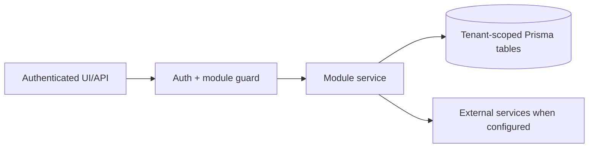

# Lead generation, contacts, TradeMining, Apollo outreach: Integrations

> Evidence status: Confirmed from code for file locations and schema references; business workflow details not explicitly encoded are marked Requires employee confirmation.

## Purpose and status

Lead generation, contacts, TradeMining, Apollo outreach is documented because code, routes, schema, or tests were located. Main evidence: `src/app/(authenticated)/lead-gen/*`, `src/modules/lead-gen/*`, `src/modules/trademining/ingestion.ts`, Apollo integration files, lead/contact/company Prisma models.

## Workflow / rules summary

- Entry points are protected authenticated pages and/or API routes for this module.
- Server-side pages and mutating APIs should validate tenant context and module entitlement before data access.
- Data persistence uses tenant-scoped Prisma models where a database model exists.
- External calls use `src/server/integrations/*` or module-specific integration helpers. Secret values are not documented here.
- Approval, printing, posting, and live external writes require human approval unless a code path explicitly enforces a safe dry-run.

## Hunter TradeMining query mapping

- Destination ports are submitted together through TradeMining's multi-select `USPort` field.
- Origin countries and foreign ports are resolved through TradeMining's lookup service and submitted as multi-select values.
- Canonical Newl Apps labels may use explicit TradeMining aliases where its lookup vocabulary differs; for example, profile value `Busan` resolves to TradeMining's `Pusan`.
- Ship-from ports and product keywords use TradeMining Boolean `OR` syntax in `PlaceOfReceipt` and `ContainerCommodity`. The dedicated `HTSCode` field requires comma-separated codes; Boolean syntax causes TradeMining's result endpoint to fail.
- The legacy `minShipmentVolume` profile field is treated as minimum TEUs per BOL and submitted as `TEU >= value`.
- A normal daily profile run creates one TradeMining search log and one export. An explicit date split remains available only as manual recovery tooling.
- A valid search with zero matching BOLs completes successfully with zero ingested records; Hunter does not call TradeMining's Excel endpoint because that endpoint rejects empty result sets.

## Data model

Relevant tables and enums are in `prisma/schema.prisma`. Operationally important fields include primary `id`, `tenantId` where present, status enums, foreign keys to tenant/user/module, timestamps, metadata JSON, and unique/index constraints declared in Prisma.

## Permissions

Roles and defaults are in `src/server/auth/role-policy.ts`. Runtime checks are in `src/server/auth/authorization.ts`; gaps should be treated as requiring code review before enabling production writes.

## Failure modes

Expected failures include missing tenant entitlement, read-only mutation attempts, validation errors, missing integration credentials, duplicate records, empty parser results, external API errors, timeouts, and partial job completion. Recovery should use module UI review screens, audit/job records, and documented dry-run scripts before live writes.

## Testing

Relevant tests are under `tests/` and generally named after the module. Recommended checks: `npm test`, `npm run lint`, `npm run typecheck`, and targeted route/service tests. Live integration scripts must not be run without explicit approval and safe credentials.

## Source map

| Responsibility | Main files | Supporting files | Tests |
|---|---|---|---|
| UI and routes | See evidence paths above | `src/components/app-shell.tsx` | module-named tests under `tests/` |
| Services/actions/queries | `src/modules/lead*` or evidence paths above | `src/server/*` | module-named tests |
| Schema | `prisma/schema.prisma` | `prisma/migrations/*` | schema-dependent unit tests |

## Open questions

- Which status values map to employee-approved business language? Requires employee confirmation.
- Which write actions should require two-person approval? Requires owner confirmation.
- Which external integration credentials should be moved from env fallback to tenant-scoped settings first? Requires owner confirmation.

## Apollo contact sequence state

Apollo's Contacts API can return sequence membership in either the older top-level sequence fields or the newer `contact_campaign_statuses` array. Newl Apps must parse both shapes. When several campaign memberships exist, current replied, active, or paused memberships take precedence over finished history; equally ranked memberships use the newest membership timestamp.

The Apollo push path remains deliberately two-phase:

1. submit the selected contact IDs to the tenant-configured cadence and sender;
2. read the contacts back from Apollo before marking the Newl Apps contact `ENROLLED`.

Apollo can accept a push before the membership is visible to a follow-up read. The job should retain a pending-confirmation marker and must not automatically submit the same contact again. A later status sync is the recovery path.
