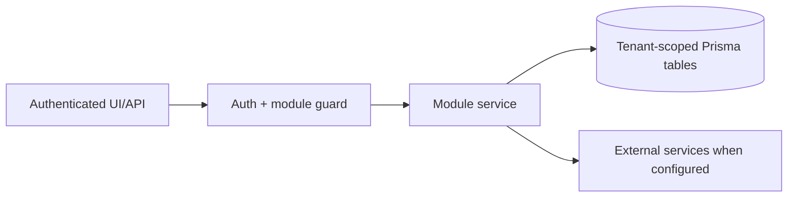

# Lead generation, contacts, TradeMining, Apollo outreach: Integrations

> Evidence status: Confirmed from code for file locations and schema references; business workflow details not explicitly encoded are marked Requires employee confirmation.

## Purpose and status

Lead generation, contacts, TradeMining, Apollo outreach is documented because code, routes, schema, or tests were located. Main evidence: `src/app/(authenticated)/lead-gen/*`, `src/modules/lead-gen/*`, `src/modules/trademining/ingestion.ts`, Apollo integration files, lead/contact/company Prisma models.

## Workflow / rules summary

- Entry points are protected authenticated pages and/or API routes for this module.
- Server-side pages and mutating APIs should validate tenant context and module entitlement before data access.
- Data persistence uses tenant-scoped Prisma models where a database model exists.
- External calls use `src/server/integrations/*` or module-specific integration helpers. Secret values are not documented here.
- Approval, printing, posting, and live external writes require human approval unless a code path explicitly enforces a safe dry-run.

## Hunter TradeMining query mapping

- Destination ports are optional canonical U.S. ports. When present they are submitted together through TradeMining's multi-select `USPort` field; when absent Hunter omits that field.
- Destination markets are submitted as consignee filters. `Ontario | Canada` resolves Canada through `CountryOfOrigin`, then resolves Ontario through TradeMining's `State` lookup with the selected `countryId`; the BOL query sends `ConsigneeCountryOfOrigin` and `ConsigneeState`. Canadian province targeting never uses the U.S.-only `ConsigneeCity` picker. Other city values use `ConsigneeCity` only on an exact label match. If any city is unavailable, all configured city alternatives use one Boolean `OR` expression in `ConsigneeAddress`.
- Origin countries and foreign ports are resolved through TradeMining's lookup service and submitted as multi-select values.
- Canonical Newl Apps labels may use explicit TradeMining aliases where its lookup vocabulary differs; for example, profile value `Busan` resolves to TradeMining's `Pusan`.
- Ship-from ports and product keywords use TradeMining Boolean `OR` syntax in `PlaceOfReceipt` and `ContainerCommodity`. The dedicated `HTSCode` field requires comma-separated codes; Boolean syntax causes TradeMining's result endpoint to fail.
- The legacy `minShipmentVolume` profile field is treated as minimum TEUs per BOL and submitted as `TEU >= value`.
- A normal daily profile run starts as one TradeMining search. When the reported count exceeds the 25,000-row export ceiling, Hunter automatically creates smaller disjoint date queries and then port queries when necessary. Parent search logs are probes only; leaf search logs are exported and their disjoint counts produce coverage totals.
- A valid search with zero matching BOLs completes successfully with zero ingested records; Hunter does not call TradeMining's Excel endpoint because that endpoint rejects empty result sets.
- If a one-day query with one or no arrival port remains above 25,000 results, the export is retained and ingested but coverage is marked incomplete and the Newl Apps run is `PARTIAL`.
- Industry packs and aggregate TEUs are evaluated in Newl Apps after ingestion. They do not add undocumented fields to TradeMining's form.

## Hunter public-signal discovery and local classification

- GDELT DOC 2 article-list JSON is the first read-only discovery transport.
- Google News RSS is the fallback when a GDELT query is unavailable or empty.
- Both endpoints are fixed in the server-issued packet; the worker refuses arbitrary discovery endpoints.
- Only HTTPS article links and bounded public headline metadata are processed.
- Ollama is restricted to `http://127.0.0.1` or `http://localhost`; the default model is `qwen3:30b-instruct`.
- Ollama structured output receives the same JSON Schema represented in the application validator. Invalid, omitted, weak, or unmapped classifications fail closed.
- The machine prepare, complete, and fail routes reuse ingestion authentication and resolve the configured ingestion tenant server-side.
- The scout does not use Apollo credentials and has no Apollo, cadence, or messaging client.

## Hunter company-research providers

- Brave Search is the approved production retrieval provider. A bounded DuckDuckGo HTML adapter is
  available for trial/replay use but is not an availability-guaranteed production contract.
- Search and Kimi credentials remain only in Hunter's protected local environment. Newl Apps receives
  bounded public evidence and usage metadata, never either credential.
- Public page retrieval accepts HTTPS only, validates DNS as globally routable, revalidates redirects,
  caps response sizes, and rejects local/private destinations.
- Ollama is restricted to loopback and defaults to `qwen3.5:35b` for synthesis. The Kimi client is
  restricted to `https://api.moonshot.ai/v1`, defaults to `kimi-k2.6` for scoring, and uses `kimi-k3`
  with low reasoning and strict JSON Schema for at most five top fresh-event validators. Both use the
  same protected local Kimi credential; no Kimi secret is sent to Newl Apps.
- The company-research worker and machine routes contain no Apollo, pipeline-stage, cadence, email,
  LinkedIn, or customer-communication client.

## Hunter planning integration boundary

- `/api/lead-gen/hunter/daily-plan` is invoked daily by Vercel Cron and authenticates with the existing `CRON_SECRET`; Phase 1 introduces no new environment variable.
- Opportunity signals use a source-agnostic database contract. Manual entry is enabled first; automatic news, hiring, expansion, construction, and other collectors require a separate reviewed integration.
- No Kimi, Qwen, OpenAI, Apollo, LinkedIn, email, or browser-automation call is made by the Phase 1 planner. Provider selection belongs in the later evidence-analysis stage after deterministic filtering and a measured quality/cost comparison.

## Assisted outreach model boundary

- `OPENAI_API_KEY` remains server-only. Outreach generation uses the Responses API with strict JSON Schema output.
- `LEAD_GEN_OUTREACH_STRATEGY_MODEL`, `LEAD_GEN_OUTREACH_DRAFT_MODEL`, and `LEAD_GEN_OUTREACH_QA_MODEL` select the
  bounded strategy, drafting, and critic models. Defaults are `gpt-5.6-terra`, `gpt-5.6-luna`, and `gpt-5.6-luna`.
- The strategy call receives bounded contact role data and the frozen evidence ledger. The drafting and critic calls
  receive the saved strategy and the same ledger. No Apollo secret, tenant credential, raw customer record, or
  unrelated tenant data is included.
- The strategy call also receives the tenant-scoped Hunter handoff. Its required service line and opportunity thesis
  are authoritative; server code rejects a returned strategy that changes that service line.
- `HUNTER_OUTREACH_RESEARCH_MAX_AGE_DAYS` controls how long saved Hunter research can authorize outreach. The default
  is 30 days and is an inferred operating value pending owner confirmation.
- OpenAI output cannot authorize Apollo, email, LinkedIn, calls, or any customer communication. Apollo remains the
  separately approved execution integration; LinkedIn and call steps are reviewable manual tasks only.
- In Hunter `ASSISTED` mode, the Mac worker invokes the tenant-bound handoff processor after research. Apollo
  organization/contact reads occur server-side with the existing tenant credential; no Apollo credential is sent
  to the Mac. Each request handles one company and the server persists retries and results.
- `HUNTER_CONTACT_FIT_MODEL` optionally selects the buyer-role validator and defaults to the existing
  `gpt-5.6-luna` outreach model. The model receives bounded company identity, Hunter opportunity context, contact
  role fields, and contactability booleans; it does not receive Apollo credentials, raw Apollo payloads, email
  content, phone numbers, or unrelated tenant data.

## Data model

Relevant tables and enums are in `prisma/schema.prisma`. Operationally important fields include primary `id`, `tenantId` where present, status enums, foreign keys to tenant/user/module, timestamps, metadata JSON, and unique/index constraints declared in Prisma.

```mermaid
flowchart LR
  UI[Authenticated UI/API] --> Auth[Auth + module guard]
  Auth --> Service[Module service]
  Service --> DB[(Tenant-scoped Prisma tables)]
  Service --> Ext[External services when configured]
```

## Permissions

Roles and defaults are in `src/server/auth/role-policy.ts`. Runtime checks are in `src/server/auth/authorization.ts`; gaps should be treated as requiring code review before enabling production writes.

## Failure modes

Expected failures include missing tenant entitlement, read-only mutation attempts, validation errors, missing integration credentials, duplicate records, empty parser results, external API errors, timeouts, and partial job completion. Recovery should use module UI review screens, audit/job records, and documented dry-run scripts before live writes.

## Testing

Relevant tests are under `tests/` and generally named after the module. Recommended checks: `npm test`, `npm run lint`, `npm run typecheck`, and targeted route/service tests. Live integration scripts must not be run without explicit approval and safe credentials.

## Source map

| Responsibility | Main files | Supporting files | Tests |
|---|---|---|---|
| UI and routes | See evidence paths above | `src/components/app-shell.tsx` | module-named tests under `tests/` |
| Services/actions/queries | `src/modules/lead*` or evidence paths above | `src/server/*` | module-named tests |
| Schema | `prisma/schema.prisma` | `prisma/migrations/*` | schema-dependent unit tests |

## Open questions

- Which status values map to employee-approved business language? Requires employee confirmation.
- Which write actions should require two-person approval? Requires owner confirmation.
- Which external integration credentials should be moved from env fallback to tenant-scoped settings first? Requires owner confirmation.

## Apollo contact sequence state

## Apollo company discovery and manual mapping

- Organization discovery uses Apollo's documented Organization Search filters: `q_organization_domains_list` when Newl Apps has a domain, otherwise `q_organization_name`. Newl Apps does not send internal TradeMining identity-field names to Apollo.
- A domain lookup uses one result page. A name-only lookup tries at most two deterministic name variants and stops as soon as a direct-company match is found.
- A confirmed `apolloOrganizationId` is trusted for subsequent people searches, so the contact lookup stays constrained by `organization_ids` and never falls back to an unscoped company search.
- Ambiguous, logistics-provider, and no-match results enter **Apollo Match Review**. Bulk enrichment skips those companies until a rep resolves the latest match explicitly.
- A rep can paste an Apollo company URL or organization ID. Newl Apps reads that exact organization, verifies that its name is a strong match, prevents duplicate tenant mappings, records the reviewer and source, and then searches people using the confirmed organization ID.
- Apollo's Complete Organization Info endpoint consumes one credit when a company is returned. The mapping form therefore requires explicit one-credit confirmation. An automatic name-only retry requires a separate confirmation and is capped at two organization-search pages.
- **Confirmed no match** is an auditable archive state, not deletion. The company remains visible and protected from bulk retry until a rep reopens it.

Apollo's Contacts API can return sequence membership in either the older top-level sequence fields or the newer `contact_campaign_statuses` array. Newl Apps must parse both shapes. When several campaign memberships exist, current replied, active, or paused memberships take precedence over finished history; equally ranked memberships use the newest membership timestamp.

The Apollo push path remains deliberately two-phase:

1. submit the selected contact IDs to the tenant-configured cadence and sender;
2. read the contacts back from Apollo before marking the Newl Apps contact `ENROLLED`.

Apollo can accept a push before the membership is visible to a follow-up read. The job should retain a pending-confirmation marker and must not automatically submit the same contact again. A later status sync is the recovery path.

## Apollo reply synchronization

- Apollo's documented webhook callbacks apply to asynchronous enrichment results; no general saved-contact reply webhook is documented. Newl Apps therefore polls the saved Contact endpoint.
- `GET /api/v1/contacts/{contact_id}` requires the master API key and does not consume Apollo credits. The scheduled sync never calls people enrichment.
- Apollo applies fixed-window, endpoint-specific limits. Newl Apps uses small batches, bounded retries, a maximum 30-second retry delay, and stops the remaining batch after a sustained `429`.
- References: [View a Contact](https://docs.apollo.io/reference/view-a-contact), [Rate Limits](https://docs.apollo.io/reference/rate-limits), and [API Pricing and Credits](https://docs.apollo.io/docs/api-pricing).
