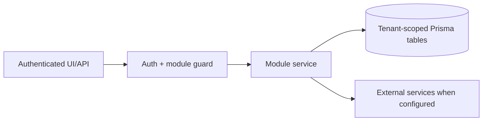

# Lead generation, contacts, TradeMining, Apollo outreach: Integrations

> Evidence status: Confirmed from code for file locations and schema references; business workflow details not explicitly encoded are marked Requires employee confirmation.

## Purpose and status

Lead generation, contacts, TradeMining, Apollo outreach is documented because code, routes, schema, or tests were located. Main evidence: `src/app/(authenticated)/lead-gen/*`, `src/modules/lead-gen/*`, `src/modules/trademining/ingestion.ts`, Apollo integration files, lead/contact/company Prisma models.

## Workflow / rules summary

- Entry points are protected authenticated pages and/or API routes for this module.
- Server-side pages and mutating APIs should validate tenant context and module entitlement before data access.
- Data persistence uses tenant-scoped Prisma models where a database model exists.
- External calls use `src/server/integrations/*` or module-specific integration helpers. Secret values are not documented here.
- Approval, printing, posting, and live external writes require human approval unless a code path explicitly enforces a safe dry-run.

## Confirmed Apollo account employee discovery

When a reviewer maps a saved Apollo account URL, Newl Apps preserves both the account ID and Apollo's canonical
organization ID in the match history. Employee discovery first uses Apollo's documented organization-ID People Search
filter. A successfully resolved saved account already supplies that canonical identity, so Hunter skips the
credit-consuming Organization Search endpoint on later rechecks. If People Search returns no useful people, it
retries with the trusted domain stored on the confirmed company even when the original saved-account ID is
unavailable. Both scopes read up to five 100-person pages rather than treating the first page as the complete
company roster. Saved-contact lookup uses Apollo's canonical account/company name—not a TradeMining facility label
such as `UNISYNC GROUP:GUELPH DC`—and accepts contacts tied to either the reviewer-confirmed account ID or its resolved
canonical organization ID. A contradictory organization ID still fails closed. Apollo can maintain duplicate or
related saved accounts for one brand while its UI combines their
employees through **Include Sub Accounts**. After the exact organization and domain return zero, Hunter searches a
bounded set of zero-credit saved-account results, accepts only safe same-brand records on the exact trusted domain,
and searches each distinct nested organization ID. If those verified scopes are still empty, one bounded
company-keyword People Search may generate candidates, but every returned person's employer name and domain must
still pass the strict confirmed-company guard. A different domain, sibling identity, or ambiguous employer is
discarded.

Apollo can return a strictly scoped employee
with only a marketing/brand employer label and omit the
organization ID and domain from that person record. Newl Apps accepts a safe leading uppercase brand expansion such
as `YAT USA, INC.` / `YAT - Your Advanced Technology` only inside the exact confirmed organization/domain query;
explicitly different organization IDs, domains, and sibling names still fail closed. If the UI still exposes people
that neither supported employer index returns, Newl Apps exposes a last-resort reviewer option for up to
three exact Apollo person profile URLs. Apollo can place either a saved-contact ID or a global person ID in this
route, so Newl Apps first checks zero-credit Contact View and uses separately authorized email-only People Enrichment
only when the ID is not an existing saved contact.
Every returned employer must match the confirmed account identity and trusted domain, and a concrete email must be
present; similarly named or unverifiable companies are rejected. The company-keyword fallback is candidate
generation only and never overrides those identity checks.

## Hunter TradeMining query mapping

- Destination ports are optional canonical U.S. ports. When present they are submitted together through TradeMining's multi-select `USPort` field; when absent Hunter omits that field.
- Destination markets are submitted as consignee filters. `Ontario | Canada` resolves Canada through `CountryOfOrigin`, then resolves Ontario through TradeMining's `State` lookup with the selected `countryId`; the BOL query sends `ConsigneeCountryOfOrigin` and `ConsigneeState`. Canadian province targeting never uses the U.S.-only `ConsigneeCity` picker. Other city values use `ConsigneeCity` only on an exact label match. If any city is unavailable, all configured city alternatives use one Boolean `OR` expression in `ConsigneeAddress`.
- Origin countries and foreign ports are resolved through TradeMining's lookup service and submitted as multi-select values.
- Canonical Newl Apps labels may use explicit TradeMining aliases where its lookup vocabulary differs; for example, profile value `Busan` resolves to TradeMining's `Pusan`.
- Ship-from ports and product keywords use TradeMining Boolean `OR` syntax in `PlaceOfReceipt` and `ContainerCommodity`. The dedicated `HTSCode` field requires comma-separated codes; Boolean syntax causes TradeMining's result endpoint to fail.
- The legacy `minShipmentVolume` profile field is treated as minimum TEUs per BOL and submitted as `TEU >= value`.
- A normal daily profile run starts as one TradeMining search. When the reported count exceeds the 25,000-row export ceiling, Hunter automatically creates smaller disjoint date queries and then port queries when necessary. Parent search logs are probes only; leaf search logs are exported and their disjoint counts produce coverage totals.
- A valid search with zero matching BOLs completes successfully with zero ingested records; Hunter does not call TradeMining's Excel endpoint because that endpoint rejects empty result sets.
- If a one-day query with one or no arrival port remains above 25,000 results, the export is retained and ingested but coverage is marked incomplete and the Newl Apps run is `PARTIAL`.
- Industry packs and aggregate TEUs are evaluated in Newl Apps after ingestion. They do not add undocumented fields to TradeMining's form.

## Hunter public-signal discovery and local classification

- Brave Web Search is the primary read-only discovery transport and uses the same protected local search credential as company research.
- Google News RSS is the fallback only when one Brave query is unavailable or empty.
- Both endpoints are fixed in the server-issued packet; the worker refuses arbitrary discovery endpoints.
- The server rotates an allowlisted topic/geography catalog by local date. The worker cannot add arbitrary queries.
- Only HTTPS result links and bounded public title/snippet metadata are processed.
- Ollama is restricted to `http://127.0.0.1` or `http://localhost`; the default model is `qwen3:30b-instruct`.
- Ollama structured output receives the same JSON Schema represented in the application validator. Invalid, omitted, weak, or unmapped classifications fail closed.
- The machine prepare, complete, and fail routes reuse ingestion authentication and resolve the configured ingestion tenant server-side.
- The scout does not use Apollo credentials and has no Apollo, cadence, or messaging client. It may create a
  tenant-scoped provisional company so the existing full Luna/Kimi research gate can later decide whether the
  separate assisted handoff is allowed to search Apollo.

## Hunter company-research providers

- Brave Search is the approved production retrieval provider. A bounded DuckDuckGo HTML adapter is
  available for trial/replay use but is not an availability-guaranteed production contract.
- Search and Kimi credentials remain only in Hunter's protected local environment. Newl Apps receives
  bounded public evidence and usage metadata, never either credential.
- Public page retrieval accepts HTTPS only, validates DNS as globally routable, revalidates redirects,
  caps response sizes, and rejects local/private destinations.
- Ollama is restricted to loopback and defaults to `qwen3.5:35b` for temporary shadow synthesis. The Kimi client is
  restricted to `https://api.moonshot.ai/v1`, defaults to `kimi-k2.6` for scoring, and uses `kimi-k3`
  with low reasoning and strict JSON Schema for at most five top fresh-event validators. Both use the
  same protected local Kimi credential; no Kimi secret is sent to Newl Apps.
- The company-research worker and machine routes contain no Apollo, pipeline-stage, cadence, email,
  LinkedIn, or customer-communication client.
- `HUNTER_COMPANY_RESEARCH_LUNA_SHADOW_ENABLED=true` enables authoritative GPT-5.6 Luna synthesis during
  the compatibility cutover. It reuses the existing server-only `OPENAI_API_KEY`; that key is never copied to
  Hunter's Mac environment. The worker sends already-retrieved bounded evidence and an optional Qwen shadow row
  through the ingestion-authenticated, tenant-scoped synthesis route in batches of at most four.
  The Qwen row is retained for server-side comparison but removed from the OpenAI model input; Luna also
  receives evidence for companies where Qwen failed to produce a valid row.
- The Luna call uses the Responses API, `store: false`, low reasoning, strict Structured Outputs, and
  no web or other tools. A prompt/model/batch fingerprint makes successful batches idempotent, so an
  operator retry does not repeat an already-completed OpenAI call.
- Luna usage, schema-valid coverage, categorical agreement, evidence-citation overlap, and bounded errors are
  stored in the company-research `AutomationJobRun.output`. Luna rows continue into Kimi scoring and deterministic
  gates. Qwen comparison rows remain audit-only and cannot affect planning, Apollo, or outreach.

## Hunter planning integration boundary

- `/api/lead-gen/hunter/daily-plan` is invoked daily by Vercel Cron and authenticates with the existing `CRON_SECRET`; Phase 1 introduces no new environment variable.
- Opportunity signals use a source-agnostic database contract. Manual entry is enabled first; automatic news, hiring, expansion, construction, and other collectors require a separate reviewed integration.
- No Kimi, Qwen, OpenAI, Apollo, LinkedIn, email, or browser-automation call is made by the Phase 1 planner. Provider selection belongs in the later evidence-analysis stage after deterministic filtering and a measured quality/cost comparison.

## Assisted outreach model boundary

- `OPENAI_API_KEY` remains server-only. Outreach generation uses the Responses API with strict JSON Schema output.
- `LEAD_GEN_OUTREACH_STRATEGY_MODEL`, `LEAD_GEN_OUTREACH_DRAFT_MODEL`, and `LEAD_GEN_OUTREACH_QA_MODEL` select the
  bounded strategy, drafting, and critic models. Defaults are `gpt-5.6-terra`, `gpt-5.6-luna`, and `gpt-5.6-luna`.
- The strategy call receives bounded contact role data and the frozen evidence ledger. The drafting and critic calls
  receive the saved strategy and the same ledger. No Apollo secret, tenant credential, raw customer record, or
  unrelated tenant data is included.
- The strategy call also receives the tenant-scoped Hunter handoff. Its required service line and opportunity thesis
  are authoritative; server code rejects a returned strategy that changes that service line.
- `HUNTER_OUTREACH_RESEARCH_MAX_AGE_DAYS` controls how long saved Hunter research can authorize outreach. The default
  is 30 days and is an inferred operating value pending owner confirmation.
- OpenAI output cannot authorize Apollo, email, LinkedIn, calls, or any customer communication. Apollo remains the
  separately approved execution integration; LinkedIn and call steps are reviewable manual tasks only.
- In Hunter `ASSISTED` mode, the Mac worker invokes the tenant-bound handoff processor after research. Apollo
  organization/contact reads occur server-side with the existing tenant credential; no Apollo credential is sent
  to the Mac. Each request handles one company and the server persists retries and results.
- Apollo documents People API Search as a zero-credit endpoint that returns identity, title, location, and company
  metadata without email addresses or phone numbers. Hunter uses it for the generic and relevant-title employee
  searches. Apollo's current contract expresses the filters as URL query parameters, so Hunter sends
  `organization_ids[]`, `q_organization_domains_list[]`, `person_titles[]`, pagination, and similar-title controls in
  the documented query string. The identical raw JSON payload remains for compatibility, while returned employers
  still have to pass the confirmed-company safety check. Accessing or enriching a selected person's email or phone is
  a separate downstream operation that can consume Apollo credits; search must not be represented as contact-data
  enrichment.
- Saved Contact Search and People API Search return different identity shapes. A saved-contact `id` is stored as
  `apolloContactId`; a People Search `id` is stored as `apolloPersonId`. People Search can omit the returned
  organization's ID even when the request was constrained by `organization_ids`, so Hunter validates any returned
  company name/domain against the expected company instead of rejecting the scoped employee solely because that ID
  is absent. When both ID and domain are absent, a safe uppercase leading-brand expansion is accepted only inside the
  exact organization/domain query. An explicit different organization ID, domain, or sibling company name still
  fails closed.
- People Search availability flags identify candidates for recovery, but they are not represented as revealed email,
  phone, or LinkedIn values. Hunter reads zero-credit Saved Contact Search in 100-record pages (maximum 20 relevant
  pages), then searches the saved directory again for each of the best 10 masked role candidates using name, title,
  and confirmed company. Identity resolution uses person/contact ID, LinkedIn/email, then strict confirmed-company +
  first-name + title matching. When the same person exists as a saved contact, Hunter preserves and backfills the saved
  full name, email, contact ID, sequence history, and enriched status.
- Automatic and scheduled handoffs never call paid People Enrichment. Manual company mapping and one-company recheck
  expose a separate optional authorization for at most three email-only `/api/v1/people/match` calls, and only after
  saved-contact recovery has failed. The request uses the Apollo person ID plus confirmed employer, disables personal
  email, phone, and both waterfall modes, and freezes the authorization into the tenant job/audit record.
- Apollo account IDs and global organization IDs are different identifiers. Organization Search intentionally omits
  companies already saved as Apollo accounts, while the zero-credit saved-account search may return both the account
  ID and nested global organization ID. If a mapped account produces at most one employee and Organization Search
  cannot resolve it, Hunter searches the saved-account directory for that exact account and legal-company identity.
  If name-filtered account search omits the confirmed mapping, Hunter retrieves that exact saved account by ID through
  Apollo's zero-credit Account View endpoint. It then repeats People Search with the nested global organization ID. When Apollo's exact saved-account record exposes
  no nested organization ID, Hunter retries by that record's trusted domain instead of repeating the stale account ID.
  It never combines `organization_ids` with a
  possibly subsidiary-specific domain filter. The expected domain remains a response-validation guard, so a scoped
  People Search result that omits its organization ID can still be accepted when the returned domain matches; an
  explicit different organization ID still fails closed. An exact Apollo account-to-organization relationship is
  accepted for a manually pasted account only when Account View proves the exact account-to-canonical-organization
  relationship and both company names share the same distinctive brand token; a loose parent, subsidiary, sibling, or
  multiple-candidate result still routes to Apollo Match Review with no contacts selected. The validated global ID is
  persisted by the existing direct-match transaction, so later runs remain organization scoped.
- If the exact saved account's global organization and domain filters both return zero, Hunter records a durable
  mapped-with-no-employees exception. The reviewer may paste at most three exact `#/people/<person-id>` Apollo profile
  URLs and explicitly authorize email-only enrichment for those people. Hunter rejects any returned person whose
  employer identity or domain does not match the confirmed saved account, any person without a concrete email, and
  any request without the explicit credit authorization. It does not call Apollo's deprecated legacy People Search
  or private UI finder endpoints.
- If an immutable mapped account still returns at most one employee and Apollo Account Search/View does not expose
  the nested global organization ID, Hunter may recover one unique domain from a saved contact whose organization
  identity matches the exact legal/regional account. It repeats the generic and relevant-title People Search against
  that trusted domain and merges the results without revealing emails or phone numbers. Returned domains must match
  exactly, explicit organization-ID mismatches remain rejected, and acronym-expanded operating names such as
  `Aalberts IPS Americas` / `Aalberts integrated piping systems` are accepted only inside that confirmed scope.
- `HUNTER_CONTACT_FIT_MODEL` optionally selects the buyer-role validator and defaults to the existing
  `gpt-5.6-luna` outreach model. The model receives bounded company identity, Hunter opportunity context, contact
  role fields, and contactability booleans; it does not receive Apollo credentials, raw Apollo payloads, email
  content, phone numbers, or unrelated tenant data.

## Data model

Relevant tables and enums are in `prisma/schema.prisma`. Operationally important fields include primary `id`, `tenantId` where present, status enums, foreign keys to tenant/user/module, timestamps, metadata JSON, and unique/index constraints declared in Prisma.

```mermaid
flowchart LR
  UI[Authenticated UI/API] --> Auth[Auth + module guard]
  Auth --> Service[Module service]
  Service --> DB[(Tenant-scoped Prisma tables)]
  Service --> Ext[External services when configured]
```

## Permissions

Roles and defaults are in `src/server/auth/role-policy.ts`. Runtime checks are in `src/server/auth/authorization.ts`; gaps should be treated as requiring code review before enabling production writes.

## Failure modes

Expected failures include missing tenant entitlement, read-only mutation attempts, validation errors, missing integration credentials, duplicate records, empty parser results, external API errors, timeouts, and partial job completion. Recovery should use module UI review screens, audit/job records, and documented dry-run scripts before live writes.

## Testing

Relevant tests are under `tests/` and generally named after the module. Recommended checks: `npm test`, `npm run lint`, `npm run typecheck`, and targeted route/service tests. Live integration scripts must not be run without explicit approval and safe credentials.

## Source map

| Responsibility | Main files | Supporting files | Tests |
|---|---|---|---|
| UI and routes | See evidence paths above | `src/components/app-shell.tsx` | module-named tests under `tests/` |
| Services/actions/queries | `src/modules/lead*` or evidence paths above | `src/server/*` | module-named tests |
| Schema | `prisma/schema.prisma` | `prisma/migrations/*` | schema-dependent unit tests |

## Open questions

- Which status values map to employee-approved business language? Requires employee confirmation.
- Which write actions should require two-person approval? Requires owner confirmation.
- Which external integration credentials should be moved from env fallback to tenant-scoped settings first? Requires owner confirmation.

## Apollo contact sequence state

## Apollo company discovery and manual mapping

- Organization discovery uses Apollo's documented Organization Search filters: `q_organization_domains_list` when Newl Apps has a domain, otherwise `q_organization_name`. Newl Apps does not send internal TradeMining identity-field names to Apollo.
- A domain lookup uses one result page. A name-only lookup tries at most two deterministic name variants and stops as soon as a direct-company match is found.
- A confirmed `apolloOrganizationId` is revalidated through bounded exact-company lookup before People Search
  because the saved value can be an Apollo account ID rather than the global organization ID. Apollo Organization
  Search covers unsaved organizations; an unresolved mapped account that returns at most one employee is recovered
  only through the exact zero-credit saved-account directory. The contact lookup then stays constrained to the safely
  resolved `organization_ids` value and never falls back to an unscoped company search.
- Ambiguous, logistics-provider, and no-match results enter **Apollo Match Review**. Bulk enrichment skips those companies until a rep resolves the latest match explicitly.
- A rep can paste an Apollo company Overview/People URL or a raw organization ID. For `/accounts/{id}` links,
  Newl Apps reads the exact account and extracts its nested global organization ID when present. If Apollo returns a
  valid sparse account without a nested organization, Newl Apps retains that exact confirmed account ID for bounded
  recovery. The authenticated reviewer's confirmation is authoritative for company identity: facility, legal entity,
  regional brand, parent-company, and provider-like name differences are audited but cannot cause Newl Apps to reject
  or substitute the chosen URL. Duplicate tenant mapping prevention remains enforced, and contact/outreach safety
  (email, DNC, bounce, active cadence, role eligibility, and provider prospecting policy) is evaluated separately.
- A reviewer-confirmed saved Apollo account URL is authoritative. Newl Apps reads that exact account record and uses
  only its linked organization ID for Apollo's zero-credit People Search (Apollo's documented employee endpoint does
  not accept saved-account IDs). It does not substitute a parent, sibling, same-domain organization, or similarly named
  company. Returned people must still match the exact linked organization before buyer review.
- Apollo's Complete Organization Info endpoint consumes one credit when a company is returned. The mapping form therefore requires explicit one-credit confirmation. An automatic name-only retry requires a separate confirmation and is capped at two organization-search pages.
- **Archived exceptions** is an auditable, reversible state rather than deletion. It covers both confirmed no-match
  companies and reviewer-confirmed mappings with no usable employees, duplicates, or irrelevant companies. The
  company and exact Apollo mapping remain visible in a collapsed audit section and protected from automatic or bulk
  retry until a rep reopens it.

Apollo's Contacts API can return sequence membership in either the older top-level sequence fields or the newer `contact_campaign_statuses` array. Newl Apps must parse both shapes. A bounced membership, direct bounced email-delivery status, invalid-MX result, bad-data delivery result, recipient-domain failure, spam block, or other explicit permanent Apollo delivery failure is terminal and maps to the existing `BOUNCED` sequence state. The exact Apollo reason, category, source record, selected sequence, and detection time remain in the contact audit payload. For every due contact with an exact selected cadence, Newl Apps performs one cached, bounded, zero-credit `GET /api/v1/emailer_messages/search` lookup per cadence using Apollo's documented terminal message-status and permanent not-sent-reason filters. It reconciles by exact Apollo contact ID first and normalized email second. This closes the documented gap where Apollo's UI shows `Bounced` or `Not sent` while the contact-detail payload omits the delivery failure. Once terminal, later contact discovery, handoff, manual sync, and scheduled sync cannot downgrade that state. Otherwise current replied, active, or paused memberships take precedence over finished history; equally ranked memberships use the newest membership timestamp.

For an approved Hunter Outreach Plan, Newl Apps uses Apollo's no-credit
`emailer_campaigns/remove_or_stop_contact_ids` endpoint in `remove` mode when a no-reply contact is still active or
paused in a different cadence, then calls the normal add-contact endpoint for the approved Hunter cadence. Finished
history in another cadence requires no removal. The add-contact request uses Apollo's documented query parameters,
including `sequence_active_in_other_campaigns=true`, `sequence_finished_in_other_campaigns=true`,
`sequence_same_company_in_same_campaign=true`, and `add_if_in_queue=true`, because the owner approved safe
re-enrollment of no-reply contacts from earlier cadences. Missing email, bounce, reply, do-not-contact, and grounded
approval gates still fail closed before this request. The selected Hunter cadence ID makes later status sync
campaign-aware, so stale `FINISHED` history cannot mask a new `ENROLLED` status.

Apollo People Search returns a person ID, while sequence enrollment requires a saved Apollo contact ID. Immediately
before an otherwise eligible approved enrollment, Newl Apps searches the bounded saved-contact result by Apollo person
ID, exact email, LinkedIn URL, or exact name/title. If no saved contact exists, it calls Apollo's zero-credit
`POST /api/v1/contacts` endpoint with the concrete email and `run_dedupe=true`. Masked name fragments are omitted,
Apollo responses with a conflicting email fail closed, and the saved contact ID is persisted with tenant filtering
before custom-field or cadence writes.

Hunter's catalog keys such as `hunter-executive-referral` are internal planning identifiers, not Apollo sequence IDs.
Immediately before enrollment, Newl Apps reads Apollo's live active-cadence directory once for the job, accepts an
exact live ID or resolves one unique exact cadence-name match, and persists the resolved ID on the contact. Missing,
inactive, duplicate-name, or unavailable cadence data fails closed. The Apollo integration client also rejects known
Newl Apps catalog keys so they can never be transmitted to Apollo's enrollment endpoint.

The Apollo push path remains deliberately two-phase:

1. submit the selected contact IDs to the tenant-configured cadence and sender;
2. read the contacts back from Apollo before marking the Newl Apps contact `ENROLLED`.

Apollo can accept a push before the membership is visible to a follow-up read. The job should retain a pending-confirmation marker and must not automatically submit the same contact again. A later status sync is the recovery path.
The Outreach Queue displays this state as `Pending confirmation`, polls it with bounded backoff while the page is
open, and makes the contact immediately due for the scheduled saved-contact sync. Confirmation must match both the
requested Apollo cadence ID and a current ready, enrolled, or paused membership state; stale `FINISHED` history does
not count. If Apollo still does not show that exact
membership after ten minutes, the job becomes failed with a visible blocker instead of remaining skipped or silently
retrying the write.

## Apollo reply synchronization

- Apollo's documented webhook callbacks apply to asynchronous enrichment results; no general saved-contact reply webhook is documented. Newl Apps therefore polls the saved Contact endpoint.
- `GET /api/v1/contacts/{contact_id}` requires the master API key and does not consume Apollo credits. The scheduled sync never calls people enrichment.
- The manual **Sync Apollo status** action also re-reads each selected saved contact by its exact Apollo contact ID before using the broader organization-scoped result. This prevents a company search response from masking a contact-level bounce or reply.
- A successful scheduled sync reports both reconciled terminal delivery failures and delivery-failure records that did
  not match a tracked Newl contact in the selected sync batch. Unmatched failures are diagnostics, not guessed
  identity matches.
- Apollo applies fixed-window, endpoint-specific limits. Newl Apps uses small batches, bounded retries, a maximum 30-second retry delay, and stops the remaining batch after a sustained `429`.
- References: [View a Contact](https://docs.apollo.io/reference/view-a-contact), [Rate Limits](https://docs.apollo.io/reference/rate-limits), and [API Pricing and Credits](https://docs.apollo.io/docs/api-pricing).
