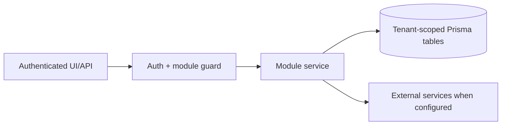

# Lead generation, contacts, TradeMining, Apollo outreach: Open Questions

> Evidence status: Confirmed from code for file locations and schema references; business workflow details not explicitly encoded are marked Requires employee confirmation.

## Purpose and status

Lead generation, contacts, TradeMining, Apollo outreach is documented because code, routes, schema, or tests were located. Main evidence: `src/app/(authenticated)/lead-gen/*`, `src/modules/lead-gen/*`, `src/modules/trademining/ingestion.ts`, Apollo integration files, lead/contact/company Prisma models.

## Workflow / rules summary

- Entry points are protected authenticated pages and/or API routes for this module.
- Server-side pages and mutating APIs should validate tenant context and module entitlement before data access.
- Data persistence uses tenant-scoped Prisma models where a database model exists.
- External calls use `src/server/integrations/*` or module-specific integration helpers. Secret values are not documented here.
- Approval, printing, posting, and live external writes require human approval unless a code path explicitly enforces a safe dry-run.

## Data model

Relevant tables and enums are in `prisma/schema.prisma`. Operationally important fields include primary `id`, `tenantId` where present, status enums, foreign keys to tenant/user/module, timestamps, metadata JSON, and unique/index constraints declared in Prisma.

## Permissions

Roles and defaults are in `src/server/auth/role-policy.ts`. Runtime checks are in `src/server/auth/authorization.ts`; gaps should be treated as requiring code review before enabling production writes.

## Failure modes

Expected failures include missing tenant entitlement, read-only mutation attempts, validation errors, missing integration credentials, duplicate records, empty parser results, external API errors, timeouts, and partial job completion. Recovery should use module UI review screens, audit/job records, and documented dry-run scripts before live writes.

## Testing

Relevant tests are under `tests/` and generally named after the module. Recommended checks: `npm test`, `npm run lint`, `npm run typecheck`, and targeted route/service tests. Live integration scripts must not be run without explicit approval and safe credentials.

## Source map

| Responsibility | Main files | Supporting files | Tests |
|---|---|---|---|
| UI and routes | See evidence paths above | `src/components/app-shell.tsx` | module-named tests under `tests/` |
| Services/actions/queries | `src/modules/lead*` or evidence paths above | `src/server/*` | module-named tests |
| Schema | `prisma/schema.prisma` | `prisma/migrations/*` | schema-dependent unit tests |

## Open questions

- Which status values map to employee-approved business language? Requires employee confirmation.
- Which write actions should require two-person approval? Requires owner confirmation.
- Which external integration credentials should be moved from env fallback to tenant-scoped settings first? Requires owner confirmation.
- Should a future search-profile experiment agent be allowed to propose bounded profile variants in a sandbox ledger? It must not mutate active profiles or trigger TradeMining queries until the owner approves an experiment budget, success metric, holdout design, and automatic rollback rule. Requires owner confirmation.
- Confirm periodically that the active Brave Search plan continues to grant the storage rights required for Hunter's bounded URL, title, snippet, and evidence ledger. The owner approved enabling the signal scout on 2026-08-03; Google News RSS remains fallback-only and its retained metadata remains bounded.
- Which jurisdictions, sender identities, daily mailbox volumes, and review thresholds should govern later outreach? Requires owner confirmation before moving beyond dry run.
- Which named sender should be preferred for each service line/persona, and which mailbox caps should apply? Weighted
  mailbox pools now support deterministic company-level allocation. The approved initial state is Alex 100 with all
  secondary identities inactive at weight 0; later weights and service-line overrides require owner confirmation.
- How long should a Hunter assessment remain valid for outreach? The implemented default is 30 days through
  `HUNTER_OUTREACH_RESEARCH_MAX_AGE_DAYS`; business-owner confirmation is still required.
- External-signal discovery uses local `qwen3.6:27b-q4_K_M` for bounded first-pass classification, followed by the
  Luna-first, Qwen 3.6 recovery, and Kimi research stages only for promoted companies. A hosted first-pass model is not
  currently required.
