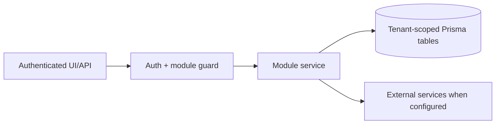

# Lead generation, contacts, TradeMining, Apollo outreach: Overview

> Evidence status: Confirmed from code for file locations and schema references; business workflow details not explicitly encoded are marked Requires employee confirmation.

## Purpose and status

Lead generation, contacts, TradeMining, Apollo outreach is documented because code, routes, schema, or tests were located. Main evidence: `src/app/(authenticated)/lead-gen/*`, `src/modules/lead-gen/*`, `src/modules/trademining/ingestion.ts`, Apollo integration files, lead/contact/company Prisma models.

## Workflow / rules summary

- Entry points are protected authenticated pages and/or API routes for this module.
- Server-side pages and mutating APIs should validate tenant context and module entitlement before data access.
- Data persistence uses tenant-scoped Prisma models where a database model exists.
- External calls use `src/server/integrations/*` or module-specific integration helpers. Secret values are not documented here.
- Approval, printing, posting, and live external writes require human approval unless a code path explicitly enforces a safe dry-run.

## Hunter dry-run control plane

Hunter Phase 1 creates a daily, tenant-scoped prospecting plan without performing enrichment or outreach. It combines existing TradeMining company evidence with source-agnostic opportunity signals such as expansion, facility openings, retail rollouts, hiring, leadership changes, leases/construction, funding/acquisition, referrals, and manually researched news.

The owner-approved planning allocation is 60% warehousing, 30% ocean/air, and 10% trucking. If one service-line bucket does not contain enough qualified companies, Hunter backfills with the highest-ranked remaining opportunities rather than padding the plan with weak records. The employee-facing Daily Opportunities page presents researched tiers and evidence; policy, kill-switch, manual evidence, and dry-run controls live on the separate Automation Settings page. No Phase 1 path calls Apollo or sends a customer communication.

Phase 2 adds an opt-in external signal scout to the existing Mac-mini Hunter service. It reads a bounded set of recent public-news links, falls back between configured discovery transports, and classifies only headline metadata with local structured output. Accepted signals reuse the existing tenant-scoped signal table; rejected samples, source failures, model name, and prompt version remain in `AutomationJobRun`. The scout is disabled by default pending approval of the exact external sources and their terms. It still cannot call Apollo, change a cadence, or send outreach.

The Sales navigation is arranged around operational intent: Daily Opportunities, Outreach Queue, Sales Opportunities,
and Apollo Exceptions are daily work; TradeMining Searches and Found Companies are source data; Automation Settings,
Scoring & Outcomes, and Health & Logs are administrative and quality-control surfaces. Existing records are preserved.

Phase 4 begins the assisted outreach-intelligence layer. For a ranked contact, Newl Apps can create a versioned
company/contact Outreach Plan from a bounded Hunter and TradeMining evidence ledger, generate a complete five-touch
sequence, and run both deterministic and model grounding checks. Generation does not approve, enroll, or send. A
current plan blocks Apollo push until QA passes and an authenticated employee approves it.

When an administrator explicitly selects **Assisted** mode, completed company research also queues a durable
post-research handoff. The Mac-mini worker processes one eligible Hot or Qualified company per authenticated request:
it verifies the latest Apollo company match, imports a bounded set of buyer contacts in `REVIEWING`, ranks them,
and creates grounded Outreach Plans. Ambiguous/missing Apollo matches are recorded for review and are not searched
again automatically. Assisted mode never approves a contact or plan, enrolls a cadence, or sends communication.

Daily Opportunities separates the latest successful research cohort from carry-forward outreach. Primary tier counts
represent only companies completed in the latest run; still-current Hot and Qualified accounts from earlier runs
remain actionable in a distinct carry-forward section. The planner records the cohort and source research run on
each decision so an older opportunity cannot be presented as research completed today.

Research preparation resolves a canonical company identity before selecting the bounded cohort. A normalized company
domain takes precedence over legal suffixes and branch labels, preventing aliases of the same operating company from
consuming multiple research slots. Tenant company IDs and prepared keys are still revalidated at completion.

The Luna/Qwen comparison is visible under Automation Settings. Luna is the authoritative company-research
synthesis consumed by Kimi and deterministic classification. Qwen receives the same saved public evidence only as a
temporary non-blocking shadow. An administrator may replay the Luna audit against saved evidence without repeating
Brave retrieval; replay does not rewrite a completed opportunity or authorize outreach.

Apollo company mapping and employee discovery are separate states. A verified Apollo organization remains mapped
when Apollo returns zero employees. It appears under **Mapped company — employee lookup needed**, where employees can
be rechecked without repeating paid organization matching; it is not presented as an unmapped-company exception.

Company and contact identity resolution is tenant-wide. TradeMining ingestion reuses an existing company for a unique,
safe legal-suffix name variant rather than creating another company row. Apollo organization ID and normalized domain
take precedence over display-name spelling after a manual mapping; ambiguous name-only matches remain in human review.
Apollo person/contact ID, then LinkedIn URL and concrete email, identify an existing contact across company aliases.
If that person is already enrolled or paused in a Hunter-managed cadence, Hunter creates neither a duplicate contact
nor another outreach plan. Prior non-Hunter cadence history remains eligible for the separately approved move policy.

## Data model

Relevant tables and enums are in `prisma/schema.prisma`. Operationally important fields include primary `id`, `tenantId` where present, status enums, foreign keys to tenant/user/module, timestamps, metadata JSON, and unique/index constraints declared in Prisma.

## Permissions

Roles and defaults are in `src/server/auth/role-policy.ts`. Runtime checks are in `src/server/auth/authorization.ts`; gaps should be treated as requiring code review before enabling production writes.

## Failure modes

Expected failures include missing tenant entitlement, read-only mutation attempts, validation errors, missing integration credentials, duplicate records, empty parser results, external API errors, timeouts, and partial job completion. Recovery should use module UI review screens, audit/job records, and documented dry-run scripts before live writes.

## Testing

Relevant tests are under `tests/` and generally named after the module. Recommended checks: `npm test`, `npm run lint`, `npm run typecheck`, and targeted route/service tests. Live integration scripts must not be run without explicit approval and safe credentials.

## Source map

| Responsibility | Main files | Supporting files | Tests |
|---|---|---|---|
| UI and routes | See evidence paths above | `src/components/app-shell.tsx` | module-named tests under `tests/` |
| Services/actions/queries | `src/modules/lead*` or evidence paths above | `src/server/*` | module-named tests |
| Schema | `prisma/schema.prisma` | `prisma/migrations/*` | schema-dependent unit tests |

## Open questions

- Which status values map to employee-approved business language? Requires employee confirmation.
- Which write actions should require two-person approval? Requires owner confirmation.
- Which external integration credentials should be moved from env fallback to tenant-scoped settings first? Requires owner confirmation.
