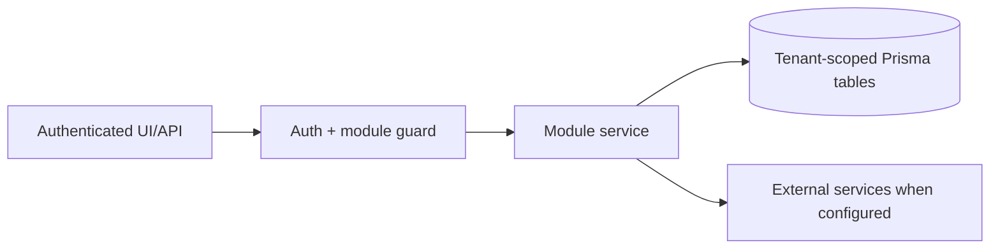

# Lead generation, contacts, TradeMining, Apollo outreach: Permissions

> Evidence status: Confirmed from code for file locations and schema references; business workflow details not explicitly encoded are marked Requires employee confirmation.

## Purpose and status

Lead generation, contacts, TradeMining, Apollo outreach is documented because code, routes, schema, or tests were located. Main evidence: `src/app/(authenticated)/lead-gen/*`, `src/modules/lead-gen/*`, `src/modules/trademining/ingestion.ts`, Apollo integration files, lead/contact/company Prisma models.

## Workflow / rules summary

- Entry points are protected authenticated pages and/or API routes for this module.
- Server-side pages and mutating APIs should validate tenant context and module entitlement before data access.
- Data persistence uses tenant-scoped Prisma models where a database model exists.
- External calls use `src/server/integrations/*` or module-specific integration helpers. Secret values are not documented here.
- Approval, printing, posting, and live external writes require human approval unless a code path explicitly enforces a safe dry-run.

## Data model

Relevant tables and enums are in `prisma/schema.prisma`. Operationally important fields include primary `id`, `tenantId` where present, status enums, foreign keys to tenant/user/module, timestamps, metadata JSON, and unique/index constraints declared in Prisma.

## Permissions

Roles and defaults are in `src/server/auth/role-policy.ts`. Runtime checks are in `src/server/auth/authorization.ts`; gaps should be treated as requiring code review before enabling production writes.

- Reading Hunter requires authenticated Lead Generation module access.
- Adding an opportunity signal and manually generating a dry-run plan require module mutation access.
- Changing Hunter policy, allocation, mode, thresholds, jurisdictions, or kill switch requires tenant administrator access.
- The daily machine route requires the existing Vercel `CRON_SECRET`, selects only Lead Generation-enabled tenants with a stored dry-run policy, and has no external-write capability.
- Signal-scout and company-research machine routes require the tenant-bound ingestion credential and
  resolve the tenant server-side. An explicit research cohort cannot select another tenant or bypass
  the company/customer/contact suppression rules.
- Company-research evidence and health are read through the authenticated Hunter page. Phase 3 has no
  Apollo, pipeline-stage, cadence, email, LinkedIn, or other communication action.
- The Hunter quality endpoint requires the distinct OpenClaw assistant token, Alex's mapped Microsoft
  Entra identity, tenant administrator role, and mutation access. Every query and incident retains that
  authenticated tenant ID.
- The owner-approved standing value authorizes only reproducible Hunter/TradeMining code defects to
  enter Rivet's existing restricted draft-PR queue. It does not authorize lead reclassification,
  production data repair, TradeMining retry, outreach retry, merge, deployment, permissions, or
  prospect communication.
- Quality results and Rivet outcomes are sent only to the protected `RIVET_TEAMS_TARGET`.
- Reading Outreach Plans requires authenticated Lead Generation access and remains tenant scoped through the contact
  and company relations.
- Generating, editing, or approving a plan requires Lead Generation mutation access. Approval records the authenticated
  user ID and is rejected for an unapproved contact or unsafe company.
- No plan-generation or plan-approval action performs Apollo enrollment or customer communication. The existing
  explicit Apollo push permission and validation boundary remains separate.
- Only a tenant administrator can select `ASSISTED`. Processing requires the tenant-bound ingestion credential and
  rechecks the stored mode and kill switch on every request. Assisted processing may create `REVIEWING` contacts
  and unapproved plans; it cannot approve, assign, enroll, create a Sales Opportunity, or send.
- Only a tenant administrator can manually queue current eligible opportunities for contact discovery. The action
  reuses current tenant-scoped research, refreshes deterministic planning, and remains subject to Assisted mode,
  the kill switch, Apollo match review, contact-fit review, and plan QA.

## Failure modes

Expected failures include missing tenant entitlement, read-only mutation attempts, validation errors, missing integration credentials, duplicate records, empty parser results, external API errors, timeouts, and partial job completion. Recovery should use module UI review screens, audit/job records, and documented dry-run scripts before live writes.

## Testing

Relevant tests are under `tests/` and generally named after the module. Recommended checks: `npm test`, `npm run lint`, `npm run typecheck`, and targeted route/service tests. Live integration scripts must not be run without explicit approval and safe credentials.

## Source map

| Responsibility | Main files | Supporting files | Tests |
|---|---|---|---|
| UI and routes | See evidence paths above | `src/components/app-shell.tsx` | module-named tests under `tests/` |
| Services/actions/queries | `src/modules/lead*` or evidence paths above | `src/server/*` | module-named tests |
| Schema | `prisma/schema.prisma` | `prisma/migrations/*` | schema-dependent unit tests |

## Open questions

- Which status values map to employee-approved business language? Requires employee confirmation.
- Which write actions should require two-person approval? Requires owner confirmation.
- Which external integration credentials should be moved from env fallback to tenant-scoped settings first? Requires owner confirmation.
