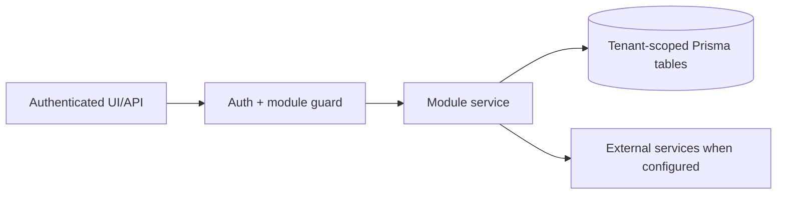

# Lead generation, contacts, TradeMining, Apollo outreach: Testing

> Evidence status: Confirmed from code for file locations and schema references; business workflow details not explicitly encoded are marked Requires employee confirmation.

## Purpose and status

Lead generation, contacts, TradeMining, Apollo outreach is documented because code, routes, schema, or tests were located. Main evidence: `src/app/(authenticated)/lead-gen/*`, `src/modules/lead-gen/*`, `src/modules/trademining/ingestion.ts`, Apollo integration files, lead/contact/company Prisma models.

## Workflow / rules summary

- Entry points are protected authenticated pages and/or API routes for this module.
- Server-side pages and mutating APIs should validate tenant context and module entitlement before data access.
- Data persistence uses tenant-scoped Prisma models where a database model exists.
- External calls use `src/server/integrations/*` or module-specific integration helpers. Secret values are not documented here.
- Approval, printing, posting, and live external writes require human approval unless a code path explicitly enforces a safe dry-run.

## Data model

Relevant tables and enums are in `prisma/schema.prisma`. Operationally important fields include primary `id`, `tenantId` where present, status enums, foreign keys to tenant/user/module, timestamps, metadata JSON, and unique/index constraints declared in Prisma.

## Permissions

Roles and defaults are in `src/server/auth/role-policy.ts`. Runtime checks are in `src/server/auth/authorization.ts`; gaps should be treated as requiring code review before enabling production writes.

## Failure modes

Expected failures include missing tenant entitlement, read-only mutation attempts, validation errors, missing integration credentials, duplicate records, empty parser results, external API errors, timeouts, and partial job completion. Recovery should use module UI review screens, audit/job records, and documented dry-run scripts before live writes.

## Testing

Relevant tests are under `tests/` and generally named after the module. Recommended checks: `npm test`, `npm run lint`, `npm run typecheck`, and targeted route/service tests. Live integration scripts must not be run without explicit approval and safe credentials.

## Source map

| Responsibility | Main files | Supporting files | Tests |
|---|---|---|---|
| UI and routes | See evidence paths above | `src/components/app-shell.tsx` | module-named tests under `tests/` |
| Services/actions/queries | `src/modules/lead*` or evidence paths above | `src/server/*` | module-named tests |
| Schema | `prisma/schema.prisma` | `prisma/migrations/*` | schema-dependent unit tests |

## Open questions

- Which status values map to employee-approved business language? Requires employee confirmation.
- Which write actions should require two-person approval? Requires owner confirmation.
- Which external integration credentials should be moved from env fallback to tenant-scoped settings first? Requires owner confirmation.

## TradeMining-to-Apollo smoke path

Use synthetic data for ingestion and pipeline-state testing:

1. run `npm run smoke:trademining` against a local server and local ingestion token;
2. verify the Hunter exporter form test submits multiple ports and every profile filter in one request, including `TEU >= minimum`;
3. confirm the configured profile is returned and the ingestion job reaches `SUCCESS`;
4. move the synthetic company from New to Reviewing to Approved for Pipeline;
5. advance the approved account through at least one Pipeline stage;
6. for a live Apollo test, require a named-contact confirmation that includes contact, cadence, sender, active/paused status, and contact count;
7. after the Newl Apps job completes, verify Apollo membership independently and then sync status back into Newl Apps.

Do not use a contact with active or finished sequence history unless the owner explicitly approves re-enrollment. Do not treat a job-level `SUCCESS` as proof of enrollment; compare enrolled, skipped, and failed counts and verify the contact's campaign status.

For Hunter collector validation, include a canonical export containing both a valid company row and a shipment-only row. Confirm the adapter uploads the valid row, counts the identity-free row under `recordsRejectedBeforeUpload`, and does not fail the complete batch.

For daily profile rules, verify a worker plan reports the profile's exact lookback, not a global collection cap. Test before/after the configured local run time and with a `lastRunAt` on the same local date. Candidate scoring tests must also prove that records outside the profile lookback or belonging to a different profile do not count toward `minShipmentCount`.

Scoring regression coverage must also verify:

1. TradeMining evidence queries are tenant scoped and use an inclusive UTC-day cutoff;
2. `DO_NOT_CONTACT` and `REJECTED` contacts are unranked with score zero;
3. cadence assignment refuses blocked contacts and Apollo queueing requires `APPROVED` status;
4. default role penalties deprioritize sales-only contacts without suppressing mixed titles that match logistics or operations;
5. invalid windows, contact tier thresholds, company weight totals, and mid-market TEU ranges are rejected before persistence.
6. the default Contacts directory includes unassigned pipeline contacts, the `UNASSIGNED` filter remains tenant scoped, and queueing refuses contacts without a sales rep.
7. identical scoring configuration objects produce the same fingerprint regardless of key order, while a changed setting produces a different fingerprint;
8. score snapshots and outcome events always include `tenantId`, and scoring-history reads filter both tables by the authenticated tenant;
9. ingestion records a company snapshot after its evidence and persisted pipeline score are refreshed;
10. candidate and pipeline mutations record the previous and current values without creating events from read-only page loads.
11. outcome creation selects only the latest applicable snapshot from the same tenant, company, and contact at or before the event time, and persists that snapshot ID;
12. outcomes with no earlier applicable snapshot remain valid with a null snapshot link, rather than linking to a later or unrelated score.
13. scheduled Apollo sync selects due contacts by tenant and Apollo contact ID, clears errors after success, and creates outcomes only for material sequence/reply changes;
14. transient and `429` responses receive no more than three total attempts, and sustained rate limiting defers the rest of the batch;
15. the scheduled route rejects missing or invalid `APOLLO_STATUS_SYNC_SECRET` values before any tenant or Apollo work begins and never falls back to the shared `CRON_SECRET`.
16. the scheduled route returns a non-success HTTP status when any tenant run reports `error`, so the calling GitHub Actions workflow cannot appear green after an internal sync failure.

The `20260722193000_add_lead_scoring_history` migration must remain additive: it may create the two history tables, indexes, and foreign keys, but must not drop, rename, truncate, update, or backfill existing tables.
The `20260722201500_link_lead_outcomes_to_scores` migration may only add the nullable snapshot foreign key; it must not rewrite existing outcomes.
The `20260722214500_add_apollo_status_sync_tracking` migration may only add nullable timestamps/error text, a defaulted failure counter, and indexes to `Contact`; it must not rewrite existing contact data.
