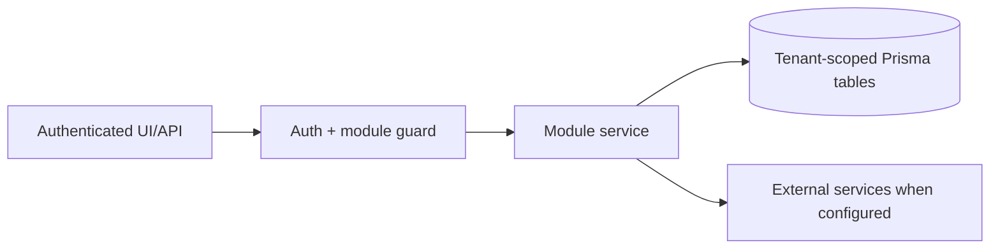

# Lead generation, contacts, TradeMining, Apollo outreach: Testing

> Evidence status: Confirmed from code for file locations and schema references; business workflow details not explicitly encoded are marked Requires employee confirmation.

## Purpose and status

Lead generation, contacts, TradeMining, Apollo outreach is documented because code, routes, schema, or tests were located. Main evidence: `src/app/(authenticated)/lead-gen/*`, `src/modules/lead-gen/*`, `src/modules/trademining/ingestion.ts`, Apollo integration files, lead/contact/company Prisma models.

## Workflow / rules summary

- Entry points are protected authenticated pages and/or API routes for this module.
- Server-side pages and mutating APIs should validate tenant context and module entitlement before data access.
- Data persistence uses tenant-scoped Prisma models where a database model exists.
- External calls use `src/server/integrations/*` or module-specific integration helpers. Secret values are not documented here.
- Approval, printing, posting, and live external writes require human approval unless a code path explicitly enforces a safe dry-run.

Regression coverage for Apollo contact discovery must include a reviewer-confirmed saved account whose canonical
organization and exact-domain searches return zero while its Apollo UI visibly shows Suggested leads. The test must
prove that up to three exact Apollo person URLs are parsed and deduplicated, that paid email-only enrichment cannot
run without explicit authorization, that a concrete-email person at the confirmed company is recovered, and that a
similarly named wrong-company person is rejected. Tests must also verify that the saved account ID survives subsequent
match records so a later manual recheck does not lose the mapped identity.

## Data model

Relevant tables and enums are in `prisma/schema.prisma`. Operationally important fields include primary `id`, `tenantId` where present, status enums, foreign keys to tenant/user/module, timestamps, metadata JSON, and unique/index constraints declared in Prisma.

```mermaid
flowchart LR
  UI[Authenticated UI/API] --> Auth[Auth + module guard]
  Auth --> Service[Module service]
  Service --> DB[(Tenant-scoped Prisma tables)]
  Service --> Ext[External services when configured]
```

## Permissions

Roles and defaults are in `src/server/auth/role-policy.ts`. Runtime checks are in `src/server/auth/authorization.ts`; gaps should be treated as requiring code review before enabling production writes.

## Failure modes

Expected failures include missing tenant entitlement, read-only mutation attempts, validation errors, missing integration credentials, duplicate records, empty parser results, external API errors, timeouts, and partial job completion. Recovery should use module UI review screens, audit/job records, and documented dry-run scripts before live writes.

## Testing

Relevant tests are under `tests/` and generally named after the module. Recommended checks: `npm test`, `npm run lint`, `npm run typecheck`, and targeted route/service tests. Live integration scripts must not be run without explicit approval and safe credentials.

## Source map

| Responsibility | Main files | Supporting files | Tests |
|---|---|---|---|
| UI and routes | See evidence paths above | `src/components/app-shell.tsx` | module-named tests under `tests/` |
| Services/actions/queries | `src/modules/lead*` or evidence paths above | `src/server/*` | module-named tests |
| Schema | `prisma/schema.prisma` | `prisma/migrations/*` | schema-dependent unit tests |

## Open questions

- Which status values map to employee-approved business language? Requires employee confirmation.
- Which write actions should require two-person approval? Requires owner confirmation.
- Which external integration credentials should be moved from env fallback to tenant-scoped settings first? Requires owner confirmation.

## TradeMining-to-Apollo smoke path

Use synthetic data for ingestion and pipeline-state testing:

1. run `npm run smoke:trademining` against a local server and local ingestion token;
2. verify the Hunter exporter form test submits multiple ports and every profile filter in one request, including `TEU >= minimum`;
3. confirm the configured profile is returned and the ingestion job reaches `SUCCESS`;
4. move the synthetic company from New to Reviewing to Approved for Pipeline;
5. advance the approved account through at least one Pipeline stage;
6. for a live Apollo test, require a named-contact confirmation that includes contact, cadence, sender, active/paused status, and contact count;
7. after the Newl Apps job completes, verify Apollo membership independently and then sync status back into Newl Apps.

Do not use a contact with active or finished sequence history unless the owner explicitly approves re-enrollment.
When re-enrollment is approved, regression coverage must verify Apollo receives
`sequence_active_in_other_campaigns=true` and `sequence_finished_in_other_campaigns=true`. Do not treat a job-level
`SUCCESS` as proof of enrollment; compare enrolled, pending, skipped, and failed counts and verify the exact requested
campaign ID. A pending result must resolve to enrolled or failed within ten minutes and must never cause an automatic
second enrollment write.
If the pending-confirmation marker is missing, regression coverage must prove that Newl Apps can recover only from an
exact saved selected-cadence ID plus a matching live active membership. The same path must fail closed when that ID is
missing or Apollo reports a different cadence, and recovery must clear a stale push blocker so the contact moves to
Active Cadences.

For Hunter collector validation, include a canonical export containing both a valid company row and a shipment-only row. Confirm the adapter uploads the valid row, counts the identity-free row under `recordsRejectedBeforeUpload`, and does not fail the complete batch.

For daily profile rules, verify a worker plan reports the profile's exact lookback, not a global collection cap. Test before/after the configured local run time and with a `lastRunAt` on the same local date. Candidate scoring tests must also prove that records outside the profile lookback or belonging to a different profile do not count toward `minShipmentCount`.

Port and consignee-filter regression coverage must also verify:

1. common U.S. port aliases resolve to canonical TradeMining names;
2. Canadian cities are rejected as U.S. arrival ports;
3. an empty U.S. arrival-port selection is valid and omits `USPort` from the TradeMining form;
4. `Ontario | Canada` produces a consignee-state and consignee-country worker plan with no city fallback, while a legacy `Toronto | Canada` value fails closed;
5. Ontario's `State` lookup includes Canada's `countryId`, and the form posts the resolved value through `ConsigneeState`;
6. a city is posted through `ConsigneeCity` only on an exact label match; `Vaughan` must not resolve to `VAUGHAN, MS`, and mixed unresolved cities remain together in one Boolean `ConsigneeAddress` expression;
7. the country, state/city/address, ports, and all other profile filters remain inside one logical BOL query;
8. results over 25,000 split first by date and then by port, while an unsplittable capped leaf reports incomplete coverage;
9. aggregate TEUs use only the matched profile's records inside its lookback;
10. industry-pack identifiers and modes reject unsupported values, and classification labels match the qualification packs; and
11. invalid local configuration creates and fails a tracked run before the worker stops, preventing untracked retry loops.
12. Found Companies queries at most the top 100 human-review candidates, defaults to 25 rendered rows, supports only 25/50/75/100, clamps invalid pages, and limits CSV export to the same bounded review queue.
13. the Hunter installer pins the live service to a clean detached `origin/main` worktree and the runner cannot be redirected to a development checkout through its environment file.

Scoring regression coverage must also verify:

1. TradeMining evidence queries are tenant scoped and use an inclusive UTC-day cutoff;
2. `DO_NOT_CONTACT` and `REJECTED` contacts are unranked with score zero;
3. cadence assignment refuses blocked contacts and Apollo queueing requires `APPROVED` status;
4. default role penalties deprioritize sales-only contacts without suppressing mixed titles that match logistics or operations;
5. invalid windows, contact tier thresholds, company weight totals, and mid-market TEU ranges are rejected before persistence.
6. the default Contacts directory includes unassigned pipeline contacts, the `UNASSIGNED` filter remains tenant scoped, and queueing refuses contacts without a sales rep.
7. identical scoring configuration objects produce the same fingerprint regardless of key order, while a changed setting produces a different fingerprint;
8. score snapshots and outcome events always include `tenantId`, and scoring-history reads filter both tables by the authenticated tenant;
9. ingestion records a company snapshot after its evidence and persisted pipeline score are refreshed;
10. candidate and pipeline mutations record the previous and current values without creating events from read-only page loads.
11. outcome creation selects only the latest applicable snapshot from the same tenant, company, and contact at or before the event time, and persists that snapshot ID;
12. outcomes with no earlier applicable snapshot remain valid with a null snapshot link, rather than linking to a later or unrelated score.
13. scheduled Apollo sync selects due contacts by tenant and Apollo contact ID, clears errors after success, and creates outcomes only for material sequence/reply changes;
14. transient and `429` responses receive no more than three total attempts, and sustained rate limiting defers the rest of the batch;
15. the scheduled route rejects missing or invalid `APOLLO_STATUS_SYNC_SECRET` values before any tenant or Apollo work begins and never falls back to the shared `CRON_SECRET`.
16. the scheduled route returns a non-success HTTP status when any tenant run reports `error`, so the calling GitHub Actions workflow cannot appear green after an internal sync failure.
17. Apollo reply and sequence outcomes link to a score snapshot created before the new Apollo status is persisted, preventing positive engagement from leaking into the score used to evaluate that outcome.
18. the GitHub Actions caller does not retry a failed whole-batch HTTP request; retries remain bounded inside the per-contact Apollo client.
19. organization search sends `q_organization_domains_list` for domains and `q_organization_name` for name-only companies, never internal TradeMining identity-field names.
20. name-only organization discovery is capped at two deterministic queries and stops at the first direct-company match.
21. every confirmed Apollo mapping performs bounded identity lookup, with or without a saved domain, to resolve
    account IDs to Apollo's canonical nested organization ID; when Organization Search omits an already-saved account,
    an exact zero-credit saved-account lookup recovers that relationship after a zero/partial employee result. People
    Search stays constrained to the canonical `organization_ids` value without combining it with a subsidiary-specific
    domain filter or falling back to an unscoped search. The expected domain remains a response guard. Exact Apollo
    account-to-organization relationships may resolve a legal-entity card to its operating parent/brand, while
    unrelated parents, siblings, explicit different organization IDs, and unsafe identities still fail closed.
    A Dansons regression covers Apollo's duplicate saved-account shape: after the confirmed organization and domain
    return zero, a same-brand account on the exact trusted domain supplies a distinct global organization roster,
    while a same-name account on another domain is never searched. A separate regression verifies the bounded
    company-keyword fallback accepts only the confirmed company/domain.
22. an unresolved latest `ApolloCompanyMatch` makes bulk enrichment skip the company before any Apollo or contact
    lookup, except for the explicit mapped-zero-employee state shown under **Mapped, no employees**. That state may
    repeat only the read-only, organization-scoped employee lookup; a stored organization ID or zero-employee reason
    alone is insufficient.
23. Apollo company URL parsing rejects non-Apollo hosts, distinguishes `/accounts/{id}` from
    `/organizations/{id}`, resolves account links to their nested global organization before exact validation, and
    manual mapping never authorizes cadence enrollment.
24. People Search parses its `id` as an Apollo person ID, retains obfuscated-name and availability metadata, and does not claim the person is an enriched saved contact.
25. An organization-scoped People Search response may omit the returned organization ID only when its available company identity strictly matches the expected company; a sibling name or explicit different ID is rejected.
26. Saved Contact and People Search records dedupe by Apollo person ID while preserving the saved contact ID, revealed contact data, sequence history, and enrichment state.
27. People Search sends organization, domain, title, pagination, and similar-title filters in Apollo's documented URL
    query format. The YAT regression simulates Apollo ignoring body-only filters and confirms that the
    organization-scoped employee plus saved-contact email recovery succeeds without paid enrichment.
28. Bulk outreach approval resolves only tenant-owned contacts, approves only the latest non-archived QA-passed plan
    with a concrete usable email and current Hunter eligibility, leaves blocked selections unchanged with a reason,
    assigns an unassigned accepted contact to the approver, and creates one bounded Apollo enrollment job for the
    accepted contact IDs.
29. Outreach QA repairs normalize whitespace-only corruption of a saved evidence ID, strip any exact ledger ID from
    customer-visible copy, preserve line breaks and mailbox signatures, and rerun deterministic QA without a second
    draft-model call. Unsupported semantic claims still receive at most one model regeneration.
30. Regeneration remains allowed for an unapproved contact whose prior cadence is `FINISHED`, but replies, bounces,
    rejection, do-not-contact, approval, and active or paused outreach remain hard stops.
31. Needs Attention and Active Cadences exclude null, masked, and syntactically invalid email values without deleting
    the underlying tenant-owned contact.
32. A mapped-company employee recheck returns its result to Apollo Exceptions, exposes paid email-only enrichment as
    a separate explicit checkbox, and links to Outreach only when at least one actionable plan exists.

The `20260722193000_add_lead_scoring_history` migration must remain additive: it may create the two history tables, indexes, and foreign keys, but must not drop, rename, truncate, update, or backfill existing tables.
The `20260722201500_link_lead_outcomes_to_scores` migration may only add the nullable snapshot foreign key; it must not rewrite existing outcomes.
The `20260722214500_add_apollo_status_sync_tracking` migration may only add nullable timestamps/error text, a defaulted failure counter, and indexes to `Contact`; it must not rewrite existing contact data.
The `20260724170000_add_hunter_profile_coverage_rules` migration may only add industry-pack JSON, the defaulted industry mode, and the nullable aggregate-TEU threshold; it must not delete, rename, update, or backfill existing data.

## Hunter dry-run planning

Regression coverage must prove:

1. a limit of 20 produces 12 warehousing, 6 ocean/air, and 2 trucking positions when every bucket is supplied;
2. an undersupplied service bucket is backfilled with the highest-ranked remaining qualified opportunities;
3. allocations outside 0-100 or not totaling exactly 100 are rejected;
4. every company, signal, suppression, policy, decision, and run query remains tenant scoped;
5. existing pipeline leads, replies, prior sequence history, do-not-contact, do-not-prospect, cashflow customers, and active suppressions are excluded;
6. the scheduled route rejects an absent or invalid `CRON_SECRET`, runs at most once per tenant local calendar date, and records tenant failures without authorizing external writes;
7. the Hunter UI and planner contain no Apollo enrollment or communication action.

Migration `20260725120000_add_hunter_dry_run_control_plane` must remain additive and may not rewrite existing company, contact, lead, TradeMining, Apollo, scoring, or outreach records.

## Hunter external signal scout

Regression coverage must prove:

1. prepare, complete, and fail routes resolve tenant scope through machine ingestion authentication;
2. a completion cannot write without an active tenant-owned run ID;
3. every accepted source URL is HTTPS and every relevant result has an explicit company;
4. approved topics and geographies rotate across local dates, preserve the 60/30/10 service mix, store query fingerprints,
   suppress canonical source URLs for 180 days, and group repeat monthly company events without suppressing a later event;
5. obvious directories and warehouse/provider roundups are filtered before Qwen, and model instructions reject one-off pop-ups plus unsupported service-line inference;
6. model and prompt version, source provider/lens, confidence, rationale, raw/filtered/duplicate/selected coverage metrics, and evidence remain auditable;
7. invalid enums, oversized batches, missing fields, omitted source rows, and confidence below 50 fail closed;
8. Brave 429/5xx responses receive bounded retry, the RSS fallback remains available, and total source failure makes the run fail visibly;
9. accepted news creates or reuses a tenant-scoped provisional company without TradeMining, and the next company-research
   cohort reserves bounded capacity for external-signal companies;
10. the live runner allows only loopback Ollama endpoints and reads its model settings from the protected Hunter environment;
11. the installed Hunter service remains pinned to the dedicated clean runtime checkout;
12. no scout module or route imports or calls Apollo, cadence enrollment, email, LinkedIn, or customer-communication code; and
13. Python, zsh, TypeScript, and structured-output contract tests pass without a database migration.

## Hunter company deep research

Regression coverage must prove:

1. prepare, complete, and fail routes resolve tenant scope through machine ingestion authentication;
2. an explicit cohort is bounded to 100 keys and still resolves only eligible companies inside the authenticated tenant;
3. the default queue follows the saved daily company limit and excludes recently researched companies for seven days;
4. identity, fresh-event, careers, and distribution-footprint queries are generated for every company;
5. evidence URLs are HTTPS, source domains match their URLs, redirects cannot reach local/private addresses, and query/evidence sizes are bounded;
6. Luna receives the bounded evidence in batches of at most four through a tenant-scoped machine route,
   uses strict Structured Outputs with no tools and `store: false`, and is the only synthesis allowed into
   K2.6 and deterministic classification. A missing, malformed, disabled, or unavailable Luna response fails
   closed. Qwen runs locally with structured output and thinking disabled only as an optional non-blocking shadow;
   its row is withheld from the hosted model, its failure cannot block Luna/Kimi completion, and agreement remains
   auditable. K2.6 and bounded K3 usage, cached-token counts, reasoning effort, status, and cost estimates remain auditable;
7. uncorroborated ambiguous identity, explicit provider-service evidence even when the model misses it, explicitly evidenced stable/exclusive external-provider relationships without displacement evidence, thin evidence, and incomplete pass coverage fail deterministic gates; matching first-party identity can correct unsupported ambiguity; unsupported provider/incumbent labels cannot block; stale/no-opportunity evidence remains Watchlist; an undated/old `FRESH` claim is evaluated as current fit rather than Hot; exact-company recent material expansions, including new production lines at an existing facility and distribution-center establishments, can restore a missed fresh trigger or replace a weaker affiliate or unsupported careers citation before the date gate, replace a contradicted generic summary with saved evidence, and remain typed as expansion rather than facility opening; compact Qwen/K2.6/K3 packets preserve up to two qualifying expansion records in exact-entity-first order plus the strongest specific current logistics-management vacancy before pass-diverse backfill; a Qualified current account saves that qualifying vacancy as its trigger citation with exact role wording, while salary/compensation records, role taxonomies, job-description references, employee profiles, generic responsibilities/qualifications, malformed or incomplete careers rows, generic “Join our team” invitations, general applications, talent communities, future-opportunity pages, and completely missing vacancy evidence cannot become trigger citations or retain an unsupported hiring claim; opening or application language must be tied to the specific currently available role; duplicate vacancy evidence is selected deterministically; and incidental China text cannot override verified North American identity;
8. five 0-20 K2.6 dimensions must equal the reported total; K3 cannot raise that score, promote a blocked candidate, or create Hot without citing the same recent dated trigger;
9. public identity evidence, never shipment origin, determines company country; verified North American operators do not fail a redundant foreign-division name check, while foreign division evidence tolerates legal-suffix/parenthetical differences but still requires a matching alias, U.S. jurisdiction, and explicit operating relationship; other foreign entities without a verified U.S. division receive a 10-point penalty and Watchlist cap, while mainland-China entities without one are blocked;
10. ambiguous or below-70% identities pivot from candidate-matching domains found in saved evidence to official and legal/about/contact pages, rerun synthesis when first-party evidence is recovered, and never accept an unrelated directory or similar-name domain;
11. completion preloads the prepared tenant-scoped company identity map, uses a bounded 30-second
    interactive transaction, stores tenant-scoped evidence atomically, and refreshes only the dry-run plan; and
12. a retrieval/synthesis checkpoint resumes only against an identical newly prepared tenant cohort; scheduled
    runs write the paid-retrieval checkpoint atomically before Luna, an exact same-day retry discovers it
    automatically, malformed batches are isolated to individual companies with bounded repair attempts,
    and exhausted company-level failures do not discard other valid synthesis results;
13. legal-name, regional, and brand aliases cover known false-negative shapes such as Aalberts IPS Americas, AS Colour, 3F North America, Barnhardt Manufacturing, and Atlas Copco Compressors;
14. saturated generic results cannot prevent a known-domain identity or fresh-event query from executing or contributing evidence, including Barnhardt's first-party NCFI expansion;
15. a full evidence ledger executes no follow-up search, a partially full ledger appends only to the remaining capacity, resumed evidence is bounded, and no completion company can exceed 24 evidence records; and
16. no company-research module or route imports or calls Apollo, pipeline-stage mutation, cadence enrollment, email, LinkedIn, or customer-communication code; and
17. the Luna compatibility flag requires the existing server OpenAI key, successful batches are idempotent,
    evidence changes produce a new fingerprint, off-cohort identities fail before provider access, and no OpenAI
    key appears in the Mac worker.

## Hunter quality audit and Rivet triage

Regression coverage must prove:

1. the sample selects one Hot, Qualified current account, Watchlist, and Blocked signal before filling the fifth slot;
2. prepare/complete/fail require the authenticated administrator's tenant and mutation access;
3. completion returns exactly one result for every prepared tenant-scoped signal and rejects duplicates or foreign IDs;
4. Codex output accepts only the documented categories, tiers, severities, booleans, and HTTPS evidence URLs;
5. model judgment and data/configuration issues notify but never auto-queue Rivet;
6. reproducible retrieval, handoff, and deterministic-rule defects require the exact owner standing-approval value;
7. a Rivet suggestion forbids reclassification, TradeMining/outreach retry, merge, deploy, production writes, permissions, and customer communication;
8. related reproducible findings from the same workflow consolidate into one incident and one Rivet job, while a second workflow-scoped incident inside seven days trips the circuit breaker;
9. enabled TradeMining profiles without a due run, removed/disabled profiles that ran, overlap, stuck/failed runs, missing/incomplete coverage, and exported/processed count drift are detected;
10. a zero-result profile is only an anomaly when recent positive history exists;
11. shell/schema tests preserve a read-only Codex audit, the 13:30 America/Toronto schedule, and Teams delivery through `RIVET_TEAMS_TARGET`;
12. Rivet resolves Git state from its dedicated runtime, validates context against the fetched base branch, stops a failed packet parse before any blank `origin/` worktree reference, refuses sibling queued/running/review-blocked work for one workflow, and creates no PR until the exact branch commit receives a zero-finding independent `PASS`;
13. the Hunter worker emits one settled daily profile digest, sends immediate sanitized failure alerts, and keeps processing other due profiles;
14. the assisted outreach-handoff machine route bypasses browser-session middleware and continues to enforce tenant-bound ingestion authentication in its route;
15. the Mac worker starts its outreach-handoff poller before the sequential TradeMining loop, so a large profile
    ingestion cannot block an interactive contact-discovery job; and
16. no schema migration is required because audit, incident, feedback, suggestion, and Rivet state use existing tenant-scoped tables.

## Automated sales workspace

Regression coverage must prove:

1. Sales Opportunities contains only engaged, meeting, proposal, won, and lost stages;
2. New, researching, enriched, qualified, and contacted leads remain stored but do not appear in the revenue view unless a saved Apollo positive reply or meeting-booked status supplies the corresponding effective sales stage;
3. Outreach Queue **Needs Attention** includes approved, drafted, ready, paused, and unanswered pre-enrollment work;
4. enrolled no-reply contacts move to **Active Cadences**, while rejected, do-not-contact, bounced, explicit
   permanent delivery failures, finished, positive, meeting-booked, and negative contacts are excluded from both
   actionable work views; terminal delivery failures remain visible in the read-only Delivery Failures history;
5. the legacy `/lead-gen/contacts` route redirects to `/lead-gen/outreach`; and
6. Outreach Queue starts with secondary audit columns hidden and links companies back to Found Companies; and
7. every underlying query remains tenant scoped and the redesign requires no database migration.
8. the Apollo reply-sync metric is labeled as an all-status saved-contact monitoring count and is not presented as
   the number of contacts in Outreach Queue.
9. QA-passed prompt versions explicitly marked compatible remain query-visible after a prompt-policy upgrade, while
   failed legacy plans do not.
10. Tina-style explicit bounces, Rodney-style invalid-MX outcomes after a finished cadence, and Dileep-style
    recipient-domain failures map to terminal `BOUNCED`, preserve Apollo's exact audit reason, and cannot be
    downgraded by later contact rechecks.
11. a successful Apollo sync reports terminal delivery failures that could not be matched by exact contact ID or
    normalized email.

## Assisted post-research handoff

Regression coverage must prove:

1. only explicit `ASSISTED` mode with the kill switch off can queue or process a handoff;
2. the queued cohort contains only fresh Hot/Qualified companies with the exact tenant-owned `WOULD_PURSUE`
   decision produced by the dedicated researched-outreach plan; unresearched TradeMining candidates cannot consume
   this cohort's daily slots;
3. machine routes ignore caller-supplied tenant identifiers and use ingestion authentication;
4. each request processes at most one company and persisted leases, results, attempts, and retry dates survive worker restart;
5. an unresolved latest Apollo company match blocks repeat discovery and remains review-required;
6. saved contacts are read in 100-record pages through a 20-page safety cap, then combined with a 100-result organization-scoped employee search and an always-run multi-title search before ranking; each masked shortlisted person is searched again in the saved directory by name/title/confirmed company, and records merge by person/contact ID, LinkedIn/email, then strict company + first name + title while preserving the revealed saved identity; Apollo account IDs are resolved to the nested global organization ID before employee search (with saved-contact recovery as a fallback), an exact saved account omitted by name search is recovered through zero-credit Account View, and saved-contact search uses that account's canonical Apollo name rather than a branch/facility label while accepting only the confirmed account or resolved canonical organization ID; an exact saved account with no nested organization ID retries by its trusted account domain, and an unresolved partial result may use the one unique domain carried by an exact-identity saved contact; one partial account result cannot be treated as complete, acronym-expanded operating names are accepted only inside the confirmed ID/domain scope, and sibling/parent organizations remain excluded unless a manually pasted account proves the exact account-to-parent relationship and distinctive shared brand;
7. deterministic ranking excludes seller-side and unidentifiable contacts, gives the buyer-role model the best 10 candidates, and caps final selection at `maxContactsPerCompany`;
8. buyer-role review uses strict structured output and returns the exact requested contact IDs; model-qualified contacts rank first, while an explicit manager-or-higher physical logistics or facility-operations buyer remains eligible for an unapproved human-review plan; digital/franchise/general back-office operations and explicit geography mismatches do not receive that fallback;
9. the manual current-opportunity handoff requires completed company research, creates a deterministic plan scoped
   to the current researched Hot/Qualified cohort, and queues the same bounded Assisted-mode job without rerunning
   research;
10. the same prompt version and prospecting decision reuse a cached review, while a new decision requires fresh review;
11. imported contacts remain `REVIEWING`, unapproved, unassigned, and unenrolled;
12. plan generation uses the saved Hunter/TradeMining evidence ledger and persists QA failure rather than bypassing it;
13. no assisted-handoff path creates a lead, changes a pipeline stage, approves a plan/contact, writes an Apollo cadence, or sends communication; and
14. the Mac worker drains the queue after research and resumes unfinished jobs during its normal loop.
15. legacy pre-engagement `Lead` rows, old negative/out-of-office contacts, individual do-not-contact records, and
    prior-sequence evidence do not suppress a current Hot/Qualified company. Current customers, generic replies
    requiring review, positive replies, and meetings remain company-level stops; contact-level do-not-contact,
    reply, and bounce safety is enforced on each selected contact.
16. Automation Settings reports the latest handoff's queued companies, processed companies, Apollo people found,
    deterministic buyer-role candidates, evaluated contacts, newly created plans, already-current plans, total actionable plans, QA failures, and per-company terminal
    reason as separate values.
17. same-domain regional brand shortening such as `SALICE AMERICA INC` to Apollo organization `Salice` is accepted,
    while different-domain parents and sibling companies still fail closed.
18. an approved contact with finished prior cadence history can enroll in Hunter; an active or paused different
    cadence is removed before the Hunter add-contact request; replies and bounces remain blocked; and status sync
    may replace stale `FINISHED` state only when Apollo reports the selected Hunter cadence ID.
19. a contact recheck counts a current same-prompt outreach plan as actionable instead of incorrectly reporting zero
    plans and a terminal no-qualifying-contact result.
20. a forced contact recheck archives unapproved plans for contacts that no longer pass buyer-role review, and the
    active queue hides AI drafts linked to superseded prompt versions while preserving manual drafts and approved plans.
21. manual mapping/recheck is credit-free unless the operator checks the separate paid-email authorization; the
    authorized job attempts no more than three `/people/match` requests, disables phone/personal/waterfall fields, and
    never calls paid enrichment when a concrete saved contact was recovered.
22. an existing masked local contact such as Isaac is backfilled with the saved Apollo name, email, and contact ID;
    unapproved plans for contacts that still lack a concrete email are archived and cannot remain in Outreach Queue.
23. a later saved-contact page can surface a role such as YAT's import/export specialist, and a manually confirmed
    Pratt Rock Hill Apollo account may resolve to Pratt Industries only through its explicit account relationship;
    when YAT's confirmed organization and domain People Search scopes both return zero, a final exact-name search
    recovers only YAT USA employees and rejects a similarly named unrelated company without paid enrichment.
24. an authenticated reviewer can explicitly confirm weak facility/parent or legal/brand name differences such as
    Roechling Industrial Gastonia to Roechling Industrial North America and Kimbrells Furniture Distributors to
    Kimbrell's Home Furnishings; a reviewer-confirmed sparse Pratt account without a nested global organization ID is
    retained exactly rather than rejected, and a provider-like name preserves its warning signal without vetoing the
    confirmed identity. Unconfirmed weak matches remain blocked.
25. the exact persisted zero-employee production shape—a current Hunter company with a `DIRECT_COMPANY` match and
    the explicit zero-employee marker—remains in **Mapped company — employee lookup needed**, while ordinary
    successful direct matches remain excluded.
26. a confirmed company retries employee discovery through its trusted domain when the organization-ID result is
    empty or singular, reads the bounded paged People Search roster, and does not require individual person URLs.
27. an Apollo `/people/<id>` recovery value can resolve as a zero-credit saved-contact ID before separately
    authorized People Enrichment is attempted, while wrong-employer and missing-email records remain rejected.
28. when a reviewer-confirmed saved Account is an empty shell, a populated operating-brand Account such as `CGT`
    may supply saved contacts only when Apollo explicitly links both Accounts to the same immutable global
    organization ID; a same-name or same-domain Account linked to a different global organization remains rejected,
    and no paid organization or person endpoint is called.
29. an exact reviewer-confirmed `organization_ids[]` People Search accepts the roster Apollo returns when the person
    records embed a different saved Account ID and operating-brand label such as `CGT`, whether the reviewer supplied
    an Apollo account URL or canonical organization URL; organization-URL trust must come from the manual mapping
    audit record and still equal the company's current stored organization ID, while the same identifier mismatch
    remains rejected for automatic or unconfirmed company matching.

## Outreach Plans and grounded sequence generation

Regression coverage must prove:

1. evidence fingerprints are stable regardless of input ordering;
2. a valid sequence contains three emails and, only for a Hot opportunity, one separate call task; it contains no
   LinkedIn task, uses contiguous steps, and has increasing delays;
3. missing/unknown evidence references, generic banned phrasing, unsupported URLs, and unsupported quantified claims
   fail deterministic QA;
4. any blocking model-critic issue fails the combined gate even when deterministic checks pass; a repairable
   deterministic or model issue triggers at most one full-sequence redraft with the exact findings, after which both
   gates rerun and any remaining failure stays blocked;
5. OpenAI strategy, sequence, and QA calls use the Responses API with strict JSON Schema;
6. generated drafts are not auto-approved, plan approval requires QA plus contact/company safety, and a current
   unapproved plan blocks Apollo;
7. editing generated copy invalidates QA and approval;
8. every email ends with the routed Apollo mailbox first name, including when Apollo exposes the sender label as an
   email address, while sender placeholders, generic company signatures,
   Hunter/internal references, and evidence IDs fail deterministic QA; the model critic receives only outbound
   sequence fields, not internal sequence names or evidence-reference arrays; and
9. the migration is additive and preserves every existing lead-generation record;
10. legacy/unassessed, Watchlist, Blocked, stale, unselected, or inconsistent Hunter handoffs cannot generate or push;
11. a Hot opportunity requires K3 confirmation while a Qualified current account may retain `NOT_SELECTED`;
12. a current selected handoff exposes Hunter's saved service line, point of attack, score, confidence, and provenance;
13. the strategy request includes that directive and rejects any model response that changes the service line; and
14. the evidence ledger preserves individual Hunter research URLs and excerpts rather than only flattened JSON text.
15. owner-approved Newl capability evidence can ground conservative statements about Newl's selected service line,
    without weakening company-claim grounding;
16. passed v2.4 plans remain unchanged, failed v2.4 plans upgrade once to v2.5, and a v2.5 failure does not create
    repeated automatic model spend; and
17. drafting and bounded repair instructions forbid date/outcome conflation and job-posting-to-capacity inference.
18. a selected Apollo person without a saved contact ID is matched to an existing saved contact or created with
    deduplication before enrollment; masked name fragments are not submitted, and conflicting/missing Apollo
    identities fail closed.
19. internal Hunter cadence keys are resolved against one live Apollo cadence directory by exact ID or unique exact
    name, while absent, inactive, ambiguous, and unavailable cadences fail before the enrollment endpoint; and the
    low-level Apollo client refuses to transmit known Newl Apps cadence keys.
