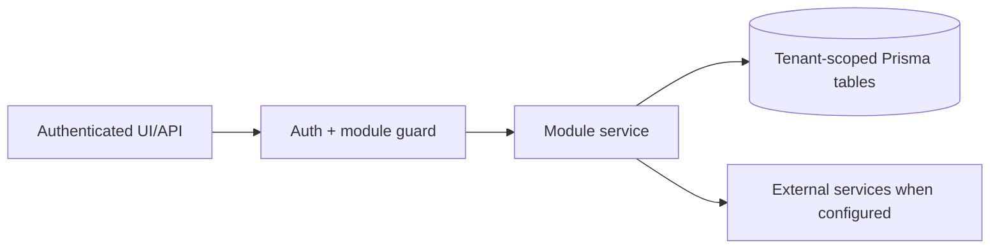

# Lead generation, contacts, TradeMining, Apollo outreach: Workflow

> Evidence status: Confirmed from code for file locations and schema references; business workflow details not explicitly encoded are marked Requires employee confirmation.

## Purpose and status

Lead generation, contacts, TradeMining, Apollo outreach is documented because code, routes, schema, or tests were located. Main evidence: `src/app/(authenticated)/lead-gen/*`, `src/modules/lead-gen/*`, `src/modules/trademining/ingestion.ts`, Apollo integration files, lead/contact/company Prisma models.

## Workflow / rules summary

- Entry points are protected authenticated pages and/or API routes for this module.
- Server-side pages and mutating APIs should validate tenant context and module entitlement before data access.
- Data persistence uses tenant-scoped Prisma models where a database model exists.
- External calls use `src/server/integrations/*` or module-specific integration helpers. Secret values are not documented here.
- Approval, printing, posting, and live external writes require human approval unless a code path explicitly enforces a safe dry-run.

## Daily TradeMining flow

1. Hunter polls Newl Apps for the tenant's current enabled profiles.
2. Manual run requests are processed first. Otherwise, each profile becomes due once per local calendar day after its configured daily time.
3. Immediately before collection, Hunter reloads the enabled profile by ID. A deleted or disabled profile fails closed.
4. TradeMining is queried once for the profile's full `lookbackWindowDays`. Multi-value profile filters are included in the same BOL search.
5. Hunter creates a tracked job run, exports and normalizes the records, and submits tenant-bound batches.
6. Candidate evidence is limited to the matched profile and lookback. Companies below that profile's `minShipmentCount` do not appear in Found Companies.

## Automatic Apollo reply sync

1. Vercel calls `/api/lead-gen/apollo/status-sync` hourly using `CRON_SECRET`.
2. Newl Apps selects only tenants with Lead Generation enabled and an active Apollo integration.
3. Each run processes at most `APOLLO_STATUS_SYNC_BATCH_SIZE` due contacts. A successful contact becomes due again after `APOLLO_STATUS_SYNC_INTERVAL_HOURS` (four hours by default).
4. Saved Apollo contacts are read by `apolloContactId`; the scheduler does not run people enrichment or organization search and therefore does not consume enrichment/search credits.
5. Transient and rate-limit responses receive at most three attempts with bounded backoff. Sustained rate limiting stops the current batch so later contacts remain due rather than creating an API storm.
6. Reply or sequence changes create the same score snapshot and outcome history used by manual synchronization. Unchanged polls do not create redundant score history.
7. Run results are stored in `AutomationJobRun` and `AuditLog`; per-contact last-sync, next-sync, failure count, and latest error appear in the Contacts health panel.

## Data model

Relevant tables and enums are in `prisma/schema.prisma`. Operationally important fields include primary `id`, `tenantId` where present, status enums, foreign keys to tenant/user/module, timestamps, metadata JSON, and unique/index constraints declared in Prisma.

## Permissions

Roles and defaults are in `src/server/auth/role-policy.ts`. Runtime checks are in `src/server/auth/authorization.ts`; gaps should be treated as requiring code review before enabling production writes.

## Failure modes

Expected failures include missing tenant entitlement, read-only mutation attempts, validation errors, missing integration credentials, duplicate records, empty parser results, external API errors, timeouts, and partial job completion. Recovery should use module UI review screens, audit/job records, and documented dry-run scripts before live writes.

## Testing

Relevant tests are under `tests/` and generally named after the module. Recommended checks: `npm test`, `npm run lint`, `npm run typecheck`, and targeted route/service tests. Live integration scripts must not be run without explicit approval and safe credentials.

## Source map

| Responsibility | Main files | Supporting files | Tests |
|---|---|---|---|
| UI and routes | See evidence paths above | `src/components/app-shell.tsx` | module-named tests under `tests/` |
| Services/actions/queries | `src/modules/lead*` or evidence paths above | `src/server/*` | module-named tests |
| Schema | `prisma/schema.prisma` | `prisma/migrations/*` | schema-dependent unit tests |

## Open questions

- Which status values map to employee-approved business language? Requires employee confirmation.
- Which write actions should require two-person approval? Requires owner confirmation.
- Which external integration credentials should be moved from env fallback to tenant-scoped settings first? Requires owner confirmation.
