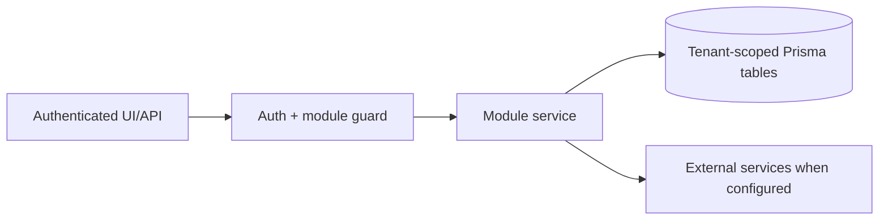

# Lead generation, contacts, TradeMining, Apollo outreach: Workflow

> Evidence status: Confirmed from code for file locations and schema references; business workflow details not explicitly encoded are marked Requires employee confirmation.

## Purpose and status

Lead generation, contacts, TradeMining, Apollo outreach is documented because code, routes, schema, or tests were located. Main evidence: `src/app/(authenticated)/lead-gen/*`, `src/modules/lead-gen/*`, `src/modules/trademining/ingestion.ts`, Apollo integration files, lead/contact/company Prisma models.

## Workflow / rules summary

- Entry points are protected authenticated pages and/or API routes for this module.
- Server-side pages and mutating APIs should validate tenant context and module entitlement before data access.
- Data persistence uses tenant-scoped Prisma models where a database model exists.
- External calls use `src/server/integrations/*` or module-specific integration helpers. Secret values are not documented here.
- Approval, printing, posting, and live external writes require human approval unless a code path explicitly enforces a safe dry-run.

## Daily TradeMining flow

1. Hunter polls Newl Apps for the tenant's current enabled profiles.
2. Manual run requests are processed first. Otherwise, each profile becomes due once per local calendar day after its configured daily time.
3. Immediately before collection, Hunter reloads the enabled profile by ID. A deleted or disabled profile fails closed.
4. TradeMining is queried for the profile's full `lookbackWindowDays`. Multi-value profile filters are included in the same logical BOL search. Optional U.S. arrival ports are canonicalized before submission. Destination markets become consignee-city/country filters; unresolved Canadian city values fall back to consignee-address text.
5. Hunter checks the reported match count before export. A result over 25,000 is split by date until it fits; a capped one-day multi-port query is then split by port. Only leaf queries are exported, so split probes are not double-counted.
6. Hunter creates a tracked job run, exports and normalizes the leaf records, and submits tenant-bound batches. Coverage metadata reports matches, exported records, query count, and completeness.
7. Candidate evidence is limited to the matched profile and lookback. Companies must meet `minShipmentCount`, optional aggregate TEUs, and any hard/exclude industry mode before appearing in Found Companies. Prefer mode affects ranking only.
8. If a capped result can no longer be divided, Hunter ingests the available export but closes the run as `PARTIAL`. If local profile configuration is invalid, the tracked run finishes as failed and the Search Profiles screen displays the error. Hunter does not repeat that daily attempt until the next local day; an operator can correct the profile and use **Run now**.

## Found Companies review

- The review queue retains the tenant-scoped filters and computed score ordering, then renders 25 companies by default.
- Employees can page through the full matching result set and select 50, 75, or 100 rows per page from the controls below the table.
- CSV export continues to include the full filtered result set rather than only the visible page.

## Automatic Apollo reply sync

1. GitHub Actions calls `/api/lead-gen/apollo/status-sync` hourly using the dedicated `APOLLO_STATUS_SYNC_SECRET`. The workflow also supports an approved manual dispatch for validation or recovery; it never reuses the shared `CRON_SECRET`.
2. Newl Apps selects only tenants with Lead Generation enabled and an active Apollo integration.
3. Each run processes at most `APOLLO_STATUS_SYNC_BATCH_SIZE` due contacts. A successful contact becomes due again after `APOLLO_STATUS_SYNC_INTERVAL_HOURS` (four hours by default).
4. Saved Apollo contacts are read by `apolloContactId`; the scheduler does not run people enrichment or organization search and therefore does not consume enrichment/search credits.
5. Transient and rate-limit responses receive at most three contact-level attempts with bounded backoff. Sustained rate limiting stops the current batch so later contacts remain due rather than creating an API storm. The GitHub caller does not retry the entire HTTP request because that could hide a partially failed batch behind a later empty success.
6. Reply or sequence changes create a pre-outcome score snapshot before Apollo state is persisted, then link the outcome to that snapshot. Manual synchronization follows the same ordering. Unchanged scheduled polls do not create redundant score history.
7. Run results are stored in `AutomationJobRun` and `AuditLog`; per-contact last-sync, next-sync, failure count, and latest error appear in the Contacts health panel.

## Data model

Relevant tables and enums are in `prisma/schema.prisma`. Operationally important fields include primary `id`, `tenantId` where present, status enums, foreign keys to tenant/user/module, timestamps, metadata JSON, and unique/index constraints declared in Prisma.

```mermaid
flowchart LR
  UI[Authenticated UI/API] --> Auth[Auth + module guard]
  Auth --> Service[Module service]
  Service --> DB[(Tenant-scoped Prisma tables)]
  Service --> Ext[External services when configured]
```

## Permissions

Roles and defaults are in `src/server/auth/role-policy.ts`. Runtime checks are in `src/server/auth/authorization.ts`; gaps should be treated as requiring code review before enabling production writes.

## Failure modes

Expected failures include missing tenant entitlement, read-only mutation attempts, validation errors, missing integration credentials, duplicate records, empty parser results, external API errors, timeouts, and partial job completion. Recovery should use module UI review screens, audit/job records, and documented dry-run scripts before live writes.

## Testing

Relevant tests are under `tests/` and generally named after the module. Recommended checks: `npm test`, `npm run lint`, `npm run typecheck`, and targeted route/service tests. Live integration scripts must not be run without explicit approval and safe credentials.

## Source map

| Responsibility | Main files | Supporting files | Tests |
|---|---|---|---|
| UI and routes | See evidence paths above | `src/components/app-shell.tsx` | module-named tests under `tests/` |
| Services/actions/queries | `src/modules/lead*` or evidence paths above | `src/server/*` | module-named tests |
| Schema | `prisma/schema.prisma` | `prisma/migrations/*` | schema-dependent unit tests |

## Open questions

- Which status values map to employee-approved business language? Requires employee confirmation.
- Which write actions should require two-person approval? Requires owner confirmation.
- Which external integration credentials should be moved from env fallback to tenant-scoped settings first? Requires owner confirmation.
