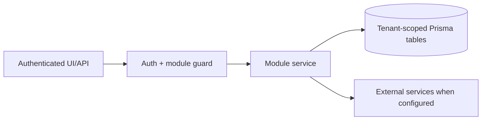

# Lead generation, contacts, TradeMining, Apollo outreach: Workflow

> Evidence status: Confirmed from code for file locations and schema references; business workflow details not explicitly encoded are marked Requires employee confirmation.

## Purpose and status

Lead generation, contacts, TradeMining, Apollo outreach is documented because code, routes, schema, or tests were located. Main evidence: `src/app/(authenticated)/lead-gen/*`, `src/modules/lead-gen/*`, `src/modules/trademining/ingestion.ts`, Apollo integration files, lead/contact/company Prisma models.

## Workflow / rules summary

- Entry points are protected authenticated pages and/or API routes for this module.
- Server-side pages and mutating APIs should validate tenant context and module entitlement before data access.
- Data persistence uses tenant-scoped Prisma models where a database model exists.
- External calls use `src/server/integrations/*` or module-specific integration helpers. Secret values are not documented here.
- Approval, printing, posting, and live external writes require human approval unless a code path explicitly enforces a safe dry-run.

## Daily TradeMining flow

1. Hunter polls Newl Apps for the tenant's current enabled profiles.
2. Manual run requests are processed first. Otherwise, each profile becomes due once per local calendar day after its configured daily time.
3. Immediately before collection, Hunter reloads the enabled profile by ID. A deleted or disabled profile fails closed.
4. TradeMining is queried for the profile's full `lookbackWindowDays`. Multi-value profile filters are included in the same logical BOL search. Optional U.S. arrival ports are canonicalized before submission. Canadian province markets such as `Ontario | Canada` become exact consignee-country and consignee-state filters; they do not use the U.S.-only city picker.
5. Hunter checks the reported match count before export. A result over 25,000 is split by date until it fits; a capped one-day multi-port query is then split by port. Only leaf queries are exported, so split probes are not double-counted.
6. Hunter creates a tracked job run, exports and normalizes the leaf records, and submits tenant-bound batches. Coverage metadata reports matches, exported records, query count, and completeness.
7. Candidate evidence is limited to the matched profile and lookback. Companies must meet `minShipmentCount`, optional aggregate TEUs, and any hard/exclude industry mode before appearing in Found Companies. Prefer mode affects ranking only.
8. If a capped result can no longer be divided, Hunter ingests the available export but closes the run as `PARTIAL`. If local profile configuration is invalid, the tracked run finishes as failed and the Search Profiles screen displays the error. Hunter does not repeat that daily attempt until the next local day; an operator can correct the profile and use **Run now**.

## Daily Hunter prospecting plan

1. TradeMining ingestion remains one opportunity source. Employees or future collectors can add independent signals for expansions, new facilities, retail rollouts, hiring, leadership changes, leases/construction, funding/acquisition, referrals, and news.
2. The daily planner considers tenant-owned companies plus active external signals. An external signal can be planned even when no TradeMining company exists yet.
3. Hunter excludes do-not-prospect, rejected/disqualified, existing cashflow-customer, actively suppressed, any existing pipeline lead, replied, do-not-contact, and previously sequenced records before ranking.
4. Qualified opportunities are selected at 60% warehousing, 30% ocean/air, and 10% trucking. Empty service buckets are filled with the strongest remaining qualified opportunities.
5. Every decision stores the opportunity type, rationale, confidence, evidence sources, recommended buyer persona, recommended cadence category, and effective policy snapshot.
6. The manual action and `/api/lead-gen/hunter/daily-plan` both run the same deterministic planner. The Vercel route uses the existing `CRON_SECRET` and skips tenants already planned on their local calendar date.
7. Phase 1 stops after persisting and displaying the plan. It does not search Apollo, create contacts, draft emails, change a cadence, enroll a contact, or send a message.

## External signal scout

1. The existing Mac-mini Hunter launch service checks once per local day after `HUNTER_SIGNAL_SCOUT_DAILY_TIME`. Automatic checks remain off unless `HUNTER_SIGNAL_SCOUT_ENABLED=true` is explicitly configured.
2. The worker authenticates through the existing tenant-bound ingestion context. Newl Apps rejects overlap and returns the fixed discovery lenses, recent source-URL dedupe set, policy threshold, recommended local model, and no-outreach rules.
3. The worker queries a bounded recent window, reserving the 40-item discovery cap as 24 warehousing, 12 ocean/air, and 4 trucking items before classification. GDELT DOC 2 is attempted first; HTTP 429 and transient failures receive bounded retries. Google News RSS is a read-only fallback. The run records each provider, result count, and error.
4. Only HTTPS link, source, published date, headline, lens, and service hint are supplied to the local classifier. Article bodies, Apollo data, contacts, and customer records are not sent.
5. Ollama enforces a JSON schema. The default `qwen3:30b-instruct` prompt requires an explicit non-logistics prospect, concrete event, evidence-only summary, service line, and calibrated 0-100 confidence. Missing records and scores below 50 fail closed.
6. Newl Apps validates the complete response again. Relevant classifications are upserted by tenant and deterministic source key. Signals below the tenant confidence threshold are saved as dismissed; irrelevant records remain as a bounded rejected sample in the run ledger.
7. The next dry-run planner automatically considers accepted signals. No signal-scout path performs Apollo search, cadence mutation, enrollment, email, LinkedIn, or other customer communication.
8. `--signal-scout-now` provides an explicit operator rerun. `--signal-scout-dry-run` exercises discovery and classification, then closes the prepared job as intentionally failed without persisting signals.

## Company deep research

1. After `HUNTER_COMPANY_RESEARCH_DAILY_TIME`, the existing Mac-mini service requests a tenant-scoped cohort from Newl Apps. The default limit is the saved Hunter policy limit; a new unsaved policy uses 30.
2. The server applies the same customer, pipeline, reply, sequence, do-not-contact, do-not-prospect, suppression, and recency exclusions before returning company facts. No contact or Apollo payload is returned.
3. Hunter runs four query passes per company: identity/parent, fresh events, first-party careers, and distribution footprint/named external providers. Brave Search is the approved production provider; DuckDuckGo HTML is a bounded trial fallback.
4. The worker stores HTTPS URLs, matching source domains, queries, excerpts, first-party labels, retrieval failures, and limited page text. URL resolution and redirects reject local, private, and non-global network destinations.
5. Local Qwen 3.5 35B synthesizes small structured batches with thinking disabled. It can propose at most two precise follow-up queries per company; Hunter retrieves them and reruns synthesis once.
6. Kimi K2.6 scores demand trigger, service fit, timing, accessibility, and evidence quality from 0-20. Its reported total must equal the dimensions, and usage/cost telemetry is retained.
7. Newl Apps revalidates the tenant cohort and the complete payload, then applies deterministic identity, logistics-provider, stable/exclusive external-provider, evidence-count, pass-coverage, and freshness gates. Blocked candidates receive no usable research score.
8. Accepted research is stored as a Hunter signal and immediately refreshes the dry-run plan. No Apollo lookup, pipeline mutation, cadence write, email, LinkedIn action, or other customer communication exists in this path.
9. `--company-research-now` runs the queue explicitly. `--company-research-dry-run` stops before persistence. `--company-research-cohort <json>` replays an exact bounded company list for model comparisons. A redacted `--company-research-output` checkpoint is written after retrieval and Qwen; `--company-research-resume` can reuse it only when the newly prepared tenant cohort matches exactly, avoiding duplicate search traffic after a Kimi outage.

## Found Companies review

- The review queue retains the tenant-scoped filters and computed score ordering, then renders 25 companies by default.
- Employees can page through the full matching result set and select 50, 75, or 100 rows per page from the controls below the table.
- CSV export continues to include the full filtered result set rather than only the visible page.

## Apollo company-match review

1. Pipeline enrichment first searches Apollo by the stored company domain, or by at most two company-name variants when no domain is available.
2. Only a direct-company result continues to contact discovery. Contact discovery for a direct or manually mapped company remains scoped to the confirmed Apollo organization ID.
3. Any ambiguous, logistics-provider, or no-match result creates an `ApolloCompanyMatch` attempt and appears in **Apollo Match Review**. The same company is skipped by later bulk enrichment, preventing accidental repeat searches and credit use.
4. A rep can resolve the row by pasting the Apollo company URL, explicitly retrying automatic matching after company data is corrected, or confirming there is no usable match.
5. URL mapping validates the exact Apollo organization, records the reviewer and mapping evidence, stores the organization ID/domain/LinkedIn URL, and then imports relevant contacts. It does not enroll a contact in a cadence.
6. Confirming no match keeps the row in the review archive and blocks bulk retries. Reopening returns it to the active review list; it does not itself call Apollo.

## Automatic Apollo reply sync

1. GitHub Actions calls `/api/lead-gen/apollo/status-sync` hourly using the dedicated `APOLLO_STATUS_SYNC_SECRET`. The workflow also supports an approved manual dispatch for validation or recovery; it never reuses the shared `CRON_SECRET`.
2. Newl Apps selects only tenants with Lead Generation enabled and an active Apollo integration.
3. Each run processes at most `APOLLO_STATUS_SYNC_BATCH_SIZE` due contacts. A successful contact becomes due again after `APOLLO_STATUS_SYNC_INTERVAL_HOURS` (four hours by default).
4. Saved Apollo contacts are read by `apolloContactId`; the scheduler does not run people enrichment or organization search and therefore does not consume enrichment/search credits.
5. Transient and rate-limit responses receive at most three contact-level attempts with bounded backoff. Sustained rate limiting stops the current batch so later contacts remain due rather than creating an API storm. The GitHub caller does not retry the entire HTTP request because that could hide a partially failed batch behind a later empty success.
6. Reply or sequence changes create a pre-outcome score snapshot before Apollo state is persisted, then link the outcome to that snapshot. Manual synchronization follows the same ordering. Unchanged scheduled polls do not create redundant score history.
7. Run results are stored in `AutomationJobRun` and `AuditLog`; per-contact last-sync, next-sync, failure count, and latest error appear in the Contacts health panel.

## Data model

Relevant tables and enums are in `prisma/schema.prisma`. Operationally important fields include primary `id`, `tenantId` where present, status enums, foreign keys to tenant/user/module, timestamps, metadata JSON, and unique/index constraints declared in Prisma.

```mermaid
flowchart LR
  UI[Authenticated UI/API] --> Auth[Auth + module guard]
  Auth --> Service[Module service]
  Service --> DB[(Tenant-scoped Prisma tables)]
  Service --> Ext[External services when configured]
```

## Permissions

Roles and defaults are in `src/server/auth/role-policy.ts`. Runtime checks are in `src/server/auth/authorization.ts`; gaps should be treated as requiring code review before enabling production writes.

## Failure modes

Expected failures include missing tenant entitlement, read-only mutation attempts, validation errors, missing integration credentials, duplicate records, empty parser results, external API errors, timeouts, and partial job completion. Recovery should use module UI review screens, audit/job records, and documented dry-run scripts before live writes.

## Testing

Relevant tests are under `tests/` and generally named after the module. Recommended checks: `npm test`, `npm run lint`, `npm run typecheck`, and targeted route/service tests. Live integration scripts must not be run without explicit approval and safe credentials.

## Source map

| Responsibility | Main files | Supporting files | Tests |
|---|---|---|---|
| UI and routes | See evidence paths above | `src/components/app-shell.tsx` | module-named tests under `tests/` |
| Services/actions/queries | `src/modules/lead*` or evidence paths above | `src/server/*` | module-named tests |
| Schema | `prisma/schema.prisma` | `prisma/migrations/*` | schema-dependent unit tests |

## Open questions

- Which status values map to employee-approved business language? Requires employee confirmation.
- Which write actions should require two-person approval? Requires owner confirmation.
- Which external integration credentials should be moved from env fallback to tenant-scoped settings first? Requires owner confirmation.
