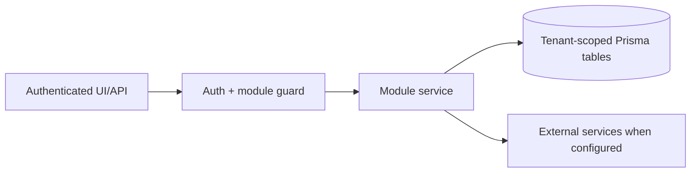

# Lead generation, contacts, TradeMining, Apollo outreach: Workflow

> Evidence status: Confirmed from code for file locations and schema references; business workflow details not explicitly encoded are marked Requires employee confirmation.

## Purpose and status

Lead generation, contacts, TradeMining, Apollo outreach is documented because code, routes, schema, or tests were located. Main evidence: `src/app/(authenticated)/lead-gen/*`, `src/modules/lead-gen/*`, `src/modules/trademining/ingestion.ts`, Apollo integration files, lead/contact/company Prisma models.

## Workflow / rules summary

- Entry points are protected authenticated pages and/or API routes for this module.
- Server-side pages and mutating APIs should validate tenant context and module entitlement before data access.
- Data persistence uses tenant-scoped Prisma models where a database model exists.
- External calls use `src/server/integrations/*` or module-specific integration helpers. Secret values are not documented here.
- Approval, printing, posting, and live external writes require human approval unless a code path explicitly enforces a safe dry-run.

## Daily TradeMining flow

1. Hunter polls Newl Apps for the tenant's current enabled profiles.
2. Manual run requests are processed first. Otherwise, each profile becomes due once per local calendar day after its configured daily time.
3. Immediately before collection, Hunter reloads the enabled profile by ID. A deleted or disabled profile fails closed.
4. TradeMining is queried for the profile's full `lookbackWindowDays`. Multi-value profile filters are included in the same logical BOL search. Optional U.S. arrival ports are canonicalized before submission. Canadian province markets such as `Ontario | Canada` become exact consignee-country and consignee-state filters; they do not use the U.S.-only city picker.
5. Hunter checks the reported match count before export. A result over 25,000 is split by date until it fits; a capped one-day multi-port query is then split by port. Only leaf queries are exported, so split probes are not double-counted.
6. Hunter creates a tracked job run, exports and normalizes the leaf records, and submits tenant-bound batches. Coverage metadata reports matches, exported records, query count, and completeness.
7. Candidate evidence is limited to the matched profile and lookback. Companies must meet `minShipmentCount`, optional aggregate TEUs, and any hard/exclude industry mode before appearing in Found Companies. Prefer mode affects ranking only.
8. If a capped result can no longer be divided, Hunter ingests the available export but closes the run as `PARTIAL`. If local profile configuration is invalid, the tracked run finishes as failed and the Search Profiles screen displays the error. Hunter does not repeat that daily attempt until the next local day; an operator can correct the profile and use **Run now**.
9. When the due-profile batch settles, Hunter sends one Teams digest with the completed/attempted count and each profile's matches, exported rows, processed rows, qualifying companies, physical query count, and retrieval completeness. A failed profile also sends an immediate safe alert while Hunter continues the remaining due profiles. The notification never includes credentials or raw external error text.

## Daily Hunter prospecting plan

1. TradeMining ingestion remains one opportunity source. Employees or future collectors can add independent signals for expansions, new facilities, retail rollouts, hiring, leadership changes, leases/construction, funding/acquisition, referrals, and news.
2. The daily planner considers tenant-owned companies plus active external signals. An external signal can be planned even when no TradeMining company exists yet.
3. Hunter excludes do-not-prospect, rejected/disqualified, existing cashflow-customer, actively suppressed, any existing pipeline lead, replied, do-not-contact, and previously sequenced records before ranking.
4. Qualified opportunities are selected at 60% warehousing, 30% ocean/air, and 10% trucking. Empty service buckets are filled with the strongest remaining qualified opportunities.
5. Every decision stores the opportunity type, rationale, confidence, evidence sources, recommended buyer persona, recommended cadence category, and effective policy snapshot.
6. The manual action and `/api/lead-gen/hunter/daily-plan` both run the same deterministic planner. The Vercel route uses the existing `CRON_SECRET` and skips tenants already planned on their local calendar date.
7. Phase 1 stops after persisting and displaying the plan. It does not search Apollo, create contacts, draft emails, change a cadence, enroll a contact, or send a message.

## External signal scout

1. The existing Mac-mini Hunter launch service checks once per local day after `HUNTER_SIGNAL_SCOUT_DAILY_TIME`. Automatic checks remain off unless `HUNTER_SIGNAL_SCOUT_ENABLED=true` is explicitly configured.
2. The worker authenticates through the existing tenant-bound ingestion context. Newl Apps rejects overlap and returns the fixed discovery lenses, recent source-URL dedupe set, policy threshold, recommended local model, and no-outreach rules.
3. The worker queries a bounded recent window, reserving the 40-item discovery cap as 24 warehousing, 12 ocean/air, and 4 trucking items before classification. GDELT DOC 2 is attempted first; HTTP 429 and transient failures receive bounded retries. Google News RSS is a read-only fallback. The run records each provider, result count, and error.
4. Only HTTPS link, source, published date, headline, lens, and service hint are supplied to the local classifier. Article bodies, Apollo data, contacts, and customer records are not sent.
5. Ollama enforces a JSON schema. The default `qwen3:30b-instruct` prompt requires an explicit non-logistics prospect, concrete event, evidence-only summary, service line, and calibrated 0-100 confidence. Missing records and scores below 50 fail closed.
6. Newl Apps validates the complete response again. Relevant classifications are upserted by tenant and deterministic source key. Signals below the tenant confidence threshold are saved as dismissed; irrelevant records remain as a bounded rejected sample in the run ledger.
7. The next dry-run planner automatically considers accepted signals. No signal-scout path performs Apollo search, cadence mutation, enrollment, email, LinkedIn, or other customer communication.
8. `--signal-scout-now` provides an explicit operator rerun. `--signal-scout-dry-run` exercises discovery and classification, then closes the prepared job as intentionally failed without persisting signals.

## Company deep research

1. After `HUNTER_COMPANY_RESEARCH_DAILY_TIME`, the existing Mac-mini service requests a tenant-scoped cohort from Newl Apps. The default limit is the saved Hunter policy limit; a new unsaved policy uses 30.
2. The server applies the same customer, pipeline, reply, sequence, do-not-contact, do-not-prospect, suppression, and recency exclusions before returning company facts. No contact or Apollo payload is returned.
3. Hunter runs four query passes per company: identity/parent, fresh events, first-party careers, and distribution footprint/named external providers. It searches the legal name plus bounded brand and regional aliases, and adds official-domain identity/event queries when a domain is known. The bounded evidence ledger samples results across every enabled query before taking additional results from any one query, so generic search results cannot exhaust the cap before an official-domain fresh-event query runs. After the first synthesis, an ambiguous, below-70%, or uncorroborated identity receives a deterministic domain-discovery recovery pass. Hunter recognizes only domains matching the candidate's bounded aliases, including domains already mentioned inside saved evidence, then searches/fetches official legal, privacy, terms, contact, and about results before rerunning Qwen. Brave Search is the approved production provider; Hunter normalizes Brave's `page_age` as a fallback `publishedAt`, replaces it with the page's original `datePublished` metadata when available, and requires Qwen to cite the exact evidence behind a trigger. DuckDuckGo HTML remains a bounded trial fallback without reliable search-result publication dates.
4. The worker stores HTTPS URLs, matching source domains, queries, excerpts, first-party labels, retrieval failures, and limited page text. URL resolution and redirects reject local, private, and non-global network destinations.
5. Local Qwen 3.5 35B synthesizes small structured batches with thinking disabled. Ollama's schema-constrained generation is validated again by Hunter. If a batch is malformed, truncated, omits a company, or violates a field contract, Hunter records a bounded validation reason, retries each affected company independently up to the configured repair limit, and continues with valid companies instead of discarding the complete cohort. It can propose at most two precise follow-up queries per company; Hunter retrieves them and reruns synthesis once. Follow-up retrieval shares the same hard 24-record company evidence cap, skips unused queries once the ledger is full, and bounds the evidence again before completion submission.
6. Kimi K2.6 scores demand trigger, service fit, timing, accessibility, and evidence quality from 0-20. Its reported total must equal the dimensions. Kimi K3 then conservatively validates at most five provisional fresh-event leaders with low reasoning and strict JSON output; it may confirm or downgrade but never promote.
7. Newl Apps revalidates the tenant cohort and complete payload, then applies deterministic identity, logistics-provider, stable/exclusive external-provider, evidence-count, pass-coverage, company-country, and U.S.-division gates. A model label cannot by itself block a logistics prospect or prove an exclusive incumbent; the evidence must contain explicit supporting language. Matching first-party identity evidence can correct an unsupported ambiguous model label. A verified North American operator is not subjected to the foreign-company U.S.-division gate. Foreign and mainland-China entities claiming a U.S. division still require a matching public alias, U.S./North America language, and explicit subsidiary/division/branch/facility/operating evidence; legal suffix and parenthetical differences are ignored without allowing a similar but unrelated company to pass. Before each model stage, the bounded evidence selector pins up to two exact-company, recent, dated material-expansion records plus the strongest specific current logistics-management vacancy, then fills the remaining packet by research-pass diversity. A qualifying vacancy needs unambiguous opening, hiring, or application semantics tied to the specific currently available role; responsibilities, qualifications, generic “Join our team” invitations, general applications, talent communities, and future-opportunity language do not qualify. Salary records, compensation references, role taxonomies, job-description references, employee profiles, malformed careers rows, expired postings, and similar pages are not vacancies. For a Qualified current account, deterministic reconciliation hands the strongest qualifying vacancy to the saved trigger citation and preserves the role wording from that source; invalid careers citations and unsupported hiring wording are replaced when no qualifying vacancy exists. When multiple related entities have recent events, the selector ranks the most specific company-name match first and recognizes establishment of a distribution center or warehouse as a material facility event. This prevents a parent or affiliate event from displacing a stronger exact-entity logistics event. Exact-company expansion evidence is also restored as a fresh trigger when Qwen overlooks it or cites a weaker affiliate or unsupported careers item, while directory-only claims cannot trigger that correction. New manufacturing or production lines at an existing facility count as expansion evidence rather than a new-facility opening; the repaired synthesis uses the saved event evidence instead of retaining a contradictory generic summary. An undated claimed trigger is evaluated as current fit, while stale/no-opportunity results remain recoverable on Watchlist instead of being permanently blocked. Company country must come from public identity evidence, not shipment origin; incidental China text cannot override a verified North American identity. Mainland-China entities without a cited U.S. division are blocked; other foreign entities without one receive a 10-point penalty and are capped at Watchlist.
8. Newl Apps assigns Hot opportunity, Qualified current account, Watchlist, or Blocked. Hot/Qualified signals refresh the dry-run plan; Watchlist/Blocked signals remain visible in the audit inbox but are dismissed from planning. No Apollo lookup, pipeline mutation, cadence write, email, LinkedIn action, or other customer communication exists in this path.
9. `--company-research-now` runs the queue explicitly. `--company-research-dry-run` stops before persistence. `--company-research-cohort <json>` replays an exact bounded company list for model comparisons. Scheduled and manual runs atomically write a mode-`0600`, cohort-fingerprinted checkpoint immediately after paid retrieval, defaulting under `HUNTER_PROCESSED_DIRECTORY/company-research-checkpoints`. A same-day exact-cohort retry reuses that checkpoint automatically, while `--company-research-output` and `--company-research-resume` remain available for controlled replays. A different prompt version or tenant-prepared cohort fails closed rather than reusing mismatched evidence.
10. With `HUNTER_TEAMS_TARGET` configured, a completed run reports researched, accepted, blocked, and omitted counts. A failed scheduled or explicit live run sends a sanitized alert stating that no outreach was sent and whether the paid-retrieval checkpoint can be reused; raw provider responses and credentials are never included.

## Assisted post-research handoff

1. **Assisted** is an explicit administrator-selected Hunter mode. `OFF` and `DRY_RUN` retain their existing no-handoff behavior.
2. After research persistence, Newl Apps creates a dedicated outreach plan from the latest safe, fresh Hot and
   Qualified research records, up to the saved daily company limit. This cohort does not compete with unresearched
   TradeMining or external-source candidates for the general prospecting plan's slots. The resulting
   `WOULD_PURSUE` decisions are snapshotted into a tenant-scoped `HUNTER_OUTREACH_HANDOFF` job.
3. The Mac-mini worker drains that durable queue through ingestion authentication. A dedicated background poller starts before TradeMining collection and continues independently while large exports are ingested, so an interactive contact-discovery request is not held behind a long profile run. Every request leases and processes at most one company, so a timeout or restart does not require research to run again.
4. The service rechecks do-not-prospect, rejected/disqualified, research freshness, tier, and current planning decision immediately before Apollo access.
5. A known Apollo mapping is trusted as the intended account, but its account ID must resolve to Apollo's canonical
   nested organization ID when Apollo exposes one. Organization Search handles unsaved companies; if it omits an
   already-saved mapped account and the initial employee search returns at most one person, Hunter requires an exact
   match in Apollo's zero-credit saved-account directory. If name-filtered account search omits that confirmed account,
   Hunter retrieves the exact saved account by its immutable ID through Apollo's zero-credit Account View endpoint.
   It repeats People Search with the nested organization ID
   alone when available, or with the exact saved account's trusted domain when Apollo exposes no nested ID. Otherwise organization
   discovery is bounded and an immutable match record is saved. An ambiguous or missing latest match stops in Apollo
   Exceptions and blocks automatic repeat lookup.
6. Hunter always combines saved Apollo contacts, a 100-result employee search scoped to the canonical confirmed Apollo organization, and an additional organization-scoped relevant-title search. The title search runs even when the generic first page already contains acceptable people, uses Apollo's multi-title filter in one request, and includes similar titles. A legacy Apollo account ID is replaced by the exact nested global organization ID before People Search; recovery remains available when saved-contact evidence exposes the canonical ID. One partial person may not suppress the full employee search. Explicit sibling organizations are rejected. A result must contain a concrete syntactically usable email address before Hunter persists it or submits it for buyer-role review; Apollo's boolean email-availability metadata is insufficient. Deterministic ranking builds a 10-person review pool using buyer role, opportunity geography, contactability, prior sequence history, replies, and Apollo's Unresponsive stage. Prior cadence history is ranking context, not a company- or contact-level disqualifier.
7. A low-cost structured buyer-role model compares the complete pool with the exact Hunter service line, opportunity rationale, geography, and recommended persona. It returns `PRIMARY`, `SECONDARY`, `REVIEW`, or `REJECT`, a bounded confidence, responsibility hypothesis, rationale, recommended approach, and risk flags. Model-qualified contacts advance first. An explicit manager-or-higher physical logistics, supply-chain, distribution, warehouse, fulfillment, transportation, shipping/receiving, procurement, purchasing, sourcing, materials, inventory, import, export, or clearly facility-scoped operations role also remains eligible for plan drafting when deterministic contact safety passes. Generic digital, franchise, revenue, people, financial, clinical, sales, marketing, customer-service, or administrative operations roles do not receive that fallback. Clearly individual-contributor coordinator, specialist, analyst, associate, assistant, administrator, clerk, representative, agent, and technician titles cannot be auto-selected solely from a favorable model disposition. An explicit geography-mismatch risk blocks automatic selection. Only the best 1-3 contacts are selected.
8. The contact-fit result is stored in the contact audit JSON against the exact prospecting decision and prompt version. A retry reuses that review rather than paying for another model call; new research/decisions force a fresh review.
9. Hunter uses `Hunter - Email Only` for operating buyers and `Hunter - Executive Referral` for senior stakeholders; legacy tier cadence mappings do not control Hunter handoffs.
10. Each accepted contact receives a score, three-email Outreach Plan, deterministic grounding check, and model QA check. Only Hot opportunities may also receive a separate call task. Every email ends with the first name of the exact mailbox selected by deterministic Apollo routing. Sender placeholders, generic company signatures, internal evidence IDs, and the Hunter name are forbidden in outbound copy. The model critic receives customer-visible sequence fields separately from internal sequence names and citation metadata so those internal records cannot be misclassified as outbound wording. Hunter normalizes the model strategy to the authoritative day 0/4/10 email schedule plus the optional day-7 call task. When either QA gate returns a repairable error, Hunter performs one bounded complete-sequence redraft with the exact findings and reruns both gates inside the same job. A second failure remains visible and cannot advance or be counted as approval-ready.
11. Transient failures retry at most three times with rate-limit delay. Permanent company failures are recorded in the job output and audit log without invalidating the completed research.
12. The handoff never approves or communicates with a prospect. When a person approves a QA-passed Outreach Plan, that single approval also approves the selected contact, assigns the approver as sender when no sender is already assigned, and queues Apollo enrollment automatically. Apollo revalidates every guard before enrollment. The approved Outreach Plan is authoritative over stale cadence fields. Finished prior cadence history may enroll directly; an active or paused different cadence is removed before the contact is enrolled in the approved Hunter cadence. Replies, bounces, rejected contacts, and do-not-contact records remain hard stops.
    The Outreach Queue also supports one explicit bulk approval across checked contacts. The server resolves the latest
    tenant-scoped plan per contact, skips and explains unsafe or non-QA-passed rows, records the same approval audit for
    each accepted plan, and queues all accepted contacts in one Apollo job. The separate Apollo retry control remains
    available only for contacts that were already approved.
13. An administrator can select **Recheck contacts for eligible opportunities** after enabling Assisted mode. The action creates a fresh deterministic plan from already-saved research, forces a new AI contact-fit review rather than reusing a cached disposition, and queues the protected handoff without rerunning web retrieval, Qwen, Kimi, or K3. A prior cadence does not remove the company or contact from this recheck.
    A current same-prompt, non-archived outreach plan remains actionable and is counted when no replacement draft is
    needed. Unapproved plans for contacts rejected by the forced review are archived, and AI drafts linked to
    superseded plan versions are removed from the active Outreach Queue.
    Manual Apollo URL mapping and the admin-only **Re-evaluate company contacts** action use this same targeted
    one-company path. They force buyer-role review, enforce the saved 1-3-contact ceiling, archive unselected
    unapproved plans, and do not rerun paid web research or the Qwen/Kimi company assessment.
14. A `REVIEWING` contact with a current, non-archived Outreach Plan appears in Outreach Queue even when Hunter has not created a Sales Lead. Creating a Sales Lead remains reserved for later pipeline graduation.
15. Automation Settings retains the latest assisted handoff breakdown. It separately reports Apollo people found,
    deterministic buyer-role candidates, contacts submitted to model review, newly created Outreach Plans, already-current plans, and total actionable plans. The Apollo
    status-sync monitoring count is an all-status operational metric and is not a daily-selection count.
15. Before approval, a reviewer may enter bounded feedback and regenerate the complete email sequence. Feedback can change tone, emphasis, and approach, but cannot override the saved evidence, service line, contact identity, channel policy, or deterministic/model QA gates. Regeneration is blocked after plan approval or Apollo sequence activity begins.
16. Each assigned rep may have a pool of Apollo send-from mailboxes. Plan generation and enrollment use the same active, positive-weight mailbox selected deterministically from the company ID; this keeps all contacts at the same company on one sender and makes the saved signature match the eventual send-from identity. Missing sender routing fails closed.

## Hunter quality control and Rivet

1. At 13:30 America/Toronto, after the observed TradeMining and company-research windows, the dedicated Rivet runtime starts a separate quality audit.
2. Newl Apps selects at most five recent tenant-scoped Hunter research signals: one Hot, one Qualified current account, one Watchlist, one Blocked, then the newest remaining signal. The saved ledger and tier are treated as claims, not truth.
3. Read-only Codex performs bounded current web research and returns one schema-validated result per company. It distinguishes missing retrieval, evidence lost between model stages, deterministic rule defects, subjective model judgment, and data/configuration issues.
4. The same run deterministically checks that every enabled TradeMining profile ran once that local day, removed/disabled profiles did not run, active runs do not overlap or remain stuck, adaptive retrieval completed, and exported/ingested counts reconcile. A zero-result run is an anomaly only when that profile has recent positive history.
5. Reproducible evidence-retrieval, handoff, deterministic-rule, and TradeMining code defects can create a tenant-scoped approved Rivet development job only when `HUNTER_RIVET_AUTO_TRIAGE_APPROVAL` exactly equals `OWNER_APPROVED_HUNTER_QUALITY_TRIAGE`.
6. Rivet may inspect the frozen evidence, edit an isolated branch, add tests/docs, push, and open a draft PR. It may not reclassify a lead, retry TradeMining or outreach, merge, deploy, write production data, change permissions, or contact a prospect.
7. The daily audit result is sent to Alex through the existing protected Rivet Teams target. It states how many enabled profiles were completed, active, failed, or missing at audit time instead of treating a still-running profile as confirmed complete. Rivet's normal completion/failure message later reports the draft PR outcome. A repeated identical defect trips a circuit breaker and is not queued again.
8. The worker always resolves its trusted Git source from the dedicated Rivet runtime checkout. It fetches the approved base branch, validates every required context path against that remote branch, and stops before branch creation when packet validation fails. The active developer checkout cannot change Rivet's live source tree.

## Found Companies review

- The human review screen is a bounded queue of at most the 100 highest-priority tenant-scoped companies, rather than a browser for the entire company corpus.
- It renders 25 rows by default and supports 50, 75, or 100 rows per page inside that bounded queue.
- Hunter's background planning and research paths retain tenant-scoped access to the complete eligible company corpus through bounded database batches.
- CSV export contains the bounded filtered review queue, not every company in the database.

## Automated sales workspace

The employee-facing layout follows the lifecycle of a prospect rather than the underlying database tables:

1. **Daily Opportunities** shows Hunter-researched Hot, Qualified current account, and Watchlist recommendations. Raw source candidates and blocked research remain collapsed audit material.
2. **Outreach Queue** defaults to **Needs Attention**, containing drafting, QA, approval, sender assignment, paused-cadence,
   and Apollo enrollment work. Once Apollo confirms enrollment, the contact moves to **Active Cadences** for reply
   monitoring. Terminal, unsafe, finished, and positively engaged contacts do not clutter either view. The default
   table hides secondary audit columns; employees can restore them through the Columns menu. Recent Apollo enrollment
   jobs are collapsed into an audit disclosure by default so they do not displace the active contact queue.
3. **Sales Opportunities** begins only after genuine engagement. It includes `REPLIED`, `MEETING_BOOKED`, `QUOTED`, `WON`, and `LOST`; an Apollo positive reply or meeting-booked status is also surfaced immediately even before the stored lead stage is manually confirmed. Earlier pipeline records remain stored but are not displayed in this revenue-focused view.
4. **Apollo Exceptions** is the active review queue for fresh Qwen/Kimi-vetted Hunter opportunities with ambiguous
   or missing company mappings, plus verified Apollo companies that returned zero employees. Historical Lead-workflow
   match records remain stored for audit but do not appear in this current-work queue. A zero-contact result creates
   a durable unresolved match-review record and blocks blind automatic reruns. To resolve it, open the company in
   Apollo, select the **People** page, and paste its
   `https://app.apollo.io/#/accounts/<organization-id>/people` URL. A successful manual mapping and employee lookup
   clears the exception; another zero-contact result remains queued for deliberate review. If a current Hunter company
   has no legacy `Lead`, the authenticated reviewer is attached as owner only when they deliberately map, retry,
   confirm, or reopen the exception.
5. TradeMining searches and Found Companies live under **Data Sources**. Automation controls, scoring/outcomes, and health/logs live under **Admin & Quality**.

The layout is non-destructive: it does not migrate, delete, or rewrite existing Company, Contact, Lead, Hunter, TradeMining, Apollo, scoring, or outcome data.

## Assisted Outreach Plan workflow

1. Hunter completes company research, assigns Hot/Qualified/Watchlist/Blocked, and refreshes the prospecting plan.
2. Only a fresh Hot or Qualified company with a current `WOULD_PURSUE` decision advances to outreach eligibility.
   Legacy or unassessed contacts remain visible for audit but show **Needs Hunter assessment** and cannot generate.
3. An employee selects or accepts the contact's cadence and requests an Outreach Plan from Outreach Queue.
4. Newl Apps loads only that tenant's contact, company, latest Hunter research/decision, and bounded TradeMining
   evidence. It creates stable IDs for the exact Hunter article records and fingerprints the frozen ledger.
5. The strategy model receives Hunter's required service line and saved point of attack. It creates the buyer
   hypothesis, trigger, value proposition, objection, CTA, sender recommendation, confidence, and citations without
   reconsidering the service line. A different model-returned service line fails closed.
6. The drafting model creates three coordinated emails on days 0, 4, and 10. A fourth, separate call task on day 7 is allowed only for a saved Hot opportunity. LinkedIn tasks are not part of the managed Apollo cadence. Every touch cites the frozen ledger.
   Apollo contains two exact managed sequence shells, `Hunter - Email Only` and `Hunter - Executive Referral`.
   Each shell reads `NEWL Email 1/2/3 Subject` and `NEWL Email 1/2/3 Body` contact custom fields; Newl Apps supplies
   those values before enrollment. The executive sequence name changes routing, not the three-email timing, and any
   Hot-opportunity call remains a separate reviewed task rather than an automatic Apollo call step. When an eligible
   Hunter contact still carries a manually selected legacy cadence from the retired workflow, Newl Apps replaces it
   with the role-appropriate Hunter sequence. A deliberate choice between the two Hunter sequences is preserved.
   An unapproved existing plan whose saved sequence no longer matches is regenerated on the next handoff. A
   human-approved plan remains immutable and requires deliberate review instead of silent sequence replacement.
7. Deterministic QA and a separate model critic evaluate the plan. An unavailable critic fails closed and is recorded
   as a QA error instead of silently approving the draft.
8. Newl Apps archives the prior active version, saves the plan and all steps, and updates the legacy first-email draft
   as `AVAILABLE` only when QA passes. No Apollo call occurs.
9. An authenticated employee reviews the strategy, sequence, citations, evidence sources, QA findings, and model
   versions. Approval requires an approved contact and a safe company. It marks the first-email compatibility draft
   approved but still performs no customer communication.
10. The explicit **Approve selected & enroll** action and the background worker both recheck the current Hunter
    handoff, plan approval, draft requirements, suppression, contact approval, sender mapping, email, company safety,
    and existing sequence history before any external write. The worker refreshes Apollo's active cadence directory
    once per job and converts any stored Hunter cadence key to the unique live Apollo sequence ID by exact cadence
    name; an absent, inactive, duplicate, or unreadable cadence fails before custom-field or enrollment writes. If
    contact discovery produced only an Apollo person ID,
    the worker first looks for the exact saved contact and otherwise uses Apollo's zero-credit Create Contact endpoint
    with deduplication enabled. The returned saved-contact ID is persisted tenant-safely before custom-field sync and
    cadence enrollment.
11. A manual email edit invalidates QA. The employee must regenerate a new version before approval and push.

## Apollo company-match review

1. Pipeline enrichment first searches Apollo by the stored company domain, or by at most two company-name variants when no domain is available.
2. Only a direct-company result continues to contact discovery. Contact discovery for a direct or manually mapped company remains scoped to the confirmed Apollo organization ID.
3. Any ambiguous, logistics-provider, or no-match result creates an `ApolloCompanyMatch` attempt and appears in **Apollo Match Review**. The same company is skipped by later bulk enrichment, preventing accidental repeat searches and credit use.
4. A rep can resolve the row by pasting the Apollo company Overview or People URL, explicitly retrying automatic matching after company data is corrected, or confirming there is no usable match.
5. URL mapping distinguishes Apollo account links from organization links. An account link is resolved through Account
   View to its nested global organization ID before exact organization validation and People Search. The action records
   the reviewer and mapping evidence, stores only the global organization ID/domain/LinkedIn URL, and then imports
   relevant contacts. It does not enroll a contact in a cadence.
6. Confirming no match keeps the row in the review archive and blocks bulk retries. Reopening returns it to the active review list; it does not itself call Apollo.

## Automatic Apollo reply sync

1. GitHub Actions calls `/api/lead-gen/apollo/status-sync` hourly using the dedicated `APOLLO_STATUS_SYNC_SECRET`. The workflow also supports an approved manual dispatch for validation or recovery; it never reuses the shared `CRON_SECRET`.
2. Newl Apps selects only tenants with Lead Generation enabled and an active Apollo integration.
3. Each run processes at most `APOLLO_STATUS_SYNC_BATCH_SIZE` due contacts. A successful contact becomes due again after `APOLLO_STATUS_SYNC_INTERVAL_HOURS` (four hours by default).
4. Saved Apollo contacts are read by `apolloContactId`; the scheduler does not run people enrichment or organization search and therefore does not consume enrichment/search credits.
5. Transient and rate-limit responses receive at most three contact-level attempts with bounded backoff. Sustained rate limiting stops the current batch so later contacts remain due rather than creating an API storm. The GitHub caller does not retry the entire HTTP request because that could hide a partially failed batch behind a later empty success.
6. Reply or sequence changes create a pre-outcome score snapshot before Apollo state is persisted, then link the outcome to that snapshot. Manual synchronization follows the same ordering. Unchanged scheduled polls do not create redundant score history.
7. Run results are stored in `AutomationJobRun` and `AuditLog`; per-contact last-sync, next-sync, failure count, and latest error appear in the Contacts health panel.

## Data model

Relevant tables and enums are in `prisma/schema.prisma`. Operationally important fields include primary `id`, `tenantId` where present, status enums, foreign keys to tenant/user/module, timestamps, metadata JSON, and unique/index constraints declared in Prisma.

```mermaid
flowchart LR
  UI[Authenticated UI/API] --> Auth[Auth + module guard]
  Auth --> Service[Module service]
  Service --> DB[(Tenant-scoped Prisma tables)]
  Service --> Ext[External services when configured]
```

## Permissions

Roles and defaults are in `src/server/auth/role-policy.ts`. Runtime checks are in `src/server/auth/authorization.ts`; gaps should be treated as requiring code review before enabling production writes.

## Failure modes

Expected failures include missing tenant entitlement, read-only mutation attempts, validation errors, missing integration credentials, duplicate records, empty parser results, external API errors, timeouts, and partial job completion. Recovery should use module UI review screens, audit/job records, and documented dry-run scripts before live writes.

## Testing

Relevant tests are under `tests/` and generally named after the module. Recommended checks: `npm test`, `npm run lint`, `npm run typecheck`, and targeted route/service tests. Live integration scripts must not be run without explicit approval and safe credentials.

## Source map

| Responsibility | Main files | Supporting files | Tests |
|---|---|---|---|
| UI and routes | See evidence paths above | `src/components/app-shell.tsx` | module-named tests under `tests/` |
| Services/actions/queries | `src/modules/lead*` or evidence paths above | `src/server/*` | module-named tests |
| Schema | `prisma/schema.prisma` | `prisma/migrations/*` | schema-dependent unit tests |

## Open questions

- Which status values map to employee-approved business language? Requires employee confirmation.
- Which write actions should require two-person approval? Requires owner confirmation.
- Which external integration credentials should be moved from env fallback to tenant-scoped settings first? Requires owner confirmation.
