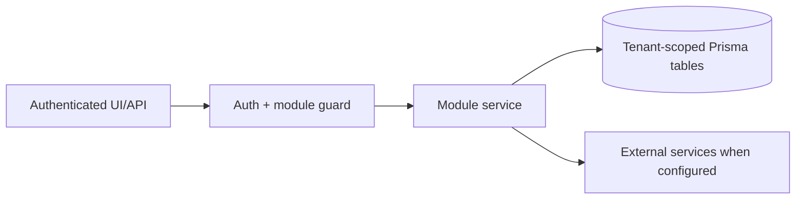

# Shipment documents and Garland Teamship review: Failure Modes

> Evidence status: Confirmed from code for file locations and schema references; business workflow details not explicitly encoded are marked Requires employee confirmation.

## Purpose and status

Shipment documents and Garland Teamship review is documented because code, routes, schema, or tests were located. Main evidence: `src/app/(authenticated)/shipment-documents/*`, `src/modules/shipment-documents/*`, Teamship and Garland models/tests.

## Workflow / rules summary

- Entry points are protected authenticated pages and/or API routes for this module.
- Server-side pages and mutating APIs should validate tenant context and module entitlement before data access.
- Data persistence uses tenant-scoped Prisma models where a database model exists.
- External calls use `src/server/integrations/*` or module-specific integration helpers. Secret values are not documented here.
- Approval, printing, posting, and live external writes require human approval unless a code path explicitly enforces a safe dry-run.
- Printing stops for changed pallet counts, a missing or duplicated exact printer, a changed selection, unavailable CUPS queue, invalid PDF download, expired approval, worker timeout, page/scope mismatch, or partial failure. No uncertain job is retried automatically; physical output must be checked first.
- A batch releases only one child job at a time. Failure or expiry of the active child marks every waiting child blocked and changes the batch to `PARTIAL_FAILED`. Completed children stay completed; blocked children are not retried and must be included in a newly approved plan only after physical output is checked.
- Batch plan creation re-resolves each saved PS/SR pair and verifies its saved Teamship internal page ID before using the separate display shipping-order number. If the identities do not resolve to one exact order, that row is excluded before approval; a Teamship internal page ID is never treated as the display order number.
- Printing API routes remain outside session-cookie middleware so their dedicated OpenClaw and worker tokens are validated by the route handlers. The worker treats a login redirect as an authentication failure and never follows it.
- Carrier-manifest attachments reject empty files, non-PDF contents, files larger than 20 MB, incomplete or out-of-order chunks, missing/deleted runs, and run or attachment identifiers outside the authenticated tenant. Incomplete uploads remain hidden from saved-run history and downloads.
- Garland email attachment processing is bounded. Normal scheduled runs process newly received `PDF_METADATA_READY` files first and exclude `PDF_PARSE_FAILED` files so permanent failures cannot starve later orders. Retrying a failed PDF is a separate explicit operator action.
- A newly parsed batch with zero Teamship matches and all PDF orders missing is treated as a bounded timing-race candidate, not an immediate final failure. Scheduler cycles wait at least 15 minutes between attempts and stop after three retries. Any partial Teamship match bypasses this retry path and is finalized for CSR review.
- The Teamship update worker classifies terminal failures as worker preflight, Teamship login, Teamship API, editable-BOL cleanup, or unknown. Sanitized top-level errors are stored on the job and copied to orders that returned no evidence, so the UI and CSR report expose the actionable cause.
- Teamship login retries once only for a transient network error, HTTP 429, or HTTP 5xx response. It does not retry rejected credentials, missing tokens, order updates, or uncertain browser work.
- A batch-level failure after recorded order updates preserves the successful per-order evidence, triggers a read-only verification scan, and leaves the batch in `NEEDS_REVIEW`. Successful Teamship writes are never replayed automatically.

## Data model

Relevant tables and enums are in `prisma/schema.prisma`. Operationally important fields include primary `id`, `tenantId` where present, status enums, foreign keys to tenant/user/module, timestamps, metadata JSON, and unique/index constraints declared in Prisma.

## Permissions

Roles and defaults are in `src/server/auth/role-policy.ts`. Runtime checks are in `src/server/auth/authorization.ts`; gaps should be treated as requiring code review before enabling production writes.

## Failure modes

Expected failures include missing tenant entitlement, read-only mutation attempts, validation errors, missing integration credentials, duplicate records, empty parser results, external API errors, timeouts, and partial job completion. Recovery should use module UI review screens, audit/job records, and documented dry-run scripts before live writes.

## Testing

Relevant tests are under `tests/` and generally named after the module. Recommended checks: `npm test`, `npm run lint`, `npm run typecheck`, and targeted route/service tests. Live integration scripts must not be run without explicit approval and safe credentials.

## Source map

| Responsibility | Main files | Supporting files | Tests |
|---|---|---|---|
| UI and routes | See evidence paths above | `src/components/app-shell.tsx` | module-named tests under `tests/` |
| Services/actions/queries | `src/modules/shipment*` or evidence paths above | `src/server/*` | module-named tests |
| Schema | `prisma/schema.prisma` | `prisma/migrations/*` | schema-dependent unit tests |

## Open questions

- Which status values map to employee-approved business language? Requires employee confirmation.
- Which write actions should require two-person approval? Requires owner confirmation.
- Which external integration credentials should be moved from env fallback to tenant-scoped settings first? Requires owner confirmation.
