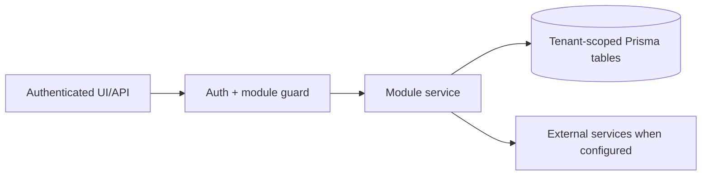

# Shipment documents and Garland Teamship review: Integrations

> Evidence status: Confirmed from code for file locations and schema references; business workflow details not explicitly encoded are marked Requires employee confirmation.

## Purpose and status

Shipment documents and Garland Teamship review is documented because code, routes, schema, or tests were located. Main evidence: `src/app/(authenticated)/shipment-documents/*`, `src/modules/shipment-documents/*`, Teamship and Garland models/tests.

## Workflow / rules summary

- Entry points are protected authenticated pages and/or API routes for this module.
- Server-side pages and mutating APIs should validate tenant context and module entitlement before data access.
- Data persistence uses tenant-scoped Prisma models where a database model exists.
- External calls use `src/server/integrations/*` or module-specific integration helpers. Secret values are not documented here.
- Approval, printing, posting, and live external writes require human approval unless a code path explicitly enforces a safe dry-run.
- The `newl-print` OpenClaw plugin creates and approves print jobs through Newl Apps. A dedicated local worker uses Teamship for BOL and outbound-label submission and CUPS for the picking list; neither OpenClaw nor the model receives Teamship credentials or printer access.

## Teams and OpenClaw Phase 1

- Machine routes under `/api/assistant/garland` use an OpenClaw bearer token plus trusted Microsoft Teams tenant/object headers. Newl Apps resolves those Entra claims to an existing user and tenant membership before any data access.
- Garland routes require `OPENCLAW_ASSISTANT_TOKEN`, and Newl Apps rejects configurations where its value matches `OPENCLAW_TEAMSHIP_READ_TOKEN`. The existing Teamship reader retains its separate read-only credential and authority.
- The model never supplies an attachment path. The plugin captures media from the trusted `message_received` hook, keys it to the current session and sender for ten minutes, and uploads only PDF files from that capture.
- The plugin requires the employee's exact PS or SR as `targetReference` when upload storage is created. The normalized target participates in retry idempotency and is stored with the artifact before parsing. Newl Apps filters the parsed PDF before the Teamship integration is called; a missing target, an unmatched target, or a repeated SR stops without a Teamship request.
- PDFs are limited to 20 MB and sent as 3 MB chunks. Each chunk and final file have SHA-256 integrity checks. A tenant-scoped source key makes retrying the same Teams message, PDF, and target reference idempotent. This stays below Vercel's per-request body limit while keeping object-storage migration possible later.
- Artifact creation and review outcomes, employee feedback lifecycle changes, approved lessons, and development-suggestion decisions create tenant-scoped audit records.
- Binary storage is PostgreSQL `BYTEA` through Prisma/Postgres in Phase 1. Production migration and retention-policy changes still require explicit approval.

## Data model

Relevant tables and enums are in `prisma/schema.prisma`. Operationally important fields include primary `id`, `tenantId` where present, status enums, foreign keys to tenant/user/module, timestamps, metadata JSON, and unique/index constraints declared in Prisma.

## Permissions

Roles and defaults are in `src/server/auth/role-policy.ts`. Runtime checks are in `src/server/auth/authorization.ts`; gaps should be treated as requiring code review before enabling production writes.

## Failure modes

Expected failures include missing tenant entitlement, read-only mutation attempts, validation errors, missing integration credentials, duplicate records, empty parser results, external API errors, timeouts, and partial job completion. Recovery should use module UI review screens, audit/job records, and documented dry-run scripts before live writes.

## Testing

Relevant tests are under `tests/` and generally named after the module. Recommended checks: `npm test`, `npm run lint`, `npm run typecheck`, and targeted route/service tests. Live integration scripts must not be run without explicit approval and safe credentials.

## Source map

| Responsibility | Main files | Supporting files | Tests |
|---|---|---|---|
| UI and routes | See evidence paths above | `src/components/app-shell.tsx` | module-named tests under `tests/` |
| Services/actions/queries | `src/modules/shipment*` or evidence paths above | `src/server/*` | module-named tests |
| Schema | `prisma/schema.prisma` | `prisma/migrations/*` | schema-dependent unit tests |

## Open questions

- Which status values map to employee-approved business language? Requires employee confirmation.
- Which write actions should require two-person approval? Requires owner confirmation.
- Which external integration credentials should be moved from env fallback to tenant-scoped settings first? Requires owner confirmation.
