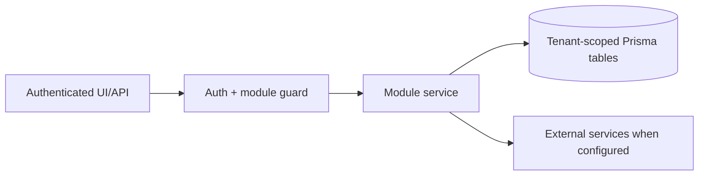

# Shipment documents and Garland Teamship review: Overview

> Evidence status: Confirmed from code for file locations and schema references; business workflow details not explicitly encoded are marked Requires employee confirmation.

## Purpose and status

Shipment documents and Garland Teamship review is documented because code, routes, schema, or tests were located. Main evidence: `src/app/(authenticated)/shipment-documents/*`, `src/modules/shipment-documents/*`, Teamship and Garland models/tests.

## Workflow / rules summary

- Entry points are protected authenticated pages and/or API routes for this module.
- Server-side pages and mutating APIs should validate tenant context and module entitlement before data access.
- Data persistence uses tenant-scoped Prisma models where a database model exists.
- External calls use `src/server/integrations/*` or module-specific integration helpers. Secret values are not documented here.
- Approval, printing, posting, and live external writes require human approval unless a code path explicitly enforces a safe dry-run.
- Garland carrier manifests support Midland, Speedy, Suretrack, Clarke, and Guilbault Transport. The printed `GUILBAULT TRANSPORT` value is normalized to the internal `GUILBAULT` carrier key and displayed as Guilbault Transport. Each detected carrier receives its own editable Excel workbook and saved-history download.

## Data model

Relevant tables and enums are in `prisma/schema.prisma`. Operationally important fields include primary `id`, `tenantId` where present, status enums, foreign keys to tenant/user/module, timestamps, metadata JSON, and unique/index constraints declared in Prisma.

## Permissions

Roles and defaults are in `src/server/auth/role-policy.ts`. Runtime checks are in `src/server/auth/authorization.ts`; gaps should be treated as requiring code review before enabling production writes.

## Failure modes

Expected failures include missing tenant entitlement, read-only mutation attempts, validation errors, missing integration credentials, duplicate records, empty parser results, external API errors, timeouts, and partial job completion. Recovery should use module UI review screens, audit/job records, and documented dry-run scripts before live writes.

For Garland Phase 2 jobs, a successful Teamship API update and its later editable-BOL cleanup are separate outcomes. The BOL cleanup worker may restart a closed Chrome session once and retry the interrupted order because clearing an already-empty generated weight field is idempotent. If the replacement browser also closes, the worker stops the cleanup batch, records the interrupted order as failed, records later orders as skipped because of the shared browser incident, and does not replay the successful API updates. A new production cleanup attempt still requires an explicit human-approved job or operational action.

## Testing

Relevant tests are under `tests/` and generally named after the module. Recommended checks: `npm test`, `npm run lint`, `npm run typecheck`, and targeted route/service tests. Live integration scripts must not be run without explicit approval and safe credentials.

## Source map

| Responsibility | Main files | Supporting files | Tests |
|---|---|---|---|
| UI and routes | See evidence paths above | `src/components/app-shell.tsx` | module-named tests under `tests/` |
| Services/actions/queries | `src/modules/shipment*` or evidence paths above | `src/server/*` | module-named tests |
| Schema | `prisma/schema.prisma` | `prisma/migrations/*` | schema-dependent unit tests |

## Open questions

- Which status values map to employee-approved business language? Requires employee confirmation.
- Which write actions should require two-person approval? Requires owner confirmation.
- Which external integration credentials should be moved from env fallback to tenant-scoped settings first? Requires owner confirmation.
