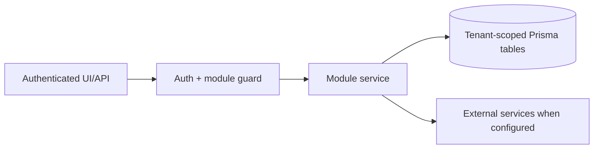

# Shipment documents and Garland Teamship review: Testing

> Evidence status: Confirmed from code for file locations and schema references; business workflow details not explicitly encoded are marked Requires employee confirmation.

## Purpose and status

Shipment documents and Garland Teamship review is documented because code, routes, schema, or tests were located. Main evidence: `src/app/(authenticated)/shipment-documents/*`, `src/modules/shipment-documents/*`, Teamship and Garland models/tests.

## Workflow / rules summary

- Entry points are protected authenticated pages and/or API routes for this module.
- Server-side pages and mutating APIs should validate tenant context and module entitlement before data access.
- Data persistence uses tenant-scoped Prisma models where a database model exists.
- External calls use `src/server/integrations/*` or module-specific integration helpers. Secret values are not documented here.
- Approval, printing, posting, and live external writes require human approval unless a code path explicitly enforces a safe dry-run.
- Printing regression tests cover tenant and identity binding, dedicated credentials, exact numeric order input, Garland/Annagem restriction, pallet-quantity summation, corrected `BIXOLON SRP-770III` selection, same-user confirmation, plugin routing, and no-retry failure reporting. Live printer validation requires a separately approved supervised production test.
- Carrier-manifest attachment regression tests cover repeated chunked PDF uploads, PDF signature and size validation, tenant-scoped creation and download, incomplete-upload hiding, and combined history for legacy signed copies plus newer attachments.
- Carrier-manifest carrier tests recognize the printed `CLARKE` and `GUILBAULT TRANSPORT` carrier values, generate the same editable workbook layout, store separate carrier bytes and counts, and enforce tenant-scoped history and downloads for both carriers.
- Carrier-manifest workbook tests require blank **Driver's time in** and **Driver's time out** cells on every generated shipment row while preserving the one-page landscape layout.
- Operational-feedback regression tests cover tenant-scoped full-message review, conditional issue fields, rejection of identical order decisions, exact PS/SR evidence linking, hash-verified retrieval and caching of the original saved-email PDF, confirmed-only development grouping, specific-family precedence over generic false mismatches, and delivery of approval comments in Rivet's immutable packet.
- Rivet evidence tests require a tenant-scoped active lease, verify artifact hashes, and confirm that a source PDF is reduced to only the approved Garland review pages before the worker receives it. Worker tests also block evidence files from Git changes.
- Teamship update-worker regression tests cover a single retry for transient login failures, no retry for rejected credentials, safe failure-message redaction, explicit failure-stage reporting, preservation of successful order evidence after a later batch failure, and exact CSR reporting instead of a generic incomplete-attempt message.
- Rivet queue tests confirm that a later approved Garland suggestion waits behind active or review-blocked Garland work and is claimed automatically only after that workflow scope clears.
- Garland email automation tests distinguish completely missed batches from partial matches, preserve the retry timer across mailbox rescans, defer each complete miss for 5 minutes, and finalize after the twelfth retry. Saved-review recovery tests require an all-missing zero-match batch, preserve tenant-scoped exact PS/SR references, refresh only Newl Apps review evidence, and reject the action for partial or completed comparisons.
- Microsoft Graph mail regression tests retry transient attachment metadata and raw-download failures, recover within the three-attempt bound, and do not retry permanent authorization failures.
- Graph diagnostic tests require a Microsoft request ID and hashed resource fingerprint for recovered reads and durable correlation evidence when all three attempts fail, without any Teams notification path.

## Data model

Relevant tables and enums are in `prisma/schema.prisma`. Operationally important fields include primary `id`, `tenantId` where present, status enums, foreign keys to tenant/user/module, timestamps, metadata JSON, and unique/index constraints declared in Prisma.

## Permissions

Roles and defaults are in `src/server/auth/role-policy.ts`. Runtime checks are in `src/server/auth/authorization.ts`; gaps should be treated as requiring code review before enabling production writes.

## Failure modes

Expected failures include missing tenant entitlement, read-only mutation attempts, validation errors, missing integration credentials, duplicate records, empty parser results, external API errors, timeouts, and partial job completion. Recovery should use module UI review screens, audit/job records, and documented dry-run scripts before live writes.

## Testing

Relevant tests are under `tests/` and generally named after the module. Recommended checks: `npm test`, `npm run lint`, `npm run typecheck`, and targeted route/service tests. Live integration scripts must not be run without explicit approval and safe credentials.

## Source map

| Responsibility | Main files | Supporting files | Tests |
|---|---|---|---|
| UI and routes | See evidence paths above | `src/components/app-shell.tsx` | module-named tests under `tests/` |
| Services/actions/queries | `src/modules/shipment*` or evidence paths above | `src/server/*` | module-named tests |
| Schema | `prisma/schema.prisma` | `prisma/migrations/*` | schema-dependent unit tests |

## Open questions

- Which status values map to employee-approved business language? Requires employee confirmation.
- Which write actions should require two-person approval? Requires owner confirmation.
- Which external integration credentials should be moved from env fallback to tenant-scoped settings first? Requires owner confirmation.
