# Shipment documents and Garland Teamship review: Workflow

> Evidence status: Confirmed from code for file locations and schema references; business workflow details not explicitly encoded are marked Requires employee confirmation.

## Purpose and status

Shipment documents and Garland Teamship review is documented because code, routes, schema, or tests were located. Main evidence: `src/app/(authenticated)/shipment-documents/*`, `src/modules/shipment-documents/*`, Teamship and Garland models/tests.

## Workflow / rules summary

- Entry points are protected authenticated pages and/or API routes for this module.
- Server-side pages and mutating APIs should validate tenant context and module entitlement before data access.
- Data persistence uses tenant-scoped Prisma models where a database model exists.
- External calls use `src/server/integrations/*` or module-specific integration helpers. Secret values are not documented here.
- Approval, printing, posting, and live external writes require human approval unless a code path explicitly enforces a safe dry-run.
- A Garland PDF attached through authenticated Teams is captured only from the trusted OpenClaw session, uploaded to Newl Apps in hashed chunks, parsed server-side, compared with a fresh read-only Teamship fetch, and saved as a normal `TeamshipReviewRun`.
- Phase 1 does not update Teamship or print. Existing update and print paths retain their separate approval requirements.
- CSRs can ask why the latest saved PS/SR check failed. The explanation uses the saved deterministic per-field comparison and may additionally show active admin-approved lessons.
- CSRs can report that a result should have passed or failed. The report is not treated as true until reviewed.

## Data model

Relevant tables and enums are in `prisma/schema.prisma`. Operationally important fields include primary `id`, `tenantId` where present, status enums, foreign keys to tenant/user/module, timestamps, metadata JSON, and unique/index constraints declared in Prisma.

```mermaid
flowchart LR
  Teams[Teams PDF or question] --> OpenClaw[Identity-bound OpenClaw tool]
  OpenClaw --> Auth[Newl auth + tenant + module guard]
  Auth --> Artifact[(Hashed PDF chunks)]
  Artifact --> Parse[Deterministic Garland parser]
  Parse --> Read[Read-only Teamship fetch]
  Read --> Review[(Saved review + field evidence)]
  Review --> Explain[Why did it fail?]
  Explain --> Feedback[(Reported employee feedback)]
  Feedback --> Approval[Admin confirmation]
  Approval --> Memory[(Approved operational lesson)]
```

## Permissions

Roles and defaults are in `src/server/auth/role-policy.ts`. Runtime checks are in `src/server/auth/authorization.ts`; gaps should be treated as requiring code review before enabling production writes.

## Failure modes

Expected failures include missing tenant entitlement, read-only mutation attempts, validation errors, missing integration credentials, duplicate records, empty parser results, external API errors, timeouts, and partial job completion. Recovery should use module UI review screens, audit/job records, and documented dry-run scripts before live writes.

## Testing

Relevant tests are under `tests/` and generally named after the module. Recommended checks: `npm test`, `npm run lint`, `npm run typecheck`, and targeted route/service tests. Live integration scripts must not be run without explicit approval and safe credentials.

## Source map

| Responsibility | Main files | Supporting files | Tests |
|---|---|---|---|
| UI and routes | See evidence paths above | `src/components/app-shell.tsx` | module-named tests under `tests/` |
| Services/actions/queries | `src/modules/shipment*` or evidence paths above | `src/server/*` | module-named tests |
| Schema | `prisma/schema.prisma` | `prisma/migrations/*` | schema-dependent unit tests |

## Open questions

- Which status values map to employee-approved business language? Requires employee confirmation.
- Which write actions should require two-person approval? Requires owner confirmation.
- Which external integration credentials should be moved from env fallback to tenant-scoped settings first? Requires owner confirmation.
- When no shipment date is supplied, the review uses a single unambiguous date found in the PDF or Teamship. If none or several are found, Nemo asks for `YYYY-MM-DD`; it never silently records today's date for an older order.
- How long should original Teams PDF artifacts be retained? Phase 1 retains them until a tenant retention policy is approved.
