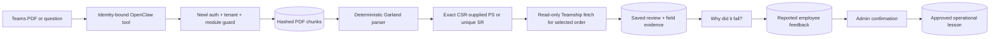

# Shipment documents and Garland Teamship review: Workflow

> Evidence status: Confirmed from code for file locations and schema references; business workflow details not explicitly encoded are marked Requires employee confirmation.

## Purpose and status

Shipment documents and Garland Teamship review is documented because code, routes, schema, or tests were located. Main evidence: `src/app/(authenticated)/shipment-documents/*`, `src/modules/shipment-documents/*`, Teamship and Garland models/tests.

## Workflow / rules summary

- Entry points are protected authenticated pages and/or API routes for this module.
- Server-side pages and mutating APIs should validate tenant context and module entitlement before data access.
- Data persistence uses tenant-scoped Prisma models where a database model exists.
- External calls use `src/server/integrations/*` or module-specific integration helpers. Secret values are not documented here.
- Approval, printing, posting, and live external writes require human approval unless a code path explicitly enforces a safe dry-run.
- Carrier-manifest OCR treats `CLARKE`, `GUILBAULT TRANSPORT`, and `ROSEDALE` as target carrier-box values alongside Midland, Speedy, and Suretrack. `GUILBAULT TRANSPORT` is normalized to `GUILBAULT`, while `ROSEDALE` is normalized to `ROSEDALE`. The employee receives one separate workbook per detected carrier containing the same SR, PS, city/province, pallet-count, total, time-in/time-out, and signature layout.
- The shared workbook layout adds blank **Driver's time in** and **Driver's time out** columns to every shipment row for all supported carriers.
- Saving a carrier-manifest run stores the Clarke, Guilbault Transport, and Rosedale workbooks separately and exposes them through tenant-scoped history and download routes.
- Single-order Teamship printing uses a separate plan and approval message from the same employee. The worker claims an immutable job once, preflights all printers and the live pallet count, and never retries uncertain work.
- Supervised batch printing starts only from a saved Garland review run. The employee selects exact PS rows, prepares a live preflight plan, reviews per-order and total document counts, and approves once. Newl Apps releases one immutable child print job at a time and stops the remaining batch after the first failure or uncertain result.
- A passed review must be `READY_TO_PRINT`. A failed review remains historically failed but can be included after an explicit, audited employee confirmation that Teamship was corrected. The confirmation never bypasses the live Teamship and printer preflight.
- A Garland PDF attached through authenticated Teams is captured only from the trusted OpenClaw session, uploaded to Newl Apps in hashed chunks, and parsed server-side. The CSR must name the exact PS or SR to review. Newl Apps filters to that order before a fresh read-only Teamship fetch and saves only that selected comparison as a normal `TeamshipReviewRun`.
- PS is preferred because SR can repeat. A missing reference, a reference absent from the PDF, or an SR that matches multiple PDF orders stops without a Teamship query. Newl Apps never guesses or silently checks the remaining orders.
- Phase 1 does not update Teamship or print. Existing update and print paths retain their separate approval requirements.
- Scheduled Garland processing retries only a completely missed batch: the PDF must contain at least one order, every PDF order must be missing from Teamship, and the matched count must be zero. The attachment remains pending for 5 minutes and can be retried up to twelve times, providing a 60-minute Teamship-ingestion window. A partial match is finalized immediately so genuinely missing orders are not hidden or repeatedly queried.
- Scheduled intake retries read-only Microsoft Graph attachment metadata and PDF downloads up to three total attempts for HTTP 408, 429, 5xx, timeout, and transient transport failures. Permanent authorization and not-found responses fail immediately. This retry happens before Garland parsing and never repeats a Teamship write.
- **Scan now** refreshes Email Intake but does not itself run a saved PDF through Teamship review. For missed processor work, **Run Teamship review** accepts only the exact ready or retry-pending PDF identifiers from one displayed tenant batch, revalidates its PS range, requires an explicit confirmation, and records request/outcome audits. It uses the existing deterministic Garland review automation, which may create and approve the supported live Teamship cleanup job; it never prints.
- Targeted Garland PS/SR retrieval first uses Teamship's authenticated **Open** dashboard search, restricted server-side to Garland rows, and then applies exact PS/SR matching. Newl Apps mirrors Teamship's Syncfusion request contract by sending a JSON `POST` body and caps each dashboard page at 100 rows. The dashboard call uses the CSRF token and cookies refreshed from an authenticated shipping-order page after login, not the pre-login form token. This prevents automatic review from walking more than 21,000 unrelated active rows and reaching its execution limit. The former active API scan is retained only when the dashboard request fails and is capped at 1,000 rows. During an explicit saved-batch **Recheck Teamship**, if an exact pair is still missing, the read-only lookup also scans Teamship's signed-in **Complete** archive so the recheck can find an order after warehouse staff physically pick and complete it. Normal automatic review never consults Complete, and every lookup stops as soon as all exact pairs are confirmed.
- A saved zero-match batch exposes **Recheck Teamship**. This tenant-scoped recovery action rereads only the exact PS/SR references stored with that PDF, refreshes the saved comparison and unstarted workflow statuses, and does not create a Teamship update job, change Teamship, print, or resend email. The action is unavailable for partial or completed comparisons so it cannot overwrite ordinary review edits.
- Exact targeted rereads prefer Teamship's canonical PS and SR fields. When those fields are absent from a list row, the read-only matcher may also inspect bounded reference/order/shipment metadata for exact `PS######` or `SR######` tokens. It does not use partial numbers or unrelated instructions and still prefers PS because one SR can belong to multiple PS orders.
- CSRs can ask why the latest saved PS/SR check failed. The explanation uses the saved deterministic per-field comparison and may additionally show active admin-approved lessons.
- CSRs can report that a result should have passed or failed. The report is not treated as true until reviewed.
- Administrators can expand the complete report and select the issue type. Incorrect order decisions use original/correct decision fields. Incorrect or missing Teamship updates use affected-field and actual/correct-value fields and require the exact saved PS/SR review plus source PDF or supporting screenshot before confirmation. When the review came from a saved Garland email, Newl Apps automatically retrieves the original attachment from Microsoft Graph, verifies its stored hash, and caches it as the review artifact; the employee does not need to re-attach that PDF.
- After confirmation and a queue refresh, the grouped `AWAITING_APPROVAL` card exposes **Your instructions for Rivet**. These comments and the exact evidence manifest are frozen into the approved packet. Only confirmed reports enter development grouping. If another Garland Rivet job is already active or review-blocked, approval is still saved and displayed as **APPROVED — WAITING FOR RIVET**. It starts automatically only after the earlier Garland job finishes or is resolved.
- A saved Garland carrier-manifest run can retain multiple completed PDF attachments. Employees can add another PDF after the first signed/completed copy has been uploaded; older single signed-copy files remain available alongside newer attachments.
- Saved Garland review totals are comparison results, not proof that the update worker completed. Bot drafts and run history separately show Teamship update evidence, editable-BOL cleanup, verification time, failure stage, and the sanitized exact error.
- The worker performs one login-only retry for transient Teamship login errors. If later processing fails, Newl Apps keeps completed order evidence and read-only rescans any batch that contains a recorded update; it does not automatically repeat Teamship writes.

## Data model

Relevant tables and enums are in `prisma/schema.prisma`. Operationally important fields include primary `id`, `tenantId` where present, status enums, foreign keys to tenant/user/module, timestamps, metadata JSON, and unique/index constraints declared in Prisma.

```mermaid
flowchart LR
  Teams[Teams PDF or question] --> OpenClaw[Identity-bound OpenClaw tool]
  OpenClaw --> Auth[Newl auth + tenant + module guard]
  Auth --> Artifact[(Hashed PDF chunks)]
  Artifact --> Parse[Deterministic Garland parser]
  Parse --> Select[Exact CSR-supplied PS or unique SR]
  Select --> Read[Read-only Teamship fetch for selected order]
  Read --> Review[(Saved review + field evidence)]
  Review --> Explain[Why did it fail?]
  Explain --> Feedback[(Reported employee feedback)]
  Feedback --> Approval[Admin confirmation]
  Approval --> Memory[(Approved operational lesson)]
```

## Permissions

Roles and defaults are in `src/server/auth/role-policy.ts`. Runtime checks are in `src/server/auth/authorization.ts`; gaps should be treated as requiring code review before enabling production writes.

## Failure modes

Expected failures include missing tenant entitlement, read-only mutation attempts, validation errors, missing integration credentials, duplicate records, empty parser results, external API errors, timeouts, and partial job completion. Recovery should use module UI review screens, audit/job records, and documented dry-run scripts before live writes.

## Testing

Relevant tests are under `tests/` and generally named after the module. Recommended checks: `npm test`, `npm run lint`, `npm run typecheck`, and targeted route/service tests. Live integration scripts must not be run without explicit approval and safe credentials.

## Source map

| Responsibility | Main files | Supporting files | Tests |
|---|---|---|---|
| UI and routes | See evidence paths above | `src/components/app-shell.tsx` | module-named tests under `tests/` |
| Services/actions/queries | `src/modules/shipment*` or evidence paths above | `src/server/*` | module-named tests |
| Schema | `prisma/schema.prisma` | `prisma/migrations/*` | schema-dependent unit tests |

## Open questions

- Which status values map to employee-approved business language? Requires employee confirmation.
- Which write actions should require two-person approval? Requires owner confirmation.
- Which external integration credentials should be moved from env fallback to tenant-scoped settings first? Requires owner confirmation.
- When no shipment date is supplied, the review uses a single unambiguous date found in the PDF or Teamship. If none or several are found, Nemo asks for `YYYY-MM-DD`; it never silently records today's date for an older order.
- How long should original Teams PDF artifacts be retained? Phase 1 retains them until a tenant retention policy is approved.
