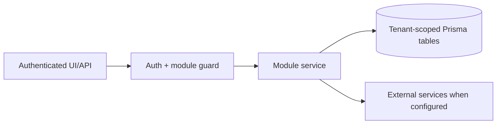

# Website growth and SEO: Data Model

> Evidence status: Confirmed from code for file locations and schema references; business workflow details not explicitly encoded are marked Requires employee confirmation.

## Purpose and status

Website growth and SEO is documented because code, routes, schema, or tests were located. Main evidence: `src/app/(authenticated)/website-growth/*`, `src/modules/website-growth/*`, website growth Prisma models/tests.

## Workflow / rules summary

- Entry points are protected authenticated pages and/or API routes for this module.
- Server-side pages and mutating APIs should validate tenant context and module entitlement before data access.
- Data persistence uses tenant-scoped Prisma models where a database model exists.
- External calls use `src/server/integrations/*` or module-specific integration helpers. Secret values are not documented here.
- Approval, printing, posting, and live external writes require human approval unless a code path explicitly enforces a safe dry-run.

## Data model

Relevant tables and enums are in `prisma/schema.prisma`. Operationally important fields include primary `id`, `tenantId` where present, status enums, foreign keys to tenant/user/module, timestamps, metadata JSON, and unique/index constraints declared in Prisma.

SEMrush cache metadata lives in tenant-scoped `WebsiteGrowthDataImport` records. Live MCP tracking records use `runType: semrush_keyword_tracking_report`. Scheduled email records use `runType: semrush_scheduled_email_report` plus `reportType`, `observedAt`, `contentHash`, sanitized `metrics`/`excerpt`, and explicit `rawEmailStored: false` / `attachmentStored: false` flags. Import errors are bounded `ERROR` records and do not stop Scout. `WebsiteGrowthMetric` remains the historical full-keyword metric ledger; PDF summaries do not create partial keyword-history rows or erase the last complete tracked-keyword snapshot.

`WebsiteGrowthBacklinkOpportunity` is the curated backlink system of record. It stores one tenant-scoped prospect per deterministic referring-domain/target-page dedupe key, human/executor lifecycle status, category, source and target URLs, quality signals, approved public outreach angle, cost flag, and verification timestamps. It does not store raw Semrush backlink rows. `REJECTED` and `ARCHIVED` records are hidden from the default workspace but retain the prior decision so Scout does not repeatedly propose them.

Raw public-web discovery is deliberately not another user-facing repository. Each tenant-scoped `WEBSITE_GROWTH_SCOUT_WEEKLY` `AutomationJobRun.output.backlinkDiscovery` record stores the bounded query plan, canonical URL hashes seen by that run, aggregate Qwen funnel counts, and at most 15 finalists. Individual rejected Qwen decisions are discarded after their counts are recorded; successful runs compact their URL ledger to hash, canonical URL, and domain. Before any page fetch, the ingest service compares a candidate hash with every prior tenant Scout run and every existing curated backlink source URL. This uses the existing automation ledger and requires no new production migration. The volume is bounded to 120 hashes per weekly run.

Successful outreach summaries are stored as tenant-scoped `AutomationJobRun` records with job type `WEBSITE_GROWTH_BACKLINK_OUTREACH`. Their sanitized output contains current-run and lifetime counts plus blocked opportunity IDs, categories, reasons, next actions, and retry guidance. Blocker categories are derived from the recorded reason at read time; no model-controlled status comparison is used.

For approved execution it also stores the public recipient, country, exact contact-source URL, consent basis, follow-up schedule, reply/opt-out state, and non-secret directory login metadata. `WebsiteGrowthOutreachMessage` is the tenant-scoped audit history for initial and follow-up messages and Microsoft conversation identifiers. `WebsiteGrowthOutreachSuppression` is the tenant-scoped do-not-contact list. Passwords and access tokens are not stored in these models.

Directory-account execution stores only an opaque credential reference/version and the lifecycle state (`NEEDS_ACCOUNT`, `CREDENTIAL_READY`, `EMAIL_VERIFICATION_PENDING`, `HUMAN_ACTION_REQUIRED`, `ACTIVE`, or `FAILED`). Challenge records contain a bounded category and sanitized explanation, never a CAPTCHA response, MFA code, password, magic link, or tokenized verification URL. The corresponding password is deterministically derived inside the local OpenClaw plugin from a protected master secret and is never persisted in Newl Apps.

## Permissions

Roles and defaults are in `src/server/auth/role-policy.ts`. Runtime checks are in `src/server/auth/authorization.ts`; gaps should be treated as requiring code review before enabling production writes.

## Failure modes

Expected failures include missing tenant entitlement, read-only mutation attempts, validation errors, missing integration credentials, duplicate records, empty parser results, external API errors, timeouts, and partial job completion. Recovery should use module UI review screens, audit/job records, and documented dry-run scripts before live writes.

## Testing

Relevant tests are under `tests/` and generally named after the module. Recommended checks: `npm test`, `npm run lint`, `npm run typecheck`, and targeted route/service tests. Live integration scripts must not be run without explicit approval and safe credentials.

## Source map

| Responsibility | Main files | Supporting files | Tests |
|---|---|---|---|
| UI and routes | See evidence paths above | `src/components/app-shell.tsx` | module-named tests under `tests/` |
| Services/actions/queries | `src/modules/website*` or evidence paths above | `src/server/*` | module-named tests |
| Schema | `prisma/schema.prisma` | `prisma/migrations/*` | schema-dependent unit tests |

## Open questions

- Which status values map to employee-approved business language? Requires employee confirmation.
- Which write actions should require two-person approval? Requires owner confirmation.
- Which external integration credentials should be moved from env fallback to tenant-scoped settings first? Requires owner confirmation.
