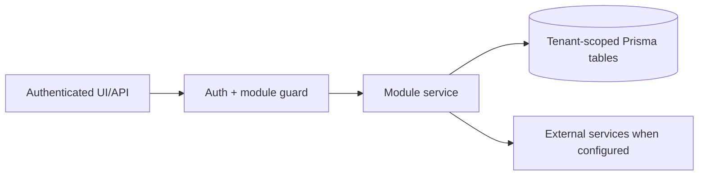

# Website growth and SEO: Failure Modes

> Evidence status: Confirmed from code for file locations and schema references; business workflow details not explicitly encoded are marked Requires employee confirmation.

## Purpose and status

Website growth and SEO is documented because code, routes, schema, or tests were located. Main evidence: `src/app/(authenticated)/website-growth/*`, `src/modules/website-growth/*`, website growth Prisma models/tests.

## Scout-specific failures

- Missing Google credentials: that source receives an error import, but other first-party sources continue.
- Missing or expired SEMrush OAuth: the worker stops and marks the Scout job failed; it never silently generates a scheduled slate without SEMrush.
- Codex output outside the stored candidate IDs: completion is rejected.
- Malformed or oversized SEMrush output: completion is rejected; at most 200 sanitized rows are accepted.
- Duplicate worker start: an active tenant run blocks a second run for three hours.
- Teams delivery failure after drafts are saved: the command job fails and the links remain available in Newl Apps; an operator may resend after fixing Teams.
- No candidates: the job succeeds without a Teams review request.
- No backlink prospects: the job succeeds and the Teams summary explicitly reports zero new prospects.
- Raw or oversized backlink output: completion is rejected; Scout may return at most 15 curated prospects and never raw backlink rows.
- Duplicate or weak backlink prospect: Newl Apps refreshes the existing record or drops it through deterministic quality gates instead of adding another queue item.
- Backlink queue growth: no new item is created after the 50-active-item cap; stale unrefreshed review items are archived after 45 days.
- Missing backlink-executor token: discovery and approval continue, but approved work is not claimable.
- CAPTCHA, MFA, payment, legal terms, missing public business facts, or access-control challenge: the executor reports `BLOCKED`; it must not bypass the control.
- Paid placement: remains visible for a separate owner decision and is excluded from machine claims.
- Missing or incomplete public identity: the send is refused before the database or Microsoft Graph is changed.
- Missing Microsoft Graph mail permission or mailbox scope: the opportunity is marked `BLOCKED` and the dedicated mailbox must be checked before retrying, preventing an uncertain send from becoming a duplicate.
- Suppressed recipient, invalid public contact source, unsupported country, Canadian recipient with a US-only basis, or reached volume limit: the send is refused.
- Reply sync failure: no follow-up state is advanced. The next run retries the mailbox read.
- Opt-out: the opportunity becomes `LOST`, the next follow-up is cancelled, and the normalized email is added to the tenant suppression list.
- Expired executor claim: the item becomes `BLOCKED` instead of being silently reclaimed, because a prior external submission may have partially completed.

## Developer comparison failures

- Missing Kimi API key: the Kimi shadow job is skipped and the primary Codex build continues.
- Kimi agent, lint, or production-build failure: no Kimi branch or PR is created; the GitHub Actions summary records a warning and Codex continues.
- Kimi PR handoff failure: the verified shadow patch is not treated as the primary build and cannot overwrite Newl Apps status.
- Codex build or PR handoff failure: Newl Apps records the existing primary failure callback; a Kimi result is not promoted automatically.
- Either Vercel Preview failure: production remains unchanged and the owner does not merge until the intended preview passes visual review.

## Workflow / rules summary

- Entry points are protected authenticated pages and/or API routes for this module.
- Server-side pages and mutating APIs should validate tenant context and module entitlement before data access.
- Data persistence uses tenant-scoped Prisma models where a database model exists.
- External calls use `src/server/integrations/*` or module-specific integration helpers. Secret values are not documented here.
- Approval, printing, posting, and live external writes require human approval unless a code path explicitly enforces a safe dry-run.

## Data model

Relevant tables and enums are in `prisma/schema.prisma`. Operationally important fields include primary `id`, `tenantId` where present, status enums, foreign keys to tenant/user/module, timestamps, metadata JSON, and unique/index constraints declared in Prisma.

## Permissions

Roles and defaults are in `src/server/auth/role-policy.ts`. Runtime checks are in `src/server/auth/authorization.ts`; gaps should be treated as requiring code review before enabling production writes.

## Failure modes

Expected failures include missing tenant entitlement, read-only mutation attempts, validation errors, missing integration credentials, duplicate records, empty parser results, external API errors, timeouts, and partial job completion. Recovery should use module UI review screens, audit/job records, and documented dry-run scripts before live writes.

## Testing

Relevant tests are under `tests/` and generally named after the module. Recommended checks: `npm test`, `npm run lint`, `npm run typecheck`, and targeted route/service tests. Live integration scripts must not be run without explicit approval and safe credentials.

## Source map

| Responsibility | Main files | Supporting files | Tests |
|---|---|---|---|
| UI and routes | See evidence paths above | `src/components/app-shell.tsx` | module-named tests under `tests/` |
| Services/actions/queries | `src/modules/website*` or evidence paths above | `src/server/*` | module-named tests |
| Schema | `prisma/schema.prisma` | `prisma/migrations/*` | schema-dependent unit tests |

## Open questions

- Which status values map to employee-approved business language? Requires employee confirmation.
- Which write actions should require two-person approval? Requires owner confirmation.
- Which external integration credentials should be moved from env fallback to tenant-scoped settings first? Requires owner confirmation.
