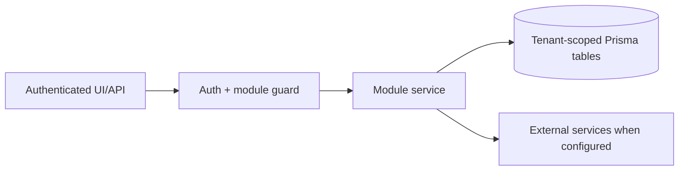

# Website growth and SEO: Failure Modes

> Evidence status: Confirmed from code for file locations and schema references; business workflow details not explicitly encoded are marked Requires employee confirmation.

## Purpose and status

Website growth and SEO is documented because code, routes, schema, or tests were located. Main evidence: `src/app/(authenticated)/website-growth/*`, `src/modules/website-growth/*`, website growth Prisma models/tests.

## Scout-specific failures

- Missing Google credentials: that source receives an error import, but other first-party sources continue.
- Missing or expired SEMrush OAuth, or exhausted API units: a Monday or Wednesday deep worker uses the exact fresh cache when available and otherwise records SEMrush as `UNAVAILABLE`. First-party evidence, Brave/Qwen backlink discovery, website review, Teams reporting, and page briefs continue.
- Codex output outside the stored candidate IDs: completion is rejected.
- Malformed or oversized SEMrush output: completion is rejected; at most 200 sanitized rows are accepted.
- Duplicate worker start: an active tenant run blocks a second run for three hours.
- Dedicated runtime update failure: the protected worktree remains unchanged, a safe Teams failure notice is attempted, and Scout does not start.
- Teams delivery failure after drafts are saved: the command job fails and the links remain available in Newl Apps; the safe failure notice is attempted through the same configured Teams target and may also fail when the channel itself is unavailable.
- Missing Scout executor tools or an incomplete required call sequence: the backlink wrapper still records and delivers the deterministic no-change summary, then exits non-zero. The Rivet failure monitor records the sanitized failure; the run can no longer appear successful after doing no work.
- Invalid or truncated local Qwen JSON: discovery processes no more than 30 candidates per local-model call and retries that same batch once. It does not repeat Brave Search, download additional pages, or perform outreach. A second invalid response fails the deep run and records the normal safe failure outcome.
- Build-notification delivery failure: the notification remains leased for 15 minutes and is then eligible for another deterministic claim. Build state remains authoritative in Newl Apps, GitHub, and Vercel; no build, merge, or deployment is retried by the notifier.
- Teams/OneDrive file consent rejects Allow: Website Growth reports no longer use that transport. The Teams summary contains a signed Newl Apps download link instead.
- Expired or modified Excel link: the download route returns no workbook. The next deep Scout report creates fresh seven-day links; changing the tenant, run, report name, expiry, or signature invalidates the link.
- Missing report signing secret: completion fails safely unless either `WEBSITE_GROWTH_REPORT_DOWNLOAD_SECRET` or the existing `OPENCLAW_WEBSITE_GROWTH_TOKEN` contains at least 32 characters.
- Duplicate trigger: the second run exits successfully after sending a Teams check-in; the active run remains authoritative.
- No candidates: the job still refreshes Position Tracking and backlink research, succeeds, and sends a Teams report without a page-approval request.
- No qualifying question candidates: the question/AI-answer lane reports zero and the remaining Scout workflow continues normally; it never creates a thin page to fill the lane.
- Question already answered well on an existing page: Scout may return no draft. Existing-page coverage is preferred over a duplicate guide.
- Missing Brave key or unavailable local Qwen: the deep run fails safely before Codex promotion and sends the normal failure notice. URL hashes already registered by ingest remain in the tenant job ledger.
- Repeated search result: canonical host/path/query normalization removes tracking parameters, and the historical tenant job ledger prevents another fetch or queue addition even if Brave returns the page for a different query or week.
- No backlink prospects: the job succeeds and the Teams summary explicitly reports zero new prospects.
- Raw or oversized backlink output: ingest rejects more than 120 search rows, Qwen is limited to 15 finalists, and Codex may promote at most five public-web prospects.
- Duplicate or weak backlink prospect: Newl Apps refreshes the existing record or drops it through deterministic quality gates instead of adding another queue item.
- Backlink queue growth: no new item is created after the 50-active-item cap; stale unrefreshed review items are archived after 45 days.
- Missing backlink-executor token: discovery and approval continue, but approved work is not claimable.
- CAPTCHA, MFA, payment, legal terms, missing public business facts, or access-control challenge: the executor reports `BLOCKED`; it must not bypass the control.
- Paid placement: remains visible for a separate owner decision and is excluded from machine claims.
- Missing or incomplete public identity: the send is refused before the database or Microsoft Graph is changed.
- Missing Microsoft Graph mail permission or mailbox scope: the opportunity is marked `BLOCKED` and the dedicated mailbox must be checked before retrying, preventing an uncertain send from becoming a duplicate.
- Suppressed recipient, invalid public contact source, an exact recipient address not visible on that approved public page, unsupported country, Canadian recipient with a US-only basis, or reached volume limit: the send is refused. Publisher-network corporate domains are allowed only when the exact address is independently verified on the approved referring organization's page.
- Reply sync failure: no follow-up state is advanced. The next run retries the mailbox read.
- A reply with a changed subject: when exactly one active opportunity uses that exact sender address, reply sync marks it `REPLIED`, labels the match for review, and cancels follow-ups. If multiple active opportunities share the sender, conversation ID or normalized subject is still required so one message cannot be assigned to the wrong opportunity.
- Opt-out: the opportunity becomes `LOST`, the next follow-up is cancelled, and the normalized email is added to the tenant suppression list.
- Expired executor claim: the item becomes `BLOCKED` instead of being silently reclaimed, because a prior external submission may have partially completed.
- A blocked item can return to the approved executor queue only through the Admin/Manager retry action, only when the original human approval remains recorded, and only after the reviewer confirms that no email or directory submission occurred. Newl Apps refuses the retry when it has a submitted/contacted timestamp or any Microsoft message/conversation ID. Failed pre-delivery drafts remain in the audit history, do not consume the outreach volume allowance, and do not prevent a confirmed retry. The retry clears the claim and records a tenant-scoped audit event.
- Every blocked executor report must include a specific reason. Newl Apps classifies it as Technical, Needs owner confirmation, Manual setup, or No contact method and shows the next action plus retry guidance. A summary uses the recorded run start to distinguish new blocks from the unresolved lifetime total. A legacy executor that has not yet been refreshed receives a bounded two-hour fallback so deployment order does not break Teams reporting.
- Directory form requires an account: use the dedicated partnerships mailbox and prefer magic-link, Microsoft sign-in, or publisher-managed password setup. CAPTCHA, MFA, phone verification, and passwords that cannot be stored through an approved password manager are Manual setup; Scout stops instead of bypassing or repeatedly retrying.
- Failed OpenClaw outreach run: the Rivet monitor records one tenant-scoped incident per source run. Code defects may create an approved, restricted Rivet development job when `WEBSITE_GROWTH_RIVET_AUTO_TRIAGE_APPROVAL` contains the exact owner-approved value. Rivet may open a draft PR but may not retry outreach, merge, deploy, change permissions, or communicate with a publisher.
- Failed or interrupted Scout work phase after a completed send: the deterministic wrapper still calls the tenant-scoped summary endpoint and sends the exact Newl Apps counts before it exits with an error. It never reruns the agent turn. Completed sends and submissions remain protected by Newl Apps status and external-history checks.
- Missing or mismatched model tool result: Scout has no shell or arbitrary file tools and therefore cannot inspect its own implementation. The deterministic wrapper reports the authoritative summary separately, retains the isolated Scout session key in the sanitized command error, and lets the failure monitor record the code defect without suppressing the normal summary.
- Missing owner-approved business profile: the bounded profile tool fails before outreach. Scout cannot fall back to reading files, environment variables, prompts, source code, or workspace memory.
- Authentication, mailbox-scope, permission, and uncertain-send failures: Rivet does not retry the action. Teams tells the owner what category requires attention.
- Repeated identical failure: the second occurrence within seven days triggers the circuit breaker and disables the weekday outreach schedule. A human reviews the failure or Rivet PR before re-enabling it.

## Developer comparison failures

- Missing Kimi API key: the Kimi shadow job is skipped and the primary Codex build continues.
- Kimi agent, lint, or production-build failure: no Kimi branch or PR is created; the GitHub Actions summary records a warning and Codex continues.
- Kimi PR handoff failure: the verified shadow patch is not treated as the primary build and cannot overwrite Newl Apps status.
- Codex build or PR handoff failure: Newl Apps records the existing primary failure callback; a Kimi result is not promoted automatically.
- Either Vercel Preview failure: production remains unchanged and the owner does not merge until the intended preview passes visual review.
- Production deployment or published-status callback failure: the item remains in Preview ready or its last safe state. The website workflow may be rerun after Newl Apps is available; repeated callbacks are idempotent and cannot create another deployment or merge.

## Workflow / rules summary

- Entry points are protected authenticated pages and/or API routes for this module.
- Server-side pages and mutating APIs should validate tenant context and module entitlement before data access.
- Data persistence uses tenant-scoped Prisma models where a database model exists.
- External calls use `src/server/integrations/*` or module-specific integration helpers. Secret values are not documented here.
- Approval, printing, posting, and live external writes require human approval unless a code path explicitly enforces a safe dry-run.

## Data model

Relevant tables and enums are in `prisma/schema.prisma`. Operationally important fields include primary `id`, `tenantId` where present, status enums, foreign keys to tenant/user/module, timestamps, metadata JSON, and unique/index constraints declared in Prisma.

```mermaid
flowchart LR
  UI[Authenticated UI/API] --> Auth[Auth + module guard]
  Auth --> Service[Module service]
  Service --> DB[(Tenant-scoped Prisma tables)]
  Service --> Ext[External services when configured]
```

## Permissions

Roles and defaults are in `src/server/auth/role-policy.ts`. Runtime checks are in `src/server/auth/authorization.ts`; gaps should be treated as requiring code review before enabling production writes.

## Failure modes

Expected failures include missing tenant entitlement, read-only mutation attempts, validation errors, missing integration credentials, duplicate records, empty parser results, external API errors, timeouts, and partial job completion. Recovery should use module UI review screens, audit/job records, and documented dry-run scripts before live writes.

## Testing

Relevant tests are under `tests/` and generally named after the module. Recommended checks: `npm test`, `npm run lint`, `npm run typecheck`, and targeted route/service tests. Live integration scripts must not be run without explicit approval and safe credentials.

## Source map

| Responsibility | Main files | Supporting files | Tests |
|---|---|---|---|
| UI and routes | See evidence paths above | `src/components/app-shell.tsx` | module-named tests under `tests/` |
| Services/actions/queries | `src/modules/website*` or evidence paths above | `src/server/*` | module-named tests |
| Schema | `prisma/schema.prisma` | `prisma/migrations/*` | schema-dependent unit tests |

## Open questions

- Which status values map to employee-approved business language? Requires employee confirmation.
- Which write actions should require two-person approval? Requires owner confirmation.
- Which external integration credentials should be moved from env fallback to tenant-scoped settings first? Requires owner confirmation.
