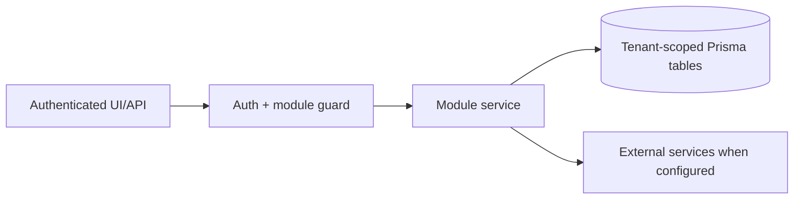

# Website growth and SEO: Integrations

> Evidence status: Confirmed from code for file locations and schema references; business workflow details not explicitly encoded are marked Requires employee confirmation.

## Purpose and status

Website growth and SEO is documented because code, routes, schema, or tests were located. Main evidence: `src/app/(authenticated)/website-growth/*`, `src/modules/website-growth/*`, website growth Prisma models/tests.

## Implemented Scout integrations

- Search Console and GA4 use the existing server-side Google API credentials and save 28-day tenant-scoped metrics. Search Console query text is deterministically classified for customer-question intent; no additional Google permission is required.
- Website forms are reduced to counts by page and primary need before Scout sees them. Names, email addresses, phone numbers, and message bodies are excluded.
- SEMrush remains optional through `https://mcp.semrush.com/v1/mcp` and official OAuth in the Codex runtime. Newl Apps does not hold the OAuth token and stores only capped, sanitized evidence rows. The Position Tracking snapshot remains an eight-day cache. If API units and a fresh cache are unavailable, the result is explicitly recorded as `UNAVAILABLE` and first-party/website/public-web research continues.
- Microsoft Teams delivery runs through the configured OpenClaw Teams account. Newl Apps constructs the message and review links deterministically; Codex cannot choose a recipient or send a message.
- Teams summaries use the fixed `WEBSITE_GROWTH_TEAMS_TARGET`. Newl Apps stores the bounded report payload with the successful tenant-scoped Scout job and places seven-day signed download links in that same summary. The report route verifies the HMAC, expiry, tenant ID, run ID, job type, and successful job status before building the `.xlsx` response. This avoids Teams file-consent cards and does not copy the report into OneDrive.
- `WEBSITE_GROWTH_REPORT_DOWNLOAD_SECRET` is an optional dedicated HMAC secret. When it is absent, the existing `OPENCLAW_WEBSITE_GROWTH_TOKEN` signs downloads. Either value must be at least 32 characters and is never included in the URL.
- Position Tracking remains read-only through official SEMrush MCP. Newl Apps stores the sanitized weekly snapshot and automatically prepares import rows from approved/built/published Scout briefs after case-insensitive keyword deduplication. Direct SEMrush mutation requires separate Business/API access and is not part of this workflow.
- Scout machine routes use the dedicated `OPENCLAW_WEBSITE_GROWTH_TOKEN` and configured tenant slug.
- Backlink discovery reuses Hunter's existing `HUNTER_BRAVE_SEARCH_API_KEY` and safe public-HTTPS retrieval code. The worker reads only that key from the protected Hunter environment when it is not already present in Scout's environment; it does not import Hunter's other secrets. Search is capped at 12 queries and 120 results per Monday or Wednesday deep run. The local Qwen endpoint defaults to `http://127.0.0.1:11434` with `qwen3.5:35b`; optional `WEBSITE_GROWTH_QWEN_URL` and `WEBSITE_GROWTH_QWEN_MODEL` values may override those local defaults. Newl Apps machine routes register canonical URL hashes before page retrieval and return only never-before-seen candidates. Codex receives at most 15 finalists and may promote at most five.
- Approved backlink execution uses a separate `OPENCLAW_WEBSITE_GROWTH_BACKLINK_TOKEN`. The executor claim route excludes paid placements and returns only tenant-scoped, human-approved records.
- The installed Scout agent uses OpenClaw's `minimal` tool profile plus an explicit allowlist containing only the browser and dedicated Website Growth backlink tools. Shell, exec, arbitrary file reads/writes, source-code search, and direct HTTP are denied.
- The protected public business-profile path is configured on the local plugin. `newl_backlink_business_profile` validates owner approval, manual opportunity approval, and the payment prohibition before returning a bounded allowlist of public identity and policy fields.
- The weekday cron runs `run-website-growth-backlink-executor.sh` as a command job. The wrapper owns the run timestamp, invokes the constrained agent, calls the tenant-scoped summary endpoint in a separate phase, and delivers Teams without giving the model a messaging tool.
- The executor installer uses the `minimal` OpenClaw profile plus explicit `alsoAllow` grants for the browser and dedicated backlink tools. The runner validates both tool exposure and the required read/sync/claim call sequence; a text-only or incomplete turn exits non-zero so the Rivet failure monitor can record it instead of reporting false success.
- The weekday executor uses `openai/gpt-5.4-mini` for native OpenClaw tool orchestration. The deep page/backlink research session remains Codex `gpt-5.6-sol`; the current `gpt-5.6-sol` OpenClaw harness exposes plugin names without making them callable, so it is not used for the executor turn.
- `run-website-growth-build-notifications.sh` polls a tenant-scoped Scout endpoint every two minutes. It claims one versioned build event at a time, sends the deterministic Newl Apps message to the fixed Teams target, and acknowledges the exact claim. Only builds created after this notification version was introduced are eligible, so installation does not replay historical builds.
- Free directory accounts use the local-only `NEWL_DIRECTORY_PASSWORD_MASTER_V1`. The OpenClaw Website Growth plugin derives a unique 28-character password from the approved tenant/opportunity/directory/account context, fills it through a mode-600 temporary browser fields file, and deletes that file. Newl Apps receives only the opaque credential reference and version. The master must not be added to Vercel.
- The directory-verification sync reuses the application-scoped Microsoft Graph mailbox access already restricted to `partnerships@newlgroup.com`. It considers only pending approved directory accounts and never returns or stores a tokenized verification URL. Automatic activation requires the exact recipient, a post-registration message, verification language, HTTPS, the same organization domain throughout redirects, and public DNS. Anything ambiguous becomes a human-action item.
- Outbound mail uses Microsoft Graph application access through the dedicated outreach mailbox. Newl Apps holds the public identity configuration and Graph credential; OpenClaw receives only constrained Website Growth tools and never the Graph access token.
- Reply sync reads the dedicated mailbox only, matches the recorded Microsoft conversation ID and recipient, and converts opt-outs into durable tenant-scoped suppression records. A unique active exact-sender match is retained as a review-labelled reply when a publisher starts a new thread or changes the subject; ambiguous shared-recipient matches still require the thread ID or normalized subject.
- True outbound automation additionally requires an owner-approved public business profile in the protected Scout runtime, `Mail.Send` and `Mail.Read`, and an Exchange mailbox scope. Secret values do not belong in Scout output, Teams, source control, or Semrush.
- Weekday Teams summaries are announced by the dedicated Scout schedule even when no opportunity is available.
- The Rivet failure monitor uses the same tenant-scoped backlink executor token only to report sanitized OpenClaw run metadata. It polls every 15 minutes without a model call, stores deduplicated incidents in `AutomationJobRun`, and sends Teams only for a newly recorded failure. The optional one-time `WEBSITE_GROWTH_RIVET_AUTO_TRIAGE_APPROVAL=OWNER_APPROVED_WEBSITE_GROWTH_FAILURE_TRIAGE` setting permits code-defect diagnosis and a draft PR; it never permits outreach retry, merge, deployment, or permission changes.

## Workflow / rules summary

- Entry points are protected authenticated pages and/or API routes for this module.
- Server-side pages and mutating APIs should validate tenant context and module entitlement before data access.
- Data persistence uses tenant-scoped Prisma models where a database model exists.
- External calls use `src/server/integrations/*` or module-specific integration helpers. Secret values are not documented here.
- Approval, printing, posting, and live external writes require human approval unless a code path explicitly enforces a safe dry-run.

## Data model

Relevant tables and enums are in `prisma/schema.prisma`. Operationally important fields include primary `id`, `tenantId` where present, status enums, foreign keys to tenant/user/module, timestamps, metadata JSON, and unique/index constraints declared in Prisma.

## Permissions

Roles and defaults are in `src/server/auth/role-policy.ts`. Runtime checks are in `src/server/auth/authorization.ts`; gaps should be treated as requiring code review before enabling production writes.

## Failure modes

Expected failures include missing tenant entitlement, read-only mutation attempts, validation errors, missing integration credentials, duplicate records, empty parser results, external API errors, timeouts, and partial job completion. Recovery should use module UI review screens, audit/job records, and documented dry-run scripts before live writes.

## Testing

Relevant tests are under `tests/` and generally named after the module. Recommended checks: `npm test`, `npm run lint`, `npm run typecheck`, and targeted route/service tests. Live integration scripts must not be run without explicit approval and safe credentials.

## Source map

| Responsibility | Main files | Supporting files | Tests |
|---|---|---|---|
| UI and routes | See evidence paths above | `src/components/app-shell.tsx` | module-named tests under `tests/` |
| Services/actions/queries | `src/modules/website*` or evidence paths above | `src/server/*` | module-named tests |
| Schema | `prisma/schema.prisma` | `prisma/migrations/*` | schema-dependent unit tests |

## Open questions

- Which status values map to employee-approved business language? Requires employee confirmation.
- Which write actions should require two-person approval? Requires owner confirmation.
- Which external integration credentials should be moved from env fallback to tenant-scoped settings first? Requires owner confirmation.
