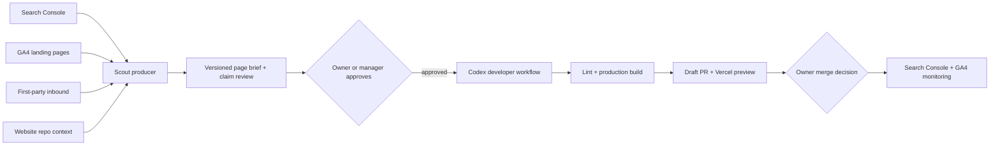

# Website Growth and SEO

> Evidence status: implementation details are confirmed from code. Claims, publishing limits, and business outcomes remain human-approved.

## Purpose

Website Growth is Newl's control plane for turning Search Console, GA4, first-party inbound, and manual research into approved website work. It owns evidence, prioritization, the page brief, claim review, approval, and build status. It never merges or publishes the website.

The page-producing role is called **Scout**, not Hunter. Hunter remains a lead-discovery collector. Scout is a separate OpenClaw agent because its inputs, approval boundary, evaluation criteria, and website access are materially different.

## Workflow

Approval of a brief starts the developer workflow automatically. It is not approval to merge. The website repository workflow uses a read-only Codex job to create and verify a patch, then a separate job without the OpenAI key pushes the patch and opens a draft PR.

## Model routing

| Work | Default | Reasoning | Notes |
| --- | --- | --- | --- |
| Imports, scoring, clustering, state checks | Deterministic code | N/A | No model should perform exact comparisons or status changes. |
| Scout page brief | `gpt-5.6-sol` | `medium` | Quality-first while volume is low and the prompt is being evaluated. Terra may replace Sol for lower-risk briefs after matched evals. |
| Website developer | Codex `gpt-5.6-sol` | `high` | Runs only after approval, in the website repo, with tests and a draft PR. |
| Kimi K3 | Shadow challenger only | Provider-specific | No automatic repository writes until it passes the same brief, claims, build, and visual-review eval set. |

Model changes must be evaluated against the same saved opportunities. Compare factuality, claim violations, duplicated intent, route correctness, design fit, lint/build success, reviewer edits, latency, and cost. Do not choose a model from benchmark scores alone.

## Data sources

- Search Console: query/page clicks, impressions, CTR, and position.
- GA4 Data API: landing page sessions, engaged sessions, engagement rate, and event count for the last 28 days.
- Newl inbound: form submissions and lead-producing pages. These remain the source of truth for lead counts.
- Manual CSV/TSV: historical Search Console, GA4, Semrush, or one-off research.
- Website repository context: routes, templates, components, navigation, sitemap, and current content.

Existing non-final opportunities are refreshed when matching evidence is re-imported. Approved, in-progress, published, and rejected records are not silently rewritten.

## Claims policy

- Capability descriptions are allowed when supported by the current website/repository context.
- Numerical performance claims need a definition, source, reporting period, sample, owner, and next review date.
- Certifications and affiliations need current documentary evidence and an expiry/review date.
- Customer names, logos, testimonials, case studies, and volumes need explicit permission.
- Absolute and guarantee language is blocked; human approval does not make an unbounded claim safe.
- Public metrics currently visible on the website, including inventory/order accuracy and dock-to-stock timing, should be treated as requiring owner confirmation until their internal source and reporting period are attached.

The initial repository research and evidence requests are recorded in `claims-register.md`.

## Capacity and cost controls

The developer run belongs in GitHub Actions rather than a Vercel function. Vercel serves the control plane and preview, while repository checkout, Codex execution, lint, and production build run in GitHub. Weekly publish guides remain two core pages, four supporting items, and six quick optimizations; they are queue limits, not automatic publishing targets.

## Human boundaries

- Admin or Manager may approve a brief and start a build.
- Sales and Operations may prepare and review opportunities but may not approve developer or publishing states.
- Codex may edit only the isolated website branch created for the build request.
- Vercel Preview is required for visual review.
- The owner decides whether to merge. Production deployment is never initiated by Newl Apps or Scout.
