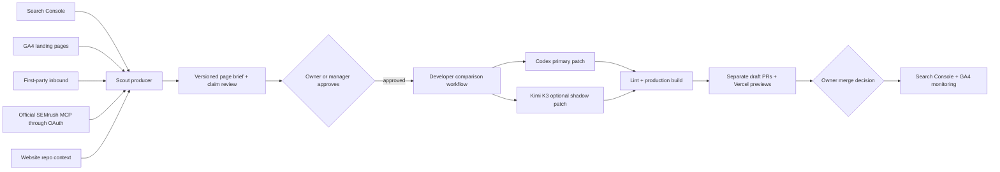

# Website Growth and SEO

> Evidence status: implementation details are confirmed from code. Claims, publishing limits, and business outcomes remain human-approved.

## Purpose

Website Growth is Newl's control plane for turning Search Console, GA4, first-party inbound, and manual research into approved website work. It owns evidence, prioritization, the page brief, claim review, approval, and build status. It never merges or publishes the website.

The page-producing role is called **Scout**, not Hunter. Hunter remains a lead-discovery collector. Scout is a separate OpenClaw agent because its inputs, approval boundary, evaluation criteria, and website access are materially different.

## Workflow

Approval of a brief starts the developer workflow automatically. It is not approval to merge. The website repository workflow uses a read-only Codex job to create and verify the primary patch, then a separate job without the OpenAI key pushes the patch and opens a draft PR. When the optional Kimi API key is configured, Kimi K3 receives the same immutable approved brief and starting website commit in a separate read-only-credential job. Its patch must pass the same lint and production-build checks before another credential-separated job may open a comparison draft PR.

## Control-plane views

The Website Growth UI intentionally separates two different kinds of records:

- **Scout workspace** is the default view. It contains only AI-curated Scout briefs and groups them into `Needs your review`, `Approved and building`, `Preview ready`, and `Completed and closed`.
- **Research signals** contains the full GA4, Search Console, Semrush, and first-party evidence inventory. These records are inputs to Scout, not a human work queue.
- **Backlink Scout** contains only Codex-reviewed, deduplicated prospects that pass deterministic relevance, quality, and spam-risk gates. Raw Semrush backlink rows and rejected candidates are never presented as a work queue.

Every Scout card must state whether it proposes a **new page** or an **update to an existing page**, show the affected route, and summarize the primary proposed change. A draft created by the latest Scout run is labeled as new. The latest run summary remains visible even when no opportunities were selected.

## Model routing

| Work | Default | Reasoning | Notes |
| --- | --- | --- | --- |
| Imports, scoring, clustering, state checks | Deterministic code | N/A | No model should perform exact comparisons or status changes. |
| Scout research and page brief | Codex `gpt-5.6-sol` | `high` | Ephemeral, read-only website-repository session. Official SEMrush MCP through OAuth is mandatory for the scheduled run. |
| Backlink outreach executor | Dedicated Scout agent with Codex `gpt-5.6-sol` | `high` | Receives constrained tools only. Newl Apps enforces approval, compliance, suppression, volume limits, and tenant scope before external actions. |
| Website developer | Codex `gpt-5.6-sol` | `high` | Runs only after approval, in the website repo, with tests and a draft PR. |
| Kimi K3 `kimi-k3` | Optional shadow challenger | `high` | Runs only after brief approval, creates a separate verified patch and draft PR, and never replaces the primary Newl Apps build record. |

Model changes must be evaluated against the same saved opportunities. Compare factuality, claim violations, duplicated intent, route correctness, design fit, lint/build success, reviewer edits, latency, and cost. Do not choose a model from benchmark scores alone.

## Data sources

- Search Console: query/page clicks, impressions, CTR, and position.
- GA4 Data API: landing page sessions, engaged sessions, engagement rate, and event count for the last 28 days.
- Newl inbound: form submissions and lead-producing pages. These remain the source of truth for lead counts.
- SEMrush: official read-only MCP through OAuth for rankings, keyword gaps, competitors, intent, volume, and difficulty. Results are capped and cached as sanitized evidence.
- Manual CSV/TSV: historical Search Console, GA4, Semrush, or one-off research.
- Website repository context: routes, templates, components, navigation, sitemap, and current content.
- Durable design and decision memory: the versioned Newl page-pattern library, current repository inventory (including forms, heroes, CTAs, FAQs, and internal links), and up to 50 recent approved, rejected, built, or published brief decisions.

Existing non-final opportunities are refreshed when matching evidence is re-imported. Approved, in-progress, published, and rejected records are not silently rewritten.

## Claims policy

- Capability descriptions are allowed when supported by the current website/repository context.
- Numerical performance claims need a definition, source, reporting period, sample, owner, and next review date.
- Certifications and affiliations need current documentary evidence and an expiry/review date.
- Customer names, logos, testimonials, case studies, and volumes need explicit permission.
- Absolute and guarantee language is blocked; human approval does not make an unbounded claim safe.
- Public metrics currently visible on the website, including inventory/order accuracy and dock-to-stock timing, should be treated as requiring owner confirmation until their internal source and reporting period are attached.

The initial repository research and evidence requests are recorded in `claims-register.md`.

## Capacity and cost controls

The developer run belongs in GitHub Actions rather than a Vercel function. Vercel serves the control plane and previews, while repository checkout, agent execution, lint, and production build run in GitHub. A successful comparison creates two Preview deployments per approved build request. They may queue when the Vercel account has one concurrent build slot, but neither preview is a production deployment. Weekly publish guides remain two core pages, four supporting items, and six quick optimizations; they are queue limits, not automatic publishing targets.

The OpenClaw command job runs Monday at 9:15 AM `America/Toronto`. It refreshes evidence, runs the bounded read-only Codex Scout, saves drafts, and sends a Teams report every week. The report states how many stored signals were reviewed, shortlisted, sent to Codex, and promoted so the research inventory is not confused with the approval queue.

The same read-only SEMrush session refreshes the Newl Group Position Tracking snapshot. Deterministic Newl Apps code selects primary and supporting keywords only from human-approved, built, or published Scout briefs, deduplicates them against the live tracked-keyword list, and creates a two-column SEMrush import workbook without a separate keyword approval step. Teams receives that workbook when additions exist and receives the weekly position/performance workbook even when Scout promotes no new page brief. Official MCP remains read-only; this workflow prepares the import rather than writing directly to SEMrush.

The weekly session also reviews Newl and competitor backlink profiles, referring domains, backlink gaps, and new/lost links. Scout may return no more than 15 curated prospects. Newl Apps rejects prospects below 60 relevance or quality, rejects high spam risk, deduplicates by referring domain and target page, caps the active queue at 50, and archives unrefreshed review items after 45 days. These are initial safe operating limits for the first rollout and should be evaluated after the first 20 reviewed prospects.

Backlink approval is distinct from content approval and spending approval. Admin or Manager may approve an opportunity for execution. A dedicated executor token can claim approved free work and report submitted, contacted, blocked, live, or lost states. Paid placements are excluded from machine claims and never authorize a purchase or paid ranking link.

The dedicated weekday outreach job is installed disabled. Once the supervised launch test passes, it runs at 11:00 AM `America/Toronto`, sends at most five new contacts per rolling day and 20 per rolling week, follows up on days 5 and 12, closes after day 21, and sends a Teams update even when there is no approved work. See `backlink-outreach-rollout.md`.

The existing Vercel weekly planner remains a safe queue-preparation fallback; it does not run Codex or send Teams.

## Human boundaries

- Admin or Manager may approve a brief and start a build.
- Sales and Operations may prepare and review opportunities but may not approve developer or publishing states.
- Codex and Kimi may produce only isolated website patches for the approved build request; credential-separated jobs create their draft branches.
- Vercel Preview is required for visual review. When Kimi is enabled, reviewers compare both previews; Newl Apps continues to track Codex as the primary build during the trial.
- The owner decides whether to merge. Production deployment is never initiated by Newl Apps or Scout.
