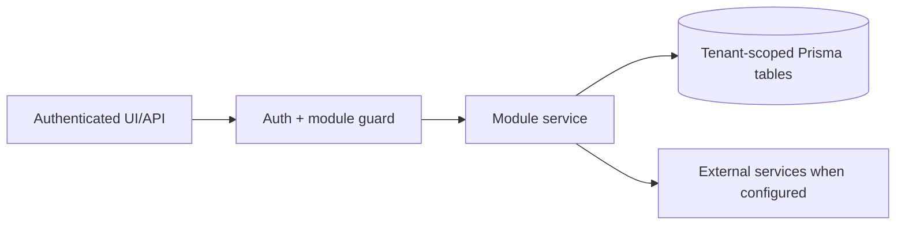

# Website growth and SEO: Permissions

> Evidence status: Confirmed from code for file locations and schema references; business workflow details not explicitly encoded are marked Requires employee confirmation.

## Purpose and status

Website growth and SEO is documented because code, routes, schema, or tests were located. Main evidence: `src/app/(authenticated)/website-growth/*`, `src/modules/website-growth/*`, website growth Prisma models/tests.

## Scout permission boundary

- The scheduled Scout token can prepare and complete only the configured tenant's Scout run.
- Codex runs with a read-only filesystem sandbox and an ephemeral session. It cannot edit Git, open a PR, approve a draft, send Teams messages, or publish.
- SEMrush MCP is read-only and authenticated through OAuth on the OpenClaw/Codex machine.
- Newl Apps validates every returned opportunity ID against the exact candidate IDs stored in the tenant-scoped job.
- Only Admin and Manager roles may approve a brief and start the existing developer workflow. Scout never receives that authority.
- Only Admin and Manager roles may approve a backlink prospect. Scout cannot approve, claim, submit, contact, purchase, or verify its own prospect.
- A separate backlink-executor bearer token can claim only approved, non-paid opportunities. It cannot read rejected/archived research or claim paid placements.
- The send route rechecks the saved human approval, non-paid category, executor state, public contact evidence, consent basis, suppression list, recipient continuity, and volume limits before Microsoft Graph is called.
- Microsoft Graph application access must be restricted to the dedicated outreach mailbox. The OpenClaw model never receives the Graph application secret or access token.
- Automatic opportunity approval is not implemented. The owner-approved future goal requires a separate reviewed policy change after an initial supervised operating period.
- The executor may report operational states, but it cannot approve spending. CAPTCHA, MFA, payment, contracts, unusual terms, private-data requests, and missing business-profile facts must be reported as blocked.

## Developer comparison boundary

- Codex and optional Kimi K3 start only from the same tenant-scoped, immutable approved brief.
- Agent jobs have read-only repository permissions and cannot push, open a PR, merge, or deploy production.
- A separate job applies only a verified patch to an isolated `codex/website-growth-*` or `kimi/website-growth-*` branch and opens a draft PR.
- Only the Codex branch reports PR and Preview status to the primary Newl Apps build record during the Kimi trial.
- The owner retains the merge decision for every branch. Kimi failure cannot block or downgrade the primary Codex result.

## Workflow / rules summary

- Entry points are protected authenticated pages and/or API routes for this module.
- Server-side pages and mutating APIs should validate tenant context and module entitlement before data access.
- Data persistence uses tenant-scoped Prisma models where a database model exists.
- External calls use `src/server/integrations/*` or module-specific integration helpers. Secret values are not documented here.
- Approval, printing, posting, and live external writes require human approval unless a code path explicitly enforces a safe dry-run.

## Data model

Relevant tables and enums are in `prisma/schema.prisma`. Operationally important fields include primary `id`, `tenantId` where present, status enums, foreign keys to tenant/user/module, timestamps, metadata JSON, and unique/index constraints declared in Prisma.

## Permissions

Roles and defaults are in `src/server/auth/role-policy.ts`. Runtime checks are in `src/server/auth/authorization.ts`; gaps should be treated as requiring code review before enabling production writes.

## Failure modes

Expected failures include missing tenant entitlement, read-only mutation attempts, validation errors, missing integration credentials, duplicate records, empty parser results, external API errors, timeouts, and partial job completion. Recovery should use module UI review screens, audit/job records, and documented dry-run scripts before live writes.

## Testing

Relevant tests are under `tests/` and generally named after the module. Recommended checks: `npm test`, `npm run lint`, `npm run typecheck`, and targeted route/service tests. Live integration scripts must not be run without explicit approval and safe credentials.

## Source map

| Responsibility | Main files | Supporting files | Tests |
|---|---|---|---|
| UI and routes | See evidence paths above | `src/components/app-shell.tsx` | module-named tests under `tests/` |
| Services/actions/queries | `src/modules/website*` or evidence paths above | `src/server/*` | module-named tests |
| Schema | `prisma/schema.prisma` | `prisma/migrations/*` | schema-dependent unit tests |

## Open questions

- Which status values map to employee-approved business language? Requires employee confirmation.
- Which write actions should require two-person approval? Requires owner confirmation.
- Which external integration credentials should be moved from env fallback to tenant-scoped settings first? Requires owner confirmation.
