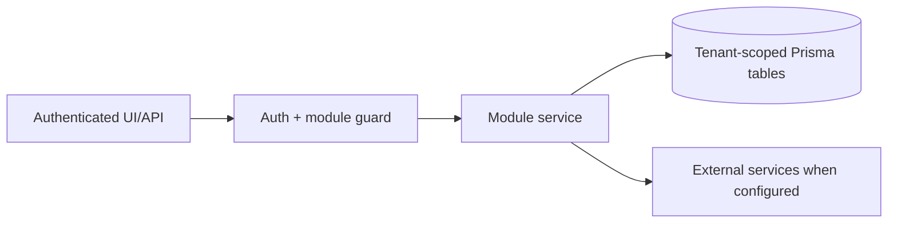

# Website growth and SEO: Source Map

> Evidence status: Confirmed from code for file locations and schema references; business workflow details not explicitly encoded are marked Requires employee confirmation.

## Purpose and status

Website growth and SEO is documented because code, routes, schema, or tests were located. Main evidence: `src/app/(authenticated)/website-growth/*`, `src/modules/website-growth/*`, website growth Prisma models/tests.

## Scout source map

| Responsibility | Source |
|---|---|
| Search Console, GA4, and sanitized form refresh | `src/modules/website-growth/evidence-refresh.ts` |
| Question-intent classification, answer strategy, scoring, and qualification | `src/modules/website-growth/opportunities.ts` |
| Tenant-scoped candidate upsert | `src/modules/website-growth/opportunity-store.ts` |
| Scout run locking, SEMrush cache, weekday check-in, packet, draft save, Teams message | `src/modules/website-growth/scout-run.ts` |
| Signed Excel links and stored-report validation | `src/modules/website-growth/report-download.ts` |
| Machine API | `src/app/api/website-growth/scout/prepare`, `complete`, `check-in`, and `fail` |
| Signed Excel download API | `src/app/api/website-growth/scout/runs/[runId]/reports/[reportName]` |
| Bounded `.xlsx` generation shared by Newl Apps and OpenClaw | `src/server/spreadsheet.ts` |
| Dedicated runtime synchronization and validation | `ops/openclaw/run-website-growth-scout-runtime.sh` |
| Read-only Codex/OpenClaw runtime | `ops/openclaw/run-website-growth-scout.sh` |
| Safe environment and fixed-target Teams helpers | `ops/openclaw/lib/website-growth-scout-runtime.zsh` |
| Official SEMrush OAuth setup | `ops/openclaw/configure-semrush-mcp.sh` |
| Split Monday deep / Tuesday-Friday cache-backed schedule and permanent worktree installation | `ops/openclaw/install-website-growth-scout.sh` |
| Structured output contract | `ops/openclaw/skills/website-growth-scout/scout-output.schema.json` |
| Backlink parsing, quality gates, dedupe, retention, workspace query | `src/modules/website-growth/backlinks.ts` |
| Rotating public-web query plan, canonical URL history, ingest and Qwen-finalist scope | `src/modules/website-growth/backlink-discovery.ts`, `src/app/api/website-growth/scout/backlink-discovery/*` |
| Brave Search, safe bounded page retrieval, and local Qwen triage worker | `ops/openclaw/website_growth_backlink_discovery.py` |
| Backlink approval actions | `src/modules/website-growth/actions.ts` |
| Backlink review UI | `src/app/(authenticated)/website-growth/backlinks/page.tsx` |
| Approved-work executor service | `src/modules/website-growth/backlink-executor.ts` |
| Executor machine API | `src/app/api/website-growth/backlinks/executor/*` |
| Executor runtime contract | `ops/openclaw/skills/website-growth-backlink-executor/SKILL.md` |
| Outbound compliance, limits, follow-ups, reply sync, suppression, Teams summary | `src/modules/website-growth/backlink-outreach.ts` |
| Deterministic blocker category, reason, next action, retry guidance | `src/modules/website-growth/backlink-blockers.ts` |
| Microsoft 365 draft/send helper | `src/server/integrations/microsoft-graph-mail.ts` |
| Dedicated OpenClaw tool plugin | `ops/openclaw/plugins/newl-website-growth` |
| Protected Scout installer and disabled weekday schedule | `ops/openclaw/install-website-growth-backlink-executor.sh` |
| Production rollout and rollback | `docs/modules/website-growth/backlink-outreach-rollout.md` |

## Workflow / rules summary

- Entry points are protected authenticated pages and/or API routes for this module.
- Server-side pages and mutating APIs should validate tenant context and module entitlement before data access.
- Data persistence uses tenant-scoped Prisma models where a database model exists.
- External calls use `src/server/integrations/*` or module-specific integration helpers. Secret values are not documented here.
- Approval, printing, posting, and live external writes require human approval unless a code path explicitly enforces a safe dry-run.

## Data model

Relevant tables and enums are in `prisma/schema.prisma`. Operationally important fields include primary `id`, `tenantId` where present, status enums, foreign keys to tenant/user/module, timestamps, metadata JSON, and unique/index constraints declared in Prisma.

## Permissions

Roles and defaults are in `src/server/auth/role-policy.ts`. Runtime checks are in `src/server/auth/authorization.ts`; gaps should be treated as requiring code review before enabling production writes.

## Failure modes

Expected failures include missing tenant entitlement, read-only mutation attempts, validation errors, missing integration credentials, duplicate records, empty parser results, external API errors, timeouts, and partial job completion. Recovery should use module UI review screens, audit/job records, and documented dry-run scripts before live writes.

## Testing

Relevant tests are under `tests/` and generally named after the module. Recommended checks: `npm test`, `npm run lint`, `npm run typecheck`, and targeted route/service tests. Live integration scripts must not be run without explicit approval and safe credentials.

## Source map

| Responsibility | Main files | Supporting files | Tests |
|---|---|---|---|
| UI and routes | See evidence paths above | `src/components/app-shell.tsx` | module-named tests under `tests/` |
| Services/actions/queries | `src/modules/website*` or evidence paths above | `src/server/*` | module-named tests |
| Schema | `prisma/schema.prisma` | `prisma/migrations/*` | schema-dependent unit tests |

## Open questions

- Which status values map to employee-approved business language? Requires employee confirmation.
- Which write actions should require two-person approval? Requires owner confirmation.
- Which external integration credentials should be moved from env fallback to tenant-scoped settings first? Requires owner confirmation.
