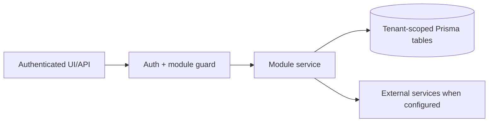

# Website growth and SEO: Testing

> Evidence status: Confirmed from code for file locations and schema references; business workflow details not explicitly encoded are marked Requires employee confirmation.

## Purpose and status

Website growth and SEO is documented because code, routes, schema, or tests were located. Main evidence: `src/app/(authenticated)/website-growth/*`, `src/modules/website-growth/*`, website growth Prisma models/tests.

## Scout regression coverage

`tests/website-growth.test.ts` verifies that scheduled completion requires SEMrush to have been queried, accepts schema-complete drafts and sanitized SEMrush evidence, deduplicates approved-page keywords against the live tracking snapshot, builds report payloads, and creates deterministic Teams summaries for both promoted and zero-promotion runs. `tests/openclaw-website-growth-scout.test.ts` verifies the shared Codex executable resolver, including explicit `CODEX_BIN` and the ChatGPT application bundle fallback, and verifies that both report payloads become valid ZIP-based `.xlsx` attachments. Shell syntax and the JSON output schema should also be validated before rollout. Live Google, SEMrush, Codex, Teams, and Vercel calls are not part of unit tests and require the guarded preview/runtime validation described in the rollout documentation.

The website repository validates the optional Kimi workflow with GitHub Actions syntax checks plus the same changed-file lint and production build used for Codex. The controlled model evaluation must start both agents from the same approved brief and website commit, then compare claim compliance, route correctness, design fit, build success, reviewer edits, latency, and cost across their separate Vercel Previews. A missing or failed Kimi run must leave the Codex callback and primary build state unchanged.

## Workflow / rules summary

- Entry points are protected authenticated pages and/or API routes for this module.
- Server-side pages and mutating APIs should validate tenant context and module entitlement before data access.
- Data persistence uses tenant-scoped Prisma models where a database model exists.
- External calls use `src/server/integrations/*` or module-specific integration helpers. Secret values are not documented here.
- Approval, printing, posting, and live external writes require human approval unless a code path explicitly enforces a safe dry-run.

## Data model

Relevant tables and enums are in `prisma/schema.prisma`. Operationally important fields include primary `id`, `tenantId` where present, status enums, foreign keys to tenant/user/module, timestamps, metadata JSON, and unique/index constraints declared in Prisma.

## Permissions

Roles and defaults are in `src/server/auth/role-policy.ts`. Runtime checks are in `src/server/auth/authorization.ts`; gaps should be treated as requiring code review before enabling production writes.

## Failure modes

Expected failures include missing tenant entitlement, read-only mutation attempts, validation errors, missing integration credentials, duplicate records, empty parser results, external API errors, timeouts, and partial job completion. Recovery should use module UI review screens, audit/job records, and documented dry-run scripts before live writes.

## Testing

Relevant tests are under `tests/` and generally named after the module. Recommended checks: `npm test`, `npm run lint`, `npm run typecheck`, and targeted route/service tests. Live integration scripts must not be run without explicit approval and safe credentials.

## Source map

| Responsibility | Main files | Supporting files | Tests |
|---|---|---|---|
| UI and routes | See evidence paths above | `src/components/app-shell.tsx` | module-named tests under `tests/` |
| Services/actions/queries | `src/modules/website*` or evidence paths above | `src/server/*` | module-named tests |
| Schema | `prisma/schema.prisma` | `prisma/migrations/*` | schema-dependent unit tests |

## Open questions

- Which status values map to employee-approved business language? Requires employee confirmation.
- Which write actions should require two-person approval? Requires owner confirmation.
- Which external integration credentials should be moved from env fallback to tenant-scoped settings first? Requires owner confirmation.
