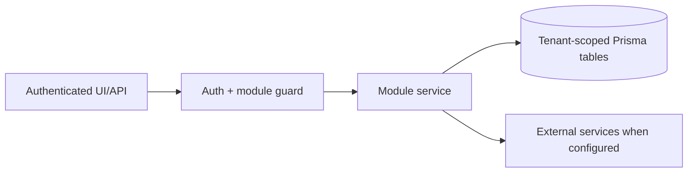

# Website growth and SEO: Testing

## Scout marketing redesign

The default workspace now follows persistent marketing work through research, owner decisions, and outcome reviews. See [Scout marketing specialist](scout-marketing-redesign.md) for the implemented worker contract, editable initial business profile, data model, approval boundaries, regression coverage, and staged cutover. Existing scheduled discovery remains available while the marketing mission is paused.

> Evidence status: Confirmed from code for file locations and schema references; business workflow details not explicitly encoded are marked Requires employee confirmation.

## Purpose and status

Website growth and SEO is documented because code, routes, schema, or tests were located. Main evidence: `src/app/(authenticated)/website-growth/*`, `src/modules/website-growth/*`, website growth Prisma models/tests.

## Scout regression coverage

`tests/website-growth.test.ts` verifies live and explicitly dated cached SEMrush results, explicit content-only `NOT_RUN` backlink output, schema-complete drafts, deterministic question-intent classification, existing-page answer preference, the reserved twice-weekly, SEO-recovery, and Scout-packet question lanes, lightweight weekday check-ins, keyword deduplication, report payloads, recovery summary parsing, signed report-link tamper/expiry guards, and Teams summaries. `tests/website-growth-seo-recovery.test.ts` verifies comparison-window boundaries, reporting lag, redirect-family aggregation, recovery classification, branded-homepage safeguards, bounded recovery opportunities, and redirect extraction. The Scout marketing tests verify query/page evidence matching without cross-tenant leakage, explicit partial/missing evidence, wake/step audit records, structured WAIT ownership, expired leases, faceted effectiveness signals, backward-compatible mission upgrades, preservation of custom mission decisions, the complete profile save action, and profile visibility on the workboard and effectiveness review. `tests/website-growth-semrush-mail.test.ts` verifies scheduled-report classification and metrics, exact sender filtering, tenant-scoped sanitized persistence, content-hash deduplication, safe mailbox failure, and preservation of the prior complete tracked-keyword list. `tests/microsoft-graph-mail.test.ts` verifies exact child-folder resolution and fail-closed missing-folder behavior. `tests/website-growth-approval-ui.test.ts` guards the detailed brief's Admin/Manager approve/reject controls, claims confirmation, blocked-claims state, and the explicit boundary that approval starts Codex but never merges or publishes. `tests/website-growth-build-completion.test.ts` verifies that a successful production deployment moves the tenant-scoped build, brief, and opportunity to published, can recover a prior callback failure after an actual production deployment, and is idempotent. `tests/website-growth-build-status-route.test.ts` verifies that the authenticated worker route accepts the bounded `PUBLISHED` callback. `tests/website-growth-build-notifications.test.ts` verifies tenant-scoped build-event claims, leases, deterministic Preview links, stale-event suppression, and acknowledgement audit records; `tests/website-growth-build-notifications-route.test.ts` covers the Scout-authenticated claim and acknowledgement boundary. `tests/openclaw-website-growth-scout.test.ts` verifies the shared Codex executable resolver; legacy and current subscription-backed OAuth status; read-only backlink preflight; explicit plugin-tool grants; fail-closed executor sequence validation; the permanent clean runtime synchronization; question-led and SEO-recovery Scout instructions and thin-page prohibitions; direct Newl Apps Excel links without Teams/OneDrive media uploads; Codex mini ten-candidate batching, omitted-ID-only retry, and fail-closed single-candidate recovery; safe duplicate/failure outcomes; disabled-job Rivet visibility; zsh syntax; the structured-output contract; and valid ZIP-based `.xlsx` output. Live Google, SEMrush, Codex, Teams, Git, and Vercel calls are not part of unit tests and require guarded runtime validation.

Route-classification regressions also cover an Amazon FBA brief whose older opportunity action says create-page while the final brief identifies `/services/amazon-fba` as an existing-page update. The tests require an update build package, inventory-based correction of `newPage: true`, and worker instructions that preserve the current page through a focused section-level patch.

Backlink regression coverage verifies the dedicated discovery job ledger, four-week 12-query rotation, 120-result and 60-domain bounds, canonical URL normalization, tracking-parameter and cross-query dedupe, completed-review hash exclusion with expiry and failed-fetch retry, the 15-triage-finalist/5-final-promotion limits, structured Scout parser, referring-domain/target-page dedupe key, Newl self-link rejection, minimum relevance/quality gates, high-spam rejection, paid-placement executor exclusion, tenant-scoped executor authentication, country-specific legal footer, Canadian consent guard, bounded public contact-page verification, exact-address evidence for publisher-network domains, approval-preserving retry only when no external history exists, opt-out detection, changed-subject exact-sender reply fallback, failure classification, incident dedupe, restricted Rivet queuing, circuit breaking, and Teams reporting when zero prospects qualify. Microsoft Graph tests verify immutable draft creation and the separate send call without sending live mail. Live Brave, Codex subscription calls, submissions, and outreach are never exercised by unit tests.

Paid campaign regression coverage verifies exact attribution parsing, paid/organic/AI/direct/local classification, test/internal exclusion, cumulative funnel metrics, campaign grouping without invented values, configurable health thresholds, tracking/sync/pacing signals, partial-attribution investigation, and the absence of spend metrics or budget-change advice before cost data exists. Scheduled tests do not connect to Google Ads or change advertising settings.

Blocker-reporting coverage verifies the four deterministic blocker categories, external-history retry protection, required block reasons, bounded run-start timestamps, separate current-run/lifetime counts, persisted run summaries, Teams next-action/retry wording, and the corresponding Newl Apps card labels.

Directory-account coverage verifies deterministic per-directory password uniqueness, required character classes, weak-master rejection, opaque credential references, private temporary-file permissions, password-free tool results, exact verification recipients, same-organization verification links, unrelated-link rejection, challenge-state reporting, and human-safe retry behaviour. Tests do not use a real master secret, mailbox, directory account, CAPTCHA, or live verification link.

The OpenClaw Website Growth plugin has its own build and tests under `ops/openclaw/plugins/newl-website-growth`. Validation confirms that the executor token is injected from the protected environment rather than accepted from model-controlled arguments; the business-profile tool returns only bounded owner-approved public fields; payment-enabled or unapproved profiles fail closed; Scout's installed policy denies shell and arbitrary file access; the deterministic wrapper owns summary delivery after successful or failed agent turns; and installer migration cannot leave a retired agent-turn cron eligible for enablement. The production rollout still requires the supervised one-message test in `backlink-outreach-rollout.md`.

The website repository validates the optional Kimi workflow with GitHub Actions syntax checks plus the same changed-file lint and production build used for Codex. The controlled model evaluation must start both agents from the same approved brief and website commit, then compare claim compliance, route correctness, design fit, build success, reviewer edits, latency, and cost across their separate Vercel Previews. A missing or failed Kimi run must leave the Codex callback and primary build state unchanged.

Supervisor-correction regressions cover after-hours completion becoming eligible at the next morning wake, recovery of existing waits on read and claim, tenant/revision guards, preserved drafts and feedback, unchanged rolling-budget and active-capacity gates, one-step worker completion, the three-attempt escalation, incomplete review/blocker metadata, missing/partial measurement evidence, and unchanged external/owner/measurement waits. Rendered workboard coverage distinguishes a ready correction from a scheduled review while still explaining a full budget. These checks use synthetic fixtures and do not run research models or contact publishers.

## Workflow / rules summary

- Entry points are protected authenticated pages and/or API routes for this module.
- Server-side pages and mutating APIs should validate tenant context and module entitlement before data access.
- Data persistence uses tenant-scoped Prisma models where a database model exists.
- External calls use `src/server/integrations/*` or module-specific integration helpers. Secret values are not documented here.
- Approval, printing, posting, and live external writes require human approval unless a code path explicitly enforces a safe dry-run.

## Data model

Relevant tables and enums are in `prisma/schema.prisma`. Operationally important fields include primary `id`, `tenantId` where present, status enums, foreign keys to tenant/user/module, timestamps, metadata JSON, and unique/index constraints declared in Prisma.

```mermaid
flowchart LR
  UI[Authenticated UI/API] --> Auth[Auth + module guard]
  Auth --> Service[Module service]
  Service --> DB[(Tenant-scoped Prisma tables)]
  Service --> Ext[External services when configured]
```

## Permissions

Roles and defaults are in `src/server/auth/role-policy.ts`. Runtime checks are in `src/server/auth/authorization.ts`; gaps should be treated as requiring code review before enabling production writes.

## Failure modes

Expected failures include missing tenant entitlement, read-only mutation attempts, validation errors, missing integration credentials, duplicate records, empty parser results, external API errors, timeouts, and partial job completion. Recovery should use module UI review screens, audit/job records, and documented dry-run scripts before live writes.

## Testing

Relevant tests are under `tests/` and generally named after the module. Recommended checks: `npm test`, `npm run lint`, `npm run typecheck`, and targeted route/service tests. Live integration scripts must not be run without explicit approval and safe credentials.

## Source map

| Responsibility | Main files | Supporting files | Tests |
|---|---|---|---|
| UI and routes | See evidence paths above | `src/components/app-shell.tsx` | module-named tests under `tests/` |
| Services/actions/queries | `src/modules/website*` or evidence paths above | `src/server/*` | module-named tests |
| Schema | `prisma/schema.prisma` | `prisma/migrations/*` | schema-dependent unit tests |

## Open questions

- Which status values map to employee-approved business language? Requires employee confirmation.
- Which write actions should require two-person approval? Requires owner confirmation.
- Which external integration credentials should be moved from env fallback to tenant-scoped settings first? Requires owner confirmation.
