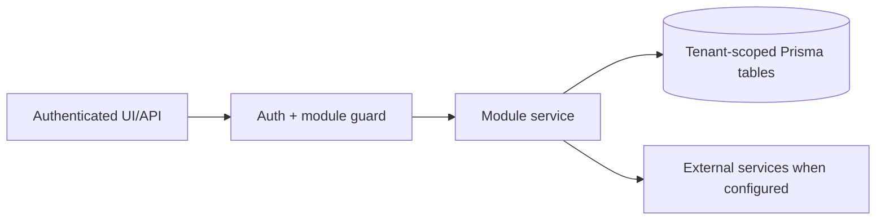

# Website growth and SEO: Workflow

> Evidence status: Confirmed from code for file locations and schema references; business workflow details not explicitly encoded are marked Requires employee confirmation.

## Purpose and status

Website growth and SEO is documented because code, routes, schema, or tests were located. Main evidence: `src/app/(authenticated)/website-growth/*`, `src/modules/website-growth/*`, website growth Prisma models/tests.

## Automated weekly workflow

1. OpenClaw runs `ops/openclaw/run-website-growth-scout.sh` Monday at 9:15 AM `America/Toronto`.
2. `/api/website-growth/scout/prepare` refreshes Search Console, GA4, and aggregate form evidence and prepares up to six candidates.
3. Codex `gpt-5.6-sol` with high reasoning inspects the current website repository in a read-only, ephemeral session and queries official SEMrush MCP through OAuth.
4. `/api/website-growth/scout/complete` rejects out-of-scope candidates or malformed results, stores sanitized SEMrush evidence, and saves drafts.
5. OpenClaw sends the returned message and direct draft links to the configured Teams target.
6. An Admin or Manager reviews each brief. Approval starts the website developer workflow; the owner still owns the merge.
7. Codex builds the primary implementation. If the optional Kimi API key is configured, Kimi K3 independently builds the same immutable brief from the same website commit.
8. Each agent output must pass the same website lint and production-build checks before a credential-separated job may open its draft PR. Vercel creates one Preview per draft PR.
9. Newl Apps records the Codex PR and Preview as the primary build. The Kimi PR remains a shadow comparison in GitHub and cannot overwrite the primary status.

The run is locked per tenant for three hours. No-candidate runs complete without sending an approval message. A Codex or SEMrush failure is recorded through `/api/website-growth/scout/fail` and does not create a draft.

The Kimi comparison is optional and fails independently: a missing key, agent error, verification failure, or PR handoff failure is surfaced in the GitHub Actions summary but does not block the primary Codex build. Neither agent workflow merges or deploys production.

## Review workspace

1. Open `/website-growth` to see Scout-curated briefs only.
2. Start with `Needs your review`. Each card identifies `New page` or `Update existing page`, the affected route, and the primary proposed change.
3. Open the brief for the complete current-page comparison, proposed copy, layout, claims review, and approval action.
4. After approval, follow the same item through `Approved and building` and then `Preview ready`.
5. Open the Vercel website preview for visual review. The owner makes the final GitHub merge decision.
6. Use `/website-growth/signals` only when investigating the underlying analytics and imported evidence. Signal counts are not counts of approved or active ideas.

## Workflow / rules summary

- Entry points are protected authenticated pages and/or API routes for this module.
- Server-side pages and mutating APIs should validate tenant context and module entitlement before data access.
- Data persistence uses tenant-scoped Prisma models where a database model exists.
- External calls use `src/server/integrations/*` or module-specific integration helpers. Secret values are not documented here.
- Approval, printing, posting, and live external writes require human approval unless a code path explicitly enforces a safe dry-run.

## Data model

Relevant tables and enums are in `prisma/schema.prisma`. Operationally important fields include primary `id`, `tenantId` where present, status enums, foreign keys to tenant/user/module, timestamps, metadata JSON, and unique/index constraints declared in Prisma.

## Permissions

Roles and defaults are in `src/server/auth/role-policy.ts`. Runtime checks are in `src/server/auth/authorization.ts`; gaps should be treated as requiring code review before enabling production writes.

## Failure modes

Expected failures include missing tenant entitlement, read-only mutation attempts, validation errors, missing integration credentials, duplicate records, empty parser results, external API errors, timeouts, and partial job completion. Recovery should use module UI review screens, audit/job records, and documented dry-run scripts before live writes.

## Testing

Relevant tests are under `tests/` and generally named after the module. Recommended checks: `npm test`, `npm run lint`, `npm run typecheck`, and targeted route/service tests. Live integration scripts must not be run without explicit approval and safe credentials.

## Source map

| Responsibility | Main files | Supporting files | Tests |
|---|---|---|---|
| UI and routes | See evidence paths above | `src/components/app-shell.tsx` | module-named tests under `tests/` |
| Services/actions/queries | `src/modules/website*` or evidence paths above | `src/server/*` | module-named tests |
| Schema | `prisma/schema.prisma` | `prisma/migrations/*` | schema-dependent unit tests |

## Open questions

- Which status values map to employee-approved business language? Requires employee confirmation.
- Which write actions should require two-person approval? Requires owner confirmation.
- Which external integration credentials should be moved from env fallback to tenant-scoped settings first? Requires owner confirmation.
