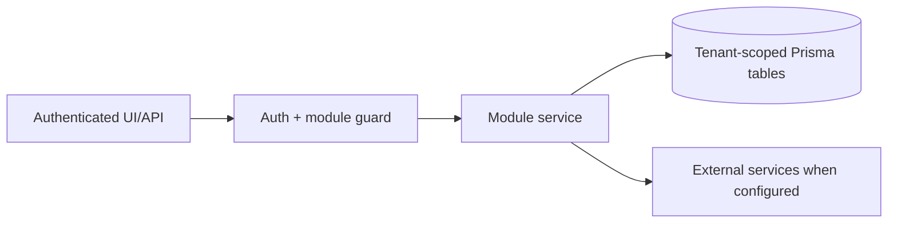

# Website growth and SEO: Workflow

> Evidence status: Confirmed from code for file locations and schema references; business workflow details not explicitly encoded are marked Requires employee confirmation.

## Purpose and status

Website growth and SEO is documented because code, routes, schema, or tests were located. Main evidence: `src/app/(authenticated)/website-growth/*`, `src/modules/website-growth/*`, website growth Prisma models/tests.

## Automated weekday workflow

1. OpenClaw runs the deep `ops/openclaw/run-website-growth-scout-runtime.sh` job on Monday at 9:15 AM `America/Toronto`. The dedicated runtime worktree fast-forwards itself to the latest clean `origin/main` before handing off to Scout.
2. `/api/website-growth/scout/prepare` refreshes Search Console, GA4, and aggregate form evidence, classifies customer-question queries, and prepares up to six candidates. Up to two packet positions are reserved for the dedicated question and AI-answer lane.
3. Codex `gpt-5.6-sol` with high reasoning inspects the current website repository in a read-only, ephemeral session and queries official SEMrush MCP through OAuth. It reviews candidate-specific question variants as well as the primary intent and refreshes Position Tracking even when there are no page candidates. If SEMrush reports insufficient units, Codex may use only the exact fresh cache in the prepared packet and must preserve its observation time.
4. `/api/website-growth/scout/complete` rejects out-of-scope candidates or malformed results, stores sanitized SEMrush evidence and the tracking snapshot, saves drafts, and deterministically selects keywords from previously approved/built/published Scout briefs.
5. OpenClaw sends the returned funnel summary, question-lane reviewed/promoted counts, direct draft links, and seven-day signed Excel download links to the configured Teams target. The workbooks download directly from Newl Apps; Teams file consent and OneDrive are not used.
6. The same Teams message reports the backlink funnel: prospects reviewed, duplicates/weak candidates removed, curated items added or refreshed, and a direct link to `/website-growth/backlinks`. The report is sent even when zero prospects qualify.
7. An Admin or Manager reviews each page brief and backlink prospect. Page-brief approval starts the website developer workflow; backlink approval makes free work claimable by the separate executor. The owner still owns website merge and every spending decision.
8. Codex builds the primary implementation. If the optional Kimi API key is configured, Kimi K3 independently builds the same immutable brief from the same website commit.
9. Each agent output must pass the same website lint and production-build checks before a credential-separated job may open its draft PR. Vercel creates one Preview per draft PR.
10. Newl Apps records the Codex PR and Preview as the primary build. The Kimi PR remains a shadow comparison in GitHub and cannot overwrite the primary status.
11. Tuesday through Friday, `/api/website-growth/scout/check-in` refreshes first-party evidence and queue state, reports the stored SEMrush cache age, and sends Teams status without running Codex or calling SEMrush.

## Backlink workflow

1. Scout queries official read-only Semrush MCP for backlink profiles, referring domains, competitor gaps, and new/lost links.
2. Codex reviews broadly but returns no more than 15 prospects after duplicate, relevance, quality, spam, and policy screening.
3. Newl Apps stores only passing prospects, refreshes existing matches in place, preserves prior human decisions, caps the active queue at 50, and archives stale `NEEDS_REVIEW` items after 45 days.
4. Teams receives one combined weekday report regardless of whether any prospect qualifies.
5. Admin or Manager approves one prospect or the current review batch. Approval is not spending authority.
6. The dedicated Scout executor runs on weekdays, first syncs replies and opt-outs, processes due follow-ups and verification, and then claims only approved non-paid work.
7. Email outreach requires an exact public-business contact source, CA/US country, recorded consent basis, suppression check, and deterministic legal footer. Newl Apps sends through the dedicated Microsoft 365 mailbox; the model never receives a Graph token.
8. Directory work may accept only ordinary free terms. Payment, reciprocal-link requirements, unusual legal terms, content resale, CAPTCHA, and MFA move the item to `BLOCKED`.
9. New contacts are capped at five per rolling day and 20 per rolling week. Follow-ups are due on days 5 and 12 and close after day 21 without a reply.
10. The weekday Teams summary is sent even when no approved work is available. It includes recent directory usernames/login URLs and verified backlink URLs, never passwords, and links back to the curated Newl Apps workspace.
11. A backlink becomes `LIVE` only after the public referring URL is verified. Lost links remain a short operational history; rejected and archived research stays hidden from the default workspace.

The production enablement sequence and supervised one-message test are documented in `backlink-outreach-rollout.md`.

The deep run is locked per tenant for three hours. Its tracking cache remains fresh for eight days. Cache reuse never changes the original observation time, refreshes backlink recency, or duplicates keyword metrics. A duplicate trigger sends a short Teams check-in and does not start a second run. A runtime-sync, dependency, Codex, SEMrush-without-cache, validation, persistence, report-link generation, or Teams-message failure sends a safe Teams failure notice. When a Newl Apps run ID exists, the failure is also recorded through `/api/website-growth/scout/fail`; no failure creates or approves a draft.

The 6,000-plus records visible under Research signals are not 6,000 proposed pages. They are a durable signal inventory. The planner may refresh the deterministic shortlist every weekday, but Codex promotion remains a Monday deep-run activity: the planner reviews at most 500 new records, clusters duplicate query/page intent, applies qualification thresholds, selects no more than 2 core pages, 4 supporting items, and 6 quick optimizations, sends at most 6 candidates to Scout by default, and allows Codex to promote only the ideas it recommends. These funnel counts are included in Teams.

Question-led signals use an additional limit of two per weekly shortlist. A question maps to an existing authoritative page before a new page is considered. Scout prefers a visible answer-first section, uses an FAQ only when the answer is genuinely useful to visitors, and proposes a dedicated guide only for a distinct substantial intent. This lane is intended to support both conventional search and answer-engine citation readiness without producing thin question pages.

The Kimi comparison is optional and fails independently: a missing key, agent error, verification failure, or PR handoff failure is surfaced in the GitHub Actions summary but does not block the primary Codex build. Neither agent workflow merges or deploys production.

## Review workspace

1. Open `/website-growth` to see Scout-curated briefs only.
2. Start with `Needs your review`. Each card identifies `New page` or `Update existing page`, the affected route, and the primary proposed change.
3. Open the brief for the complete current-page comparison, proposed copy, layout, claims review, and approval action.
4. After approval, follow the same item through `Approved and building` and then `Preview ready`.
5. Open the Vercel website preview for visual review. The owner makes the final GitHub merge decision.
6. Use `/website-growth/signals` only when investigating the underlying analytics and imported evidence. Signal counts are not counts of approved or active ideas.

## Workflow / rules summary

- Entry points are protected authenticated pages and/or API routes for this module.
- Server-side pages and mutating APIs should validate tenant context and module entitlement before data access.
- Data persistence uses tenant-scoped Prisma models where a database model exists.
- External calls use `src/server/integrations/*` or module-specific integration helpers. Secret values are not documented here.
- Approval, printing, posting, and live external writes require human approval unless a code path explicitly enforces a safe dry-run.

## Data model

Relevant tables and enums are in `prisma/schema.prisma`. Operationally important fields include primary `id`, `tenantId` where present, status enums, foreign keys to tenant/user/module, timestamps, metadata JSON, and unique/index constraints declared in Prisma.

```mermaid
flowchart LR
  UI[Authenticated UI/API] --> Auth[Auth + module guard]
  Auth --> Service[Module service]
  Service --> DB[(Tenant-scoped Prisma tables)]
  Service --> Ext[External services when configured]
```

## Permissions

Roles and defaults are in `src/server/auth/role-policy.ts`. Runtime checks are in `src/server/auth/authorization.ts`; gaps should be treated as requiring code review before enabling production writes.

## Failure modes

Expected failures include missing tenant entitlement, read-only mutation attempts, validation errors, missing integration credentials, duplicate records, empty parser results, external API errors, timeouts, and partial job completion. Recovery should use module UI review screens, audit/job records, and documented dry-run scripts before live writes.

## Testing

Relevant tests are under `tests/` and generally named after the module. Recommended checks: `npm test`, `npm run lint`, `npm run typecheck`, and targeted route/service tests. Live integration scripts must not be run without explicit approval and safe credentials.

## Source map

| Responsibility | Main files | Supporting files | Tests |
|---|---|---|---|
| UI and routes | See evidence paths above | `src/components/app-shell.tsx` | module-named tests under `tests/` |
| Services/actions/queries | `src/modules/website*` or evidence paths above | `src/server/*` | module-named tests |
| Schema | `prisma/schema.prisma` | `prisma/migrations/*` | schema-dependent unit tests |

## Open questions

- Which status values map to employee-approved business language? Requires employee confirmation.
- Which write actions should require two-person approval? Requires owner confirmation.
- Which external integration credentials should be moved from env fallback to tenant-scoped settings first? Requires owner confirmation.
