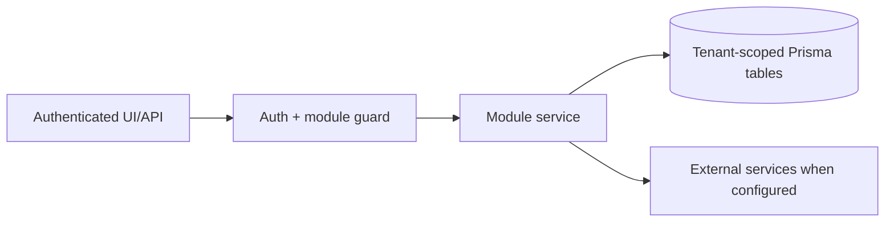

# Website growth and SEO: Workflow

## Scout marketing redesign

The default workspace now follows persistent marketing work through research, owner decisions, and outcome reviews. See [Scout marketing specialist](scout-marketing-redesign.md) for the implemented worker contract, data model, approval boundaries, regression coverage, and staged cutover. Existing scheduled discovery remains available while the marketing mission is paused.

> Evidence status: Confirmed from code for file locations and schema references; business workflow details not explicitly encoded are marked Requires employee confirmation.

## Purpose and status

Website growth and SEO is documented because code, routes, schema, or tests were located. Main evidence: `src/app/(authenticated)/website-growth/*`, `src/modules/website-growth/*`, website growth Prisma models/tests.

## Automated weekday workflow

1. OpenClaw runs a content-only `ops/openclaw/run-website-growth-scout-runtime.sh` job on Monday and Wednesday at 9:15 AM `America/Toronto`. A separate backlink-only job runs Tuesday at 10:15 AM. Both use the latest clean `origin/main`, separate `AutomationJobRun` job types, and independent three-hour locks.
2. The runner verifies `codex login status` reports ChatGPT authentication. Website Growth fails closed instead of using an API key. `/api/website-growth/scout/prepare` receives an explicit `CONTENT` or `BACKLINKS` lane and creates only the candidate type allowed for that lane.
3. In a content run, the service refreshes Search Console, GA4, aggregate form evidence, the scheduled SEMrush mailbox cache, SEO recovery, and customer-question planning. Codex `gpt-5.6-sol` inspects the current website repository read-only and may return page briefs, but the server requires the backlink result to be `NOT_RUN`.
4. In a backlink run, the runner executes 12 rotating Brave searches with 10 results each. `/api/website-growth/scout/backlink-discovery/ingest` canonicalizes the URLs, records their hashes in the tenant-scoped discovery ledger, and removes URLs successfully reviewed in the last 30 days or already present in a curated backlink. Incomplete and failed research remains retryable.
5. Codex `gpt-5.4-mini` through ChatGPT subscription OAuth performs bulk snippet triage in batches of at most ten. Incomplete batches retry only omitted candidates and split recursively. A persistent single-candidate failure is forwarded with zero confidence through the existing bounded public-page fetch/finalist limits. The final `gpt-5.6-sol` pass may promote at most five finalists. The server requires an empty page-draft array from this lane.
6. Before either review, deterministic code checks `partnerships@newlgroup.com/Inbox/Semrush` for scheduled PDFs sent by `mail@semrush.com`. It imports each PDF once, stores sanitized metrics and excerpts, and never stores the email body or attachment. Optional SEMrush evidence may be live, scheduled-report cache, an earlier exact cache, or explicitly `UNAVAILABLE`; exhausted units no longer stop either lane.
7. `/api/website-growth/scout/complete` rejects lane-crossing or out-of-scope output, stores optional sanitized SEMrush evidence, saves content drafts only in content runs, promotes backlinks only from the bounded backlink run, and deterministically selects keywords from previously approved/built/published Scout briefs.
8. OpenClaw sends a Teams outcome for every run, including zero-result runs. Content reports contain the page funnel, direct draft links, and seven-day signed Excel links. Backlink reports contain searched, duplicate, rejected, finalist, and promoted counts plus `/website-growth/backlinks`.
9. An Admin or Manager reviews each page brief and backlink prospect. Page-brief approval starts the website developer workflow; backlink approval makes free work claimable by the separate executor. The owner still owns website merge and every spending decision.
10. Codex builds the primary implementation. If the optional Kimi API key is configured, Kimi K3 independently builds the same immutable brief from the same website commit.
11. Each agent output must pass the same website lint and production-build checks before a credential-separated job may open its draft PR. Vercel creates one Preview per draft PR.
12. Newl Apps records the Codex PR and Preview as the primary build. The Kimi PR remains a shadow comparison in GitHub and cannot overwrite the primary status.
13. After the owner merges the primary Codex PR, the website repository waits for a successful Vercel production deployment. Its tenant-scoped worker callback then marks the build, brief, and opportunity as published so the Scout workspace moves the item to `Completed and closed`.
14. Tuesday, Thursday, and Friday, `/api/website-growth/scout/check-in` refreshes first-party evidence and queue state, imports any new scheduled SEMrush PDFs, reports the stored cache age, and sends Teams status without running Codex or calling the SEMrush API.
15. A deterministic local notifier checks every two minutes for newly dispatched, Preview-ready, or failed developer builds. It sends the fixed Newl Apps message to the configured Teams target, acknowledges the exact tenant-scoped event, and never exposes Teams credentials to Vercel, Codex, or Kimi.

## Backlink workflow

1. Scout uses the independent bounded Brave/Codex funnel. SEMrush is optional supporting evidence, not the primary backlink source.
2. Subscription-backed Codex triage returns no more than 15 finalists and final Codex review promotes no more than five prospects after duplicate, relevance, quality, spam, and policy screening.
3. Newl Apps stores only passing prospects, refreshes existing matches in place, preserves prior human decisions, caps the active queue at 50, and archives stale `NEEDS_REVIEW` items after 45 days.
4. Teams receives one combined weekday report regardless of whether any prospect qualifies.
5. Admin or Manager approves one prospect or the current review batch. Approval is not spending authority.
6. After the supervised launch test, the dedicated Scout executor runs at 11:00 AM `America/Toronto` on weekdays. Approval makes a non-paid item claimable; it does not send immediately. An item approved after the daily run waits for the next weekday run, and daily/rolling-week volume caps may defer it further.
7. Email outreach requires an exact public-business contact source, CA/US country, recorded consent basis, suppression check, and deterministic legal footer. The recognized backlink-executor skill and the runtime prompt both prohibit model-authored signatures, customer references, and unbounded comparative claims. Newl Apps sends through the dedicated Microsoft 365 mailbox; the model never receives a Graph token.
8. Directory work may accept only ordinary free terms. Payment, reciprocal-link requirements, unusual legal terms, content resale, CAPTCHA, and MFA move the item to `BLOCKED`.
9. New contacts are capped at five per rolling day and 20 per rolling week. The executor first syncs replies and opt-outs, then processes due follow-ups and verification, and finally claims newly approved work. Follow-ups use a dedicated tool that accepts only the opportunity ID and personalized copy; Newl Apps supplies the previously approved recipient, country, contact source and consent basis. Follow-ups are due on days 5 and 12 and close after day 21 without a reply.
10. The weekday Teams summary is sent even when no approved work is available. It includes recent directory usernames/login URLs and verified backlink URLs, never passwords, and links back to the curated Newl Apps workspace.
11. A backlink becomes `LIVE` only after the public referring URL is verified. Lost links remain a short operational history; rejected and archived research stays hidden from the default workspace.
12. A deterministic monitor checks completed outreach runs every 15 minutes. It deduplicates failures in tenant-scoped job history, classifies unsafe external-action and permission failures for owner review, and may queue Rivet for a draft code-fix PR only when the one-time owner standing-approval setting is enabled. A second identical failure within seven days disables the outreach schedule.
13. The executor records its UTC start time and passes it to the final deterministic summary. Newl Apps stores the cycle in `AutomationJobRun`, reports "blocked this run" separately from "blocked total", and displays the recorded reason, deterministic blocker category, next action, and retry guidance on every blocked card. The runtime validator requires successful JSON results and complete parameters for every Newl tool call; a rejected or empty side-effect call records an `ERROR` cycle and produces a failure Teams summary instead of a false success.
14. Outbound message attempts use a deterministic ID derived from tenant, opportunity, message kind and follow-up sequence. An existing initial attempt or an unconfirmed follow-up attempt blocks another send, preventing concurrent or manual retries from producing duplicate email.
15. Free form-based directory signups use the dedicated partnerships mailbox. Scout may complete ordinary forms and email verification, but CAPTCHA, MFA, phone verification, and password creation without an approved password-manager integration are marked Manual setup for a human to complete before retry.

The production enablement sequence and supervised one-message test are documented in `backlink-outreach-rollout.md`.

Each content or backlink lane is locked per tenant for three hours without locking the other lane. The tracking cache remains fresh for eight days. Scheduled attachments are deduplicated by SHA-256 content hash. An emailed Position Tracking summary may refresh current summary metrics and the observation time, but it does not erase the last complete tracked-keyword list. Cache reuse never refreshes backlink recency or duplicates keyword metrics. A duplicate trigger sends a short Teams check-in and does not start a second run. URL hashes registered before a later failure remain in the audit ledger, but only completed review evidence from successful runs suppresses retries, for 30 days. A mailbox, PDF, runtime-sync, dependency, Brave, Codex, validation, persistence, report-link generation, or Teams-message failure is bounded and reported; retained evidence remains available. When a Newl Apps run ID exists, the failure is also recorded through `/api/website-growth/scout/fail`; no failure creates or approves a draft.

The 6,000-plus records visible under Research signals are not 6,000 proposed pages. They are a durable signal inventory. The planner may refresh the deterministic shortlist every weekday, but Codex promotion occurs only in the Monday and Wednesday deep runs: the planner reviews at most 500 new records, clusters duplicate query/page intent, applies qualification thresholds, selects no more than 2 core pages, 4 supporting items, and 6 quick optimizations, sends at most 6 candidates to Scout by default, and allows Codex to promote only the ideas it recommends. These funnel counts are included in Teams.

Question-led signals use an additional limit of two per deep-run shortlist. A question maps to an existing authoritative page before a new page is considered. Scout prefers a visible answer-first section, uses an FAQ only when the answer is genuinely useful to visitors, and proposes a dedicated guide only for a distinct substantial intent. This lane is intended to support both conventional search and answer-engine citation readiness without producing thin question pages.

The SEO recovery lane is evaluated before ordinary content expansion. A commercial route is marked `NEEDS_RECOVERY` only when redirect-aggregated Search Console evidence shows a material click or position decline. Healthy redirect transfers are marked `MIGRATION_TRANSITION`; measurable gains are marked `IMPROVING`; other routes remain `MONITOR`. Stale recovery ideas automatically return to monitoring, while a monitored idea returns to `NEW` if later evidence again crosses the recovery threshold. Scout must improve the surviving route and must not recreate a thin legacy URL merely to recover historical impressions.

The Kimi comparison is optional and fails independently: a missing key, agent error, verification failure, or PR handoff failure is surfaced in the GitHub Actions summary but does not block the primary Codex build. Neither agent workflow merges or deploys production.

## Review workspace

1. Open `/website-growth` to see Scout-curated briefs only.
2. Start with `Needs your review`. Each card identifies `New page` or `Update existing page`, the affected route, and the primary proposed change.
3. Open the brief for the complete current-page comparison, proposed copy, layout, claims review, and approval action.
4. After approval, follow the same item through `Approved and building` and then `Preview ready`.
5. Open the Vercel website preview for visual review. The owner makes the final GitHub merge decision.
6. After the merged primary PR deploys successfully to Vercel production, the item moves automatically to `Completed and closed`.
7. Use `/website-growth/signals` only when investigating the underlying analytics and imported evidence. Signal counts are not counts of approved or active ideas.

## Workflow / rules summary

- Entry points are protected authenticated pages and/or API routes for this module.
- Server-side pages and mutating APIs should validate tenant context and module entitlement before data access.
- Data persistence uses tenant-scoped Prisma models where a database model exists.
- External calls use `src/server/integrations/*` or module-specific integration helpers. Secret values are not documented here.
- Approval, printing, posting, and live external writes require human approval unless a code path explicitly enforces a safe dry-run.

## Data model

Relevant tables and enums are in `prisma/schema.prisma`. Operationally important fields include primary `id`, `tenantId` where present, status enums, foreign keys to tenant/user/module, timestamps, metadata JSON, and unique/index constraints declared in Prisma.

```mermaid
flowchart LR
  UI[Authenticated UI/API] --> Auth[Auth + module guard]
  Auth --> Service[Module service]
  Service --> DB[(Tenant-scoped Prisma tables)]
  Service --> Ext[External services when configured]
```

## Permissions

Roles and defaults are in `src/server/auth/role-policy.ts`. Runtime checks are in `src/server/auth/authorization.ts`; gaps should be treated as requiring code review before enabling production writes.

## Failure modes

Expected failures include missing tenant entitlement, read-only mutation attempts, validation errors, missing integration credentials, duplicate records, empty parser results, external API errors, timeouts, and partial job completion. Recovery should use module UI review screens, audit/job records, and documented dry-run scripts before live writes.

## Testing

Relevant tests are under `tests/` and generally named after the module. Recommended checks: `npm test`, `npm run lint`, `npm run typecheck`, and targeted route/service tests. Live integration scripts must not be run without explicit approval and safe credentials.

## Source map

| Responsibility | Main files | Supporting files | Tests |
|---|---|---|---|
| UI and routes | See evidence paths above | `src/components/app-shell.tsx` | module-named tests under `tests/` |
| Services/actions/queries | `src/modules/website*` or evidence paths above | `src/server/*` | module-named tests |
| Schema | `prisma/schema.prisma` | `prisma/migrations/*` | schema-dependent unit tests |

## Open questions

- Which status values map to employee-approved business language? Requires employee confirmation.
- Which write actions should require two-person approval? Requires owner confirmation.
- Which external integration credentials should be moved from env fallback to tenant-scoped settings first? Requires owner confirmation.
