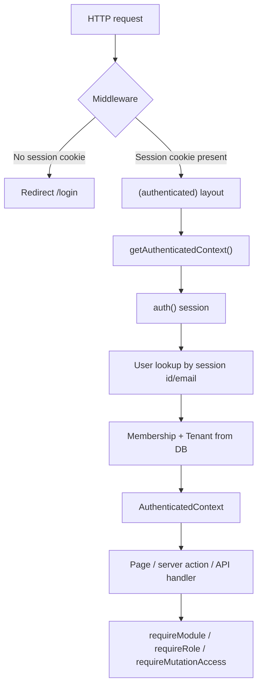

# Authentication & Tenant Context

Source of truth for how Newl Apps authenticates users, resolves tenant context, and enforces authorization. This document reflects the implementation on the `feat/auth-tenant-context` branch (PR #25).

## Architecture Flow



1. **Middleware** (`src/middleware.ts`) — Edge-safe cookie gate only. Checks for `authjs.session-token` (or the `__Secure-` HTTPS variant). Does not validate the session against the database. Redirects unauthenticated visitors to `/login` with a `callbackUrl`. Exempts `/api/auth/*`, `/api/integrations/trademining/*`, and static assets via the matcher.

2. **`(authenticated)` layout** (`src/app/(authenticated)/layout.tsx`) — Authoritative server-side validation. Calls `getAuthenticatedContext()`; on failure, redirects to `/login`. Passes user/tenant/role to `AppShell`.

3. **`getAuthenticatedContext()`** (`src/server/tenant-context.ts`) — Resolves `session → User → single Membership → Tenant`. Returns `AuthenticatedContext` with `userId`, `userEmail`, `userName`, `role`, `tenantId`, `tenantSlug`, and `tenantName`. Throws `UnauthenticatedError` when the session, user, or membership is missing.

4. **Authorization helpers** (`src/server/auth/authorization.ts`) — Called from server actions and route handlers after context is resolved. Enforce role policies and tenant module entitlements.

5. **`(public)` routes** — `/login` only for unauthenticated UI. Authenticated users with a session cookie visiting `/login` are redirected to `/dashboard`.

## Environment Variables

Summarized from `.env.example`. Use placeholders locally; store real values in a secret manager for deployed environments.

| Variable | Purpose |
|----------|---------|
| `AUTH_SECRET` | Auth.js signing secret. Generate with `npx auth secret`. |
| `AUTH_URL` | Public base URL of the app (callback URLs). |
| `AUTH_TRUST_HOST` | Trust the incoming host header (self-hosted/proxied setups). |
| `SESSION_MAX_AGE_DAYS` | Database session lifetime in days (default 30). |
| `AUTH_MICROSOFT_ENTRA_ID_ID` | Entra app client ID (Auth.js-native name). |
| `AUTH_MICROSOFT_ENTRA_ID_SECRET` | Entra app client secret. |
| `AUTH_MICROSOFT_ENTRA_ID_ISSUER` | Issuer URL for single-tenant app (recommended). |
| `AZURE_AD_CLIENT_ID` | Fallback alias for client ID. |
| `AZURE_AD_CLIENT_SECRET` | Fallback alias for client secret. |
| `AZURE_AD_TENANT_ID` | Fallback: builds issuer as `https://login.microsoftonline.com/{tenant-id}/v2.0`. |
| `AUTH_DEV_BYPASS` | When `"true"` and `NODE_ENV !== "production"`, enables dev login form. |
| `SEED_ADMIN_PASSWORD` | Local-dev password for seeded users (see below). |
| `INGESTION_API_TOKEN` | Separate machine auth for TradeMining ingestion API (not user auth). |
| `INGESTION_TENANT_SLUG` | Tenant slug for ingestion requests (falls back to `DEFAULT_TENANT_SLUG`). |
| `DEFAULT_TENANT_SLUG` | Used by seed data and ingestion tenant fallback (`newl-group` in examples). |

## Microsoft Entra ID Setup

Production login uses the **Microsoft Entra ID** provider configured in `src/server/auth/auth.config.ts`.

**App registration**

1. Register a single-tenant Entra application in Azure Portal.
2. Set redirect/callback URLs for each environment, for example:
   - Local: `http://localhost:3000/api/auth/callback/microsoft-entra-id`
   - Production: `https://your-app-domain.example/api/auth/callback/microsoft-entra-id`
3. Copy client ID, client secret, and tenant ID into env vars (use the `AUTH_MICROSOFT_ENTRA_ID_*` names or the `AZURE_AD_*` aliases).

**Admin-provisioned accounts**

- Create a `User` row and a `Membership` row linking the user to a tenant **before** the employee attempts SSO.
- The `signIn` callback in `src/server/auth/index.ts` counts memberships for the email and rejects sign-in when the count is zero.
- There is no self-service signup.

**Email linking**

- Entra verifies the employee email. The app uses `allowDangerousEmailAccountLinking: true` so a new SSO `Account` links to an existing `User` row matched by email (admin-provisioned ahead of first login).
- A successful Microsoft sign-in also captures the stable Entra tenant/object pair (`tid` + `oid`) on that existing `User`. A conflicting pair is rejected. Identity-bound Teams tools use this pair to resolve the authenticated Teams sender to the same current Newl membership without trusting prompt text or a caller-supplied email.

**Session strategy**

- Database sessions via `@auth/prisma-adapter` (~30 day max age, configurable).
- Tenant and role are **not** cached on the session; only `user.id` is surfaced. Every request re-resolves membership from the database.

## User Provisioning Model

```
Tenant ←── Membership ──→ User ←── Account (SSO, optional)
                │
              role
```

- **No self-signup.** Unknown emails fail at the `signIn` callback with `AccessDenied`.
- **Dev login** (`/api/auth/dev-login`) validates email + bcrypt `passwordHash` and requires at least one membership. Only available when `isDevLoginEnabled()` is true.
- **Seed users** (local development, `prisma/seed.ts`):

| Email | Role |
|-------|------|
| `admin@example.com` | `ADMIN` |
| `sales@example.com` | `SALES` |
| `readonly@example.com` | `READ_ONLY` |

Password for all seeded users: `SEED_ADMIN_PASSWORD` env var, defaulting to `newl-dev-password`.

## ROLE_MATRIX

Full policy from `src/server/auth/authorization.ts`. Effective write access requires **module access**, **`canMutate: true`**, and **tenant module entitlement** (`TenantModuleAccess.enabled`).

| Role | Module access | Can mutate | Notes |
|------|---------------|------------|-------|
| `ADMIN` | All modules | Yes | Full platform access including tenant administration (`requireAdmin`). |
| `MANAGER` | All modules | Yes | Same module reach as admin for operational use; admin-only actions still use `requireAdmin`. |
| `SALES` | `LEAD_GEN` | Yes | Lead generation workflow only. |
| `OPERATIONS` | `LEAD_GEN`, `UPS_TOOLS`, `TRANSIT_LOOKUP` | Yes | Lead gen plus operational tooling modules. |
| `FINANCE` | `INVOICE_VERIFICATION`, `QUICKBOOKS_POSTING` | Yes | Finance modules when enabled for the tenant. |
| `READ_ONLY` | All modules (read) | No | May view tenant data; `requireMutationAccess` blocks all writes. |

Helper functions:

- `roleHasModuleAccess(role, moduleKey)` — role policy check only
- `roleCanMutate(role)` — whether the role may write at all
- `accessibleModuleKeys(role)` — concrete module list for nav/filtering (future)
- `requireModule(ctx, moduleKey)` — role policy **and** `TenantModuleAccess` for `ctx.tenantId`
- `requireMutationAccess(ctx)` — throws for `READ_ONLY`
- `requireRole(ctx, allowed)` — role must be in list
- `requireAdmin(ctx)` — `ADMIN` only

## Dev Bypass Security

Dev login is gated by `isDevLoginEnabled()` in `src/server/auth/constants.ts`:

```typescript
process.env.NODE_ENV !== "production" && process.env.AUTH_DEV_BYPASS === "true"
```

- The dev login form on `/login` and the `POST /api/auth/dev-login` route both respect this gate.
- When disabled, the dev-login route returns 404.
- When enabled, the route logs a console warning on each use.
- Dev login creates a real Auth.js `Session` row and sets the standard session cookie (same strategy as production SSO).
- **Production bypass is impossible:** `NODE_ENV === "production"` always disables dev login regardless of env vars.

## v1 Limitations

- **Single membership per user.** `getAuthenticatedContext()` uses `user.memberships[0]` (oldest by `createdAt`). There is no tenant picker UI.
- **No impersonation.** Audit fields like `actorUserId` are stored as IDs; callers must validate through membership.
- **Module nav not filtered by role yet.** `accessibleModuleKeys()` exists for future nav filtering; the shell may still show links the role cannot mutate.

## Ingestion Auth vs User Auth

These are intentionally separate systems:

| | User auth | Ingestion auth |
|---|-----------|----------------|
| **Used by** | Employees in the browser | OpenClaw/n8n VM workers |
| **Mechanism** | Auth.js session cookie (SSO or dev login) | `INGESTION_API_TOKEN` bearer token or `x-newl-ingestion-key` header |
| **Tenant resolution** | `getAuthenticatedContext()` from membership | `INGESTION_TENANT_SLUG` / `DEFAULT_TENANT_SLUG` env lookup |
| **Middleware** | Cookie required for app routes | Exempt: `/api/integrations/trademining/*` |
| **Implementation** | `src/server/auth/*`, `src/server/tenant-context.ts` | `src/server/ingestion-auth.ts` |

Ingestion endpoints never use the user session. User-facing app code should never accept `INGESTION_API_TOKEN` as a substitute for a valid membership.

## Extension Points (Future Work)

- **Multi-tenant picker** — When users have multiple memberships, add UI to select active tenant and persist choice (session or cookie) while keeping DB re-validation.
- **SSO-only users** — Users without `passwordHash` sign in via Entra only; dev login remains for seeded local accounts.
- **Module nav filtering** — Use `accessibleModuleKeys(ctx.role)` plus tenant entitlements to hide unavailable modules in `AppShell`.
- **Per-tenant Entra config** — Move from global env vars to tenant-scoped `IntegrationCredential` when selling to external tenants.
- **Impersonation / support mode** — Admin-only audited impersonation with explicit opt-in and time limits.

## Key File Paths

| Path | Purpose |
|------|---------|
| `src/middleware.ts` | Session cookie gate, login redirect |
| `src/app/(public)/login/page.tsx` | Login UI (Entra + optional dev form) |
| `src/app/(authenticated)/layout.tsx` | DB-backed auth guard for app pages |
| `src/server/tenant-context.ts` | `getAuthenticatedContext()`, `getCurrentTenantContext()` |
| `src/server/auth/index.ts` | Auth.js instance, `signIn`/`signOut`, membership callback |
| `src/server/auth/auth.config.ts` | Entra provider, session strategy, pages |
| `src/server/auth/constants.ts` | Session cookie names, `isDevLoginEnabled()` |
| `src/server/auth/authorization.ts` | `ROLE_MATRIX`, `require*` helpers |
| `src/server/auth/actions.ts` | Server actions for Entra sign-in and sign-out |
| `src/server/auth/password.ts` | bcrypt hash/verify for dev login |
| `src/app/api/auth/[...nextauth]/route.ts` | Auth.js route handler |
| `src/app/api/auth/dev-login/route.ts` | Dev-only credentials login |
| `src/server/ingestion-auth.ts` | Machine-to-machine ingestion auth |
| `prisma/seed.ts` | Seeded users, memberships, module access |
| `.env.example` | Auth env var placeholders |
| `scripts/verify-auth.ts` | Live DB auth/tenant verification |
| `tests/authorization.test.ts` | Vitest: role matrix helpers |
| `tests/tenant-context.test.ts` | Vitest: context resolution |
| `tests/dev-bypass-gate.test.ts` | Vitest: dev bypass gate |

## Testing

**Unit tests (hermetic):**

```bash
npm test
```

Covers authorization helpers, tenant context behavior, and dev-bypass gating without a live database for most cases.

**Live DB verification:**

```bash
npm run prisma:seed   # if not already seeded
npm run verify:auth
```

Optionally set `SEED_ADMIN_PASSWORD` to verify bcrypt password hashes match seeded users. The script creates and deletes a temporary second tenant to prove cross-tenant isolation and entitlement checks; it does not modify seeded `newl-group` data.
